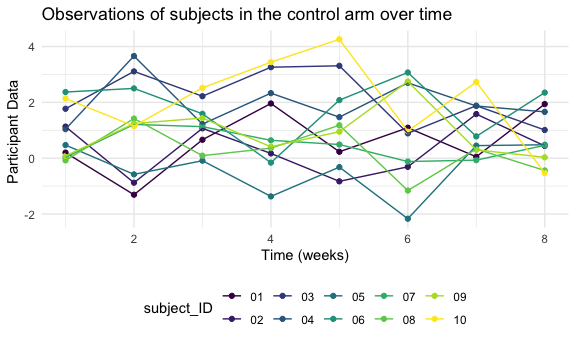
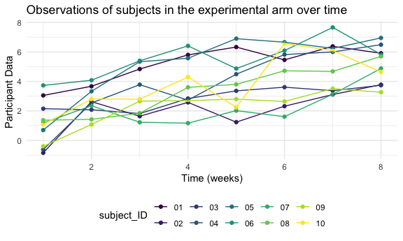
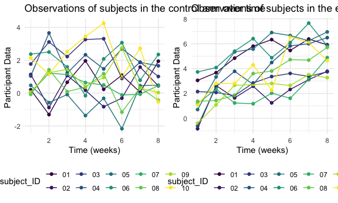

Homework 5 Solutions
================
Laura Gomez

# Problem 2

Import and tidy the following data set:

``` r
data_1 = read_csv("1da_data/con_01.csv")
```

    ## Parsed with column specification:
    ## cols(
    ##   week_1 = col_double(),
    ##   week_2 = col_double(),
    ##   week_3 = col_double(),
    ##   week_4 = col_double(),
    ##   week_5 = col_double(),
    ##   week_6 = col_double(),
    ##   week_7 = col_double(),
    ##   week_8 = col_double()
    ## )

``` r
path_df = 
  tibble(
  path = list.files("1da_data"),
  ) %>%
  mutate(
  path = str_c("1da_data/", path),
  data = map(path,read_csv)) %>%
  unnest() %>%
  separate(col = path, into = c("path_1","path_2"), sep = 9,  remove = T) %>%
  separate(col = path_2, into = c("path_3","path_4"), sep = 4,  remove = T) %>%
  separate(path_4, c("subject_ID","csv")) %>%
  select(-path_1,-csv) %>%
  rename(control_arm = path_3)
```

    ## Parsed with column specification:
    ## cols(
    ##   week_1 = col_double(),
    ##   week_2 = col_double(),
    ##   week_3 = col_double(),
    ##   week_4 = col_double(),
    ##   week_5 = col_double(),
    ##   week_6 = col_double(),
    ##   week_7 = col_double(),
    ##   week_8 = col_double()
    ## )
    ## Parsed with column specification:
    ## cols(
    ##   week_1 = col_double(),
    ##   week_2 = col_double(),
    ##   week_3 = col_double(),
    ##   week_4 = col_double(),
    ##   week_5 = col_double(),
    ##   week_6 = col_double(),
    ##   week_7 = col_double(),
    ##   week_8 = col_double()
    ## )
    ## Parsed with column specification:
    ## cols(
    ##   week_1 = col_double(),
    ##   week_2 = col_double(),
    ##   week_3 = col_double(),
    ##   week_4 = col_double(),
    ##   week_5 = col_double(),
    ##   week_6 = col_double(),
    ##   week_7 = col_double(),
    ##   week_8 = col_double()
    ## )
    ## Parsed with column specification:
    ## cols(
    ##   week_1 = col_double(),
    ##   week_2 = col_double(),
    ##   week_3 = col_double(),
    ##   week_4 = col_double(),
    ##   week_5 = col_double(),
    ##   week_6 = col_double(),
    ##   week_7 = col_double(),
    ##   week_8 = col_double()
    ## )
    ## Parsed with column specification:
    ## cols(
    ##   week_1 = col_double(),
    ##   week_2 = col_double(),
    ##   week_3 = col_double(),
    ##   week_4 = col_double(),
    ##   week_5 = col_double(),
    ##   week_6 = col_double(),
    ##   week_7 = col_double(),
    ##   week_8 = col_double()
    ## )
    ## Parsed with column specification:
    ## cols(
    ##   week_1 = col_double(),
    ##   week_2 = col_double(),
    ##   week_3 = col_double(),
    ##   week_4 = col_double(),
    ##   week_5 = col_double(),
    ##   week_6 = col_double(),
    ##   week_7 = col_double(),
    ##   week_8 = col_double()
    ## )
    ## Parsed with column specification:
    ## cols(
    ##   week_1 = col_double(),
    ##   week_2 = col_double(),
    ##   week_3 = col_double(),
    ##   week_4 = col_double(),
    ##   week_5 = col_double(),
    ##   week_6 = col_double(),
    ##   week_7 = col_double(),
    ##   week_8 = col_double()
    ## )
    ## Parsed with column specification:
    ## cols(
    ##   week_1 = col_double(),
    ##   week_2 = col_double(),
    ##   week_3 = col_double(),
    ##   week_4 = col_double(),
    ##   week_5 = col_double(),
    ##   week_6 = col_double(),
    ##   week_7 = col_double(),
    ##   week_8 = col_double()
    ## )
    ## Parsed with column specification:
    ## cols(
    ##   week_1 = col_double(),
    ##   week_2 = col_double(),
    ##   week_3 = col_double(),
    ##   week_4 = col_double(),
    ##   week_5 = col_double(),
    ##   week_6 = col_double(),
    ##   week_7 = col_double(),
    ##   week_8 = col_double()
    ## )
    ## Parsed with column specification:
    ## cols(
    ##   week_1 = col_double(),
    ##   week_2 = col_double(),
    ##   week_3 = col_double(),
    ##   week_4 = col_double(),
    ##   week_5 = col_double(),
    ##   week_6 = col_double(),
    ##   week_7 = col_double(),
    ##   week_8 = col_double()
    ## )
    ## Parsed with column specification:
    ## cols(
    ##   week_1 = col_double(),
    ##   week_2 = col_double(),
    ##   week_3 = col_double(),
    ##   week_4 = col_double(),
    ##   week_5 = col_double(),
    ##   week_6 = col_double(),
    ##   week_7 = col_double(),
    ##   week_8 = col_double()
    ## )
    ## Parsed with column specification:
    ## cols(
    ##   week_1 = col_double(),
    ##   week_2 = col_double(),
    ##   week_3 = col_double(),
    ##   week_4 = col_double(),
    ##   week_5 = col_double(),
    ##   week_6 = col_double(),
    ##   week_7 = col_double(),
    ##   week_8 = col_double()
    ## )
    ## Parsed with column specification:
    ## cols(
    ##   week_1 = col_double(),
    ##   week_2 = col_double(),
    ##   week_3 = col_double(),
    ##   week_4 = col_double(),
    ##   week_5 = col_double(),
    ##   week_6 = col_double(),
    ##   week_7 = col_double(),
    ##   week_8 = col_double()
    ## )
    ## Parsed with column specification:
    ## cols(
    ##   week_1 = col_double(),
    ##   week_2 = col_double(),
    ##   week_3 = col_double(),
    ##   week_4 = col_double(),
    ##   week_5 = col_double(),
    ##   week_6 = col_double(),
    ##   week_7 = col_double(),
    ##   week_8 = col_double()
    ## )
    ## Parsed with column specification:
    ## cols(
    ##   week_1 = col_double(),
    ##   week_2 = col_double(),
    ##   week_3 = col_double(),
    ##   week_4 = col_double(),
    ##   week_5 = col_double(),
    ##   week_6 = col_double(),
    ##   week_7 = col_double(),
    ##   week_8 = col_double()
    ## )
    ## Parsed with column specification:
    ## cols(
    ##   week_1 = col_double(),
    ##   week_2 = col_double(),
    ##   week_3 = col_double(),
    ##   week_4 = col_double(),
    ##   week_5 = col_double(),
    ##   week_6 = col_double(),
    ##   week_7 = col_double(),
    ##   week_8 = col_double()
    ## )
    ## Parsed with column specification:
    ## cols(
    ##   week_1 = col_double(),
    ##   week_2 = col_double(),
    ##   week_3 = col_double(),
    ##   week_4 = col_double(),
    ##   week_5 = col_double(),
    ##   week_6 = col_double(),
    ##   week_7 = col_double(),
    ##   week_8 = col_double()
    ## )
    ## Parsed with column specification:
    ## cols(
    ##   week_1 = col_double(),
    ##   week_2 = col_double(),
    ##   week_3 = col_double(),
    ##   week_4 = col_double(),
    ##   week_5 = col_double(),
    ##   week_6 = col_double(),
    ##   week_7 = col_double(),
    ##   week_8 = col_double()
    ## )
    ## Parsed with column specification:
    ## cols(
    ##   week_1 = col_double(),
    ##   week_2 = col_double(),
    ##   week_3 = col_double(),
    ##   week_4 = col_double(),
    ##   week_5 = col_double(),
    ##   week_6 = col_double(),
    ##   week_7 = col_double(),
    ##   week_8 = col_double()
    ## )
    ## Parsed with column specification:
    ## cols(
    ##   week_1 = col_double(),
    ##   week_2 = col_double(),
    ##   week_3 = col_double(),
    ##   week_4 = col_double(),
    ##   week_5 = col_double(),
    ##   week_6 = col_double(),
    ##   week_7 = col_double(),
    ##   week_8 = col_double()
    ## )

    ## Warning: `cols` is now required when using unnest().
    ## Please use `cols = c(data)`

Make a spaghetti plot showing observations on each subject over time

``` r
Subject_time_df = path_df %>%
  pivot_longer(week_1:week_8, names_to = "Time", values_to = "subject_values") %>%
  separate(col = Time, into = c("drop","Time"), sep = 5,  remove = T)  %>%
  select(-drop)

Subject_time_df %>%
  mutate(Time = as.numeric(Time)) %>%
  ggplot(aes(x = Time, y = subject_values, color = subject_ID)) + 
  geom_point() + geom_line() + 
  theme(legend.position = "bottom")
```


Analyze the differences between Control and Experimental groups:

``` r
# for the control
control_plot = filter( Subject_time_df, control_arm == "con_") %>%
  mutate(Time = as.numeric(Time)) %>%
  ggplot(aes(x = Time, y = subject_values, color = subject_ID)) + 
  geom_point() + geom_line() + 
  theme(legend.position = "bottom") +
    labs(
    title = "Observations of subjects in the control arm over time ",
    x = "Time (weeks)",
    y = "Participant Data ")
 

control_plot
```



``` r
# for the experimental 
exp_plot = filter( Subject_time_df, control_arm == "exp_") %>%
  mutate(Time = as.numeric(Time)) %>%
  ggplot(aes(x = Time, y = subject_values, color = subject_ID)) + 
  geom_point() + geom_line() + 
  theme(legend.position = "bottom") +
  labs(
    title = "Observations of subjects in the experimental arm over time ",
    x = "Time (weeks)",
    y = "Participant Data ")
 
exp_plot
```



``` r
grid.arrange(control_plot, exp_plot, ncol = 2)
```


The major differences between the control and experimental groups are
the observational values for the control group trend downward overall
following week 6 compared to the values for the experimental group trend
upward overall for the subjects. The overall range of values for the
control group are \#\# Problem 3

``` r
sim_ttest = function(n,  mu = 0, sigma = 5){
  
  sim_data = tibble(
    x = rnorm(n = 30, mean = mu, sd = sigma)
   )
  
  ttest = t.test(sim_data, mu = 0, sd = 5)
  ttest[['p.value']]
  ttest[['estimate']]
  
  sim_results = tibble(
    pvalue = ttest[['p.value']],
    mean = ttest[['estimate']]
  )
  
}

output = vector("list",100)

#map(.x = (0:6), ~rerun(5000, sim_ttest(mu =.x)))

#sim_results = bind_rows(output)

#data = tibble( mu = c(0:6)) %>%
                 #mutate(output_lists = map(.x = mu, ~rerun(5000, sim_ttest(mu = .x))),
                        #estimate_dfs = map(output_lists, bind_rows)) %>%
  #select(-output_lists) %>%
  #unnest(estimate_dfs)

###μ=0  using α=0.05. Hint: to obtain the estimate and p-value, use broom::tidy to clean the output of t.test.
  
##Make a plot showing the proportion of times the null was rejected (the power of the test) on the y axis and the true value of μ on the x axis. Describe the association between effect size and power.
#Make a plot showing the average estimate of μ̂  on the y axis and the true value of μ on the x axis. Make a second plot (or overlay on the first) the average estimate of μ̂  only in samples for which the null was rejected on the y axis and the true value of μ on the x axis. Is the sample average of μ̂  across tests for which the null is rejected approximately equal to the true value of μ? Why or why not?
```
