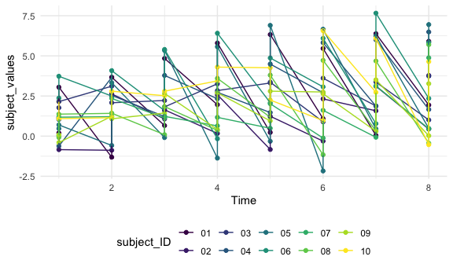
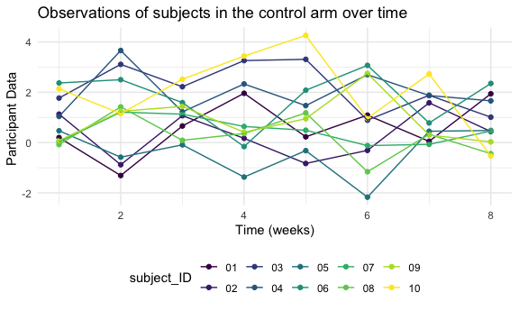
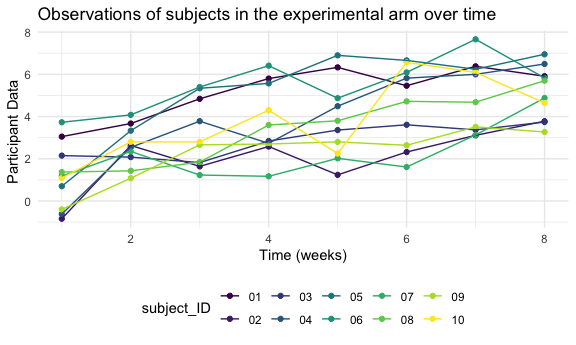
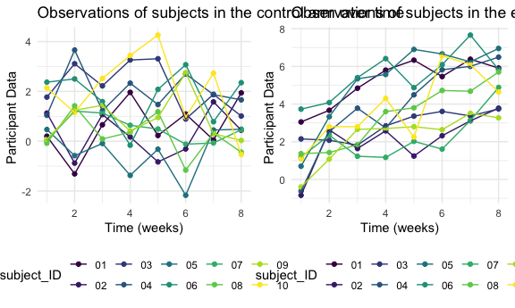
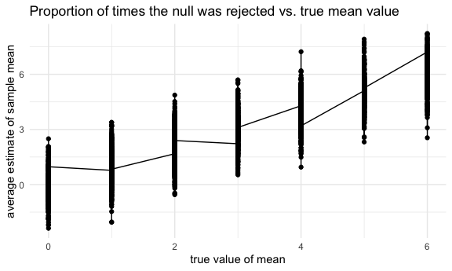

Homework 5 Solutions
================
Laura Gomez

# Problem 1

Read in the data.

``` r
#homicide_df = 
  #read_csv("homicide_data/homicide-data.csv") %>% 
  #mutate(
    #city_state = str_c(city, state, sep = "_"),
    #resolved = case_when(
      #disposition == "Closed without arrest" ~ "unsolved",
      #disposition == "Open/No arrest"        ~ "unsolved",
      #disposition == "Closed by arrest"      ~ "solved",)) %>% 
  #select(city_state, resolved) %>% 
  #filter(city_state != "Tulsa_AL")
```

Let’s look at this a bit

``` r
#aggregate_df = 
  #homicide_df %>% 
  #group_by(city_state) %>% 
  #summarize(
    #hom_total = n(),
    #hom_unsolved = sum(resolved == "unsolved"))
```

Can I do a prop test for a single city?

``` r
#prop.test(
  #aggregate_df %>% filter(city_state == "Baltimore_MD") %>% pull(hom_unsolved), 
  #aggregate_df %>% filter(city_state == "Baltimore_MD") %>% pull(hom_total)) %>% 
  #broom::tidy()
```

Try to iterate ……..

``` r
#results_df = 
  #aggregate_df %>% 
  #mutate(
    #prop_tests = map2(.x = hom_unsolved, .y = hom_total, ~prop.test(x = .x, n = .y)),
    #tidy_tests = map(.x = prop_tests, ~broom::tidy(.x))) %>% 
  #select(-prop_tests) %>% 
  #unnest(tidy_tests) %>% 
  #select(city_state, estimate, conf.low, conf.high)
```

``` r
#results_df %>% 
  #mutate(city_state = fct_reorder(city_state, estimate)) %>% 
  #ggplot(aes(x = city_state, y = estimate)) +
  #geom_point() + 
  #geom_errorbar(aes(ymin = conf.low, ymax = conf.high)) + 
  #theme(axis.text.x = element_text(angle = 90, vjust = 0.5, hjust = 1))
```

``` r
#city_prop_test = function(df) {
  
  #n_unsovled ...
  #n_total ... 
  
  #prop.test(.....)}
#homicide_df = 
  #read_csv("data/homicide-data.csv") %>% 
  #mutate(
    #city_state = str_c(city, state, sep = "_"),
    #resolved = case_when(
      #disposition == "Closed without arrest" ~ "unsolved",
      #disposition == "Open/No arrest"        ~ "unsolved",
      #disposition == "Closed by arrest"      ~ "solved",)) %>% 
 # select(city_state, resolved) %>% 
  #filter(city_state != "Tulsa_AL") %>% 
  #nest(data = resolved)
```

# Problem 2

Import and tidy the following data set:

``` r
data_1 = read_csv("1da_data/con_01.csv")
```

    ## Parsed with column specification:
    ## cols(
    ##   week_1 = col_double(),
    ##   week_2 = col_double(),
    ##   week_3 = col_double(),
    ##   week_4 = col_double(),
    ##   week_5 = col_double(),
    ##   week_6 = col_double(),
    ##   week_7 = col_double(),
    ##   week_8 = col_double()
    ## )

``` r
path_df = 
  tibble(
  path = list.files("1da_data"),
  ) %>%
  mutate(
  path = str_c("1da_data/", path),
  data = map(path,read_csv)) %>%
  unnest() %>%
  separate(col = path, into = c("path_1","path_2"), sep = 9,  remove = T) %>%
  separate(col = path_2, into = c("path_3","path_4"), sep = 4,  remove = T) %>%
  separate(path_4, c("subject_ID","csv")) %>%
  select(-path_1,-csv) %>%
  rename(control_arm = path_3)
```

    ## Parsed with column specification:
    ## cols(
    ##   week_1 = col_double(),
    ##   week_2 = col_double(),
    ##   week_3 = col_double(),
    ##   week_4 = col_double(),
    ##   week_5 = col_double(),
    ##   week_6 = col_double(),
    ##   week_7 = col_double(),
    ##   week_8 = col_double()
    ## )
    ## Parsed with column specification:
    ## cols(
    ##   week_1 = col_double(),
    ##   week_2 = col_double(),
    ##   week_3 = col_double(),
    ##   week_4 = col_double(),
    ##   week_5 = col_double(),
    ##   week_6 = col_double(),
    ##   week_7 = col_double(),
    ##   week_8 = col_double()
    ## )
    ## Parsed with column specification:
    ## cols(
    ##   week_1 = col_double(),
    ##   week_2 = col_double(),
    ##   week_3 = col_double(),
    ##   week_4 = col_double(),
    ##   week_5 = col_double(),
    ##   week_6 = col_double(),
    ##   week_7 = col_double(),
    ##   week_8 = col_double()
    ## )
    ## Parsed with column specification:
    ## cols(
    ##   week_1 = col_double(),
    ##   week_2 = col_double(),
    ##   week_3 = col_double(),
    ##   week_4 = col_double(),
    ##   week_5 = col_double(),
    ##   week_6 = col_double(),
    ##   week_7 = col_double(),
    ##   week_8 = col_double()
    ## )
    ## Parsed with column specification:
    ## cols(
    ##   week_1 = col_double(),
    ##   week_2 = col_double(),
    ##   week_3 = col_double(),
    ##   week_4 = col_double(),
    ##   week_5 = col_double(),
    ##   week_6 = col_double(),
    ##   week_7 = col_double(),
    ##   week_8 = col_double()
    ## )
    ## Parsed with column specification:
    ## cols(
    ##   week_1 = col_double(),
    ##   week_2 = col_double(),
    ##   week_3 = col_double(),
    ##   week_4 = col_double(),
    ##   week_5 = col_double(),
    ##   week_6 = col_double(),
    ##   week_7 = col_double(),
    ##   week_8 = col_double()
    ## )
    ## Parsed with column specification:
    ## cols(
    ##   week_1 = col_double(),
    ##   week_2 = col_double(),
    ##   week_3 = col_double(),
    ##   week_4 = col_double(),
    ##   week_5 = col_double(),
    ##   week_6 = col_double(),
    ##   week_7 = col_double(),
    ##   week_8 = col_double()
    ## )
    ## Parsed with column specification:
    ## cols(
    ##   week_1 = col_double(),
    ##   week_2 = col_double(),
    ##   week_3 = col_double(),
    ##   week_4 = col_double(),
    ##   week_5 = col_double(),
    ##   week_6 = col_double(),
    ##   week_7 = col_double(),
    ##   week_8 = col_double()
    ## )
    ## Parsed with column specification:
    ## cols(
    ##   week_1 = col_double(),
    ##   week_2 = col_double(),
    ##   week_3 = col_double(),
    ##   week_4 = col_double(),
    ##   week_5 = col_double(),
    ##   week_6 = col_double(),
    ##   week_7 = col_double(),
    ##   week_8 = col_double()
    ## )
    ## Parsed with column specification:
    ## cols(
    ##   week_1 = col_double(),
    ##   week_2 = col_double(),
    ##   week_3 = col_double(),
    ##   week_4 = col_double(),
    ##   week_5 = col_double(),
    ##   week_6 = col_double(),
    ##   week_7 = col_double(),
    ##   week_8 = col_double()
    ## )
    ## Parsed with column specification:
    ## cols(
    ##   week_1 = col_double(),
    ##   week_2 = col_double(),
    ##   week_3 = col_double(),
    ##   week_4 = col_double(),
    ##   week_5 = col_double(),
    ##   week_6 = col_double(),
    ##   week_7 = col_double(),
    ##   week_8 = col_double()
    ## )
    ## Parsed with column specification:
    ## cols(
    ##   week_1 = col_double(),
    ##   week_2 = col_double(),
    ##   week_3 = col_double(),
    ##   week_4 = col_double(),
    ##   week_5 = col_double(),
    ##   week_6 = col_double(),
    ##   week_7 = col_double(),
    ##   week_8 = col_double()
    ## )
    ## Parsed with column specification:
    ## cols(
    ##   week_1 = col_double(),
    ##   week_2 = col_double(),
    ##   week_3 = col_double(),
    ##   week_4 = col_double(),
    ##   week_5 = col_double(),
    ##   week_6 = col_double(),
    ##   week_7 = col_double(),
    ##   week_8 = col_double()
    ## )
    ## Parsed with column specification:
    ## cols(
    ##   week_1 = col_double(),
    ##   week_2 = col_double(),
    ##   week_3 = col_double(),
    ##   week_4 = col_double(),
    ##   week_5 = col_double(),
    ##   week_6 = col_double(),
    ##   week_7 = col_double(),
    ##   week_8 = col_double()
    ## )
    ## Parsed with column specification:
    ## cols(
    ##   week_1 = col_double(),
    ##   week_2 = col_double(),
    ##   week_3 = col_double(),
    ##   week_4 = col_double(),
    ##   week_5 = col_double(),
    ##   week_6 = col_double(),
    ##   week_7 = col_double(),
    ##   week_8 = col_double()
    ## )
    ## Parsed with column specification:
    ## cols(
    ##   week_1 = col_double(),
    ##   week_2 = col_double(),
    ##   week_3 = col_double(),
    ##   week_4 = col_double(),
    ##   week_5 = col_double(),
    ##   week_6 = col_double(),
    ##   week_7 = col_double(),
    ##   week_8 = col_double()
    ## )
    ## Parsed with column specification:
    ## cols(
    ##   week_1 = col_double(),
    ##   week_2 = col_double(),
    ##   week_3 = col_double(),
    ##   week_4 = col_double(),
    ##   week_5 = col_double(),
    ##   week_6 = col_double(),
    ##   week_7 = col_double(),
    ##   week_8 = col_double()
    ## )
    ## Parsed with column specification:
    ## cols(
    ##   week_1 = col_double(),
    ##   week_2 = col_double(),
    ##   week_3 = col_double(),
    ##   week_4 = col_double(),
    ##   week_5 = col_double(),
    ##   week_6 = col_double(),
    ##   week_7 = col_double(),
    ##   week_8 = col_double()
    ## )
    ## Parsed with column specification:
    ## cols(
    ##   week_1 = col_double(),
    ##   week_2 = col_double(),
    ##   week_3 = col_double(),
    ##   week_4 = col_double(),
    ##   week_5 = col_double(),
    ##   week_6 = col_double(),
    ##   week_7 = col_double(),
    ##   week_8 = col_double()
    ## )
    ## Parsed with column specification:
    ## cols(
    ##   week_1 = col_double(),
    ##   week_2 = col_double(),
    ##   week_3 = col_double(),
    ##   week_4 = col_double(),
    ##   week_5 = col_double(),
    ##   week_6 = col_double(),
    ##   week_7 = col_double(),
    ##   week_8 = col_double()
    ## )

    ## Warning: `cols` is now required when using unnest().
    ## Please use `cols = c(data)`

Make a spaghetti plot showing observations on each subject over time

``` r
Subject_time_df = path_df %>%
  pivot_longer(week_1:week_8, names_to = "Time", values_to = "subject_values") %>%
  separate(col = Time, into = c("drop","Time"), sep = 5,  remove = T)  %>%
  select(-drop)

Subject_time_df %>%
  mutate(Time = as.numeric(Time)) %>%
  ggplot(aes(x = Time, y = subject_values, color = subject_ID)) + 
  geom_point() + geom_line() + 
  theme(legend.position = "bottom")
```



Analyze the differences between Control and Experimental groups:

``` r
# for the control
control_plot = filter( Subject_time_df, control_arm == "con_") %>%
  mutate(Time = as.numeric(Time)) %>%
  ggplot(aes(x = Time, y = subject_values, color = subject_ID)) + 
  geom_point() + geom_line() + 
  theme(legend.position = "bottom") +
    labs(
    title = "Observations of subjects in the control arm over time ",
    x = "Time (weeks)",
    y = "Participant Data ")
 

control_plot
```



``` r
# for the experimental 
exp_plot = filter( Subject_time_df, control_arm == "exp_") %>%
  mutate(Time = as.numeric(Time)) %>%
  ggplot(aes(x = Time, y = subject_values, color = subject_ID)) + 
  geom_point() + geom_line() + 
  theme(legend.position = "bottom") +
  labs(
    title = "Observations of subjects in the experimental arm over time ",
    x = "Time (weeks)",
    y = "Participant Data ")
 
exp_plot
```



``` r
grid.arrange(control_plot, exp_plot, ncol = 2)
```



The major differences between the control and experimental groups are
the observational values for the control group trend downward overall
following week 6 compared to the values for the experimental group trend
upward overall for the subjects. The overall range of values in the
Y-axis for the control group are from (-2,5) and the experimental group
are from (-1,8). The mean value for the observational values during week
8 are higher in the control group compared to the experimental group.

# Problem 3

``` r
sim_ttest = function(n,  mu = 0, sigma = 5){
  
  sim_data = tibble(
    x = rnorm(n = 30, mean = mu, sd = sigma)
   )
  
  ttest = t.test(sim_data, mu = 0, sd = 5)
  ttest[['p.value']]
  ttest[['estimate']]
  
  sim_results = tibble(
    pvalue = ttest[['p.value']],
    mean = ttest[['estimate']]
  )
  
}

output = vector("list",100)

map(.x = (0:6), ~rerun(500, sim_ttest(mu =.x)))
```

    ## [[1]]
    ## [[1]][[1]]
    ## # A tibble: 1 x 2
    ##   pvalue  mean
    ##    <dbl> <dbl>
    ## 1  0.118  1.70
    ## 
    ## [[1]][[2]]
    ## # A tibble: 1 x 2
    ##   pvalue   mean
    ##    <dbl>  <dbl>
    ## 1  0.417 -0.680
    ## 
    ## [[1]][[3]]
    ## # A tibble: 1 x 2
    ##   pvalue  mean
    ##    <dbl> <dbl>
    ## 1  0.665 0.366
    ## 
    ## [[1]][[4]]
    ## # A tibble: 1 x 2
    ##   pvalue  mean
    ##    <dbl> <dbl>
    ## 1  0.147 -1.43
    ## 
    ## [[1]][[5]]
    ## # A tibble: 1 x 2
    ##   pvalue  mean
    ##    <dbl> <dbl>
    ## 1  0.630 0.396
    ## 
    ## [[1]][[6]]
    ## # A tibble: 1 x 2
    ##   pvalue   mean
    ##    <dbl>  <dbl>
    ## 1  0.647 -0.315
    ## 
    ## [[1]][[7]]
    ## # A tibble: 1 x 2
    ##   pvalue  mean
    ##    <dbl> <dbl>
    ## 1  0.360 0.723
    ## 
    ## [[1]][[8]]
    ## # A tibble: 1 x 2
    ##   pvalue   mean
    ##    <dbl>  <dbl>
    ## 1  0.373 -0.716
    ## 
    ## [[1]][[9]]
    ## # A tibble: 1 x 2
    ##   pvalue  mean
    ##    <dbl> <dbl>
    ## 1  0.255 -1.07
    ## 
    ## [[1]][[10]]
    ## # A tibble: 1 x 2
    ##   pvalue  mean
    ##    <dbl> <dbl>
    ## 1  0.276 0.965
    ## 
    ## [[1]][[11]]
    ## # A tibble: 1 x 2
    ##   pvalue    mean
    ##    <dbl>   <dbl>
    ## 1  0.919 -0.0913
    ## 
    ## [[1]][[12]]
    ## # A tibble: 1 x 2
    ##   pvalue  mean
    ##    <dbl> <dbl>
    ## 1  0.186 -1.41
    ## 
    ## [[1]][[13]]
    ## # A tibble: 1 x 2
    ##   pvalue  mean
    ##    <dbl> <dbl>
    ## 1  0.291 -1.03
    ## 
    ## [[1]][[14]]
    ## # A tibble: 1 x 2
    ##   pvalue  mean
    ##    <dbl> <dbl>
    ## 1  0.782 0.257
    ## 
    ## [[1]][[15]]
    ## # A tibble: 1 x 2
    ##   pvalue  mean
    ##    <dbl> <dbl>
    ## 1 0.0733  1.72
    ## 
    ## [[1]][[16]]
    ## # A tibble: 1 x 2
    ##   pvalue   mean
    ##    <dbl>  <dbl>
    ## 1  0.336 -0.892
    ## 
    ## [[1]][[17]]
    ## # A tibble: 1 x 2
    ##   pvalue   mean
    ##    <dbl>  <dbl>
    ## 1  0.426 -0.812
    ## 
    ## [[1]][[18]]
    ## # A tibble: 1 x 2
    ##   pvalue   mean
    ##    <dbl>  <dbl>
    ## 1  0.215 -0.947
    ## 
    ## [[1]][[19]]
    ## # A tibble: 1 x 2
    ##   pvalue  mean
    ##    <dbl> <dbl>
    ## 1  0.418 0.616
    ## 
    ## [[1]][[20]]
    ## # A tibble: 1 x 2
    ##   pvalue  mean
    ##    <dbl> <dbl>
    ## 1  0.242 -1.08
    ## 
    ## [[1]][[21]]
    ## # A tibble: 1 x 2
    ##   pvalue   mean
    ##    <dbl>  <dbl>
    ## 1  0.873 -0.157
    ## 
    ## [[1]][[22]]
    ## # A tibble: 1 x 2
    ##   pvalue  mean
    ##    <dbl> <dbl>
    ## 1  0.186 -1.27
    ## 
    ## [[1]][[23]]
    ## # A tibble: 1 x 2
    ##   pvalue   mean
    ##    <dbl>  <dbl>
    ## 1  0.381 -0.798
    ## 
    ## [[1]][[24]]
    ## # A tibble: 1 x 2
    ##   pvalue  mean
    ##    <dbl> <dbl>
    ## 1  0.486 0.635
    ## 
    ## [[1]][[25]]
    ## # A tibble: 1 x 2
    ##   pvalue  mean
    ##    <dbl> <dbl>
    ## 1  0.610 0.384
    ## 
    ## [[1]][[26]]
    ## # A tibble: 1 x 2
    ##   pvalue   mean
    ##    <dbl>  <dbl>
    ## 1  0.860 -0.146
    ## 
    ## [[1]][[27]]
    ## # A tibble: 1 x 2
    ##   pvalue  mean
    ##    <dbl> <dbl>
    ## 1  0.902 0.107
    ## 
    ## [[1]][[28]]
    ## # A tibble: 1 x 2
    ##   pvalue  mean
    ##    <dbl> <dbl>
    ## 1 0.0571  1.66
    ## 
    ## [[1]][[29]]
    ## # A tibble: 1 x 2
    ##   pvalue   mean
    ##    <dbl>  <dbl>
    ## 1  0.724 -0.301
    ## 
    ## [[1]][[30]]
    ## # A tibble: 1 x 2
    ##   pvalue   mean
    ##    <dbl>  <dbl>
    ## 1  0.690 -0.337
    ## 
    ## [[1]][[31]]
    ## # A tibble: 1 x 2
    ##   pvalue   mean
    ##    <dbl>  <dbl>
    ## 1  0.736 -0.269
    ## 
    ## [[1]][[32]]
    ## # A tibble: 1 x 2
    ##   pvalue  mean
    ##    <dbl> <dbl>
    ## 1  0.745 0.304
    ## 
    ## [[1]][[33]]
    ## # A tibble: 1 x 2
    ##   pvalue  mean
    ##    <dbl> <dbl>
    ## 1  0.894 0.125
    ## 
    ## [[1]][[34]]
    ## # A tibble: 1 x 2
    ##   pvalue  mean
    ##    <dbl> <dbl>
    ## 1  0.185 -1.06
    ## 
    ## [[1]][[35]]
    ## # A tibble: 1 x 2
    ##   pvalue  mean
    ##    <dbl> <dbl>
    ## 1 0.0366 -1.67
    ## 
    ## [[1]][[36]]
    ## # A tibble: 1 x 2
    ##   pvalue  mean
    ##    <dbl> <dbl>
    ## 1 0.0257  1.77
    ## 
    ## [[1]][[37]]
    ## # A tibble: 1 x 2
    ##   pvalue   mean
    ##    <dbl>  <dbl>
    ## 1  0.639 -0.476
    ## 
    ## [[1]][[38]]
    ## # A tibble: 1 x 2
    ##   pvalue   mean
    ##    <dbl>  <dbl>
    ## 1  0.910 0.0872
    ## 
    ## [[1]][[39]]
    ## # A tibble: 1 x 2
    ##   pvalue    mean
    ##    <dbl>   <dbl>
    ## 1  0.965 -0.0435
    ## 
    ## [[1]][[40]]
    ## # A tibble: 1 x 2
    ##   pvalue   mean
    ##    <dbl>  <dbl>
    ## 1  0.392 -0.998
    ## 
    ## [[1]][[41]]
    ## # A tibble: 1 x 2
    ##   pvalue  mean
    ##    <dbl> <dbl>
    ## 1  0.871 0.162
    ## 
    ## [[1]][[42]]
    ## # A tibble: 1 x 2
    ##   pvalue   mean
    ##    <dbl>  <dbl>
    ## 1  0.805 -0.228
    ## 
    ## [[1]][[43]]
    ## # A tibble: 1 x 2
    ##   pvalue  mean
    ##    <dbl> <dbl>
    ## 1  0.431 0.681
    ## 
    ## [[1]][[44]]
    ## # A tibble: 1 x 2
    ##   pvalue   mean
    ##    <dbl>  <dbl>
    ## 1  0.870 -0.134
    ## 
    ## [[1]][[45]]
    ## # A tibble: 1 x 2
    ##   pvalue   mean
    ##    <dbl>  <dbl>
    ## 1  0.935 0.0793
    ## 
    ## [[1]][[46]]
    ## # A tibble: 1 x 2
    ##   pvalue  mean
    ##    <dbl> <dbl>
    ## 1  0.696 0.419
    ## 
    ## [[1]][[47]]
    ## # A tibble: 1 x 2
    ##   pvalue   mean
    ##    <dbl>  <dbl>
    ## 1  0.498 -0.599
    ## 
    ## [[1]][[48]]
    ## # A tibble: 1 x 2
    ##   pvalue  mean
    ##    <dbl> <dbl>
    ## 1  0.382 0.616
    ## 
    ## [[1]][[49]]
    ## # A tibble: 1 x 2
    ##   pvalue  mean
    ##    <dbl> <dbl>
    ## 1  0.183  1.26
    ## 
    ## [[1]][[50]]
    ## # A tibble: 1 x 2
    ##   pvalue  mean
    ##    <dbl> <dbl>
    ## 1  0.177 -1.50
    ## 
    ## [[1]][[51]]
    ## # A tibble: 1 x 2
    ##   pvalue  mean
    ##    <dbl> <dbl>
    ## 1 0.0262  2.42
    ## 
    ## [[1]][[52]]
    ## # A tibble: 1 x 2
    ##   pvalue   mean
    ##    <dbl>  <dbl>
    ## 1  0.450 -0.754
    ## 
    ## [[1]][[53]]
    ## # A tibble: 1 x 2
    ##   pvalue   mean
    ##    <dbl>  <dbl>
    ## 1  0.643 -0.397
    ## 
    ## [[1]][[54]]
    ## # A tibble: 1 x 2
    ##   pvalue  mean
    ##    <dbl> <dbl>
    ## 1  0.109 -1.13
    ## 
    ## [[1]][[55]]
    ## # A tibble: 1 x 2
    ##   pvalue  mean
    ##    <dbl> <dbl>
    ## 1  0.429 0.810
    ## 
    ## [[1]][[56]]
    ## # A tibble: 1 x 2
    ##   pvalue  mean
    ##    <dbl> <dbl>
    ## 1  0.221  1.07
    ## 
    ## [[1]][[57]]
    ## # A tibble: 1 x 2
    ##   pvalue   mean
    ##    <dbl>  <dbl>
    ## 1  0.448 -0.725
    ## 
    ## [[1]][[58]]
    ## # A tibble: 1 x 2
    ##   pvalue   mean
    ##    <dbl>  <dbl>
    ## 1  0.903 -0.139
    ## 
    ## [[1]][[59]]
    ## # A tibble: 1 x 2
    ##   pvalue   mean
    ##    <dbl>  <dbl>
    ## 1  0.501 -0.787
    ## 
    ## [[1]][[60]]
    ## # A tibble: 1 x 2
    ##   pvalue  mean
    ##    <dbl> <dbl>
    ## 1  0.288 0.915
    ## 
    ## [[1]][[61]]
    ## # A tibble: 1 x 2
    ##   pvalue  mean
    ##    <dbl> <dbl>
    ## 1  0.245  1.08
    ## 
    ## [[1]][[62]]
    ## # A tibble: 1 x 2
    ##   pvalue   mean
    ##    <dbl>  <dbl>
    ## 1  0.422 -0.689
    ## 
    ## [[1]][[63]]
    ## # A tibble: 1 x 2
    ##   pvalue   mean
    ##    <dbl>  <dbl>
    ## 1  0.878 -0.152
    ## 
    ## [[1]][[64]]
    ## # A tibble: 1 x 2
    ##   pvalue   mean
    ##    <dbl>  <dbl>
    ## 1  0.523 -0.601
    ## 
    ## [[1]][[65]]
    ## # A tibble: 1 x 2
    ##   pvalue   mean
    ##    <dbl>  <dbl>
    ## 1  0.711 -0.311
    ## 
    ## [[1]][[66]]
    ## # A tibble: 1 x 2
    ##   pvalue   mean
    ##    <dbl>  <dbl>
    ## 1  0.735 -0.245
    ## 
    ## [[1]][[67]]
    ## # A tibble: 1 x 2
    ##   pvalue   mean
    ##    <dbl>  <dbl>
    ## 1  0.881 -0.151
    ## 
    ## [[1]][[68]]
    ## # A tibble: 1 x 2
    ##   pvalue  mean
    ##    <dbl> <dbl>
    ## 1  0.536 0.691
    ## 
    ## [[1]][[69]]
    ## # A tibble: 1 x 2
    ##   pvalue   mean
    ##    <dbl>  <dbl>
    ## 1  0.289 -0.764
    ## 
    ## [[1]][[70]]
    ## # A tibble: 1 x 2
    ##   pvalue  mean
    ##    <dbl> <dbl>
    ## 1  0.339 0.952
    ## 
    ## [[1]][[71]]
    ## # A tibble: 1 x 2
    ##   pvalue  mean
    ##    <dbl> <dbl>
    ## 1  0.834 0.217
    ## 
    ## [[1]][[72]]
    ## # A tibble: 1 x 2
    ##   pvalue  mean
    ##    <dbl> <dbl>
    ## 1  0.390 0.653
    ## 
    ## [[1]][[73]]
    ## # A tibble: 1 x 2
    ##   pvalue    mean
    ##    <dbl>   <dbl>
    ## 1  0.955 -0.0544
    ## 
    ## [[1]][[74]]
    ## # A tibble: 1 x 2
    ##   pvalue  mean
    ##    <dbl> <dbl>
    ## 1  0.686 0.432
    ## 
    ## [[1]][[75]]
    ## # A tibble: 1 x 2
    ##   pvalue   mean
    ##    <dbl>  <dbl>
    ## 1  0.935 0.0470
    ## 
    ## [[1]][[76]]
    ## # A tibble: 1 x 2
    ##   pvalue  mean
    ##    <dbl> <dbl>
    ## 1  0.238  1.10
    ## 
    ## [[1]][[77]]
    ## # A tibble: 1 x 2
    ##   pvalue   mean
    ##    <dbl>  <dbl>
    ## 1  0.553 -0.637
    ## 
    ## [[1]][[78]]
    ## # A tibble: 1 x 2
    ##   pvalue   mean
    ##    <dbl>  <dbl>
    ## 1  0.499 -0.599
    ## 
    ## [[1]][[79]]
    ## # A tibble: 1 x 2
    ##   pvalue  mean
    ##    <dbl> <dbl>
    ## 1  0.578 0.486
    ## 
    ## [[1]][[80]]
    ## # A tibble: 1 x 2
    ##   pvalue   mean
    ##    <dbl>  <dbl>
    ## 1  0.790 -0.266
    ## 
    ## [[1]][[81]]
    ## # A tibble: 1 x 2
    ##   pvalue   mean
    ##    <dbl>  <dbl>
    ## 1  0.582 -0.476
    ## 
    ## [[1]][[82]]
    ## # A tibble: 1 x 2
    ##   pvalue  mean
    ##    <dbl> <dbl>
    ## 1  0.429 0.749
    ## 
    ## [[1]][[83]]
    ## # A tibble: 1 x 2
    ##   pvalue   mean
    ##    <dbl>  <dbl>
    ## 1  0.754 -0.293
    ## 
    ## [[1]][[84]]
    ## # A tibble: 1 x 2
    ##   pvalue  mean
    ##    <dbl> <dbl>
    ## 1  0.273 -1.17
    ## 
    ## [[1]][[85]]
    ## # A tibble: 1 x 2
    ##   pvalue  mean
    ##    <dbl> <dbl>
    ## 1  0.743 0.246
    ## 
    ## [[1]][[86]]
    ## # A tibble: 1 x 2
    ##   pvalue  mean
    ##    <dbl> <dbl>
    ## 1  0.521 0.521
    ## 
    ## [[1]][[87]]
    ## # A tibble: 1 x 2
    ##   pvalue  mean
    ##    <dbl> <dbl>
    ## 1  0.504 0.557
    ## 
    ## [[1]][[88]]
    ## # A tibble: 1 x 2
    ##   pvalue  mean
    ##    <dbl> <dbl>
    ## 1  0.263 0.987
    ## 
    ## [[1]][[89]]
    ## # A tibble: 1 x 2
    ##   pvalue  mean
    ##    <dbl> <dbl>
    ## 1  0.509 0.508
    ## 
    ## [[1]][[90]]
    ## # A tibble: 1 x 2
    ##   pvalue  mean
    ##    <dbl> <dbl>
    ## 1  0.275 -1.30
    ## 
    ## [[1]][[91]]
    ## # A tibble: 1 x 2
    ##   pvalue   mean
    ##    <dbl>  <dbl>
    ## 1  0.757 -0.291
    ## 
    ## [[1]][[92]]
    ## # A tibble: 1 x 2
    ##   pvalue   mean
    ##    <dbl>  <dbl>
    ## 1  0.372 -0.822
    ## 
    ## [[1]][[93]]
    ## # A tibble: 1 x 2
    ##   pvalue  mean
    ##    <dbl> <dbl>
    ## 1  0.573 0.493
    ## 
    ## [[1]][[94]]
    ## # A tibble: 1 x 2
    ##   pvalue   mean
    ##    <dbl>  <dbl>
    ## 1  0.458 -0.798
    ## 
    ## [[1]][[95]]
    ## # A tibble: 1 x 2
    ##   pvalue  mean
    ##    <dbl> <dbl>
    ## 1  0.379 0.743
    ## 
    ## [[1]][[96]]
    ## # A tibble: 1 x 2
    ##   pvalue  mean
    ##    <dbl> <dbl>
    ## 1  0.746 0.273
    ## 
    ## [[1]][[97]]
    ## # A tibble: 1 x 2
    ##   pvalue  mean
    ##    <dbl> <dbl>
    ## 1  0.427 0.723
    ## 
    ## [[1]][[98]]
    ## # A tibble: 1 x 2
    ##   pvalue   mean
    ##    <dbl>  <dbl>
    ## 1  0.340 -0.838
    ## 
    ## [[1]][[99]]
    ## # A tibble: 1 x 2
    ##   pvalue   mean
    ##    <dbl>  <dbl>
    ## 1  0.665 -0.408
    ## 
    ## [[1]][[100]]
    ## # A tibble: 1 x 2
    ##   pvalue  mean
    ##    <dbl> <dbl>
    ## 1  0.107 -1.62
    ## 
    ## [[1]][[101]]
    ## # A tibble: 1 x 2
    ##   pvalue   mean
    ##    <dbl>  <dbl>
    ## 1  0.331 -0.883
    ## 
    ## [[1]][[102]]
    ## # A tibble: 1 x 2
    ##   pvalue  mean
    ##    <dbl> <dbl>
    ## 1 0.0817  1.46
    ## 
    ## [[1]][[103]]
    ## # A tibble: 1 x 2
    ##   pvalue  mean
    ##    <dbl> <dbl>
    ## 1  0.924 0.103
    ## 
    ## [[1]][[104]]
    ## # A tibble: 1 x 2
    ##   pvalue  mean
    ##    <dbl> <dbl>
    ## 1  0.674 0.490
    ## 
    ## [[1]][[105]]
    ## # A tibble: 1 x 2
    ##   pvalue   mean
    ##    <dbl>  <dbl>
    ## 1  0.447 -0.781
    ## 
    ## [[1]][[106]]
    ## # A tibble: 1 x 2
    ##   pvalue  mean
    ##    <dbl> <dbl>
    ## 1  0.456 0.668
    ## 
    ## [[1]][[107]]
    ## # A tibble: 1 x 2
    ##   pvalue   mean
    ##    <dbl>  <dbl>
    ## 1  0.639 -0.382
    ## 
    ## [[1]][[108]]
    ## # A tibble: 1 x 2
    ##   pvalue  mean
    ##    <dbl> <dbl>
    ## 1  0.413 0.778
    ## 
    ## [[1]][[109]]
    ## # A tibble: 1 x 2
    ##   pvalue  mean
    ##    <dbl> <dbl>
    ## 1  0.537 0.566
    ## 
    ## [[1]][[110]]
    ## # A tibble: 1 x 2
    ##   pvalue  mean
    ##    <dbl> <dbl>
    ## 1  0.690 0.282
    ## 
    ## [[1]][[111]]
    ## # A tibble: 1 x 2
    ##   pvalue  mean
    ##    <dbl> <dbl>
    ## 1 0.0791 -1.04
    ## 
    ## [[1]][[112]]
    ## # A tibble: 1 x 2
    ##   pvalue  mean
    ##    <dbl> <dbl>
    ## 1  0.603 0.443
    ## 
    ## [[1]][[113]]
    ## # A tibble: 1 x 2
    ##   pvalue   mean
    ##    <dbl>  <dbl>
    ## 1  0.244 -0.913
    ## 
    ## [[1]][[114]]
    ## # A tibble: 1 x 2
    ##   pvalue   mean
    ##    <dbl>  <dbl>
    ## 1  0.618 -0.439
    ## 
    ## [[1]][[115]]
    ## # A tibble: 1 x 2
    ##   pvalue  mean
    ##    <dbl> <dbl>
    ## 1 0.0737 -1.48
    ## 
    ## [[1]][[116]]
    ## # A tibble: 1 x 2
    ##   pvalue  mean
    ##    <dbl> <dbl>
    ## 1  0.243 0.986
    ## 
    ## [[1]][[117]]
    ## # A tibble: 1 x 2
    ##   pvalue   mean
    ##    <dbl>  <dbl>
    ## 1  0.632 -0.463
    ## 
    ## [[1]][[118]]
    ## # A tibble: 1 x 2
    ##   pvalue   mean
    ##    <dbl>  <dbl>
    ## 1  0.882 -0.115
    ## 
    ## [[1]][[119]]
    ## # A tibble: 1 x 2
    ##   pvalue  mean
    ##    <dbl> <dbl>
    ## 1  0.233 -1.37
    ## 
    ## [[1]][[120]]
    ## # A tibble: 1 x 2
    ##   pvalue  mean
    ##    <dbl> <dbl>
    ## 1  0.316  1.01
    ## 
    ## [[1]][[121]]
    ## # A tibble: 1 x 2
    ##   pvalue  mean
    ##    <dbl> <dbl>
    ## 1  0.172  1.06
    ## 
    ## [[1]][[122]]
    ## # A tibble: 1 x 2
    ##   pvalue   mean
    ##    <dbl>  <dbl>
    ## 1  0.365 -0.867
    ## 
    ## [[1]][[123]]
    ## # A tibble: 1 x 2
    ##   pvalue  mean
    ##    <dbl> <dbl>
    ## 1 0.0238  1.71
    ## 
    ## [[1]][[124]]
    ## # A tibble: 1 x 2
    ##   pvalue    mean
    ##    <dbl>   <dbl>
    ## 1  0.931 -0.0743
    ## 
    ## [[1]][[125]]
    ## # A tibble: 1 x 2
    ##   pvalue  mean
    ##    <dbl> <dbl>
    ## 1  0.165  1.47
    ## 
    ## [[1]][[126]]
    ## # A tibble: 1 x 2
    ##   pvalue  mean
    ##    <dbl> <dbl>
    ## 1  0.274 0.837
    ## 
    ## [[1]][[127]]
    ## # A tibble: 1 x 2
    ##   pvalue  mean
    ##    <dbl> <dbl>
    ## 1 0.0317 -1.62
    ## 
    ## [[1]][[128]]
    ## # A tibble: 1 x 2
    ##   pvalue  mean
    ##    <dbl> <dbl>
    ## 1  0.428 0.688
    ## 
    ## [[1]][[129]]
    ## # A tibble: 1 x 2
    ##   pvalue   mean
    ##    <dbl>  <dbl>
    ## 1  0.647 -0.340
    ## 
    ## [[1]][[130]]
    ## # A tibble: 1 x 2
    ##   pvalue  mean
    ##    <dbl> <dbl>
    ## 1  0.139  1.27
    ## 
    ## [[1]][[131]]
    ## # A tibble: 1 x 2
    ##   pvalue  mean
    ##    <dbl> <dbl>
    ## 1  0.223 -1.13
    ## 
    ## [[1]][[132]]
    ## # A tibble: 1 x 2
    ##   pvalue  mean
    ##    <dbl> <dbl>
    ## 1  0.266 -1.02
    ## 
    ## [[1]][[133]]
    ## # A tibble: 1 x 2
    ##   pvalue   mean
    ##    <dbl>  <dbl>
    ## 1  0.594 -0.478
    ## 
    ## [[1]][[134]]
    ## # A tibble: 1 x 2
    ##   pvalue  mean
    ##    <dbl> <dbl>
    ## 1  0.748 0.259
    ## 
    ## [[1]][[135]]
    ## # A tibble: 1 x 2
    ##   pvalue  mean
    ##    <dbl> <dbl>
    ## 1  0.213 -1.23
    ## 
    ## [[1]][[136]]
    ## # A tibble: 1 x 2
    ##   pvalue   mean
    ##    <dbl>  <dbl>
    ## 1  0.958 0.0410
    ## 
    ## [[1]][[137]]
    ## # A tibble: 1 x 2
    ##   pvalue  mean
    ##    <dbl> <dbl>
    ## 1  0.517 0.581
    ## 
    ## [[1]][[138]]
    ## # A tibble: 1 x 2
    ##   pvalue  mean
    ##    <dbl> <dbl>
    ## 1  0.226  1.11
    ## 
    ## [[1]][[139]]
    ## # A tibble: 1 x 2
    ##   pvalue   mean
    ##    <dbl>  <dbl>
    ## 1  0.455 -0.705
    ## 
    ## [[1]][[140]]
    ## # A tibble: 1 x 2
    ##   pvalue  mean
    ##    <dbl> <dbl>
    ## 1 0.0415  1.91
    ## 
    ## [[1]][[141]]
    ## # A tibble: 1 x 2
    ##   pvalue   mean
    ##    <dbl>  <dbl>
    ## 1  0.935 0.0713
    ## 
    ## [[1]][[142]]
    ## # A tibble: 1 x 2
    ##   pvalue  mean
    ##    <dbl> <dbl>
    ## 1  0.115 -1.30
    ## 
    ## [[1]][[143]]
    ## # A tibble: 1 x 2
    ##   pvalue  mean
    ##    <dbl> <dbl>
    ## 1  0.175  1.12
    ## 
    ## [[1]][[144]]
    ## # A tibble: 1 x 2
    ##   pvalue   mean
    ##    <dbl>  <dbl>
    ## 1  0.548 -0.530
    ## 
    ## [[1]][[145]]
    ## # A tibble: 1 x 2
    ##   pvalue  mean
    ##    <dbl> <dbl>
    ## 1  0.848 0.174
    ## 
    ## [[1]][[146]]
    ## # A tibble: 1 x 2
    ##   pvalue   mean
    ##    <dbl>  <dbl>
    ## 1  0.620 -0.398
    ## 
    ## [[1]][[147]]
    ## # A tibble: 1 x 2
    ##   pvalue  mean
    ##    <dbl> <dbl>
    ## 1  0.620 0.593
    ## 
    ## [[1]][[148]]
    ## # A tibble: 1 x 2
    ##   pvalue  mean
    ##    <dbl> <dbl>
    ## 1 0.0933  1.40
    ## 
    ## [[1]][[149]]
    ## # A tibble: 1 x 2
    ##   pvalue  mean
    ##    <dbl> <dbl>
    ## 1 0.0184 -2.52
    ## 
    ## [[1]][[150]]
    ## # A tibble: 1 x 2
    ##   pvalue  mean
    ##    <dbl> <dbl>
    ## 1  0.147  1.29
    ## 
    ## [[1]][[151]]
    ## # A tibble: 1 x 2
    ##   pvalue  mean
    ##    <dbl> <dbl>
    ## 1  0.140  1.42
    ## 
    ## [[1]][[152]]
    ## # A tibble: 1 x 2
    ##   pvalue  mean
    ##    <dbl> <dbl>
    ## 1  0.777 0.288
    ## 
    ## [[1]][[153]]
    ## # A tibble: 1 x 2
    ##   pvalue   mean
    ##    <dbl>  <dbl>
    ## 1  0.610 -0.436
    ## 
    ## [[1]][[154]]
    ## # A tibble: 1 x 2
    ##   pvalue  mean
    ##    <dbl> <dbl>
    ## 1 0.0697 -1.95
    ## 
    ## [[1]][[155]]
    ## # A tibble: 1 x 2
    ##   pvalue   mean
    ##    <dbl>  <dbl>
    ## 1  0.599 -0.436
    ## 
    ## [[1]][[156]]
    ## # A tibble: 1 x 2
    ##   pvalue  mean
    ##    <dbl> <dbl>
    ## 1  0.197 -1.26
    ## 
    ## [[1]][[157]]
    ## # A tibble: 1 x 2
    ##   pvalue   mean
    ##    <dbl>  <dbl>
    ## 1  0.650 -0.372
    ## 
    ## [[1]][[158]]
    ## # A tibble: 1 x 2
    ##   pvalue  mean
    ##    <dbl> <dbl>
    ## 1  0.670 0.465
    ## 
    ## [[1]][[159]]
    ## # A tibble: 1 x 2
    ##   pvalue    mean
    ##    <dbl>   <dbl>
    ## 1  0.959 -0.0466
    ## 
    ## [[1]][[160]]
    ## # A tibble: 1 x 2
    ##   pvalue  mean
    ##    <dbl> <dbl>
    ## 1  0.384 -1.01
    ## 
    ## [[1]][[161]]
    ## # A tibble: 1 x 2
    ##   pvalue  mean
    ##    <dbl> <dbl>
    ## 1  0.262  1.09
    ## 
    ## [[1]][[162]]
    ## # A tibble: 1 x 2
    ##   pvalue   mean
    ##    <dbl>  <dbl>
    ## 1  0.318 -0.844
    ## 
    ## [[1]][[163]]
    ## # A tibble: 1 x 2
    ##   pvalue   mean
    ##    <dbl>  <dbl>
    ## 1  0.752 -0.252
    ## 
    ## [[1]][[164]]
    ## # A tibble: 1 x 2
    ##   pvalue  mean
    ##    <dbl> <dbl>
    ## 1  0.175 -1.21
    ## 
    ## [[1]][[165]]
    ## # A tibble: 1 x 2
    ##   pvalue  mean
    ##    <dbl> <dbl>
    ## 1  0.392 0.862
    ## 
    ## [[1]][[166]]
    ## # A tibble: 1 x 2
    ##   pvalue   mean
    ##    <dbl>  <dbl>
    ## 1  0.942 0.0644
    ## 
    ## [[1]][[167]]
    ## # A tibble: 1 x 2
    ##   pvalue  mean
    ##    <dbl> <dbl>
    ## 1  0.361 0.792
    ## 
    ## [[1]][[168]]
    ## # A tibble: 1 x 2
    ##   pvalue  mean
    ##    <dbl> <dbl>
    ## 1  0.151  1.08
    ## 
    ## [[1]][[169]]
    ## # A tibble: 1 x 2
    ##   pvalue   mean
    ##    <dbl>  <dbl>
    ## 1  0.301 -0.963
    ## 
    ## [[1]][[170]]
    ## # A tibble: 1 x 2
    ##   pvalue     mean
    ##    <dbl>    <dbl>
    ## 1  0.996 -0.00565
    ## 
    ## [[1]][[171]]
    ## # A tibble: 1 x 2
    ##    pvalue  mean
    ##     <dbl> <dbl>
    ## 1 0.00821 -2.30
    ## 
    ## [[1]][[172]]
    ## # A tibble: 1 x 2
    ##   pvalue  mean
    ##    <dbl> <dbl>
    ## 1  0.493 0.402
    ## 
    ## [[1]][[173]]
    ## # A tibble: 1 x 2
    ##   pvalue  mean
    ##    <dbl> <dbl>
    ## 1  0.616 0.503
    ## 
    ## [[1]][[174]]
    ## # A tibble: 1 x 2
    ##   pvalue  mean
    ##    <dbl> <dbl>
    ## 1  0.223  1.32
    ## 
    ## [[1]][[175]]
    ## # A tibble: 1 x 2
    ##   pvalue    mean
    ##    <dbl>   <dbl>
    ## 1  0.985 -0.0187
    ## 
    ## [[1]][[176]]
    ## # A tibble: 1 x 2
    ##    pvalue  mean
    ##     <dbl> <dbl>
    ## 1 0.00257 -2.79
    ## 
    ## [[1]][[177]]
    ## # A tibble: 1 x 2
    ##   pvalue    mean
    ##    <dbl>   <dbl>
    ## 1  0.935 -0.0656
    ## 
    ## [[1]][[178]]
    ## # A tibble: 1 x 2
    ##   pvalue  mean
    ##    <dbl> <dbl>
    ## 1  0.116  1.38
    ## 
    ## [[1]][[179]]
    ## # A tibble: 1 x 2
    ##   pvalue  mean
    ##    <dbl> <dbl>
    ## 1  0.619 0.399
    ## 
    ## [[1]][[180]]
    ## # A tibble: 1 x 2
    ##   pvalue   mean
    ##    <dbl>  <dbl>
    ## 1  0.921 -0.107
    ## 
    ## [[1]][[181]]
    ## # A tibble: 1 x 2
    ##   pvalue  mean
    ##    <dbl> <dbl>
    ## 1  0.307 0.851
    ## 
    ## [[1]][[182]]
    ## # A tibble: 1 x 2
    ##   pvalue  mean
    ##    <dbl> <dbl>
    ## 1  0.398 0.666
    ## 
    ## [[1]][[183]]
    ## # A tibble: 1 x 2
    ##   pvalue   mean
    ##    <dbl>  <dbl>
    ## 1  0.978 0.0285
    ## 
    ## [[1]][[184]]
    ## # A tibble: 1 x 2
    ##   pvalue  mean
    ##    <dbl> <dbl>
    ## 1  0.152 -1.31
    ## 
    ## [[1]][[185]]
    ## # A tibble: 1 x 2
    ##   pvalue  mean
    ##    <dbl> <dbl>
    ## 1  0.635 0.414
    ## 
    ## [[1]][[186]]
    ## # A tibble: 1 x 2
    ##   pvalue  mean
    ##    <dbl> <dbl>
    ## 1  0.365 0.755
    ## 
    ## [[1]][[187]]
    ## # A tibble: 1 x 2
    ##   pvalue  mean
    ##    <dbl> <dbl>
    ## 1  0.214  1.32
    ## 
    ## [[1]][[188]]
    ## # A tibble: 1 x 2
    ##   pvalue  mean
    ##    <dbl> <dbl>
    ## 1  0.235 -1.03
    ## 
    ## [[1]][[189]]
    ## # A tibble: 1 x 2
    ##   pvalue  mean
    ##    <dbl> <dbl>
    ## 1  0.851 0.201
    ## 
    ## [[1]][[190]]
    ## # A tibble: 1 x 2
    ##   pvalue   mean
    ##    <dbl>  <dbl>
    ## 1  0.793 -0.276
    ## 
    ## [[1]][[191]]
    ## # A tibble: 1 x 2
    ##   pvalue    mean
    ##    <dbl>   <dbl>
    ## 1  0.933 -0.0650
    ## 
    ## [[1]][[192]]
    ## # A tibble: 1 x 2
    ##   pvalue  mean
    ##    <dbl> <dbl>
    ## 1  0.830 0.204
    ## 
    ## [[1]][[193]]
    ## # A tibble: 1 x 2
    ##   pvalue  mean
    ##    <dbl> <dbl>
    ## 1  0.818 0.193
    ## 
    ## [[1]][[194]]
    ## # A tibble: 1 x 2
    ##   pvalue   mean
    ##    <dbl>  <dbl>
    ## 1  0.789 -0.291
    ## 
    ## [[1]][[195]]
    ## # A tibble: 1 x 2
    ##   pvalue    mean
    ##    <dbl>   <dbl>
    ## 1  0.944 -0.0633
    ## 
    ## [[1]][[196]]
    ## # A tibble: 1 x 2
    ##   pvalue   mean
    ##    <dbl>  <dbl>
    ## 1  0.840 -0.206
    ## 
    ## [[1]][[197]]
    ## # A tibble: 1 x 2
    ##   pvalue   mean
    ##    <dbl>  <dbl>
    ## 1  0.543 -0.597
    ## 
    ## [[1]][[198]]
    ## # A tibble: 1 x 2
    ##   pvalue  mean
    ##    <dbl> <dbl>
    ## 1  0.423 0.632
    ## 
    ## [[1]][[199]]
    ## # A tibble: 1 x 2
    ##   pvalue  mean
    ##    <dbl> <dbl>
    ## 1  0.898 0.107
    ## 
    ## [[1]][[200]]
    ## # A tibble: 1 x 2
    ##   pvalue  mean
    ##    <dbl> <dbl>
    ## 1  0.149 -1.58
    ## 
    ## [[1]][[201]]
    ## # A tibble: 1 x 2
    ##   pvalue   mean
    ##    <dbl>  <dbl>
    ## 1  0.272 -0.834
    ## 
    ## [[1]][[202]]
    ## # A tibble: 1 x 2
    ##   pvalue  mean
    ##    <dbl> <dbl>
    ## 1  0.617 0.427
    ## 
    ## [[1]][[203]]
    ## # A tibble: 1 x 2
    ##   pvalue   mean
    ##    <dbl>  <dbl>
    ## 1  0.614 -0.516
    ## 
    ## [[1]][[204]]
    ## # A tibble: 1 x 2
    ##   pvalue   mean
    ##    <dbl>  <dbl>
    ## 1  0.544 -0.557
    ## 
    ## [[1]][[205]]
    ## # A tibble: 1 x 2
    ##   pvalue  mean
    ##    <dbl> <dbl>
    ## 1  0.671 0.433
    ## 
    ## [[1]][[206]]
    ## # A tibble: 1 x 2
    ##   pvalue  mean
    ##    <dbl> <dbl>
    ## 1  0.505 0.446
    ## 
    ## [[1]][[207]]
    ## # A tibble: 1 x 2
    ##   pvalue  mean
    ##    <dbl> <dbl>
    ## 1  0.701 0.335
    ## 
    ## [[1]][[208]]
    ## # A tibble: 1 x 2
    ##   pvalue   mean
    ##    <dbl>  <dbl>
    ## 1  0.602 -0.455
    ## 
    ## [[1]][[209]]
    ## # A tibble: 1 x 2
    ##   pvalue   mean
    ##    <dbl>  <dbl>
    ## 1  0.903 -0.116
    ## 
    ## [[1]][[210]]
    ## # A tibble: 1 x 2
    ##   pvalue  mean
    ##    <dbl> <dbl>
    ## 1  0.159  1.38
    ## 
    ## [[1]][[211]]
    ## # A tibble: 1 x 2
    ##   pvalue  mean
    ##    <dbl> <dbl>
    ## 1 0.0232 -1.91
    ## 
    ## [[1]][[212]]
    ## # A tibble: 1 x 2
    ##   pvalue  mean
    ##    <dbl> <dbl>
    ## 1  0.218 -1.12
    ## 
    ## [[1]][[213]]
    ## # A tibble: 1 x 2
    ##   pvalue   mean
    ##    <dbl>  <dbl>
    ## 1  0.863 -0.153
    ## 
    ## [[1]][[214]]
    ## # A tibble: 1 x 2
    ##   pvalue   mean
    ##    <dbl>  <dbl>
    ## 1  0.394 -0.887
    ## 
    ## [[1]][[215]]
    ## # A tibble: 1 x 2
    ##   pvalue  mean
    ##    <dbl> <dbl>
    ## 1  0.495 0.491
    ## 
    ## [[1]][[216]]
    ## # A tibble: 1 x 2
    ##   pvalue  mean
    ##    <dbl> <dbl>
    ## 1  0.139  1.31
    ## 
    ## [[1]][[217]]
    ## # A tibble: 1 x 2
    ##   pvalue   mean
    ##    <dbl>  <dbl>
    ## 1  0.698 -0.349
    ## 
    ## [[1]][[218]]
    ## # A tibble: 1 x 2
    ##   pvalue  mean
    ##    <dbl> <dbl>
    ## 1  0.438 0.560
    ## 
    ## [[1]][[219]]
    ## # A tibble: 1 x 2
    ##   pvalue  mean
    ##    <dbl> <dbl>
    ## 1  0.199  1.08
    ## 
    ## [[1]][[220]]
    ## # A tibble: 1 x 2
    ##   pvalue  mean
    ##    <dbl> <dbl>
    ## 1 0.0248  2.03
    ## 
    ## [[1]][[221]]
    ## # A tibble: 1 x 2
    ##   pvalue  mean
    ##    <dbl> <dbl>
    ## 1  0.323 0.949
    ## 
    ## [[1]][[222]]
    ## # A tibble: 1 x 2
    ##   pvalue  mean
    ##    <dbl> <dbl>
    ## 1  0.256 0.788
    ## 
    ## [[1]][[223]]
    ## # A tibble: 1 x 2
    ##   pvalue  mean
    ##    <dbl> <dbl>
    ## 1  0.401 0.997
    ## 
    ## [[1]][[224]]
    ## # A tibble: 1 x 2
    ##   pvalue    mean
    ##    <dbl>   <dbl>
    ## 1  0.938 -0.0795
    ## 
    ## [[1]][[225]]
    ## # A tibble: 1 x 2
    ##   pvalue  mean
    ##    <dbl> <dbl>
    ## 1  0.543 0.656
    ## 
    ## [[1]][[226]]
    ## # A tibble: 1 x 2
    ##   pvalue  mean
    ##    <dbl> <dbl>
    ## 1  0.727 0.301
    ## 
    ## [[1]][[227]]
    ## # A tibble: 1 x 2
    ##   pvalue   mean
    ##    <dbl>  <dbl>
    ## 1  0.715 -0.381
    ## 
    ## [[1]][[228]]
    ## # A tibble: 1 x 2
    ##   pvalue    mean
    ##    <dbl>   <dbl>
    ## 1  0.991 -0.0133
    ## 
    ## [[1]][[229]]
    ## # A tibble: 1 x 2
    ##   pvalue  mean
    ##    <dbl> <dbl>
    ## 1  0.286 -1.28
    ## 
    ## [[1]][[230]]
    ## # A tibble: 1 x 2
    ##   pvalue  mean
    ##    <dbl> <dbl>
    ## 1  0.391 0.891
    ## 
    ## [[1]][[231]]
    ## # A tibble: 1 x 2
    ##   pvalue   mean
    ##    <dbl>  <dbl>
    ## 1  0.613 -0.390
    ## 
    ## [[1]][[232]]
    ## # A tibble: 1 x 2
    ##   pvalue  mean
    ##    <dbl> <dbl>
    ## 1  0.856 0.195
    ## 
    ## [[1]][[233]]
    ## # A tibble: 1 x 2
    ##   pvalue  mean
    ##    <dbl> <dbl>
    ## 1  0.910 0.106
    ## 
    ## [[1]][[234]]
    ## # A tibble: 1 x 2
    ##   pvalue   mean
    ##    <dbl>  <dbl>
    ## 1  0.347 -0.704
    ## 
    ## [[1]][[235]]
    ## # A tibble: 1 x 2
    ##   pvalue   mean
    ##    <dbl>  <dbl>
    ## 1  0.586 -0.473
    ## 
    ## [[1]][[236]]
    ## # A tibble: 1 x 2
    ##   pvalue    mean
    ##    <dbl>   <dbl>
    ## 1  0.970 -0.0326
    ## 
    ## [[1]][[237]]
    ## # A tibble: 1 x 2
    ##   pvalue  mean
    ##    <dbl> <dbl>
    ## 1  0.245 0.779
    ## 
    ## [[1]][[238]]
    ## # A tibble: 1 x 2
    ##   pvalue  mean
    ##    <dbl> <dbl>
    ## 1  0.554 0.481
    ## 
    ## [[1]][[239]]
    ## # A tibble: 1 x 2
    ##   pvalue  mean
    ##    <dbl> <dbl>
    ## 1  0.230 -1.11
    ## 
    ## [[1]][[240]]
    ## # A tibble: 1 x 2
    ##   pvalue   mean
    ##    <dbl>  <dbl>
    ## 1  0.252 -0.924
    ## 
    ## [[1]][[241]]
    ## # A tibble: 1 x 2
    ##   pvalue   mean
    ##    <dbl>  <dbl>
    ## 1  0.775 -0.236
    ## 
    ## [[1]][[242]]
    ## # A tibble: 1 x 2
    ##   pvalue   mean
    ##    <dbl>  <dbl>
    ## 1  0.572 -0.523
    ## 
    ## [[1]][[243]]
    ## # A tibble: 1 x 2
    ##   pvalue  mean
    ##    <dbl> <dbl>
    ## 1  0.178 -1.18
    ## 
    ## [[1]][[244]]
    ## # A tibble: 1 x 2
    ##   pvalue  mean
    ##    <dbl> <dbl>
    ## 1  0.634 0.462
    ## 
    ## [[1]][[245]]
    ## # A tibble: 1 x 2
    ##   pvalue   mean
    ##    <dbl>  <dbl>
    ## 1  0.492 -0.708
    ## 
    ## [[1]][[246]]
    ## # A tibble: 1 x 2
    ##   pvalue  mean
    ##    <dbl> <dbl>
    ## 1  0.214 -1.01
    ## 
    ## [[1]][[247]]
    ## # A tibble: 1 x 2
    ##   pvalue   mean
    ##    <dbl>  <dbl>
    ## 1  0.982 0.0226
    ## 
    ## [[1]][[248]]
    ## # A tibble: 1 x 2
    ##   pvalue   mean
    ##    <dbl>  <dbl>
    ## 1  0.553 -0.525
    ## 
    ## [[1]][[249]]
    ## # A tibble: 1 x 2
    ##   pvalue  mean
    ##    <dbl> <dbl>
    ## 1  0.528 0.673
    ## 
    ## [[1]][[250]]
    ## # A tibble: 1 x 2
    ##   pvalue  mean
    ##    <dbl> <dbl>
    ## 1  0.689 0.400
    ## 
    ## [[1]][[251]]
    ## # A tibble: 1 x 2
    ##   pvalue   mean
    ##    <dbl>  <dbl>
    ## 1  0.720 -0.345
    ## 
    ## [[1]][[252]]
    ## # A tibble: 1 x 2
    ##   pvalue  mean
    ##    <dbl> <dbl>
    ## 1  0.279  1.06
    ## 
    ## [[1]][[253]]
    ## # A tibble: 1 x 2
    ##   pvalue   mean
    ##    <dbl>  <dbl>
    ## 1  0.822 -0.228
    ## 
    ## [[1]][[254]]
    ## # A tibble: 1 x 2
    ##   pvalue   mean
    ##    <dbl>  <dbl>
    ## 1  0.662 -0.331
    ## 
    ## [[1]][[255]]
    ## # A tibble: 1 x 2
    ##   pvalue  mean
    ##    <dbl> <dbl>
    ## 1 0.0495 -1.61
    ## 
    ## [[1]][[256]]
    ## # A tibble: 1 x 2
    ##   pvalue  mean
    ##    <dbl> <dbl>
    ## 1  0.814 0.187
    ## 
    ## [[1]][[257]]
    ## # A tibble: 1 x 2
    ##   pvalue   mean
    ##    <dbl>  <dbl>
    ## 1  0.754 -0.249
    ## 
    ## [[1]][[258]]
    ## # A tibble: 1 x 2
    ##   pvalue  mean
    ##    <dbl> <dbl>
    ## 1  0.130 -1.28
    ## 
    ## [[1]][[259]]
    ## # A tibble: 1 x 2
    ##   pvalue   mean
    ##    <dbl>  <dbl>
    ## 1  0.696 -0.310
    ## 
    ## [[1]][[260]]
    ## # A tibble: 1 x 2
    ##   pvalue   mean
    ##    <dbl>  <dbl>
    ## 1  0.822 -0.240
    ## 
    ## [[1]][[261]]
    ## # A tibble: 1 x 2
    ##   pvalue  mean
    ##    <dbl> <dbl>
    ## 1  0.588 0.549
    ## 
    ## [[1]][[262]]
    ## # A tibble: 1 x 2
    ##   pvalue    mean
    ##    <dbl>   <dbl>
    ## 1  0.929 -0.0770
    ## 
    ## [[1]][[263]]
    ## # A tibble: 1 x 2
    ##   pvalue  mean
    ##    <dbl> <dbl>
    ## 1  0.205 -1.33
    ## 
    ## [[1]][[264]]
    ## # A tibble: 1 x 2
    ##   pvalue  mean
    ##    <dbl> <dbl>
    ## 1  0.142  1.40
    ## 
    ## [[1]][[265]]
    ## # A tibble: 1 x 2
    ##   pvalue  mean
    ##    <dbl> <dbl>
    ## 1  0.499 0.864
    ## 
    ## [[1]][[266]]
    ## # A tibble: 1 x 2
    ##   pvalue  mean
    ##    <dbl> <dbl>
    ## 1  0.490 0.815
    ## 
    ## [[1]][[267]]
    ## # A tibble: 1 x 2
    ##   pvalue   mean
    ##    <dbl>  <dbl>
    ## 1  0.401 -0.882
    ## 
    ## [[1]][[268]]
    ## # A tibble: 1 x 2
    ##   pvalue  mean
    ##    <dbl> <dbl>
    ## 1  0.199 -1.47
    ## 
    ## [[1]][[269]]
    ## # A tibble: 1 x 2
    ##   pvalue  mean
    ##    <dbl> <dbl>
    ## 1  0.650 0.437
    ## 
    ## [[1]][[270]]
    ## # A tibble: 1 x 2
    ##   pvalue  mean
    ##    <dbl> <dbl>
    ## 1  0.307 0.979
    ## 
    ## [[1]][[271]]
    ## # A tibble: 1 x 2
    ##   pvalue    mean
    ##    <dbl>   <dbl>
    ## 1  0.915 -0.0959
    ## 
    ## [[1]][[272]]
    ## # A tibble: 1 x 2
    ##   pvalue  mean
    ##    <dbl> <dbl>
    ## 1  0.408 0.801
    ## 
    ## [[1]][[273]]
    ## # A tibble: 1 x 2
    ##   pvalue  mean
    ##    <dbl> <dbl>
    ## 1  0.169  1.05
    ## 
    ## [[1]][[274]]
    ## # A tibble: 1 x 2
    ##   pvalue  mean
    ##    <dbl> <dbl>
    ## 1  0.493 0.648
    ## 
    ## [[1]][[275]]
    ## # A tibble: 1 x 2
    ##   pvalue  mean
    ##    <dbl> <dbl>
    ## 1  0.188 0.973
    ## 
    ## [[1]][[276]]
    ## # A tibble: 1 x 2
    ##   pvalue  mean
    ##    <dbl> <dbl>
    ## 1  0.199  1.24
    ## 
    ## [[1]][[277]]
    ## # A tibble: 1 x 2
    ##   pvalue  mean
    ##    <dbl> <dbl>
    ## 1 0.0764  1.71
    ## 
    ## [[1]][[278]]
    ## # A tibble: 1 x 2
    ##   pvalue   mean
    ##    <dbl>  <dbl>
    ## 1  0.427 -0.658
    ## 
    ## [[1]][[279]]
    ## # A tibble: 1 x 2
    ##   pvalue  mean
    ##    <dbl> <dbl>
    ## 1  0.344  1.13
    ## 
    ## [[1]][[280]]
    ## # A tibble: 1 x 2
    ##   pvalue  mean
    ##    <dbl> <dbl>
    ## 1  0.134 -1.61
    ## 
    ## [[1]][[281]]
    ## # A tibble: 1 x 2
    ##   pvalue  mean
    ##    <dbl> <dbl>
    ## 1 0.0193  2.30
    ## 
    ## [[1]][[282]]
    ## # A tibble: 1 x 2
    ##   pvalue   mean
    ##    <dbl>  <dbl>
    ## 1  0.305 -0.675
    ## 
    ## [[1]][[283]]
    ## # A tibble: 1 x 2
    ##   pvalue    mean
    ##    <dbl>   <dbl>
    ## 1  0.913 -0.0999
    ## 
    ## [[1]][[284]]
    ## # A tibble: 1 x 2
    ##   pvalue  mean
    ##    <dbl> <dbl>
    ## 1  0.696 0.366
    ## 
    ## [[1]][[285]]
    ## # A tibble: 1 x 2
    ##   pvalue  mean
    ##    <dbl> <dbl>
    ## 1  0.110 -1.54
    ## 
    ## [[1]][[286]]
    ## # A tibble: 1 x 2
    ##   pvalue   mean
    ##    <dbl>  <dbl>
    ## 1  0.294 -0.974
    ## 
    ## [[1]][[287]]
    ## # A tibble: 1 x 2
    ##   pvalue   mean
    ##    <dbl>  <dbl>
    ## 1  0.612 -0.469
    ## 
    ## [[1]][[288]]
    ## # A tibble: 1 x 2
    ##   pvalue   mean
    ##    <dbl>  <dbl>
    ## 1  0.887 -0.106
    ## 
    ## [[1]][[289]]
    ## # A tibble: 1 x 2
    ##   pvalue  mean
    ##    <dbl> <dbl>
    ## 1  0.445 0.671
    ## 
    ## [[1]][[290]]
    ## # A tibble: 1 x 2
    ##   pvalue  mean
    ##    <dbl> <dbl>
    ## 1  0.198  1.11
    ## 
    ## [[1]][[291]]
    ## # A tibble: 1 x 2
    ##   pvalue  mean
    ##    <dbl> <dbl>
    ## 1 0.0530 -1.60
    ## 
    ## [[1]][[292]]
    ## # A tibble: 1 x 2
    ##   pvalue  mean
    ##    <dbl> <dbl>
    ## 1  0.488 0.527
    ## 
    ## [[1]][[293]]
    ## # A tibble: 1 x 2
    ##   pvalue  mean
    ##    <dbl> <dbl>
    ## 1  0.296 0.920
    ## 
    ## [[1]][[294]]
    ## # A tibble: 1 x 2
    ##   pvalue  mean
    ##    <dbl> <dbl>
    ## 1 0.0992 -1.78
    ## 
    ## [[1]][[295]]
    ## # A tibble: 1 x 2
    ##   pvalue   mean
    ##    <dbl>  <dbl>
    ## 1  0.302 -0.959
    ## 
    ## [[1]][[296]]
    ## # A tibble: 1 x 2
    ##   pvalue  mean
    ##    <dbl> <dbl>
    ## 1  0.709 0.294
    ## 
    ## [[1]][[297]]
    ## # A tibble: 1 x 2
    ##   pvalue   mean
    ##    <dbl>  <dbl>
    ## 1  0.742 -0.341
    ## 
    ## [[1]][[298]]
    ## # A tibble: 1 x 2
    ##   pvalue  mean
    ##    <dbl> <dbl>
    ## 1  0.419 0.634
    ## 
    ## [[1]][[299]]
    ## # A tibble: 1 x 2
    ##   pvalue  mean
    ##    <dbl> <dbl>
    ## 1  0.168 -1.43
    ## 
    ## [[1]][[300]]
    ## # A tibble: 1 x 2
    ##   pvalue   mean
    ##    <dbl>  <dbl>
    ## 1  0.529 -0.677
    ## 
    ## [[1]][[301]]
    ## # A tibble: 1 x 2
    ##   pvalue  mean
    ##    <dbl> <dbl>
    ## 1 0.0939  1.59
    ## 
    ## [[1]][[302]]
    ## # A tibble: 1 x 2
    ##   pvalue   mean
    ##    <dbl>  <dbl>
    ## 1  0.696 -0.445
    ## 
    ## [[1]][[303]]
    ## # A tibble: 1 x 2
    ##   pvalue  mean
    ##    <dbl> <dbl>
    ## 1  0.141  1.48
    ## 
    ## [[1]][[304]]
    ## # A tibble: 1 x 2
    ##   pvalue   mean
    ##    <dbl>  <dbl>
    ## 1  0.791 -0.241
    ## 
    ## [[1]][[305]]
    ## # A tibble: 1 x 2
    ##   pvalue   mean
    ##    <dbl>  <dbl>
    ## 1  0.945 0.0909
    ## 
    ## [[1]][[306]]
    ## # A tibble: 1 x 2
    ##   pvalue  mean
    ##    <dbl> <dbl>
    ## 1  0.335 0.861
    ## 
    ## [[1]][[307]]
    ## # A tibble: 1 x 2
    ##   pvalue  mean
    ##    <dbl> <dbl>
    ## 1  0.837 0.150
    ## 
    ## [[1]][[308]]
    ## # A tibble: 1 x 2
    ##   pvalue  mean
    ##    <dbl> <dbl>
    ## 1  0.540 0.502
    ## 
    ## [[1]][[309]]
    ## # A tibble: 1 x 2
    ##   pvalue   mean
    ##    <dbl>  <dbl>
    ## 1  0.353 -0.787
    ## 
    ## [[1]][[310]]
    ## # A tibble: 1 x 2
    ##   pvalue  mean
    ##    <dbl> <dbl>
    ## 1  0.853 0.183
    ## 
    ## [[1]][[311]]
    ## # A tibble: 1 x 2
    ##   pvalue  mean
    ##    <dbl> <dbl>
    ## 1  0.235  1.16
    ## 
    ## [[1]][[312]]
    ## # A tibble: 1 x 2
    ##   pvalue  mean
    ##    <dbl> <dbl>
    ## 1  0.188 0.994
    ## 
    ## [[1]][[313]]
    ## # A tibble: 1 x 2
    ##   pvalue   mean
    ##    <dbl>  <dbl>
    ## 1  0.418 -0.759
    ## 
    ## [[1]][[314]]
    ## # A tibble: 1 x 2
    ##   pvalue  mean
    ##    <dbl> <dbl>
    ## 1 0.0835 -1.47
    ## 
    ## [[1]][[315]]
    ## # A tibble: 1 x 2
    ##   pvalue  mean
    ##    <dbl> <dbl>
    ## 1  0.879 0.149
    ## 
    ## [[1]][[316]]
    ## # A tibble: 1 x 2
    ##   pvalue  mean
    ##    <dbl> <dbl>
    ## 1  0.817 0.168
    ## 
    ## [[1]][[317]]
    ## # A tibble: 1 x 2
    ##   pvalue   mean
    ##    <dbl>  <dbl>
    ## 1  0.563 -0.545
    ## 
    ## [[1]][[318]]
    ## # A tibble: 1 x 2
    ##   pvalue  mean
    ##    <dbl> <dbl>
    ## 1 0.0481  1.61
    ## 
    ## [[1]][[319]]
    ## # A tibble: 1 x 2
    ##   pvalue  mean
    ##    <dbl> <dbl>
    ## 1  0.129 -1.23
    ## 
    ## [[1]][[320]]
    ## # A tibble: 1 x 2
    ##   pvalue  mean
    ##    <dbl> <dbl>
    ## 1  0.138  1.34
    ## 
    ## [[1]][[321]]
    ## # A tibble: 1 x 2
    ##   pvalue  mean
    ##    <dbl> <dbl>
    ## 1  0.589 0.676
    ## 
    ## [[1]][[322]]
    ## # A tibble: 1 x 2
    ##   pvalue  mean
    ##    <dbl> <dbl>
    ## 1  0.583 0.597
    ## 
    ## [[1]][[323]]
    ## # A tibble: 1 x 2
    ##   pvalue   mean
    ##    <dbl>  <dbl>
    ## 1  0.787 -0.267
    ## 
    ## [[1]][[324]]
    ## # A tibble: 1 x 2
    ##   pvalue   mean
    ##    <dbl>  <dbl>
    ## 1  0.986 0.0165
    ## 
    ## [[1]][[325]]
    ## # A tibble: 1 x 2
    ##   pvalue   mean
    ##    <dbl>  <dbl>
    ## 1  0.942 0.0676
    ## 
    ## [[1]][[326]]
    ## # A tibble: 1 x 2
    ##   pvalue   mean
    ##    <dbl>  <dbl>
    ## 1  0.293 -0.859
    ## 
    ## [[1]][[327]]
    ## # A tibble: 1 x 2
    ##   pvalue   mean
    ##    <dbl>  <dbl>
    ## 1  0.599 -0.570
    ## 
    ## [[1]][[328]]
    ## # A tibble: 1 x 2
    ##   pvalue  mean
    ##    <dbl> <dbl>
    ## 1  0.687 0.396
    ## 
    ## [[1]][[329]]
    ## # A tibble: 1 x 2
    ##   pvalue  mean
    ##    <dbl> <dbl>
    ## 1  0.676 0.395
    ## 
    ## [[1]][[330]]
    ## # A tibble: 1 x 2
    ##   pvalue   mean
    ##    <dbl>  <dbl>
    ## 1  0.948 0.0592
    ## 
    ## [[1]][[331]]
    ## # A tibble: 1 x 2
    ##   pvalue  mean
    ##    <dbl> <dbl>
    ## 1  0.127 -1.25
    ## 
    ## [[1]][[332]]
    ## # A tibble: 1 x 2
    ##   pvalue  mean
    ##    <dbl> <dbl>
    ## 1  0.655 0.381
    ## 
    ## [[1]][[333]]
    ## # A tibble: 1 x 2
    ##   pvalue   mean
    ##    <dbl>  <dbl>
    ## 1  0.976 0.0241
    ## 
    ## [[1]][[334]]
    ## # A tibble: 1 x 2
    ##   pvalue  mean
    ##    <dbl> <dbl>
    ## 1  0.309 0.865
    ## 
    ## [[1]][[335]]
    ## # A tibble: 1 x 2
    ##   pvalue    mean
    ##    <dbl>   <dbl>
    ## 1  0.904 -0.0999
    ## 
    ## [[1]][[336]]
    ## # A tibble: 1 x 2
    ##   pvalue   mean
    ##    <dbl>  <dbl>
    ## 1  0.360 -0.851
    ## 
    ## [[1]][[337]]
    ## # A tibble: 1 x 2
    ##    pvalue  mean
    ##     <dbl> <dbl>
    ## 1 0.00230  2.75
    ## 
    ## [[1]][[338]]
    ## # A tibble: 1 x 2
    ##   pvalue   mean
    ##    <dbl>  <dbl>
    ## 1  0.783 -0.220
    ## 
    ## [[1]][[339]]
    ## # A tibble: 1 x 2
    ##   pvalue  mean
    ##    <dbl> <dbl>
    ## 1  0.175  1.08
    ## 
    ## [[1]][[340]]
    ## # A tibble: 1 x 2
    ##   pvalue  mean
    ##    <dbl> <dbl>
    ## 1  0.705 0.314
    ## 
    ## [[1]][[341]]
    ## # A tibble: 1 x 2
    ##   pvalue  mean
    ##    <dbl> <dbl>
    ## 1  0.634 0.422
    ## 
    ## [[1]][[342]]
    ## # A tibble: 1 x 2
    ##   pvalue  mean
    ##    <dbl> <dbl>
    ## 1  0.353 0.746
    ## 
    ## [[1]][[343]]
    ## # A tibble: 1 x 2
    ##   pvalue   mean
    ##    <dbl>  <dbl>
    ## 1  0.322 -0.850
    ## 
    ## [[1]][[344]]
    ## # A tibble: 1 x 2
    ##   pvalue  mean
    ##    <dbl> <dbl>
    ## 1  0.290 -1.05
    ## 
    ## [[1]][[345]]
    ## # A tibble: 1 x 2
    ##   pvalue   mean
    ##    <dbl>  <dbl>
    ## 1  0.562 -0.546
    ## 
    ## [[1]][[346]]
    ## # A tibble: 1 x 2
    ##   pvalue   mean
    ##    <dbl>  <dbl>
    ## 1  0.855 -0.206
    ## 
    ## [[1]][[347]]
    ## # A tibble: 1 x 2
    ##   pvalue    mean
    ##    <dbl>   <dbl>
    ## 1  0.963 -0.0525
    ## 
    ## [[1]][[348]]
    ## # A tibble: 1 x 2
    ##   pvalue  mean
    ##    <dbl> <dbl>
    ## 1  0.781 0.260
    ## 
    ## [[1]][[349]]
    ## # A tibble: 1 x 2
    ##   pvalue   mean
    ##    <dbl>  <dbl>
    ## 1  0.374 -0.573
    ## 
    ## [[1]][[350]]
    ## # A tibble: 1 x 2
    ##   pvalue  mean
    ##    <dbl> <dbl>
    ## 1  0.379 0.721
    ## 
    ## [[1]][[351]]
    ## # A tibble: 1 x 2
    ##   pvalue   mean
    ##    <dbl>  <dbl>
    ## 1  0.773 -0.245
    ## 
    ## [[1]][[352]]
    ## # A tibble: 1 x 2
    ##   pvalue  mean
    ##    <dbl> <dbl>
    ## 1  0.167  1.15
    ## 
    ## [[1]][[353]]
    ## # A tibble: 1 x 2
    ##   pvalue    mean
    ##    <dbl>   <dbl>
    ## 1  0.984 -0.0184
    ## 
    ## [[1]][[354]]
    ## # A tibble: 1 x 2
    ##   pvalue   mean
    ##    <dbl>  <dbl>
    ## 1  0.270 -0.788
    ## 
    ## [[1]][[355]]
    ## # A tibble: 1 x 2
    ##   pvalue  mean
    ##    <dbl> <dbl>
    ## 1 0.0209  2.62
    ## 
    ## [[1]][[356]]
    ## # A tibble: 1 x 2
    ##   pvalue  mean
    ##    <dbl> <dbl>
    ## 1  0.819 0.214
    ## 
    ## [[1]][[357]]
    ## # A tibble: 1 x 2
    ##   pvalue  mean
    ##    <dbl> <dbl>
    ## 1  0.485 0.781
    ## 
    ## [[1]][[358]]
    ## # A tibble: 1 x 2
    ##   pvalue  mean
    ##    <dbl> <dbl>
    ## 1 0.0432  1.39
    ## 
    ## [[1]][[359]]
    ## # A tibble: 1 x 2
    ##   pvalue  mean
    ##    <dbl> <dbl>
    ## 1  0.287 0.934
    ## 
    ## [[1]][[360]]
    ## # A tibble: 1 x 2
    ##   pvalue   mean
    ##    <dbl>  <dbl>
    ## 1  0.937 0.0726
    ## 
    ## [[1]][[361]]
    ## # A tibble: 1 x 2
    ##   pvalue   mean
    ##    <dbl>  <dbl>
    ## 1  0.656 -0.425
    ## 
    ## [[1]][[362]]
    ## # A tibble: 1 x 2
    ##   pvalue  mean
    ##    <dbl> <dbl>
    ## 1  0.476 0.717
    ## 
    ## [[1]][[363]]
    ## # A tibble: 1 x 2
    ##   pvalue   mean
    ##    <dbl>  <dbl>
    ## 1  0.850 -0.211
    ## 
    ## [[1]][[364]]
    ## # A tibble: 1 x 2
    ##   pvalue   mean
    ##    <dbl>  <dbl>
    ## 1  0.457 -0.775
    ## 
    ## [[1]][[365]]
    ## # A tibble: 1 x 2
    ##   pvalue   mean
    ##    <dbl>  <dbl>
    ## 1  0.214 -0.887
    ## 
    ## [[1]][[366]]
    ## # A tibble: 1 x 2
    ##   pvalue  mean
    ##    <dbl> <dbl>
    ## 1  0.691 0.373
    ## 
    ## [[1]][[367]]
    ## # A tibble: 1 x 2
    ##   pvalue   mean
    ##    <dbl>  <dbl>
    ## 1  0.665 -0.445
    ## 
    ## [[1]][[368]]
    ## # A tibble: 1 x 2
    ##   pvalue   mean
    ##    <dbl>  <dbl>
    ## 1  0.483 -0.483
    ## 
    ## [[1]][[369]]
    ## # A tibble: 1 x 2
    ##   pvalue   mean
    ##    <dbl>  <dbl>
    ## 1  0.843 -0.187
    ## 
    ## [[1]][[370]]
    ## # A tibble: 1 x 2
    ##   pvalue   mean
    ##    <dbl>  <dbl>
    ## 1  0.431 -0.751
    ## 
    ## [[1]][[371]]
    ## # A tibble: 1 x 2
    ##   pvalue   mean
    ##    <dbl>  <dbl>
    ## 1  0.354 -0.836
    ## 
    ## [[1]][[372]]
    ## # A tibble: 1 x 2
    ##   pvalue   mean
    ##    <dbl>  <dbl>
    ## 1  0.666 -0.378
    ## 
    ## [[1]][[373]]
    ## # A tibble: 1 x 2
    ##   pvalue  mean
    ##    <dbl> <dbl>
    ## 1  0.256  1.06
    ## 
    ## [[1]][[374]]
    ## # A tibble: 1 x 2
    ##   pvalue   mean
    ##    <dbl>  <dbl>
    ## 1  0.439 -0.746
    ## 
    ## [[1]][[375]]
    ## # A tibble: 1 x 2
    ##   pvalue   mean
    ##    <dbl>  <dbl>
    ## 1  0.828 -0.168
    ## 
    ## [[1]][[376]]
    ## # A tibble: 1 x 2
    ##   pvalue  mean
    ##    <dbl> <dbl>
    ## 1 0.0897 -1.51
    ## 
    ## [[1]][[377]]
    ## # A tibble: 1 x 2
    ##   pvalue  mean
    ##    <dbl> <dbl>
    ## 1  0.126  1.38
    ## 
    ## [[1]][[378]]
    ## # A tibble: 1 x 2
    ##   pvalue    mean
    ##    <dbl>   <dbl>
    ## 1  0.910 -0.0855
    ## 
    ## [[1]][[379]]
    ## # A tibble: 1 x 2
    ##   pvalue  mean
    ##    <dbl> <dbl>
    ## 1  0.376 0.705
    ## 
    ## [[1]][[380]]
    ## # A tibble: 1 x 2
    ##   pvalue   mean
    ##    <dbl>  <dbl>
    ## 1  0.368 -0.863
    ## 
    ## [[1]][[381]]
    ## # A tibble: 1 x 2
    ##   pvalue  mean
    ##    <dbl> <dbl>
    ## 1 0.0794  1.26
    ## 
    ## [[1]][[382]]
    ## # A tibble: 1 x 2
    ##   pvalue  mean
    ##    <dbl> <dbl>
    ## 1 0.0862  1.47
    ## 
    ## [[1]][[383]]
    ## # A tibble: 1 x 2
    ##   pvalue  mean
    ##    <dbl> <dbl>
    ## 1  0.702 0.374
    ## 
    ## [[1]][[384]]
    ## # A tibble: 1 x 2
    ##   pvalue   mean
    ##    <dbl>  <dbl>
    ## 1  0.897 -0.128
    ## 
    ## [[1]][[385]]
    ## # A tibble: 1 x 2
    ##   pvalue  mean
    ##    <dbl> <dbl>
    ## 1  0.577 0.495
    ## 
    ## [[1]][[386]]
    ## # A tibble: 1 x 2
    ##   pvalue   mean
    ##    <dbl>  <dbl>
    ## 1  0.471 -0.688
    ## 
    ## [[1]][[387]]
    ## # A tibble: 1 x 2
    ##   pvalue  mean
    ##    <dbl> <dbl>
    ## 1  0.185  1.28
    ## 
    ## [[1]][[388]]
    ## # A tibble: 1 x 2
    ##   pvalue  mean
    ##    <dbl> <dbl>
    ## 1  0.415 0.696
    ## 
    ## [[1]][[389]]
    ## # A tibble: 1 x 2
    ##   pvalue  mean
    ##    <dbl> <dbl>
    ## 1  0.406 0.604
    ## 
    ## [[1]][[390]]
    ## # A tibble: 1 x 2
    ##   pvalue   mean
    ##    <dbl>  <dbl>
    ## 1  0.646 -0.299
    ## 
    ## [[1]][[391]]
    ## # A tibble: 1 x 2
    ##   pvalue  mean
    ##    <dbl> <dbl>
    ## 1 0.0704  1.47
    ## 
    ## [[1]][[392]]
    ## # A tibble: 1 x 2
    ##   pvalue  mean
    ##    <dbl> <dbl>
    ## 1  0.285 0.955
    ## 
    ## [[1]][[393]]
    ## # A tibble: 1 x 2
    ##   pvalue  mean
    ##    <dbl> <dbl>
    ## 1  0.772 0.241
    ## 
    ## [[1]][[394]]
    ## # A tibble: 1 x 2
    ##   pvalue  mean
    ##    <dbl> <dbl>
    ## 1 0.0865  1.30
    ## 
    ## [[1]][[395]]
    ## # A tibble: 1 x 2
    ##   pvalue  mean
    ##    <dbl> <dbl>
    ## 1  0.850 0.181
    ## 
    ## [[1]][[396]]
    ## # A tibble: 1 x 2
    ##   pvalue  mean
    ##    <dbl> <dbl>
    ## 1 0.0938 -1.56
    ## 
    ## [[1]][[397]]
    ## # A tibble: 1 x 2
    ##   pvalue   mean
    ##    <dbl>  <dbl>
    ## 1  0.657 -0.403
    ## 
    ## [[1]][[398]]
    ## # A tibble: 1 x 2
    ##   pvalue  mean
    ##    <dbl> <dbl>
    ## 1  0.153  1.36
    ## 
    ## [[1]][[399]]
    ## # A tibble: 1 x 2
    ##   pvalue  mean
    ##    <dbl> <dbl>
    ## 1 0.0273 -1.67
    ## 
    ## [[1]][[400]]
    ## # A tibble: 1 x 2
    ##   pvalue   mean
    ##    <dbl>  <dbl>
    ## 1  0.740 -0.335
    ## 
    ## [[1]][[401]]
    ## # A tibble: 1 x 2
    ##   pvalue   mean
    ##    <dbl>  <dbl>
    ## 1  0.457 -0.782
    ## 
    ## [[1]][[402]]
    ## # A tibble: 1 x 2
    ##   pvalue  mean
    ##    <dbl> <dbl>
    ## 1  0.151 -1.54
    ## 
    ## [[1]][[403]]
    ## # A tibble: 1 x 2
    ##   pvalue  mean
    ##    <dbl> <dbl>
    ## 1  0.391 0.813
    ## 
    ## [[1]][[404]]
    ## # A tibble: 1 x 2
    ##   pvalue  mean
    ##    <dbl> <dbl>
    ## 1  0.609 0.454
    ## 
    ## [[1]][[405]]
    ## # A tibble: 1 x 2
    ##   pvalue    mean
    ##    <dbl>   <dbl>
    ## 1  0.915 -0.0883
    ## 
    ## [[1]][[406]]
    ## # A tibble: 1 x 2
    ##   pvalue   mean
    ##    <dbl>  <dbl>
    ## 1  0.315 -0.684
    ## 
    ## [[1]][[407]]
    ## # A tibble: 1 x 2
    ##   pvalue   mean
    ##    <dbl>  <dbl>
    ## 1  0.695 -0.388
    ## 
    ## [[1]][[408]]
    ## # A tibble: 1 x 2
    ##   pvalue  mean
    ##    <dbl> <dbl>
    ## 1 0.0164 -2.55
    ## 
    ## [[1]][[409]]
    ## # A tibble: 1 x 2
    ##   pvalue   mean
    ##    <dbl>  <dbl>
    ## 1  0.360 -0.786
    ## 
    ## [[1]][[410]]
    ## # A tibble: 1 x 2
    ##   pvalue  mean
    ##    <dbl> <dbl>
    ## 1  0.388 0.660
    ## 
    ## [[1]][[411]]
    ## # A tibble: 1 x 2
    ##   pvalue   mean
    ##    <dbl>  <dbl>
    ## 1  0.518 -0.674
    ## 
    ## [[1]][[412]]
    ## # A tibble: 1 x 2
    ##   pvalue  mean
    ##    <dbl> <dbl>
    ## 1  0.585 0.574
    ## 
    ## [[1]][[413]]
    ## # A tibble: 1 x 2
    ##   pvalue  mean
    ##    <dbl> <dbl>
    ## 1  0.787 0.238
    ## 
    ## [[1]][[414]]
    ## # A tibble: 1 x 2
    ##   pvalue  mean
    ##    <dbl> <dbl>
    ## 1  0.141  1.56
    ## 
    ## [[1]][[415]]
    ## # A tibble: 1 x 2
    ##   pvalue  mean
    ##    <dbl> <dbl>
    ## 1 0.0150 -2.41
    ## 
    ## [[1]][[416]]
    ## # A tibble: 1 x 2
    ##   pvalue   mean
    ##    <dbl>  <dbl>
    ## 1  0.600 -0.484
    ## 
    ## [[1]][[417]]
    ## # A tibble: 1 x 2
    ##   pvalue   mean
    ##    <dbl>  <dbl>
    ## 1  0.795 -0.239
    ## 
    ## [[1]][[418]]
    ## # A tibble: 1 x 2
    ##   pvalue  mean
    ##    <dbl> <dbl>
    ## 1  0.885 0.131
    ## 
    ## [[1]][[419]]
    ## # A tibble: 1 x 2
    ##   pvalue   mean
    ##    <dbl>  <dbl>
    ## 1  0.377 -0.928
    ## 
    ## [[1]][[420]]
    ## # A tibble: 1 x 2
    ##   pvalue  mean
    ##    <dbl> <dbl>
    ## 1  0.833 0.219
    ## 
    ## [[1]][[421]]
    ## # A tibble: 1 x 2
    ##   pvalue  mean
    ##    <dbl> <dbl>
    ## 1  0.807 0.218
    ## 
    ## [[1]][[422]]
    ## # A tibble: 1 x 2
    ##   pvalue  mean
    ##    <dbl> <dbl>
    ## 1  0.352 0.773
    ## 
    ## [[1]][[423]]
    ## # A tibble: 1 x 2
    ##   pvalue   mean
    ##    <dbl>  <dbl>
    ## 1  0.408 -0.602
    ## 
    ## [[1]][[424]]
    ## # A tibble: 1 x 2
    ##   pvalue  mean
    ##    <dbl> <dbl>
    ## 1  0.666 0.436
    ## 
    ## [[1]][[425]]
    ## # A tibble: 1 x 2
    ##   pvalue  mean
    ##    <dbl> <dbl>
    ## 1 0.0901  1.60
    ## 
    ## [[1]][[426]]
    ## # A tibble: 1 x 2
    ##   pvalue  mean
    ##    <dbl> <dbl>
    ## 1  0.152 -1.69
    ## 
    ## [[1]][[427]]
    ## # A tibble: 1 x 2
    ##   pvalue   mean
    ##    <dbl>  <dbl>
    ## 1  0.649 -0.339
    ## 
    ## [[1]][[428]]
    ## # A tibble: 1 x 2
    ##   pvalue  mean
    ##    <dbl> <dbl>
    ## 1  0.599 0.425
    ## 
    ## [[1]][[429]]
    ## # A tibble: 1 x 2
    ##   pvalue  mean
    ##    <dbl> <dbl>
    ## 1 0.0113 -2.07
    ## 
    ## [[1]][[430]]
    ## # A tibble: 1 x 2
    ##   pvalue  mean
    ##    <dbl> <dbl>
    ## 1  0.568 0.515
    ## 
    ## [[1]][[431]]
    ## # A tibble: 1 x 2
    ##   pvalue  mean
    ##    <dbl> <dbl>
    ## 1 0.0394 -1.75
    ## 
    ## [[1]][[432]]
    ## # A tibble: 1 x 2
    ##   pvalue  mean
    ##    <dbl> <dbl>
    ## 1  0.192  1.15
    ## 
    ## [[1]][[433]]
    ## # A tibble: 1 x 2
    ##   pvalue   mean
    ##    <dbl>  <dbl>
    ## 1  0.366 -0.793
    ## 
    ## [[1]][[434]]
    ## # A tibble: 1 x 2
    ##   pvalue  mean
    ##    <dbl> <dbl>
    ## 1  0.700 0.382
    ## 
    ## [[1]][[435]]
    ## # A tibble: 1 x 2
    ##   pvalue   mean
    ##    <dbl>  <dbl>
    ## 1  0.487 -0.656
    ## 
    ## [[1]][[436]]
    ## # A tibble: 1 x 2
    ##   pvalue   mean
    ##    <dbl>  <dbl>
    ## 1  0.591 -0.534
    ## 
    ## [[1]][[437]]
    ## # A tibble: 1 x 2
    ##   pvalue  mean
    ##    <dbl> <dbl>
    ## 1  0.703 0.355
    ## 
    ## [[1]][[438]]
    ## # A tibble: 1 x 2
    ##   pvalue  mean
    ##    <dbl> <dbl>
    ## 1  0.579 0.481
    ## 
    ## [[1]][[439]]
    ## # A tibble: 1 x 2
    ##   pvalue   mean
    ##    <dbl>  <dbl>
    ## 1  0.416 -0.699
    ## 
    ## [[1]][[440]]
    ## # A tibble: 1 x 2
    ##   pvalue  mean
    ##    <dbl> <dbl>
    ## 1 0.0556  2.03
    ## 
    ## [[1]][[441]]
    ## # A tibble: 1 x 2
    ##   pvalue  mean
    ##    <dbl> <dbl>
    ## 1  0.639 0.437
    ## 
    ## [[1]][[442]]
    ## # A tibble: 1 x 2
    ##   pvalue    mean
    ##    <dbl>   <dbl>
    ## 1  0.984 -0.0204
    ## 
    ## [[1]][[443]]
    ## # A tibble: 1 x 2
    ##   pvalue  mean
    ##    <dbl> <dbl>
    ## 1  0.403 0.749
    ## 
    ## [[1]][[444]]
    ## # A tibble: 1 x 2
    ##   pvalue   mean
    ##    <dbl>  <dbl>
    ## 1  0.220 -0.978
    ## 
    ## [[1]][[445]]
    ## # A tibble: 1 x 2
    ##   pvalue  mean
    ##    <dbl> <dbl>
    ## 1  0.242 -1.29
    ## 
    ## [[1]][[446]]
    ## # A tibble: 1 x 2
    ##   pvalue  mean
    ##    <dbl> <dbl>
    ## 1  0.194  1.24
    ## 
    ## [[1]][[447]]
    ## # A tibble: 1 x 2
    ##   pvalue  mean
    ##    <dbl> <dbl>
    ## 1  0.581 0.620
    ## 
    ## [[1]][[448]]
    ## # A tibble: 1 x 2
    ##   pvalue   mean
    ##    <dbl>  <dbl>
    ## 1  0.503 -0.562
    ## 
    ## [[1]][[449]]
    ## # A tibble: 1 x 2
    ##   pvalue  mean
    ##    <dbl> <dbl>
    ## 1  0.718 0.315
    ## 
    ## [[1]][[450]]
    ## # A tibble: 1 x 2
    ##   pvalue   mean
    ##    <dbl>  <dbl>
    ## 1  0.682 -0.340
    ## 
    ## [[1]][[451]]
    ## # A tibble: 1 x 2
    ##   pvalue   mean
    ##    <dbl>  <dbl>
    ## 1  0.362 -0.761
    ## 
    ## [[1]][[452]]
    ## # A tibble: 1 x 2
    ##   pvalue  mean
    ##    <dbl> <dbl>
    ## 1 0.0992  1.44
    ## 
    ## [[1]][[453]]
    ## # A tibble: 1 x 2
    ##   pvalue   mean
    ##    <dbl>  <dbl>
    ## 1  0.470 -0.693
    ## 
    ## [[1]][[454]]
    ## # A tibble: 1 x 2
    ##   pvalue   mean
    ##    <dbl>  <dbl>
    ## 1  0.752 -0.324
    ## 
    ## [[1]][[455]]
    ## # A tibble: 1 x 2
    ##   pvalue   mean
    ##    <dbl>  <dbl>
    ## 1  0.659 -0.419
    ## 
    ## [[1]][[456]]
    ## # A tibble: 1 x 2
    ##   pvalue   mean
    ##    <dbl>  <dbl>
    ## 1  0.741 -0.319
    ## 
    ## [[1]][[457]]
    ## # A tibble: 1 x 2
    ##   pvalue  mean
    ##    <dbl> <dbl>
    ## 1  0.768 0.267
    ## 
    ## [[1]][[458]]
    ## # A tibble: 1 x 2
    ##   pvalue  mean
    ##    <dbl> <dbl>
    ## 1  0.208  1.38
    ## 
    ## [[1]][[459]]
    ## # A tibble: 1 x 2
    ##   pvalue  mean
    ##    <dbl> <dbl>
    ## 1  0.635 0.508
    ## 
    ## [[1]][[460]]
    ## # A tibble: 1 x 2
    ##   pvalue  mean
    ##    <dbl> <dbl>
    ## 1  0.649 0.441
    ## 
    ## [[1]][[461]]
    ## # A tibble: 1 x 2
    ##   pvalue  mean
    ##    <dbl> <dbl>
    ## 1  0.241 -1.13
    ## 
    ## [[1]][[462]]
    ## # A tibble: 1 x 2
    ##   pvalue   mean
    ##    <dbl>  <dbl>
    ## 1  0.692 -0.306
    ## 
    ## [[1]][[463]]
    ## # A tibble: 1 x 2
    ##   pvalue   mean
    ##    <dbl>  <dbl>
    ## 1  0.249 -0.819
    ## 
    ## [[1]][[464]]
    ## # A tibble: 1 x 2
    ##   pvalue   mean
    ##    <dbl>  <dbl>
    ## 1  0.866 -0.137
    ## 
    ## [[1]][[465]]
    ## # A tibble: 1 x 2
    ##   pvalue   mean
    ##    <dbl>  <dbl>
    ## 1  0.319 -0.977
    ## 
    ## [[1]][[466]]
    ## # A tibble: 1 x 2
    ##   pvalue   mean
    ##    <dbl>  <dbl>
    ## 1  0.293 -0.793
    ## 
    ## [[1]][[467]]
    ## # A tibble: 1 x 2
    ##   pvalue  mean
    ##    <dbl> <dbl>
    ## 1  0.150 -1.70
    ## 
    ## [[1]][[468]]
    ## # A tibble: 1 x 2
    ##   pvalue   mean
    ##    <dbl>  <dbl>
    ## 1  0.430 -0.711
    ## 
    ## [[1]][[469]]
    ## # A tibble: 1 x 2
    ##   pvalue  mean
    ##    <dbl> <dbl>
    ## 1  0.351 -1.04
    ## 
    ## [[1]][[470]]
    ## # A tibble: 1 x 2
    ##   pvalue   mean
    ##    <dbl>  <dbl>
    ## 1  0.704 -0.354
    ## 
    ## [[1]][[471]]
    ## # A tibble: 1 x 2
    ##   pvalue  mean
    ##    <dbl> <dbl>
    ## 1  0.410 0.690
    ## 
    ## [[1]][[472]]
    ## # A tibble: 1 x 2
    ##   pvalue  mean
    ##    <dbl> <dbl>
    ## 1  0.808 0.247
    ## 
    ## [[1]][[473]]
    ## # A tibble: 1 x 2
    ##   pvalue  mean
    ##    <dbl> <dbl>
    ## 1  0.476 0.629
    ## 
    ## [[1]][[474]]
    ## # A tibble: 1 x 2
    ##   pvalue  mean
    ##    <dbl> <dbl>
    ## 1  0.556 0.606
    ## 
    ## [[1]][[475]]
    ## # A tibble: 1 x 2
    ##   pvalue  mean
    ##    <dbl> <dbl>
    ## 1  0.441 0.752
    ## 
    ## [[1]][[476]]
    ## # A tibble: 1 x 2
    ##   pvalue  mean
    ##    <dbl> <dbl>
    ## 1  0.414 0.507
    ## 
    ## [[1]][[477]]
    ## # A tibble: 1 x 2
    ##   pvalue  mean
    ##    <dbl> <dbl>
    ## 1  0.749 0.314
    ## 
    ## [[1]][[478]]
    ## # A tibble: 1 x 2
    ##   pvalue  mean
    ##    <dbl> <dbl>
    ## 1  0.568 0.449
    ## 
    ## [[1]][[479]]
    ## # A tibble: 1 x 2
    ##   pvalue  mean
    ##    <dbl> <dbl>
    ## 1  0.642 0.400
    ## 
    ## [[1]][[480]]
    ## # A tibble: 1 x 2
    ##   pvalue  mean
    ##    <dbl> <dbl>
    ## 1  0.479 0.810
    ## 
    ## [[1]][[481]]
    ## # A tibble: 1 x 2
    ##   pvalue  mean
    ##    <dbl> <dbl>
    ## 1  0.269  1.03
    ## 
    ## [[1]][[482]]
    ## # A tibble: 1 x 2
    ##   pvalue  mean
    ##    <dbl> <dbl>
    ## 1  0.195  1.11
    ## 
    ## [[1]][[483]]
    ## # A tibble: 1 x 2
    ##   pvalue   mean
    ##    <dbl>  <dbl>
    ## 1  0.466 -0.807
    ## 
    ## [[1]][[484]]
    ## # A tibble: 1 x 2
    ##   pvalue  mean
    ##    <dbl> <dbl>
    ## 1  0.659 0.451
    ## 
    ## [[1]][[485]]
    ## # A tibble: 1 x 2
    ##   pvalue  mean
    ##    <dbl> <dbl>
    ## 1  0.631 0.487
    ## 
    ## [[1]][[486]]
    ## # A tibble: 1 x 2
    ##   pvalue  mean
    ##    <dbl> <dbl>
    ## 1  0.171  1.34
    ## 
    ## [[1]][[487]]
    ## # A tibble: 1 x 2
    ##   pvalue  mean
    ##    <dbl> <dbl>
    ## 1  0.421 0.609
    ## 
    ## [[1]][[488]]
    ## # A tibble: 1 x 2
    ##   pvalue   mean
    ##    <dbl>  <dbl>
    ## 1  0.698 -0.390
    ## 
    ## [[1]][[489]]
    ## # A tibble: 1 x 2
    ##   pvalue   mean
    ##    <dbl>  <dbl>
    ## 1  0.183 -0.814
    ## 
    ## [[1]][[490]]
    ## # A tibble: 1 x 2
    ##   pvalue  mean
    ##    <dbl> <dbl>
    ## 1  0.250 -1.31
    ## 
    ## [[1]][[491]]
    ## # A tibble: 1 x 2
    ##   pvalue  mean
    ##    <dbl> <dbl>
    ## 1  0.496 0.563
    ## 
    ## [[1]][[492]]
    ## # A tibble: 1 x 2
    ##   pvalue    mean
    ##    <dbl>   <dbl>
    ## 1  0.910 -0.0998
    ## 
    ## [[1]][[493]]
    ## # A tibble: 1 x 2
    ##   pvalue  mean
    ##    <dbl> <dbl>
    ## 1  0.389 0.955
    ## 
    ## [[1]][[494]]
    ## # A tibble: 1 x 2
    ##   pvalue  mean
    ##    <dbl> <dbl>
    ## 1  0.808 0.233
    ## 
    ## [[1]][[495]]
    ## # A tibble: 1 x 2
    ##   pvalue   mean
    ##    <dbl>  <dbl>
    ## 1  0.387 -0.769
    ## 
    ## [[1]][[496]]
    ## # A tibble: 1 x 2
    ##   pvalue  mean
    ##    <dbl> <dbl>
    ## 1  0.205 -1.07
    ## 
    ## [[1]][[497]]
    ## # A tibble: 1 x 2
    ##   pvalue   mean
    ##    <dbl>  <dbl>
    ## 1  0.668 -0.411
    ## 
    ## [[1]][[498]]
    ## # A tibble: 1 x 2
    ##   pvalue   mean
    ##    <dbl>  <dbl>
    ## 1  0.561 -0.573
    ## 
    ## [[1]][[499]]
    ## # A tibble: 1 x 2
    ##   pvalue  mean
    ##    <dbl> <dbl>
    ## 1  0.572 0.532
    ## 
    ## [[1]][[500]]
    ## # A tibble: 1 x 2
    ##   pvalue  mean
    ##    <dbl> <dbl>
    ## 1  0.463 0.719
    ## 
    ## 
    ## [[2]]
    ## [[2]][[1]]
    ## # A tibble: 1 x 2
    ##   pvalue  mean
    ##    <dbl> <dbl>
    ## 1  0.722 0.312
    ## 
    ## [[2]][[2]]
    ## # A tibble: 1 x 2
    ##   pvalue  mean
    ##    <dbl> <dbl>
    ## 1  0.262  1.00
    ## 
    ## [[2]][[3]]
    ## # A tibble: 1 x 2
    ##   pvalue  mean
    ##    <dbl> <dbl>
    ## 1  0.113  1.15
    ## 
    ## [[2]][[4]]
    ## # A tibble: 1 x 2
    ##   pvalue  mean
    ##    <dbl> <dbl>
    ## 1  0.181  1.45
    ## 
    ## [[2]][[5]]
    ## # A tibble: 1 x 2
    ##   pvalue   mean
    ##    <dbl>  <dbl>
    ## 1  0.725 -0.339
    ## 
    ## [[2]][[6]]
    ## # A tibble: 1 x 2
    ##   pvalue  mean
    ##    <dbl> <dbl>
    ## 1 0.0849  1.17
    ## 
    ## [[2]][[7]]
    ## # A tibble: 1 x 2
    ##   pvalue  mean
    ##    <dbl> <dbl>
    ## 1  0.170  1.14
    ## 
    ## [[2]][[8]]
    ## # A tibble: 1 x 2
    ##   pvalue  mean
    ##    <dbl> <dbl>
    ## 1 0.0533  1.73
    ## 
    ## [[2]][[9]]
    ## # A tibble: 1 x 2
    ##    pvalue  mean
    ##     <dbl> <dbl>
    ## 1 0.00968  2.29
    ## 
    ## [[2]][[10]]
    ## # A tibble: 1 x 2
    ##   pvalue  mean
    ##    <dbl> <dbl>
    ## 1  0.184 0.996
    ## 
    ## [[2]][[11]]
    ## # A tibble: 1 x 2
    ##   pvalue  mean
    ##    <dbl> <dbl>
    ## 1  0.188  1.41
    ## 
    ## [[2]][[12]]
    ## # A tibble: 1 x 2
    ##   pvalue  mean
    ##    <dbl> <dbl>
    ## 1 0.0278  1.85
    ## 
    ## [[2]][[13]]
    ## # A tibble: 1 x 2
    ##   pvalue  mean
    ##    <dbl> <dbl>
    ## 1  0.105  1.57
    ## 
    ## [[2]][[14]]
    ## # A tibble: 1 x 2
    ##        pvalue  mean
    ##         <dbl> <dbl>
    ## 1 0.000000226  4.39
    ## 
    ## [[2]][[15]]
    ## # A tibble: 1 x 2
    ##   pvalue  mean
    ##    <dbl> <dbl>
    ## 1  0.118  1.39
    ## 
    ## [[2]][[16]]
    ## # A tibble: 1 x 2
    ##   pvalue  mean
    ##    <dbl> <dbl>
    ## 1  0.650 0.406
    ## 
    ## [[2]][[17]]
    ## # A tibble: 1 x 2
    ##   pvalue  mean
    ##    <dbl> <dbl>
    ## 1  0.874 0.144
    ## 
    ## [[2]][[18]]
    ## # A tibble: 1 x 2
    ##   pvalue  mean
    ##    <dbl> <dbl>
    ## 1  0.173  1.18
    ## 
    ## [[2]][[19]]
    ## # A tibble: 1 x 2
    ##   pvalue  mean
    ##    <dbl> <dbl>
    ## 1 0.0701  1.63
    ## 
    ## [[2]][[20]]
    ## # A tibble: 1 x 2
    ##   pvalue  mean
    ##    <dbl> <dbl>
    ## 1 0.0114  1.81
    ## 
    ## [[2]][[21]]
    ## # A tibble: 1 x 2
    ##   pvalue  mean
    ##    <dbl> <dbl>
    ## 1  0.821 0.220
    ## 
    ## [[2]][[22]]
    ## # A tibble: 1 x 2
    ##   pvalue  mean
    ##    <dbl> <dbl>
    ## 1  0.306  1.10
    ## 
    ## [[2]][[23]]
    ## # A tibble: 1 x 2
    ##   pvalue  mean
    ##    <dbl> <dbl>
    ## 1  0.653 0.358
    ## 
    ## [[2]][[24]]
    ## # A tibble: 1 x 2
    ##   pvalue  mean
    ##    <dbl> <dbl>
    ## 1  0.192  1.20
    ## 
    ## [[2]][[25]]
    ## # A tibble: 1 x 2
    ##   pvalue  mean
    ##    <dbl> <dbl>
    ## 1 0.0142  1.73
    ## 
    ## [[2]][[26]]
    ## # A tibble: 1 x 2
    ##   pvalue   mean
    ##    <dbl>  <dbl>
    ## 1  0.604 -0.457
    ## 
    ## [[2]][[27]]
    ## # A tibble: 1 x 2
    ##   pvalue  mean
    ##    <dbl> <dbl>
    ## 1 0.0329  1.93
    ## 
    ## [[2]][[28]]
    ## # A tibble: 1 x 2
    ##   pvalue  mean
    ##    <dbl> <dbl>
    ## 1  0.748 0.305
    ## 
    ## [[2]][[29]]
    ## # A tibble: 1 x 2
    ##   pvalue  mean
    ##    <dbl> <dbl>
    ## 1  0.287 0.880
    ## 
    ## [[2]][[30]]
    ## # A tibble: 1 x 2
    ##   pvalue  mean
    ##    <dbl> <dbl>
    ## 1 0.0337  2.07
    ## 
    ## [[2]][[31]]
    ## # A tibble: 1 x 2
    ##    pvalue  mean
    ##     <dbl> <dbl>
    ## 1 0.00294  2.86
    ## 
    ## [[2]][[32]]
    ## # A tibble: 1 x 2
    ##   pvalue  mean
    ##    <dbl> <dbl>
    ## 1 0.0242  2.24
    ## 
    ## [[2]][[33]]
    ## # A tibble: 1 x 2
    ##   pvalue  mean
    ##    <dbl> <dbl>
    ## 1 0.0768  1.35
    ## 
    ## [[2]][[34]]
    ## # A tibble: 1 x 2
    ##   pvalue  mean
    ##    <dbl> <dbl>
    ## 1  0.449 0.684
    ## 
    ## [[2]][[35]]
    ## # A tibble: 1 x 2
    ##   pvalue  mean
    ##    <dbl> <dbl>
    ## 1  0.186  1.27
    ## 
    ## [[2]][[36]]
    ## # A tibble: 1 x 2
    ##   pvalue  mean
    ##    <dbl> <dbl>
    ## 1  0.260 0.945
    ## 
    ## [[2]][[37]]
    ## # A tibble: 1 x 2
    ##   pvalue  mean
    ##    <dbl> <dbl>
    ## 1  0.480 0.609
    ## 
    ## [[2]][[38]]
    ## # A tibble: 1 x 2
    ##   pvalue    mean
    ##    <dbl>   <dbl>
    ## 1  0.950 -0.0638
    ## 
    ## [[2]][[39]]
    ## # A tibble: 1 x 2
    ##   pvalue  mean
    ##    <dbl> <dbl>
    ## 1  0.882 0.138
    ## 
    ## [[2]][[40]]
    ## # A tibble: 1 x 2
    ##   pvalue  mean
    ##    <dbl> <dbl>
    ## 1  0.205 0.991
    ## 
    ## [[2]][[41]]
    ## # A tibble: 1 x 2
    ##    pvalue  mean
    ##     <dbl> <dbl>
    ## 1 0.00255  2.99
    ## 
    ## [[2]][[42]]
    ## # A tibble: 1 x 2
    ##   pvalue  mean
    ##    <dbl> <dbl>
    ## 1 0.0454  1.76
    ## 
    ## [[2]][[43]]
    ## # A tibble: 1 x 2
    ##   pvalue  mean
    ##    <dbl> <dbl>
    ## 1  0.393 0.832
    ## 
    ## [[2]][[44]]
    ## # A tibble: 1 x 2
    ##   pvalue  mean
    ##    <dbl> <dbl>
    ## 1 0.0735  1.81
    ## 
    ## [[2]][[45]]
    ## # A tibble: 1 x 2
    ##   pvalue   mean
    ##    <dbl>  <dbl>
    ## 1  0.626 -0.441
    ## 
    ## [[2]][[46]]
    ## # A tibble: 1 x 2
    ##   pvalue  mean
    ##    <dbl> <dbl>
    ## 1  0.364 0.624
    ## 
    ## [[2]][[47]]
    ## # A tibble: 1 x 2
    ##   pvalue  mean
    ##    <dbl> <dbl>
    ## 1  0.115  1.30
    ## 
    ## [[2]][[48]]
    ## # A tibble: 1 x 2
    ##   pvalue   mean
    ##    <dbl>  <dbl>
    ## 1  0.261 -0.785
    ## 
    ## [[2]][[49]]
    ## # A tibble: 1 x 2
    ##   pvalue  mean
    ##    <dbl> <dbl>
    ## 1 0.0407  2.07
    ## 
    ## [[2]][[50]]
    ## # A tibble: 1 x 2
    ##   pvalue  mean
    ##    <dbl> <dbl>
    ## 1  0.757 0.275
    ## 
    ## [[2]][[51]]
    ## # A tibble: 1 x 2
    ##   pvalue  mean
    ##    <dbl> <dbl>
    ## 1  0.311 0.909
    ## 
    ## [[2]][[52]]
    ## # A tibble: 1 x 2
    ##   pvalue   mean
    ##    <dbl>  <dbl>
    ## 1  0.497 -0.611
    ## 
    ## [[2]][[53]]
    ## # A tibble: 1 x 2
    ##   pvalue  mean
    ##    <dbl> <dbl>
    ## 1  0.172  1.13
    ## 
    ## [[2]][[54]]
    ## # A tibble: 1 x 2
    ##   pvalue  mean
    ##    <dbl> <dbl>
    ## 1  0.391 0.713
    ## 
    ## [[2]][[55]]
    ## # A tibble: 1 x 2
    ##   pvalue  mean
    ##    <dbl> <dbl>
    ## 1  0.361 0.792
    ## 
    ## [[2]][[56]]
    ## # A tibble: 1 x 2
    ##   pvalue  mean
    ##    <dbl> <dbl>
    ## 1  0.114  1.22
    ## 
    ## [[2]][[57]]
    ## # A tibble: 1 x 2
    ##   pvalue  mean
    ##    <dbl> <dbl>
    ## 1  0.358 0.739
    ## 
    ## [[2]][[58]]
    ## # A tibble: 1 x 2
    ##   pvalue  mean
    ##    <dbl> <dbl>
    ## 1  0.866 0.143
    ## 
    ## [[2]][[59]]
    ## # A tibble: 1 x 2
    ##   pvalue  mean
    ##    <dbl> <dbl>
    ## 1  0.208  1.00
    ## 
    ## [[2]][[60]]
    ## # A tibble: 1 x 2
    ##   pvalue  mean
    ##    <dbl> <dbl>
    ## 1  0.833 0.188
    ## 
    ## [[2]][[61]]
    ## # A tibble: 1 x 2
    ##   pvalue  mean
    ##    <dbl> <dbl>
    ## 1  0.663 0.410
    ## 
    ## [[2]][[62]]
    ## # A tibble: 1 x 2
    ##   pvalue  mean
    ##    <dbl> <dbl>
    ## 1 0.0188  1.93
    ## 
    ## [[2]][[63]]
    ## # A tibble: 1 x 2
    ##   pvalue  mean
    ##    <dbl> <dbl>
    ## 1  0.125  1.60
    ## 
    ## [[2]][[64]]
    ## # A tibble: 1 x 2
    ##   pvalue  mean
    ##    <dbl> <dbl>
    ## 1  0.271  1.15
    ## 
    ## [[2]][[65]]
    ## # A tibble: 1 x 2
    ##   pvalue   mean
    ##    <dbl>  <dbl>
    ## 1  0.694 -0.353
    ## 
    ## [[2]][[66]]
    ## # A tibble: 1 x 2
    ##   pvalue  mean
    ##    <dbl> <dbl>
    ## 1  0.113  1.97
    ## 
    ## [[2]][[67]]
    ## # A tibble: 1 x 2
    ##   pvalue  mean
    ##    <dbl> <dbl>
    ## 1  0.371 0.776
    ## 
    ## [[2]][[68]]
    ## # A tibble: 1 x 2
    ##   pvalue  mean
    ##    <dbl> <dbl>
    ## 1 0.0663  1.54
    ## 
    ## [[2]][[69]]
    ## # A tibble: 1 x 2
    ##   pvalue  mean
    ##    <dbl> <dbl>
    ## 1 0.0647  1.86
    ## 
    ## [[2]][[70]]
    ## # A tibble: 1 x 2
    ##   pvalue  mean
    ##    <dbl> <dbl>
    ## 1 0.0377  1.53
    ## 
    ## [[2]][[71]]
    ## # A tibble: 1 x 2
    ##   pvalue  mean
    ##    <dbl> <dbl>
    ## 1 0.0331  1.59
    ## 
    ## [[2]][[72]]
    ## # A tibble: 1 x 2
    ##   pvalue  mean
    ##    <dbl> <dbl>
    ## 1  0.851 0.163
    ## 
    ## [[2]][[73]]
    ## # A tibble: 1 x 2
    ##   pvalue  mean
    ##    <dbl> <dbl>
    ## 1 0.0878  1.53
    ## 
    ## [[2]][[74]]
    ## # A tibble: 1 x 2
    ##   pvalue  mean
    ##    <dbl> <dbl>
    ## 1 0.0867  1.64
    ## 
    ## [[2]][[75]]
    ## # A tibble: 1 x 2
    ##   pvalue  mean
    ##    <dbl> <dbl>
    ## 1  0.150  1.09
    ## 
    ## [[2]][[76]]
    ## # A tibble: 1 x 2
    ##   pvalue  mean
    ##    <dbl> <dbl>
    ## 1  0.111  1.50
    ## 
    ## [[2]][[77]]
    ## # A tibble: 1 x 2
    ##    pvalue  mean
    ##     <dbl> <dbl>
    ## 1 0.00187  2.70
    ## 
    ## [[2]][[78]]
    ## # A tibble: 1 x 2
    ##   pvalue  mean
    ##    <dbl> <dbl>
    ## 1  0.108  1.59
    ## 
    ## [[2]][[79]]
    ## # A tibble: 1 x 2
    ##   pvalue  mean
    ##    <dbl> <dbl>
    ## 1  0.570 0.509
    ## 
    ## [[2]][[80]]
    ## # A tibble: 1 x 2
    ##   pvalue  mean
    ##    <dbl> <dbl>
    ## 1 0.0332  1.73
    ## 
    ## [[2]][[81]]
    ## # A tibble: 1 x 2
    ##   pvalue  mean
    ##    <dbl> <dbl>
    ## 1  0.690 0.383
    ## 
    ## [[2]][[82]]
    ## # A tibble: 1 x 2
    ##   pvalue   mean
    ##    <dbl>  <dbl>
    ## 1  0.958 0.0492
    ## 
    ## [[2]][[83]]
    ## # A tibble: 1 x 2
    ##   pvalue  mean
    ##    <dbl> <dbl>
    ## 1  0.122  1.34
    ## 
    ## [[2]][[84]]
    ## # A tibble: 1 x 2
    ##   pvalue  mean
    ##    <dbl> <dbl>
    ## 1  0.707 0.394
    ## 
    ## [[2]][[85]]
    ## # A tibble: 1 x 2
    ##   pvalue   mean
    ##    <dbl>  <dbl>
    ## 1  0.948 0.0577
    ## 
    ## [[2]][[86]]
    ## # A tibble: 1 x 2
    ##   pvalue  mean
    ##    <dbl> <dbl>
    ## 1 0.0357  2.17
    ## 
    ## [[2]][[87]]
    ## # A tibble: 1 x 2
    ##   pvalue  mean
    ##    <dbl> <dbl>
    ## 1  0.114  1.74
    ## 
    ## [[2]][[88]]
    ## # A tibble: 1 x 2
    ##   pvalue  mean
    ##    <dbl> <dbl>
    ## 1 0.0837  1.55
    ## 
    ## [[2]][[89]]
    ## # A tibble: 1 x 2
    ##   pvalue  mean
    ##    <dbl> <dbl>
    ## 1 0.0462  1.87
    ## 
    ## [[2]][[90]]
    ## # A tibble: 1 x 2
    ##   pvalue  mean
    ##    <dbl> <dbl>
    ## 1 0.0378  1.79
    ## 
    ## [[2]][[91]]
    ## # A tibble: 1 x 2
    ##   pvalue  mean
    ##    <dbl> <dbl>
    ## 1  0.123  1.22
    ## 
    ## [[2]][[92]]
    ## # A tibble: 1 x 2
    ##   pvalue  mean
    ##    <dbl> <dbl>
    ## 1  0.607 0.472
    ## 
    ## [[2]][[93]]
    ## # A tibble: 1 x 2
    ##   pvalue  mean
    ##    <dbl> <dbl>
    ## 1 0.0648  2.00
    ## 
    ## [[2]][[94]]
    ## # A tibble: 1 x 2
    ##   pvalue  mean
    ##    <dbl> <dbl>
    ## 1  0.147 0.882
    ## 
    ## [[2]][[95]]
    ## # A tibble: 1 x 2
    ##   pvalue  mean
    ##    <dbl> <dbl>
    ## 1  0.552 0.531
    ## 
    ## [[2]][[96]]
    ## # A tibble: 1 x 2
    ##   pvalue  mean
    ##    <dbl> <dbl>
    ## 1 0.0773  1.61
    ## 
    ## [[2]][[97]]
    ## # A tibble: 1 x 2
    ##   pvalue  mean
    ##    <dbl> <dbl>
    ## 1  0.131  1.56
    ## 
    ## [[2]][[98]]
    ## # A tibble: 1 x 2
    ##   pvalue  mean
    ##    <dbl> <dbl>
    ## 1  0.320 0.903
    ## 
    ## [[2]][[99]]
    ## # A tibble: 1 x 2
    ##    pvalue  mean
    ##     <dbl> <dbl>
    ## 1 0.00414  2.01
    ## 
    ## [[2]][[100]]
    ## # A tibble: 1 x 2
    ##   pvalue  mean
    ##    <dbl> <dbl>
    ## 1 0.0807  1.39
    ## 
    ## [[2]][[101]]
    ## # A tibble: 1 x 2
    ##   pvalue  mean
    ##    <dbl> <dbl>
    ## 1 0.0612  1.75
    ## 
    ## [[2]][[102]]
    ## # A tibble: 1 x 2
    ##   pvalue  mean
    ##    <dbl> <dbl>
    ## 1 0.0460  1.92
    ## 
    ## [[2]][[103]]
    ## # A tibble: 1 x 2
    ##   pvalue   mean
    ##    <dbl>  <dbl>
    ## 1  0.861 -0.137
    ## 
    ## [[2]][[104]]
    ## # A tibble: 1 x 2
    ##   pvalue  mean
    ##    <dbl> <dbl>
    ## 1  0.645 0.381
    ## 
    ## [[2]][[105]]
    ## # A tibble: 1 x 2
    ##   pvalue   mean
    ##    <dbl>  <dbl>
    ## 1  0.825 -0.199
    ## 
    ## [[2]][[106]]
    ## # A tibble: 1 x 2
    ##   pvalue  mean
    ##    <dbl> <dbl>
    ## 1  0.740 0.376
    ## 
    ## [[2]][[107]]
    ## # A tibble: 1 x 2
    ##   pvalue  mean
    ##    <dbl> <dbl>
    ## 1  0.828 0.201
    ## 
    ## [[2]][[108]]
    ## # A tibble: 1 x 2
    ##   pvalue  mean
    ##    <dbl> <dbl>
    ## 1  0.298 0.918
    ## 
    ## [[2]][[109]]
    ## # A tibble: 1 x 2
    ##   pvalue    mean
    ##    <dbl>   <dbl>
    ## 1  0.938 -0.0627
    ## 
    ## [[2]][[110]]
    ## # A tibble: 1 x 2
    ##   pvalue  mean
    ##    <dbl> <dbl>
    ## 1  0.239 0.771
    ## 
    ## [[2]][[111]]
    ## # A tibble: 1 x 2
    ##   pvalue  mean
    ##    <dbl> <dbl>
    ## 1  0.726 0.342
    ## 
    ## [[2]][[112]]
    ## # A tibble: 1 x 2
    ##   pvalue  mean
    ##    <dbl> <dbl>
    ## 1 0.0308  2.15
    ## 
    ## [[2]][[113]]
    ## # A tibble: 1 x 2
    ##   pvalue  mean
    ##    <dbl> <dbl>
    ## 1 0.0370  2.30
    ## 
    ## [[2]][[114]]
    ## # A tibble: 1 x 2
    ##   pvalue  mean
    ##    <dbl> <dbl>
    ## 1  0.224  1.22
    ## 
    ## [[2]][[115]]
    ## # A tibble: 1 x 2
    ##   pvalue  mean
    ##    <dbl> <dbl>
    ## 1  0.191  1.35
    ## 
    ## [[2]][[116]]
    ## # A tibble: 1 x 2
    ##   pvalue  mean
    ##    <dbl> <dbl>
    ## 1  0.331  1.20
    ## 
    ## [[2]][[117]]
    ## # A tibble: 1 x 2
    ##   pvalue  mean
    ##    <dbl> <dbl>
    ## 1  0.247  1.10
    ## 
    ## [[2]][[118]]
    ## # A tibble: 1 x 2
    ##   pvalue  mean
    ##    <dbl> <dbl>
    ## 1  0.302 0.982
    ## 
    ## [[2]][[119]]
    ## # A tibble: 1 x 2
    ##    pvalue  mean
    ##     <dbl> <dbl>
    ## 1 0.00633  2.70
    ## 
    ## [[2]][[120]]
    ## # A tibble: 1 x 2
    ##   pvalue  mean
    ##    <dbl> <dbl>
    ## 1  0.748 0.284
    ## 
    ## [[2]][[121]]
    ## # A tibble: 1 x 2
    ##   pvalue  mean
    ##    <dbl> <dbl>
    ## 1 0.0644  1.82
    ## 
    ## [[2]][[122]]
    ## # A tibble: 1 x 2
    ##   pvalue   mean
    ##    <dbl>  <dbl>
    ## 1  0.865 -0.170
    ## 
    ## [[2]][[123]]
    ## # A tibble: 1 x 2
    ##   pvalue  mean
    ##    <dbl> <dbl>
    ## 1  0.328  1.07
    ## 
    ## [[2]][[124]]
    ## # A tibble: 1 x 2
    ##   pvalue  mean
    ##    <dbl> <dbl>
    ## 1  0.170  1.26
    ## 
    ## [[2]][[125]]
    ## # A tibble: 1 x 2
    ##   pvalue  mean
    ##    <dbl> <dbl>
    ## 1  0.350 0.808
    ## 
    ## [[2]][[126]]
    ## # A tibble: 1 x 2
    ##   pvalue   mean
    ##    <dbl>  <dbl>
    ## 1  0.531 -0.411
    ## 
    ## [[2]][[127]]
    ## # A tibble: 1 x 2
    ##   pvalue  mean
    ##    <dbl> <dbl>
    ## 1 0.0311  1.63
    ## 
    ## [[2]][[128]]
    ## # A tibble: 1 x 2
    ##   pvalue  mean
    ##    <dbl> <dbl>
    ## 1  0.115  1.26
    ## 
    ## [[2]][[129]]
    ## # A tibble: 1 x 2
    ##   pvalue    mean
    ##    <dbl>   <dbl>
    ## 1  0.917 -0.0869
    ## 
    ## [[2]][[130]]
    ## # A tibble: 1 x 2
    ##   pvalue  mean
    ##    <dbl> <dbl>
    ## 1  0.706 0.346
    ## 
    ## [[2]][[131]]
    ## # A tibble: 1 x 2
    ##   pvalue  mean
    ##    <dbl> <dbl>
    ## 1  0.180 -1.14
    ## 
    ## [[2]][[132]]
    ## # A tibble: 1 x 2
    ##   pvalue   mean
    ##    <dbl>  <dbl>
    ## 1  0.576 -0.572
    ## 
    ## [[2]][[133]]
    ## # A tibble: 1 x 2
    ##   pvalue   mean
    ##    <dbl>  <dbl>
    ## 1  0.875 -0.171
    ## 
    ## [[2]][[134]]
    ## # A tibble: 1 x 2
    ##   pvalue  mean
    ##    <dbl> <dbl>
    ## 1  0.516 0.506
    ## 
    ## [[2]][[135]]
    ## # A tibble: 1 x 2
    ##   pvalue  mean
    ##    <dbl> <dbl>
    ## 1  0.284 0.783
    ## 
    ## [[2]][[136]]
    ## # A tibble: 1 x 2
    ##    pvalue  mean
    ##     <dbl> <dbl>
    ## 1 0.00502  3.11
    ## 
    ## [[2]][[137]]
    ## # A tibble: 1 x 2
    ##   pvalue  mean
    ##    <dbl> <dbl>
    ## 1  0.379 0.835
    ## 
    ## [[2]][[138]]
    ## # A tibble: 1 x 2
    ##   pvalue  mean
    ##    <dbl> <dbl>
    ## 1  0.118  1.48
    ## 
    ## [[2]][[139]]
    ## # A tibble: 1 x 2
    ##   pvalue  mean
    ##    <dbl> <dbl>
    ## 1  0.632 0.429
    ## 
    ## [[2]][[140]]
    ## # A tibble: 1 x 2
    ##   pvalue  mean
    ##    <dbl> <dbl>
    ## 1  0.143  1.51
    ## 
    ## [[2]][[141]]
    ## # A tibble: 1 x 2
    ##   pvalue  mean
    ##    <dbl> <dbl>
    ## 1 0.0921  1.90
    ## 
    ## [[2]][[142]]
    ## # A tibble: 1 x 2
    ##   pvalue  mean
    ##    <dbl> <dbl>
    ## 1  0.720 0.347
    ## 
    ## [[2]][[143]]
    ## # A tibble: 1 x 2
    ##   pvalue  mean
    ##    <dbl> <dbl>
    ## 1  0.326 0.951
    ## 
    ## [[2]][[144]]
    ## # A tibble: 1 x 2
    ##    pvalue  mean
    ##     <dbl> <dbl>
    ## 1 0.00319  3.06
    ## 
    ## [[2]][[145]]
    ## # A tibble: 1 x 2
    ##   pvalue  mean
    ##    <dbl> <dbl>
    ## 1 0.0768  1.79
    ## 
    ## [[2]][[146]]
    ## # A tibble: 1 x 2
    ##   pvalue   mean
    ##    <dbl>  <dbl>
    ## 1  0.880 -0.151
    ## 
    ## [[2]][[147]]
    ## # A tibble: 1 x 2
    ##   pvalue  mean
    ##    <dbl> <dbl>
    ## 1  0.492 0.681
    ## 
    ## [[2]][[148]]
    ## # A tibble: 1 x 2
    ##   pvalue  mean
    ##    <dbl> <dbl>
    ## 1  0.163 -1.32
    ## 
    ## [[2]][[149]]
    ## # A tibble: 1 x 2
    ##   pvalue  mean
    ##    <dbl> <dbl>
    ## 1  0.861 0.165
    ## 
    ## [[2]][[150]]
    ## # A tibble: 1 x 2
    ##   pvalue  mean
    ##    <dbl> <dbl>
    ## 1  0.460 0.694
    ## 
    ## [[2]][[151]]
    ## # A tibble: 1 x 2
    ##   pvalue  mean
    ##    <dbl> <dbl>
    ## 1  0.174  1.37
    ## 
    ## [[2]][[152]]
    ## # A tibble: 1 x 2
    ##   pvalue  mean
    ##    <dbl> <dbl>
    ## 1  0.363 0.826
    ## 
    ## [[2]][[153]]
    ## # A tibble: 1 x 2
    ##   pvalue  mean
    ##    <dbl> <dbl>
    ## 1  0.255 -1.06
    ## 
    ## [[2]][[154]]
    ## # A tibble: 1 x 2
    ##   pvalue  mean
    ##    <dbl> <dbl>
    ## 1 0.0731  1.97
    ## 
    ## [[2]][[155]]
    ## # A tibble: 1 x 2
    ##   pvalue  mean
    ##    <dbl> <dbl>
    ## 1  0.104  1.56
    ## 
    ## [[2]][[156]]
    ## # A tibble: 1 x 2
    ##   pvalue  mean
    ##    <dbl> <dbl>
    ## 1  0.313  1.13
    ## 
    ## [[2]][[157]]
    ## # A tibble: 1 x 2
    ##   pvalue  mean
    ##    <dbl> <dbl>
    ## 1  0.833 0.221
    ## 
    ## [[2]][[158]]
    ## # A tibble: 1 x 2
    ##    pvalue  mean
    ##     <dbl> <dbl>
    ## 1 0.00743  3.25
    ## 
    ## [[2]][[159]]
    ## # A tibble: 1 x 2
    ##   pvalue  mean
    ##    <dbl> <dbl>
    ## 1  0.124  1.87
    ## 
    ## [[2]][[160]]
    ## # A tibble: 1 x 2
    ##   pvalue  mean
    ##    <dbl> <dbl>
    ## 1  0.172  1.17
    ## 
    ## [[2]][[161]]
    ## # A tibble: 1 x 2
    ##   pvalue  mean
    ##    <dbl> <dbl>
    ## 1  0.731 0.299
    ## 
    ## [[2]][[162]]
    ## # A tibble: 1 x 2
    ##   pvalue   mean
    ##    <dbl>  <dbl>
    ## 1  0.729 -0.265
    ## 
    ## [[2]][[163]]
    ## # A tibble: 1 x 2
    ##   pvalue  mean
    ##    <dbl> <dbl>
    ## 1  0.156  1.32
    ## 
    ## [[2]][[164]]
    ## # A tibble: 1 x 2
    ##   pvalue   mean
    ##    <dbl>  <dbl>
    ## 1  0.817 -0.187
    ## 
    ## [[2]][[165]]
    ## # A tibble: 1 x 2
    ##   pvalue  mean
    ##    <dbl> <dbl>
    ## 1 0.0209  1.96
    ## 
    ## [[2]][[166]]
    ## # A tibble: 1 x 2
    ##   pvalue   mean
    ##    <dbl>  <dbl>
    ## 1  0.798 -0.238
    ## 
    ## [[2]][[167]]
    ## # A tibble: 1 x 2
    ##   pvalue  mean
    ##    <dbl> <dbl>
    ## 1  0.227 0.961
    ## 
    ## [[2]][[168]]
    ## # A tibble: 1 x 2
    ##   pvalue  mean
    ##    <dbl> <dbl>
    ## 1  0.491 0.445
    ## 
    ## [[2]][[169]]
    ## # A tibble: 1 x 2
    ##   pvalue  mean
    ##    <dbl> <dbl>
    ## 1  0.175  1.03
    ## 
    ## [[2]][[170]]
    ## # A tibble: 1 x 2
    ##   pvalue  mean
    ##    <dbl> <dbl>
    ## 1  0.433 0.533
    ## 
    ## [[2]][[171]]
    ## # A tibble: 1 x 2
    ##   pvalue  mean
    ##    <dbl> <dbl>
    ## 1  0.149  1.16
    ## 
    ## [[2]][[172]]
    ## # A tibble: 1 x 2
    ##   pvalue  mean
    ##    <dbl> <dbl>
    ## 1 0.0209  2.05
    ## 
    ## [[2]][[173]]
    ## # A tibble: 1 x 2
    ##   pvalue  mean
    ##    <dbl> <dbl>
    ## 1  0.325 0.847
    ## 
    ## [[2]][[174]]
    ## # A tibble: 1 x 2
    ##   pvalue  mean
    ##    <dbl> <dbl>
    ## 1 0.0111  2.68
    ## 
    ## [[2]][[175]]
    ## # A tibble: 1 x 2
    ##   pvalue  mean
    ##    <dbl> <dbl>
    ## 1  0.110  1.18
    ## 
    ## [[2]][[176]]
    ## # A tibble: 1 x 2
    ##   pvalue  mean
    ##    <dbl> <dbl>
    ## 1  0.211  1.18
    ## 
    ## [[2]][[177]]
    ## # A tibble: 1 x 2
    ##   pvalue  mean
    ##    <dbl> <dbl>
    ## 1 0.0615  1.92
    ## 
    ## [[2]][[178]]
    ## # A tibble: 1 x 2
    ##   pvalue  mean
    ##    <dbl> <dbl>
    ## 1  0.129  1.23
    ## 
    ## [[2]][[179]]
    ## # A tibble: 1 x 2
    ##   pvalue    mean
    ##    <dbl>   <dbl>
    ## 1  0.995 0.00585
    ## 
    ## [[2]][[180]]
    ## # A tibble: 1 x 2
    ##   pvalue  mean
    ##    <dbl> <dbl>
    ## 1  0.140  1.49
    ## 
    ## [[2]][[181]]
    ## # A tibble: 1 x 2
    ##   pvalue  mean
    ##    <dbl> <dbl>
    ## 1 0.0195  1.91
    ## 
    ## [[2]][[182]]
    ## # A tibble: 1 x 2
    ##   pvalue  mean
    ##    <dbl> <dbl>
    ## 1 0.0275  1.99
    ## 
    ## [[2]][[183]]
    ## # A tibble: 1 x 2
    ##   pvalue  mean
    ##    <dbl> <dbl>
    ## 1  0.242  1.06
    ## 
    ## [[2]][[184]]
    ## # A tibble: 1 x 2
    ##   pvalue  mean
    ##    <dbl> <dbl>
    ## 1  0.105  1.62
    ## 
    ## [[2]][[185]]
    ## # A tibble: 1 x 2
    ##   pvalue  mean
    ##    <dbl> <dbl>
    ## 1  0.137  1.06
    ## 
    ## [[2]][[186]]
    ## # A tibble: 1 x 2
    ##   pvalue  mean
    ##    <dbl> <dbl>
    ## 1  0.328 0.837
    ## 
    ## [[2]][[187]]
    ## # A tibble: 1 x 2
    ##   pvalue  mean
    ##    <dbl> <dbl>
    ## 1 0.0797  1.38
    ## 
    ## [[2]][[188]]
    ## # A tibble: 1 x 2
    ##   pvalue  mean
    ##    <dbl> <dbl>
    ## 1  0.196  1.21
    ## 
    ## [[2]][[189]]
    ## # A tibble: 1 x 2
    ##   pvalue  mean
    ##    <dbl> <dbl>
    ## 1  0.459 0.672
    ## 
    ## [[2]][[190]]
    ## # A tibble: 1 x 2
    ##   pvalue  mean
    ##    <dbl> <dbl>
    ## 1 0.0633 -1.90
    ## 
    ## [[2]][[191]]
    ## # A tibble: 1 x 2
    ##     pvalue  mean
    ##      <dbl> <dbl>
    ## 1 0.000641  2.82
    ## 
    ## [[2]][[192]]
    ## # A tibble: 1 x 2
    ##   pvalue  mean
    ##    <dbl> <dbl>
    ## 1 0.0979  1.48
    ## 
    ## [[2]][[193]]
    ## # A tibble: 1 x 2
    ##   pvalue  mean
    ##    <dbl> <dbl>
    ## 1 0.0389  1.65
    ## 
    ## [[2]][[194]]
    ## # A tibble: 1 x 2
    ##   pvalue  mean
    ##    <dbl> <dbl>
    ## 1  0.583 0.407
    ## 
    ## [[2]][[195]]
    ## # A tibble: 1 x 2
    ##   pvalue   mean
    ##    <dbl>  <dbl>
    ## 1  0.817 -0.244
    ## 
    ## [[2]][[196]]
    ## # A tibble: 1 x 2
    ##   pvalue  mean
    ##    <dbl> <dbl>
    ## 1  0.907 0.104
    ## 
    ## [[2]][[197]]
    ## # A tibble: 1 x 2
    ##   pvalue  mean
    ##    <dbl> <dbl>
    ## 1  0.379 0.741
    ## 
    ## [[2]][[198]]
    ## # A tibble: 1 x 2
    ##   pvalue  mean
    ##    <dbl> <dbl>
    ## 1 0.0295  1.84
    ## 
    ## [[2]][[199]]
    ## # A tibble: 1 x 2
    ##   pvalue  mean
    ##    <dbl> <dbl>
    ## 1  0.129  1.70
    ## 
    ## [[2]][[200]]
    ## # A tibble: 1 x 2
    ##   pvalue  mean
    ##    <dbl> <dbl>
    ## 1  0.682 0.354
    ## 
    ## [[2]][[201]]
    ## # A tibble: 1 x 2
    ##   pvalue  mean
    ##    <dbl> <dbl>
    ## 1  0.253  1.21
    ## 
    ## [[2]][[202]]
    ## # A tibble: 1 x 2
    ##   pvalue  mean
    ##    <dbl> <dbl>
    ## 1 0.0532  1.65
    ## 
    ## [[2]][[203]]
    ## # A tibble: 1 x 2
    ##   pvalue  mean
    ##    <dbl> <dbl>
    ## 1  0.244  1.24
    ## 
    ## [[2]][[204]]
    ## # A tibble: 1 x 2
    ##   pvalue  mean
    ##    <dbl> <dbl>
    ## 1  0.736 0.317
    ## 
    ## [[2]][[205]]
    ## # A tibble: 1 x 2
    ##   pvalue  mean
    ##    <dbl> <dbl>
    ## 1 0.0765  1.66
    ## 
    ## [[2]][[206]]
    ## # A tibble: 1 x 2
    ##   pvalue  mean
    ##    <dbl> <dbl>
    ## 1  0.278 0.948
    ## 
    ## [[2]][[207]]
    ## # A tibble: 1 x 2
    ##   pvalue  mean
    ##    <dbl> <dbl>
    ## 1  0.611 0.471
    ## 
    ## [[2]][[208]]
    ## # A tibble: 1 x 2
    ##   pvalue  mean
    ##    <dbl> <dbl>
    ## 1  0.105  1.41
    ## 
    ## [[2]][[209]]
    ## # A tibble: 1 x 2
    ##   pvalue  mean
    ##    <dbl> <dbl>
    ## 1 0.0297  2.43
    ## 
    ## [[2]][[210]]
    ## # A tibble: 1 x 2
    ##   pvalue  mean
    ##    <dbl> <dbl>
    ## 1  0.201  1.11
    ## 
    ## [[2]][[211]]
    ## # A tibble: 1 x 2
    ##   pvalue  mean
    ##    <dbl> <dbl>
    ## 1  0.195  1.12
    ## 
    ## [[2]][[212]]
    ## # A tibble: 1 x 2
    ##   pvalue  mean
    ##    <dbl> <dbl>
    ## 1  0.462 0.667
    ## 
    ## [[2]][[213]]
    ## # A tibble: 1 x 2
    ##   pvalue  mean
    ##    <dbl> <dbl>
    ## 1 0.0217  1.71
    ## 
    ## [[2]][[214]]
    ## # A tibble: 1 x 2
    ##   pvalue   mean
    ##    <dbl>  <dbl>
    ## 1  0.714 -0.342
    ## 
    ## [[2]][[215]]
    ## # A tibble: 1 x 2
    ##   pvalue  mean
    ##    <dbl> <dbl>
    ## 1  0.227 0.855
    ## 
    ## [[2]][[216]]
    ## # A tibble: 1 x 2
    ##   pvalue  mean
    ##    <dbl> <dbl>
    ## 1  0.156  1.51
    ## 
    ## [[2]][[217]]
    ## # A tibble: 1 x 2
    ##   pvalue  mean
    ##    <dbl> <dbl>
    ## 1  0.157  1.49
    ## 
    ## [[2]][[218]]
    ## # A tibble: 1 x 2
    ##   pvalue  mean
    ##    <dbl> <dbl>
    ## 1  0.856 0.173
    ## 
    ## [[2]][[219]]
    ## # A tibble: 1 x 2
    ##   pvalue  mean
    ##    <dbl> <dbl>
    ## 1  0.582 0.513
    ## 
    ## [[2]][[220]]
    ## # A tibble: 1 x 2
    ##   pvalue   mean
    ##    <dbl>  <dbl>
    ## 1  0.505 -0.665
    ## 
    ## [[2]][[221]]
    ## # A tibble: 1 x 2
    ##   pvalue  mean
    ##    <dbl> <dbl>
    ## 1  0.177  1.17
    ## 
    ## [[2]][[222]]
    ## # A tibble: 1 x 2
    ##   pvalue  mean
    ##    <dbl> <dbl>
    ## 1  0.773 0.294
    ## 
    ## [[2]][[223]]
    ## # A tibble: 1 x 2
    ##   pvalue  mean
    ##    <dbl> <dbl>
    ## 1  0.344  1.01
    ## 
    ## [[2]][[224]]
    ## # A tibble: 1 x 2
    ##   pvalue  mean
    ##    <dbl> <dbl>
    ## 1  0.605 0.546
    ## 
    ## [[2]][[225]]
    ## # A tibble: 1 x 2
    ##   pvalue  mean
    ##    <dbl> <dbl>
    ## 1  0.337 0.843
    ## 
    ## [[2]][[226]]
    ## # A tibble: 1 x 2
    ##   pvalue  mean
    ##    <dbl> <dbl>
    ## 1  0.108  1.57
    ## 
    ## [[2]][[227]]
    ## # A tibble: 1 x 2
    ##   pvalue   mean
    ##    <dbl>  <dbl>
    ## 1  0.856 -0.178
    ## 
    ## [[2]][[228]]
    ## # A tibble: 1 x 2
    ##   pvalue  mean
    ##    <dbl> <dbl>
    ## 1  0.519 0.552
    ## 
    ## [[2]][[229]]
    ## # A tibble: 1 x 2
    ##   pvalue  mean
    ##    <dbl> <dbl>
    ## 1  0.716 0.334
    ## 
    ## [[2]][[230]]
    ## # A tibble: 1 x 2
    ##   pvalue  mean
    ##    <dbl> <dbl>
    ## 1  0.385 0.979
    ## 
    ## [[2]][[231]]
    ## # A tibble: 1 x 2
    ##   pvalue  mean
    ##    <dbl> <dbl>
    ## 1  0.872 0.136
    ## 
    ## [[2]][[232]]
    ## # A tibble: 1 x 2
    ##   pvalue    mean
    ##    <dbl>   <dbl>
    ## 1  0.925 -0.0812
    ## 
    ## [[2]][[233]]
    ## # A tibble: 1 x 2
    ##   pvalue  mean
    ##    <dbl> <dbl>
    ## 1  0.257  1.30
    ## 
    ## [[2]][[234]]
    ## # A tibble: 1 x 2
    ##   pvalue  mean
    ##    <dbl> <dbl>
    ## 1 0.0147  2.34
    ## 
    ## [[2]][[235]]
    ## # A tibble: 1 x 2
    ##   pvalue  mean
    ##    <dbl> <dbl>
    ## 1  0.409 0.868
    ## 
    ## [[2]][[236]]
    ## # A tibble: 1 x 2
    ##   pvalue   mean
    ##    <dbl>  <dbl>
    ## 1  0.765 -0.287
    ## 
    ## [[2]][[237]]
    ## # A tibble: 1 x 2
    ##   pvalue  mean
    ##    <dbl> <dbl>
    ## 1 0.0354  1.74
    ## 
    ## [[2]][[238]]
    ## # A tibble: 1 x 2
    ##   pvalue  mean
    ##    <dbl> <dbl>
    ## 1  0.180  1.38
    ## 
    ## [[2]][[239]]
    ## # A tibble: 1 x 2
    ##   pvalue  mean
    ##    <dbl> <dbl>
    ## 1  0.729 0.320
    ## 
    ## [[2]][[240]]
    ## # A tibble: 1 x 2
    ##   pvalue  mean
    ##    <dbl> <dbl>
    ## 1  0.171  1.45
    ## 
    ## [[2]][[241]]
    ## # A tibble: 1 x 2
    ##     pvalue  mean
    ##      <dbl> <dbl>
    ## 1 0.000829  2.96
    ## 
    ## [[2]][[242]]
    ## # A tibble: 1 x 2
    ##   pvalue  mean
    ##    <dbl> <dbl>
    ## 1  0.832 0.242
    ## 
    ## [[2]][[243]]
    ## # A tibble: 1 x 2
    ##   pvalue  mean
    ##    <dbl> <dbl>
    ## 1  0.160  1.30
    ## 
    ## [[2]][[244]]
    ## # A tibble: 1 x 2
    ##   pvalue  mean
    ##    <dbl> <dbl>
    ## 1 0.0930  1.47
    ## 
    ## [[2]][[245]]
    ## # A tibble: 1 x 2
    ##   pvalue  mean
    ##    <dbl> <dbl>
    ## 1 0.0596  1.55
    ## 
    ## [[2]][[246]]
    ## # A tibble: 1 x 2
    ##   pvalue  mean
    ##    <dbl> <dbl>
    ## 1  0.648 0.408
    ## 
    ## [[2]][[247]]
    ## # A tibble: 1 x 2
    ##   pvalue  mean
    ##    <dbl> <dbl>
    ## 1  0.184 0.975
    ## 
    ## [[2]][[248]]
    ## # A tibble: 1 x 2
    ##   pvalue  mean
    ##    <dbl> <dbl>
    ## 1 0.0219  2.02
    ## 
    ## [[2]][[249]]
    ## # A tibble: 1 x 2
    ##   pvalue  mean
    ##    <dbl> <dbl>
    ## 1  0.362 0.977
    ## 
    ## [[2]][[250]]
    ## # A tibble: 1 x 2
    ##   pvalue  mean
    ##    <dbl> <dbl>
    ## 1  0.279  1.10
    ## 
    ## [[2]][[251]]
    ## # A tibble: 1 x 2
    ##   pvalue  mean
    ##    <dbl> <dbl>
    ## 1 0.0531  2.04
    ## 
    ## [[2]][[252]]
    ## # A tibble: 1 x 2
    ##   pvalue  mean
    ##    <dbl> <dbl>
    ## 1  0.666 0.422
    ## 
    ## [[2]][[253]]
    ## # A tibble: 1 x 2
    ##   pvalue  mean
    ##    <dbl> <dbl>
    ## 1  0.435 0.662
    ## 
    ## [[2]][[254]]
    ## # A tibble: 1 x 2
    ##   pvalue   mean
    ##    <dbl>  <dbl>
    ## 1  0.333 -0.595
    ## 
    ## [[2]][[255]]
    ## # A tibble: 1 x 2
    ##   pvalue  mean
    ##    <dbl> <dbl>
    ## 1  0.349 0.889
    ## 
    ## [[2]][[256]]
    ## # A tibble: 1 x 2
    ##   pvalue  mean
    ##    <dbl> <dbl>
    ## 1  0.784 0.200
    ## 
    ## [[2]][[257]]
    ## # A tibble: 1 x 2
    ##   pvalue  mean
    ##    <dbl> <dbl>
    ## 1  0.607 0.406
    ## 
    ## [[2]][[258]]
    ## # A tibble: 1 x 2
    ##   pvalue    mean
    ##    <dbl>   <dbl>
    ## 1  0.954 -0.0540
    ## 
    ## [[2]][[259]]
    ## # A tibble: 1 x 2
    ##   pvalue   mean
    ##    <dbl>  <dbl>
    ## 1  0.980 0.0264
    ## 
    ## [[2]][[260]]
    ## # A tibble: 1 x 2
    ##   pvalue  mean
    ##    <dbl> <dbl>
    ## 1  0.642 0.422
    ## 
    ## [[2]][[261]]
    ## # A tibble: 1 x 2
    ##   pvalue  mean
    ##    <dbl> <dbl>
    ## 1  0.279 0.944
    ## 
    ## [[2]][[262]]
    ## # A tibble: 1 x 2
    ##   pvalue  mean
    ##    <dbl> <dbl>
    ## 1  0.219  1.26
    ## 
    ## [[2]][[263]]
    ## # A tibble: 1 x 2
    ##   pvalue  mean
    ##    <dbl> <dbl>
    ## 1  0.371 0.914
    ## 
    ## [[2]][[264]]
    ## # A tibble: 1 x 2
    ##   pvalue  mean
    ##    <dbl> <dbl>
    ## 1  0.138  1.36
    ## 
    ## [[2]][[265]]
    ## # A tibble: 1 x 2
    ##   pvalue  mean
    ##    <dbl> <dbl>
    ## 1  0.879 0.135
    ## 
    ## [[2]][[266]]
    ## # A tibble: 1 x 2
    ##   pvalue  mean
    ##    <dbl> <dbl>
    ## 1  0.543 0.534
    ## 
    ## [[2]][[267]]
    ## # A tibble: 1 x 2
    ##   pvalue  mean
    ##    <dbl> <dbl>
    ## 1 0.0202  2.08
    ## 
    ## [[2]][[268]]
    ## # A tibble: 1 x 2
    ##   pvalue  mean
    ##    <dbl> <dbl>
    ## 1 0.0428  1.54
    ## 
    ## [[2]][[269]]
    ## # A tibble: 1 x 2
    ##   pvalue  mean
    ##    <dbl> <dbl>
    ## 1  0.542 0.485
    ## 
    ## [[2]][[270]]
    ## # A tibble: 1 x 2
    ##   pvalue  mean
    ##    <dbl> <dbl>
    ## 1  0.189  1.20
    ## 
    ## [[2]][[271]]
    ## # A tibble: 1 x 2
    ##   pvalue  mean
    ##    <dbl> <dbl>
    ## 1  0.463 0.668
    ## 
    ## [[2]][[272]]
    ## # A tibble: 1 x 2
    ##    pvalue  mean
    ##     <dbl> <dbl>
    ## 1 0.00697  2.21
    ## 
    ## [[2]][[273]]
    ## # A tibble: 1 x 2
    ##   pvalue   mean
    ##    <dbl>  <dbl>
    ## 1  0.621 -0.415
    ## 
    ## [[2]][[274]]
    ## # A tibble: 1 x 2
    ##     pvalue  mean
    ##      <dbl> <dbl>
    ## 1 0.000692  3.07
    ## 
    ## [[2]][[275]]
    ## # A tibble: 1 x 2
    ##   pvalue  mean
    ##    <dbl> <dbl>
    ## 1  0.306  1.01
    ## 
    ## [[2]][[276]]
    ## # A tibble: 1 x 2
    ##    pvalue  mean
    ##     <dbl> <dbl>
    ## 1 0.00995  2.70
    ## 
    ## [[2]][[277]]
    ## # A tibble: 1 x 2
    ##   pvalue  mean
    ##    <dbl> <dbl>
    ## 1 0.0317  2.00
    ## 
    ## [[2]][[278]]
    ## # A tibble: 1 x 2
    ##   pvalue  mean
    ##    <dbl> <dbl>
    ## 1 0.0493  1.81
    ## 
    ## [[2]][[279]]
    ## # A tibble: 1 x 2
    ##   pvalue  mean
    ##    <dbl> <dbl>
    ## 1  0.103  1.50
    ## 
    ## [[2]][[280]]
    ## # A tibble: 1 x 2
    ##   pvalue  mean
    ##    <dbl> <dbl>
    ## 1  0.769 0.271
    ## 
    ## [[2]][[281]]
    ## # A tibble: 1 x 2
    ##   pvalue  mean
    ##    <dbl> <dbl>
    ## 1  0.683 0.363
    ## 
    ## [[2]][[282]]
    ## # A tibble: 1 x 2
    ##   pvalue  mean
    ##    <dbl> <dbl>
    ## 1  0.438 0.832
    ## 
    ## [[2]][[283]]
    ## # A tibble: 1 x 2
    ##   pvalue  mean
    ##    <dbl> <dbl>
    ## 1  0.554 0.552
    ## 
    ## [[2]][[284]]
    ## # A tibble: 1 x 2
    ##   pvalue  mean
    ##    <dbl> <dbl>
    ## 1  0.136  1.57
    ## 
    ## [[2]][[285]]
    ## # A tibble: 1 x 2
    ##    pvalue  mean
    ##     <dbl> <dbl>
    ## 1 0.00257  2.67
    ## 
    ## [[2]][[286]]
    ## # A tibble: 1 x 2
    ##   pvalue  mean
    ##    <dbl> <dbl>
    ## 1  0.712 0.363
    ## 
    ## [[2]][[287]]
    ## # A tibble: 1 x 2
    ##   pvalue  mean
    ##    <dbl> <dbl>
    ## 1  0.326 0.732
    ## 
    ## [[2]][[288]]
    ## # A tibble: 1 x 2
    ##   pvalue  mean
    ##    <dbl> <dbl>
    ## 1  0.726 0.378
    ## 
    ## [[2]][[289]]
    ## # A tibble: 1 x 2
    ##   pvalue  mean
    ##    <dbl> <dbl>
    ## 1 0.0689  1.55
    ## 
    ## [[2]][[290]]
    ## # A tibble: 1 x 2
    ##   pvalue   mean
    ##    <dbl>  <dbl>
    ## 1  0.908 -0.103
    ## 
    ## [[2]][[291]]
    ## # A tibble: 1 x 2
    ##   pvalue  mean
    ##    <dbl> <dbl>
    ## 1  0.603 0.456
    ## 
    ## [[2]][[292]]
    ## # A tibble: 1 x 2
    ##    pvalue  mean
    ##     <dbl> <dbl>
    ## 1 0.00116  3.12
    ## 
    ## [[2]][[293]]
    ## # A tibble: 1 x 2
    ##   pvalue  mean
    ##    <dbl> <dbl>
    ## 1  0.409 0.728
    ## 
    ## [[2]][[294]]
    ## # A tibble: 1 x 2
    ##   pvalue  mean
    ##    <dbl> <dbl>
    ## 1  0.105  1.52
    ## 
    ## [[2]][[295]]
    ## # A tibble: 1 x 2
    ##   pvalue  mean
    ##    <dbl> <dbl>
    ## 1 0.0346  1.98
    ## 
    ## [[2]][[296]]
    ## # A tibble: 1 x 2
    ##   pvalue   mean
    ##    <dbl>  <dbl>
    ## 1  0.663 -0.305
    ## 
    ## [[2]][[297]]
    ## # A tibble: 1 x 2
    ##    pvalue  mean
    ##     <dbl> <dbl>
    ## 1 0.00803  2.54
    ## 
    ## [[2]][[298]]
    ## # A tibble: 1 x 2
    ##   pvalue  mean
    ##    <dbl> <dbl>
    ## 1 0.0219  2.01
    ## 
    ## [[2]][[299]]
    ## # A tibble: 1 x 2
    ##   pvalue  mean
    ##    <dbl> <dbl>
    ## 1  0.442 0.689
    ## 
    ## [[2]][[300]]
    ## # A tibble: 1 x 2
    ##   pvalue  mean
    ##    <dbl> <dbl>
    ## 1  0.113  1.46
    ## 
    ## [[2]][[301]]
    ## # A tibble: 1 x 2
    ##   pvalue  mean
    ##    <dbl> <dbl>
    ## 1  0.308 0.997
    ## 
    ## [[2]][[302]]
    ## # A tibble: 1 x 2
    ##   pvalue   mean
    ##    <dbl>  <dbl>
    ## 1  0.847 -0.153
    ## 
    ## [[2]][[303]]
    ## # A tibble: 1 x 2
    ##   pvalue  mean
    ##    <dbl> <dbl>
    ## 1 0.0110  2.00
    ## 
    ## [[2]][[304]]
    ## # A tibble: 1 x 2
    ##   pvalue  mean
    ##    <dbl> <dbl>
    ## 1 0.0224  2.14
    ## 
    ## [[2]][[305]]
    ## # A tibble: 1 x 2
    ##   pvalue  mean
    ##    <dbl> <dbl>
    ## 1  0.536 0.606
    ## 
    ## [[2]][[306]]
    ## # A tibble: 1 x 2
    ##   pvalue   mean
    ##    <dbl>  <dbl>
    ## 1  0.317 -0.993
    ## 
    ## [[2]][[307]]
    ## # A tibble: 1 x 2
    ##   pvalue  mean
    ##    <dbl> <dbl>
    ## 1  0.173  1.09
    ## 
    ## [[2]][[308]]
    ## # A tibble: 1 x 2
    ##   pvalue  mean
    ##    <dbl> <dbl>
    ## 1  0.361 0.832
    ## 
    ## [[2]][[309]]
    ## # A tibble: 1 x 2
    ##   pvalue  mean
    ##    <dbl> <dbl>
    ## 1 0.0678  1.46
    ## 
    ## [[2]][[310]]
    ## # A tibble: 1 x 2
    ##   pvalue  mean
    ##    <dbl> <dbl>
    ## 1 0.0200  2.17
    ## 
    ## [[2]][[311]]
    ## # A tibble: 1 x 2
    ##   pvalue  mean
    ##    <dbl> <dbl>
    ## 1  0.387 0.924
    ## 
    ## [[2]][[312]]
    ## # A tibble: 1 x 2
    ##   pvalue  mean
    ##    <dbl> <dbl>
    ## 1 0.0444  1.92
    ## 
    ## [[2]][[313]]
    ## # A tibble: 1 x 2
    ##   pvalue  mean
    ##    <dbl> <dbl>
    ## 1 0.0183  2.15
    ## 
    ## [[2]][[314]]
    ## # A tibble: 1 x 2
    ##   pvalue  mean
    ##    <dbl> <dbl>
    ## 1  0.166  1.24
    ## 
    ## [[2]][[315]]
    ## # A tibble: 1 x 2
    ##   pvalue   mean
    ##    <dbl>  <dbl>
    ## 1  0.647 -0.436
    ## 
    ## [[2]][[316]]
    ## # A tibble: 1 x 2
    ##   pvalue  mean
    ##    <dbl> <dbl>
    ## 1  0.364 0.791
    ## 
    ## [[2]][[317]]
    ## # A tibble: 1 x 2
    ##   pvalue  mean
    ##    <dbl> <dbl>
    ## 1  0.833 0.176
    ## 
    ## [[2]][[318]]
    ## # A tibble: 1 x 2
    ##   pvalue  mean
    ##    <dbl> <dbl>
    ## 1  0.136  1.42
    ## 
    ## [[2]][[319]]
    ## # A tibble: 1 x 2
    ##   pvalue  mean
    ##    <dbl> <dbl>
    ## 1 0.0831  1.61
    ## 
    ## [[2]][[320]]
    ## # A tibble: 1 x 2
    ##   pvalue  mean
    ##    <dbl> <dbl>
    ## 1  0.447 0.671
    ## 
    ## [[2]][[321]]
    ## # A tibble: 1 x 2
    ##   pvalue  mean
    ##    <dbl> <dbl>
    ## 1 0.0371  1.75
    ## 
    ## [[2]][[322]]
    ## # A tibble: 1 x 2
    ##   pvalue   mean
    ##    <dbl>  <dbl>
    ## 1  0.905 0.0988
    ## 
    ## [[2]][[323]]
    ## # A tibble: 1 x 2
    ##   pvalue  mean
    ##    <dbl> <dbl>
    ## 1 0.0664  1.56
    ## 
    ## [[2]][[324]]
    ## # A tibble: 1 x 2
    ##   pvalue  mean
    ##    <dbl> <dbl>
    ## 1 0.0696  1.45
    ## 
    ## [[2]][[325]]
    ## # A tibble: 1 x 2
    ##   pvalue  mean
    ##    <dbl> <dbl>
    ## 1  0.786 0.285
    ## 
    ## [[2]][[326]]
    ## # A tibble: 1 x 2
    ##   pvalue  mean
    ##    <dbl> <dbl>
    ## 1  0.157  1.38
    ## 
    ## [[2]][[327]]
    ## # A tibble: 1 x 2
    ##   pvalue  mean
    ##    <dbl> <dbl>
    ## 1  0.303 0.900
    ## 
    ## [[2]][[328]]
    ## # A tibble: 1 x 2
    ##   pvalue  mean
    ##    <dbl> <dbl>
    ## 1  0.310 0.951
    ## 
    ## [[2]][[329]]
    ## # A tibble: 1 x 2
    ##   pvalue  mean
    ##    <dbl> <dbl>
    ## 1  0.202  1.12
    ## 
    ## [[2]][[330]]
    ## # A tibble: 1 x 2
    ##   pvalue  mean
    ##    <dbl> <dbl>
    ## 1  0.432 0.785
    ## 
    ## [[2]][[331]]
    ## # A tibble: 1 x 2
    ##   pvalue  mean
    ##    <dbl> <dbl>
    ## 1  0.594 0.420
    ## 
    ## [[2]][[332]]
    ## # A tibble: 1 x 2
    ##   pvalue  mean
    ##    <dbl> <dbl>
    ## 1 0.0191  1.72
    ## 
    ## [[2]][[333]]
    ## # A tibble: 1 x 2
    ##   pvalue  mean
    ##    <dbl> <dbl>
    ## 1  0.180  1.28
    ## 
    ## [[2]][[334]]
    ## # A tibble: 1 x 2
    ##   pvalue  mean
    ##    <dbl> <dbl>
    ## 1  0.164  1.15
    ## 
    ## [[2]][[335]]
    ## # A tibble: 1 x 2
    ##   pvalue  mean
    ##    <dbl> <dbl>
    ## 1  0.334 0.916
    ## 
    ## [[2]][[336]]
    ## # A tibble: 1 x 2
    ##   pvalue  mean
    ##    <dbl> <dbl>
    ## 1  0.765 0.323
    ## 
    ## [[2]][[337]]
    ## # A tibble: 1 x 2
    ##   pvalue  mean
    ##    <dbl> <dbl>
    ## 1 0.0199  2.27
    ## 
    ## [[2]][[338]]
    ## # A tibble: 1 x 2
    ##   pvalue  mean
    ##    <dbl> <dbl>
    ## 1  0.289  1.04
    ## 
    ## [[2]][[339]]
    ## # A tibble: 1 x 2
    ##   pvalue  mean
    ##    <dbl> <dbl>
    ## 1  0.118  1.66
    ## 
    ## [[2]][[340]]
    ## # A tibble: 1 x 2
    ##   pvalue  mean
    ##    <dbl> <dbl>
    ## 1  0.416 0.727
    ## 
    ## [[2]][[341]]
    ## # A tibble: 1 x 2
    ##   pvalue  mean
    ##    <dbl> <dbl>
    ## 1  0.233 0.754
    ## 
    ## [[2]][[342]]
    ## # A tibble: 1 x 2
    ##   pvalue  mean
    ##    <dbl> <dbl>
    ## 1 0.0701  1.42
    ## 
    ## [[2]][[343]]
    ## # A tibble: 1 x 2
    ##   pvalue  mean
    ##    <dbl> <dbl>
    ## 1  0.295  1.27
    ## 
    ## [[2]][[344]]
    ## # A tibble: 1 x 2
    ##   pvalue  mean
    ##    <dbl> <dbl>
    ## 1  0.545 0.645
    ## 
    ## [[2]][[345]]
    ## # A tibble: 1 x 2
    ##   pvalue   mean
    ##    <dbl>  <dbl>
    ## 1  0.901 -0.109
    ## 
    ## [[2]][[346]]
    ## # A tibble: 1 x 2
    ##   pvalue   mean
    ##    <dbl>  <dbl>
    ## 1  0.933 0.0764
    ## 
    ## [[2]][[347]]
    ## # A tibble: 1 x 2
    ##   pvalue  mean
    ##    <dbl> <dbl>
    ## 1 0.0114  3.03
    ## 
    ## [[2]][[348]]
    ## # A tibble: 1 x 2
    ##   pvalue  mean
    ##    <dbl> <dbl>
    ## 1 0.0206  2.34
    ## 
    ## [[2]][[349]]
    ## # A tibble: 1 x 2
    ##   pvalue  mean
    ##    <dbl> <dbl>
    ## 1  0.106  1.25
    ## 
    ## [[2]][[350]]
    ## # A tibble: 1 x 2
    ##   pvalue    mean
    ##    <dbl>   <dbl>
    ## 1  0.952 -0.0621
    ## 
    ## [[2]][[351]]
    ## # A tibble: 1 x 2
    ##   pvalue  mean
    ##    <dbl> <dbl>
    ## 1  0.112 -1.31
    ## 
    ## [[2]][[352]]
    ## # A tibble: 1 x 2
    ##   pvalue   mean
    ##    <dbl>  <dbl>
    ## 1  0.758 -0.292
    ## 
    ## [[2]][[353]]
    ## # A tibble: 1 x 2
    ##   pvalue  mean
    ##    <dbl> <dbl>
    ## 1  0.270 0.970
    ## 
    ## [[2]][[354]]
    ## # A tibble: 1 x 2
    ##   pvalue  mean
    ##    <dbl> <dbl>
    ## 1 0.0108  2.33
    ## 
    ## [[2]][[355]]
    ## # A tibble: 1 x 2
    ##   pvalue  mean
    ##    <dbl> <dbl>
    ## 1 0.0274  1.59
    ## 
    ## [[2]][[356]]
    ## # A tibble: 1 x 2
    ##   pvalue  mean
    ##    <dbl> <dbl>
    ## 1  0.531 0.614
    ## 
    ## [[2]][[357]]
    ## # A tibble: 1 x 2
    ##   pvalue   mean
    ##    <dbl>  <dbl>
    ## 1  0.617 -0.398
    ## 
    ## [[2]][[358]]
    ## # A tibble: 1 x 2
    ##   pvalue  mean
    ##    <dbl> <dbl>
    ## 1  0.180 0.886
    ## 
    ## [[2]][[359]]
    ## # A tibble: 1 x 2
    ##   pvalue  mean
    ##    <dbl> <dbl>
    ## 1 0.0938  1.44
    ## 
    ## [[2]][[360]]
    ## # A tibble: 1 x 2
    ##   pvalue     mean
    ##    <dbl>    <dbl>
    ## 1  0.999 0.000701
    ## 
    ## [[2]][[361]]
    ## # A tibble: 1 x 2
    ##   pvalue  mean
    ##    <dbl> <dbl>
    ## 1  0.230  1.14
    ## 
    ## [[2]][[362]]
    ## # A tibble: 1 x 2
    ##   pvalue  mean
    ##    <dbl> <dbl>
    ## 1  0.600 0.575
    ## 
    ## [[2]][[363]]
    ## # A tibble: 1 x 2
    ##   pvalue  mean
    ##    <dbl> <dbl>
    ## 1  0.917 0.127
    ## 
    ## [[2]][[364]]
    ## # A tibble: 1 x 2
    ##    pvalue  mean
    ##     <dbl> <dbl>
    ## 1 0.00577  2.39
    ## 
    ## [[2]][[365]]
    ## # A tibble: 1 x 2
    ##   pvalue  mean
    ##    <dbl> <dbl>
    ## 1  0.295 0.983
    ## 
    ## [[2]][[366]]
    ## # A tibble: 1 x 2
    ##   pvalue  mean
    ##    <dbl> <dbl>
    ## 1 0.0533  1.72
    ## 
    ## [[2]][[367]]
    ## # A tibble: 1 x 2
    ##   pvalue  mean
    ##    <dbl> <dbl>
    ## 1  0.410 0.759
    ## 
    ## [[2]][[368]]
    ## # A tibble: 1 x 2
    ##    pvalue  mean
    ##     <dbl> <dbl>
    ## 1 0.00706  2.19
    ## 
    ## [[2]][[369]]
    ## # A tibble: 1 x 2
    ##   pvalue  mean
    ##    <dbl> <dbl>
    ## 1 0.0211  1.48
    ## 
    ## [[2]][[370]]
    ## # A tibble: 1 x 2
    ##   pvalue  mean
    ##    <dbl> <dbl>
    ## 1  0.253  1.06
    ## 
    ## [[2]][[371]]
    ## # A tibble: 1 x 2
    ##   pvalue    mean
    ##    <dbl>   <dbl>
    ## 1  0.970 -0.0368
    ## 
    ## [[2]][[372]]
    ## # A tibble: 1 x 2
    ##   pvalue  mean
    ##    <dbl> <dbl>
    ## 1 0.0472  1.63
    ## 
    ## [[2]][[373]]
    ## # A tibble: 1 x 2
    ##   pvalue  mean
    ##    <dbl> <dbl>
    ## 1  0.195  1.15
    ## 
    ## [[2]][[374]]
    ## # A tibble: 1 x 2
    ##   pvalue  mean
    ##    <dbl> <dbl>
    ## 1  0.765 0.257
    ## 
    ## [[2]][[375]]
    ## # A tibble: 1 x 2
    ##   pvalue  mean
    ##    <dbl> <dbl>
    ## 1 0.0101  2.70
    ## 
    ## [[2]][[376]]
    ## # A tibble: 1 x 2
    ##   pvalue  mean
    ##    <dbl> <dbl>
    ## 1  0.141  1.38
    ## 
    ## [[2]][[377]]
    ## # A tibble: 1 x 2
    ##   pvalue  mean
    ##    <dbl> <dbl>
    ## 1 0.0629  1.34
    ## 
    ## [[2]][[378]]
    ## # A tibble: 1 x 2
    ##   pvalue  mean
    ##    <dbl> <dbl>
    ## 1  0.572 0.427
    ## 
    ## [[2]][[379]]
    ## # A tibble: 1 x 2
    ##   pvalue  mean
    ##    <dbl> <dbl>
    ## 1  0.188  1.08
    ## 
    ## [[2]][[380]]
    ## # A tibble: 1 x 2
    ##   pvalue  mean
    ##    <dbl> <dbl>
    ## 1 0.0540  1.72
    ## 
    ## [[2]][[381]]
    ## # A tibble: 1 x 2
    ##   pvalue  mean
    ##    <dbl> <dbl>
    ## 1  0.902 0.108
    ## 
    ## [[2]][[382]]
    ## # A tibble: 1 x 2
    ##   pvalue  mean
    ##    <dbl> <dbl>
    ## 1 0.0249  2.06
    ## 
    ## [[2]][[383]]
    ## # A tibble: 1 x 2
    ##   pvalue  mean
    ##    <dbl> <dbl>
    ## 1  0.395 0.745
    ## 
    ## [[2]][[384]]
    ## # A tibble: 1 x 2
    ##   pvalue   mean
    ##    <dbl>  <dbl>
    ## 1  0.867 -0.182
    ## 
    ## [[2]][[385]]
    ## # A tibble: 1 x 2
    ##   pvalue  mean
    ##    <dbl> <dbl>
    ## 1  0.922 0.102
    ## 
    ## [[2]][[386]]
    ## # A tibble: 1 x 2
    ##    pvalue  mean
    ##     <dbl> <dbl>
    ## 1 0.00400  2.60
    ## 
    ## [[2]][[387]]
    ## # A tibble: 1 x 2
    ##   pvalue  mean
    ##    <dbl> <dbl>
    ## 1  0.311 0.994
    ## 
    ## [[2]][[388]]
    ## # A tibble: 1 x 2
    ##   pvalue   mean
    ##    <dbl>  <dbl>
    ## 1  0.447 -0.704
    ## 
    ## [[2]][[389]]
    ## # A tibble: 1 x 2
    ##   pvalue  mean
    ##    <dbl> <dbl>
    ## 1 0.0118  1.63
    ## 
    ## [[2]][[390]]
    ## # A tibble: 1 x 2
    ##   pvalue   mean
    ##    <dbl>  <dbl>
    ## 1  0.629 -0.486
    ## 
    ## [[2]][[391]]
    ## # A tibble: 1 x 2
    ##   pvalue  mean
    ##    <dbl> <dbl>
    ## 1  0.269  1.00
    ## 
    ## [[2]][[392]]
    ## # A tibble: 1 x 2
    ##   pvalue   mean
    ##    <dbl>  <dbl>
    ## 1  0.967 0.0411
    ## 
    ## [[2]][[393]]
    ## # A tibble: 1 x 2
    ##   pvalue  mean
    ##    <dbl> <dbl>
    ## 1  0.196  1.20
    ## 
    ## [[2]][[394]]
    ## # A tibble: 1 x 2
    ##   pvalue  mean
    ##    <dbl> <dbl>
    ## 1  0.829 0.129
    ## 
    ## [[2]][[395]]
    ## # A tibble: 1 x 2
    ##   pvalue  mean
    ##    <dbl> <dbl>
    ## 1 0.0985  1.74
    ## 
    ## [[2]][[396]]
    ## # A tibble: 1 x 2
    ##   pvalue  mean
    ##    <dbl> <dbl>
    ## 1  0.345 0.736
    ## 
    ## [[2]][[397]]
    ## # A tibble: 1 x 2
    ##   pvalue  mean
    ##    <dbl> <dbl>
    ## 1  0.611 0.481
    ## 
    ## [[2]][[398]]
    ## # A tibble: 1 x 2
    ##   pvalue  mean
    ##    <dbl> <dbl>
    ## 1 0.0885  1.52
    ## 
    ## [[2]][[399]]
    ## # A tibble: 1 x 2
    ##   pvalue   mean
    ##    <dbl>  <dbl>
    ## 1  0.592 -0.425
    ## 
    ## [[2]][[400]]
    ## # A tibble: 1 x 2
    ##   pvalue  mean
    ##    <dbl> <dbl>
    ## 1  0.171  1.38
    ## 
    ## [[2]][[401]]
    ## # A tibble: 1 x 2
    ##   pvalue  mean
    ##    <dbl> <dbl>
    ## 1  0.390 0.691
    ## 
    ## [[2]][[402]]
    ## # A tibble: 1 x 2
    ##   pvalue   mean
    ##    <dbl>  <dbl>
    ## 1  0.355 -0.862
    ## 
    ## [[2]][[403]]
    ## # A tibble: 1 x 2
    ##   pvalue  mean
    ##    <dbl> <dbl>
    ## 1  0.123  1.55
    ## 
    ## [[2]][[404]]
    ## # A tibble: 1 x 2
    ##   pvalue  mean
    ##    <dbl> <dbl>
    ## 1  0.311  1.09
    ## 
    ## [[2]][[405]]
    ## # A tibble: 1 x 2
    ##   pvalue  mean
    ##    <dbl> <dbl>
    ## 1  0.181  1.34
    ## 
    ## [[2]][[406]]
    ## # A tibble: 1 x 2
    ##   pvalue  mean
    ##    <dbl> <dbl>
    ## 1  0.426 0.811
    ## 
    ## [[2]][[407]]
    ## # A tibble: 1 x 2
    ##   pvalue   mean
    ##    <dbl>  <dbl>
    ## 1  0.371 -0.861
    ## 
    ## [[2]][[408]]
    ## # A tibble: 1 x 2
    ##   pvalue  mean
    ##    <dbl> <dbl>
    ## 1  0.219  1.13
    ## 
    ## [[2]][[409]]
    ## # A tibble: 1 x 2
    ##   pvalue  mean
    ##    <dbl> <dbl>
    ## 1  0.470 0.681
    ## 
    ## [[2]][[410]]
    ## # A tibble: 1 x 2
    ##   pvalue  mean
    ##    <dbl> <dbl>
    ## 1  0.237  1.18
    ## 
    ## [[2]][[411]]
    ## # A tibble: 1 x 2
    ##   pvalue  mean
    ##    <dbl> <dbl>
    ## 1  0.870 0.132
    ## 
    ## [[2]][[412]]
    ## # A tibble: 1 x 2
    ##   pvalue  mean
    ##    <dbl> <dbl>
    ## 1 0.0646  1.89
    ## 
    ## [[2]][[413]]
    ## # A tibble: 1 x 2
    ##   pvalue  mean
    ##    <dbl> <dbl>
    ## 1 0.0898  1.99
    ## 
    ## [[2]][[414]]
    ## # A tibble: 1 x 2
    ##   pvalue  mean
    ##    <dbl> <dbl>
    ## 1  0.101  1.63
    ## 
    ## [[2]][[415]]
    ## # A tibble: 1 x 2
    ##   pvalue  mean
    ##    <dbl> <dbl>
    ## 1  0.666 0.510
    ## 
    ## [[2]][[416]]
    ## # A tibble: 1 x 2
    ##   pvalue  mean
    ##    <dbl> <dbl>
    ## 1  0.576 0.525
    ## 
    ## [[2]][[417]]
    ## # A tibble: 1 x 2
    ##   pvalue  mean
    ##    <dbl> <dbl>
    ## 1 0.0720  1.69
    ## 
    ## [[2]][[418]]
    ## # A tibble: 1 x 2
    ##   pvalue  mean
    ##    <dbl> <dbl>
    ## 1 0.0855  1.38
    ## 
    ## [[2]][[419]]
    ## # A tibble: 1 x 2
    ##   pvalue  mean
    ##    <dbl> <dbl>
    ## 1  0.327 0.999
    ## 
    ## [[2]][[420]]
    ## # A tibble: 1 x 2
    ##   pvalue  mean
    ##    <dbl> <dbl>
    ## 1 0.0837  1.61
    ## 
    ## [[2]][[421]]
    ## # A tibble: 1 x 2
    ##   pvalue  mean
    ##    <dbl> <dbl>
    ## 1 0.0937  1.84
    ## 
    ## [[2]][[422]]
    ## # A tibble: 1 x 2
    ##   pvalue  mean
    ##    <dbl> <dbl>
    ## 1  0.354 0.766
    ## 
    ## [[2]][[423]]
    ## # A tibble: 1 x 2
    ##   pvalue  mean
    ##    <dbl> <dbl>
    ## 1  0.542 0.614
    ## 
    ## [[2]][[424]]
    ## # A tibble: 1 x 2
    ##   pvalue   mean
    ##    <dbl>  <dbl>
    ## 1  0.542 -0.542
    ## 
    ## [[2]][[425]]
    ## # A tibble: 1 x 2
    ##   pvalue  mean
    ##    <dbl> <dbl>
    ## 1  0.374 0.668
    ## 
    ## [[2]][[426]]
    ## # A tibble: 1 x 2
    ##   pvalue  mean
    ##    <dbl> <dbl>
    ## 1  0.141  1.32
    ## 
    ## [[2]][[427]]
    ## # A tibble: 1 x 2
    ##   pvalue  mean
    ##    <dbl> <dbl>
    ## 1  0.101  1.98
    ## 
    ## [[2]][[428]]
    ## # A tibble: 1 x 2
    ##   pvalue  mean
    ##    <dbl> <dbl>
    ## 1 0.0178  1.64
    ## 
    ## [[2]][[429]]
    ## # A tibble: 1 x 2
    ##   pvalue  mean
    ##    <dbl> <dbl>
    ## 1  0.144  1.50
    ## 
    ## [[2]][[430]]
    ## # A tibble: 1 x 2
    ##   pvalue  mean
    ##    <dbl> <dbl>
    ## 1  0.855 0.160
    ## 
    ## [[2]][[431]]
    ## # A tibble: 1 x 2
    ##   pvalue  mean
    ##    <dbl> <dbl>
    ## 1  0.741 0.310
    ## 
    ## [[2]][[432]]
    ## # A tibble: 1 x 2
    ##   pvalue   mean
    ##    <dbl>  <dbl>
    ## 1  0.945 0.0607
    ## 
    ## [[2]][[433]]
    ## # A tibble: 1 x 2
    ##   pvalue  mean
    ##    <dbl> <dbl>
    ## 1 0.0383  1.59
    ## 
    ## [[2]][[434]]
    ## # A tibble: 1 x 2
    ##   pvalue  mean
    ##    <dbl> <dbl>
    ## 1 0.0842  1.48
    ## 
    ## [[2]][[435]]
    ## # A tibble: 1 x 2
    ##   pvalue   mean
    ##    <dbl>  <dbl>
    ## 1  0.329 -0.695
    ## 
    ## [[2]][[436]]
    ## # A tibble: 1 x 2
    ##   pvalue   mean
    ##    <dbl>  <dbl>
    ## 1  0.934 0.0648
    ## 
    ## [[2]][[437]]
    ## # A tibble: 1 x 2
    ##   pvalue  mean
    ##    <dbl> <dbl>
    ## 1  0.320 0.868
    ## 
    ## [[2]][[438]]
    ## # A tibble: 1 x 2
    ##   pvalue  mean
    ##    <dbl> <dbl>
    ## 1 0.0723  1.38
    ## 
    ## [[2]][[439]]
    ## # A tibble: 1 x 2
    ##   pvalue   mean
    ##    <dbl>  <dbl>
    ## 1  0.384 -0.734
    ## 
    ## [[2]][[440]]
    ## # A tibble: 1 x 2
    ##   pvalue  mean
    ##    <dbl> <dbl>
    ## 1 0.0193  1.93
    ## 
    ## [[2]][[441]]
    ## # A tibble: 1 x 2
    ##   pvalue   mean
    ##    <dbl>  <dbl>
    ## 1  0.921 0.0876
    ## 
    ## [[2]][[442]]
    ## # A tibble: 1 x 2
    ##   pvalue   mean
    ##    <dbl>  <dbl>
    ## 1  0.573 -0.512
    ## 
    ## [[2]][[443]]
    ## # A tibble: 1 x 2
    ##   pvalue  mean
    ##    <dbl> <dbl>
    ## 1 0.0910  1.61
    ## 
    ## [[2]][[444]]
    ## # A tibble: 1 x 2
    ##   pvalue  mean
    ##    <dbl> <dbl>
    ## 1 0.0944  1.34
    ## 
    ## [[2]][[445]]
    ## # A tibble: 1 x 2
    ##   pvalue  mean
    ##    <dbl> <dbl>
    ## 1 0.0363  1.94
    ## 
    ## [[2]][[446]]
    ## # A tibble: 1 x 2
    ##   pvalue  mean
    ##    <dbl> <dbl>
    ## 1  0.156  1.37
    ## 
    ## [[2]][[447]]
    ## # A tibble: 1 x 2
    ##   pvalue    mean
    ##    <dbl>   <dbl>
    ## 1  0.998 0.00261
    ## 
    ## [[2]][[448]]
    ## # A tibble: 1 x 2
    ##   pvalue  mean
    ##    <dbl> <dbl>
    ## 1  0.466 0.689
    ## 
    ## [[2]][[449]]
    ## # A tibble: 1 x 2
    ##   pvalue  mean
    ##    <dbl> <dbl>
    ## 1  0.884 0.141
    ## 
    ## [[2]][[450]]
    ## # A tibble: 1 x 2
    ##   pvalue    mean
    ##    <dbl>   <dbl>
    ## 1  0.999 0.00135
    ## 
    ## [[2]][[451]]
    ## # A tibble: 1 x 2
    ##   pvalue  mean
    ##    <dbl> <dbl>
    ## 1  0.161  1.21
    ## 
    ## [[2]][[452]]
    ## # A tibble: 1 x 2
    ##   pvalue  mean
    ##    <dbl> <dbl>
    ## 1  0.243  1.06
    ## 
    ## [[2]][[453]]
    ## # A tibble: 1 x 2
    ##   pvalue  mean
    ##    <dbl> <dbl>
    ## 1  0.548 0.515
    ## 
    ## [[2]][[454]]
    ## # A tibble: 1 x 2
    ##   pvalue  mean
    ##    <dbl> <dbl>
    ## 1  0.162  1.42
    ## 
    ## [[2]][[455]]
    ## # A tibble: 1 x 2
    ##   pvalue  mean
    ##    <dbl> <dbl>
    ## 1  0.206  1.25
    ## 
    ## [[2]][[456]]
    ## # A tibble: 1 x 2
    ##   pvalue  mean
    ##    <dbl> <dbl>
    ## 1  0.808 0.232
    ## 
    ## [[2]][[457]]
    ## # A tibble: 1 x 2
    ##   pvalue  mean
    ##    <dbl> <dbl>
    ## 1  0.141  1.38
    ## 
    ## [[2]][[458]]
    ## # A tibble: 1 x 2
    ##   pvalue   mean
    ##    <dbl>  <dbl>
    ## 1  0.549 -0.654
    ## 
    ## [[2]][[459]]
    ## # A tibble: 1 x 2
    ##   pvalue  mean
    ##    <dbl> <dbl>
    ## 1  0.139  1.23
    ## 
    ## [[2]][[460]]
    ## # A tibble: 1 x 2
    ##   pvalue  mean
    ##    <dbl> <dbl>
    ## 1  0.210  1.17
    ## 
    ## [[2]][[461]]
    ## # A tibble: 1 x 2
    ##   pvalue   mean
    ##    <dbl>  <dbl>
    ## 1  0.837 -0.189
    ## 
    ## [[2]][[462]]
    ## # A tibble: 1 x 2
    ##   pvalue  mean
    ##    <dbl> <dbl>
    ## 1  0.842 0.197
    ## 
    ## [[2]][[463]]
    ## # A tibble: 1 x 2
    ##   pvalue  mean
    ##    <dbl> <dbl>
    ## 1  0.823 0.177
    ## 
    ## [[2]][[464]]
    ## # A tibble: 1 x 2
    ##   pvalue  mean
    ##    <dbl> <dbl>
    ## 1  0.285  1.19
    ## 
    ## [[2]][[465]]
    ## # A tibble: 1 x 2
    ##   pvalue  mean
    ##    <dbl> <dbl>
    ## 1  0.247  1.31
    ## 
    ## [[2]][[466]]
    ## # A tibble: 1 x 2
    ##   pvalue   mean
    ##    <dbl>  <dbl>
    ## 1  0.929 0.0785
    ## 
    ## [[2]][[467]]
    ## # A tibble: 1 x 2
    ##    pvalue  mean
    ##     <dbl> <dbl>
    ## 1 0.00722  2.32
    ## 
    ## [[2]][[468]]
    ## # A tibble: 1 x 2
    ##   pvalue  mean
    ##    <dbl> <dbl>
    ## 1  0.559 0.532
    ## 
    ## [[2]][[469]]
    ## # A tibble: 1 x 2
    ##   pvalue  mean
    ##    <dbl> <dbl>
    ## 1  0.373 0.777
    ## 
    ## [[2]][[470]]
    ## # A tibble: 1 x 2
    ##   pvalue  mean
    ##    <dbl> <dbl>
    ## 1  0.187  1.27
    ## 
    ## [[2]][[471]]
    ## # A tibble: 1 x 2
    ##   pvalue   mean
    ##    <dbl>  <dbl>
    ## 1  0.270 -0.915
    ## 
    ## [[2]][[472]]
    ## # A tibble: 1 x 2
    ##   pvalue  mean
    ##    <dbl> <dbl>
    ## 1  0.189  1.07
    ## 
    ## [[2]][[473]]
    ## # A tibble: 1 x 2
    ##   pvalue  mean
    ##    <dbl> <dbl>
    ## 1  0.177  1.26
    ## 
    ## [[2]][[474]]
    ## # A tibble: 1 x 2
    ##   pvalue   mean
    ##    <dbl>  <dbl>
    ## 1  0.821 -0.238
    ## 
    ## [[2]][[475]]
    ## # A tibble: 1 x 2
    ##   pvalue  mean
    ##    <dbl> <dbl>
    ## 1  0.106  1.36
    ## 
    ## [[2]][[476]]
    ## # A tibble: 1 x 2
    ##   pvalue  mean
    ##    <dbl> <dbl>
    ## 1  0.690 0.371
    ## 
    ## [[2]][[477]]
    ## # A tibble: 1 x 2
    ##   pvalue  mean
    ##    <dbl> <dbl>
    ## 1  0.143  1.55
    ## 
    ## [[2]][[478]]
    ## # A tibble: 1 x 2
    ##   pvalue  mean
    ##    <dbl> <dbl>
    ## 1 0.0697  1.74
    ## 
    ## [[2]][[479]]
    ## # A tibble: 1 x 2
    ##   pvalue  mean
    ##    <dbl> <dbl>
    ## 1  0.145  1.37
    ## 
    ## [[2]][[480]]
    ## # A tibble: 1 x 2
    ##   pvalue  mean
    ##    <dbl> <dbl>
    ## 1  0.119  1.50
    ## 
    ## [[2]][[481]]
    ## # A tibble: 1 x 2
    ##   pvalue   mean
    ##    <dbl>  <dbl>
    ## 1  0.559 -0.567
    ## 
    ## [[2]][[482]]
    ## # A tibble: 1 x 2
    ##   pvalue  mean
    ##    <dbl> <dbl>
    ## 1  0.653 0.399
    ## 
    ## [[2]][[483]]
    ## # A tibble: 1 x 2
    ##   pvalue  mean
    ##    <dbl> <dbl>
    ## 1  0.292 0.915
    ## 
    ## [[2]][[484]]
    ## # A tibble: 1 x 2
    ##   pvalue  mean
    ##    <dbl> <dbl>
    ## 1 0.0896  1.60
    ## 
    ## [[2]][[485]]
    ## # A tibble: 1 x 2
    ##   pvalue  mean
    ##    <dbl> <dbl>
    ## 1 0.0857  1.58
    ## 
    ## [[2]][[486]]
    ## # A tibble: 1 x 2
    ##   pvalue  mean
    ##    <dbl> <dbl>
    ## 1  0.445 0.699
    ## 
    ## [[2]][[487]]
    ## # A tibble: 1 x 2
    ##   pvalue  mean
    ##    <dbl> <dbl>
    ## 1  0.859 0.212
    ## 
    ## [[2]][[488]]
    ## # A tibble: 1 x 2
    ##   pvalue  mean
    ##    <dbl> <dbl>
    ## 1 0.0717  1.72
    ## 
    ## [[2]][[489]]
    ## # A tibble: 1 x 2
    ##   pvalue  mean
    ##    <dbl> <dbl>
    ## 1  0.147  1.32
    ## 
    ## [[2]][[490]]
    ## # A tibble: 1 x 2
    ##   pvalue   mean
    ##    <dbl>  <dbl>
    ## 1  0.766 -0.299
    ## 
    ## [[2]][[491]]
    ## # A tibble: 1 x 2
    ##   pvalue   mean
    ##    <dbl>  <dbl>
    ## 1  0.395 -0.811
    ## 
    ## [[2]][[492]]
    ## # A tibble: 1 x 2
    ##   pvalue  mean
    ##    <dbl> <dbl>
    ## 1  0.533 0.791
    ## 
    ## [[2]][[493]]
    ## # A tibble: 1 x 2
    ##   pvalue  mean
    ##    <dbl> <dbl>
    ## 1  0.425 0.784
    ## 
    ## [[2]][[494]]
    ## # A tibble: 1 x 2
    ##    pvalue  mean
    ##     <dbl> <dbl>
    ## 1 0.00408  2.12
    ## 
    ## [[2]][[495]]
    ## # A tibble: 1 x 2
    ##    pvalue  mean
    ##     <dbl> <dbl>
    ## 1 0.00507  2.50
    ## 
    ## [[2]][[496]]
    ## # A tibble: 1 x 2
    ##   pvalue  mean
    ##    <dbl> <dbl>
    ## 1  0.309 0.912
    ## 
    ## [[2]][[497]]
    ## # A tibble: 1 x 2
    ##    pvalue  mean
    ##     <dbl> <dbl>
    ## 1 0.00250  2.70
    ## 
    ## [[2]][[498]]
    ## # A tibble: 1 x 2
    ##   pvalue  mean
    ##    <dbl> <dbl>
    ## 1  0.375 0.931
    ## 
    ## [[2]][[499]]
    ## # A tibble: 1 x 2
    ##   pvalue  mean
    ##    <dbl> <dbl>
    ## 1  0.399  1.05
    ## 
    ## [[2]][[500]]
    ## # A tibble: 1 x 2
    ##   pvalue  mean
    ##    <dbl> <dbl>
    ## 1  0.431 0.733
    ## 
    ## 
    ## [[3]]
    ## [[3]][[1]]
    ## # A tibble: 1 x 2
    ##    pvalue  mean
    ##     <dbl> <dbl>
    ## 1 0.00211  3.30
    ## 
    ## [[3]][[2]]
    ## # A tibble: 1 x 2
    ##   pvalue  mean
    ##    <dbl> <dbl>
    ## 1  0.379 0.732
    ## 
    ## [[3]][[3]]
    ## # A tibble: 1 x 2
    ##   pvalue  mean
    ##    <dbl> <dbl>
    ## 1 0.0280  2.19
    ## 
    ## [[3]][[4]]
    ## # A tibble: 1 x 2
    ##   pvalue  mean
    ##    <dbl> <dbl>
    ## 1  0.469 0.678
    ## 
    ## [[3]][[5]]
    ## # A tibble: 1 x 2
    ##   pvalue  mean
    ##    <dbl> <dbl>
    ## 1  0.179  1.23
    ## 
    ## [[3]][[6]]
    ## # A tibble: 1 x 2
    ##   pvalue  mean
    ##    <dbl> <dbl>
    ## 1 0.0598  1.81
    ## 
    ## [[3]][[7]]
    ## # A tibble: 1 x 2
    ##   pvalue  mean
    ##    <dbl> <dbl>
    ## 1 0.0339  1.93
    ## 
    ## [[3]][[8]]
    ## # A tibble: 1 x 2
    ##   pvalue  mean
    ##    <dbl> <dbl>
    ## 1 0.0148  2.45
    ## 
    ## [[3]][[9]]
    ## # A tibble: 1 x 2
    ##   pvalue  mean
    ##    <dbl> <dbl>
    ## 1 0.0148  1.80
    ## 
    ## [[3]][[10]]
    ## # A tibble: 1 x 2
    ##   pvalue  mean
    ##    <dbl> <dbl>
    ## 1  0.115  1.13
    ## 
    ## [[3]][[11]]
    ## # A tibble: 1 x 2
    ##    pvalue  mean
    ##     <dbl> <dbl>
    ## 1 0.00424  2.37
    ## 
    ## [[3]][[12]]
    ## # A tibble: 1 x 2
    ##    pvalue  mean
    ##     <dbl> <dbl>
    ## 1 0.00380  2.72
    ## 
    ## [[3]][[13]]
    ## # A tibble: 1 x 2
    ##   pvalue  mean
    ##    <dbl> <dbl>
    ## 1  0.109  1.04
    ## 
    ## [[3]][[14]]
    ## # A tibble: 1 x 2
    ##   pvalue  mean
    ##    <dbl> <dbl>
    ## 1 0.0358  1.68
    ## 
    ## [[3]][[15]]
    ## # A tibble: 1 x 2
    ##    pvalue  mean
    ##     <dbl> <dbl>
    ## 1 0.00801  2.45
    ## 
    ## [[3]][[16]]
    ## # A tibble: 1 x 2
    ##   pvalue  mean
    ##    <dbl> <dbl>
    ## 1 0.0589  1.98
    ## 
    ## [[3]][[17]]
    ## # A tibble: 1 x 2
    ##   pvalue  mean
    ##    <dbl> <dbl>
    ## 1 0.0605  1.91
    ## 
    ## [[3]][[18]]
    ## # A tibble: 1 x 2
    ##   pvalue  mean
    ##    <dbl> <dbl>
    ## 1 0.0858  1.28
    ## 
    ## [[3]][[19]]
    ## # A tibble: 1 x 2
    ##   pvalue  mean
    ##    <dbl> <dbl>
    ## 1 0.0116  2.17
    ## 
    ## [[3]][[20]]
    ## # A tibble: 1 x 2
    ##   pvalue  mean
    ##    <dbl> <dbl>
    ## 1 0.0602  1.70
    ## 
    ## [[3]][[21]]
    ## # A tibble: 1 x 2
    ##   pvalue  mean
    ##    <dbl> <dbl>
    ## 1 0.0432  1.75
    ## 
    ## [[3]][[22]]
    ## # A tibble: 1 x 2
    ##   pvalue  mean
    ##    <dbl> <dbl>
    ## 1  0.669 0.306
    ## 
    ## [[3]][[23]]
    ## # A tibble: 1 x 2
    ##   pvalue  mean
    ##    <dbl> <dbl>
    ## 1 0.0207  2.32
    ## 
    ## [[3]][[24]]
    ## # A tibble: 1 x 2
    ##   pvalue  mean
    ##    <dbl> <dbl>
    ## 1  0.103  1.63
    ## 
    ## [[3]][[25]]
    ## # A tibble: 1 x 2
    ##   pvalue  mean
    ##    <dbl> <dbl>
    ## 1 0.0884  1.92
    ## 
    ## [[3]][[26]]
    ## # A tibble: 1 x 2
    ##   pvalue  mean
    ##    <dbl> <dbl>
    ## 1 0.0657  1.38
    ## 
    ## [[3]][[27]]
    ## # A tibble: 1 x 2
    ##    pvalue  mean
    ##     <dbl> <dbl>
    ## 1 0.00320  2.29
    ## 
    ## [[3]][[28]]
    ## # A tibble: 1 x 2
    ##   pvalue  mean
    ##    <dbl> <dbl>
    ## 1 0.0216  1.94
    ## 
    ## [[3]][[29]]
    ## # A tibble: 1 x 2
    ##   pvalue  mean
    ##    <dbl> <dbl>
    ## 1  0.162  1.34
    ## 
    ## [[3]][[30]]
    ## # A tibble: 1 x 2
    ##    pvalue  mean
    ##     <dbl> <dbl>
    ## 1 0.00249  2.74
    ## 
    ## [[3]][[31]]
    ## # A tibble: 1 x 2
    ##   pvalue  mean
    ##    <dbl> <dbl>
    ## 1 0.0303  1.88
    ## 
    ## [[3]][[32]]
    ## # A tibble: 1 x 2
    ##   pvalue  mean
    ##    <dbl> <dbl>
    ## 1  0.183  1.29
    ## 
    ## [[3]][[33]]
    ## # A tibble: 1 x 2
    ##    pvalue  mean
    ##     <dbl> <dbl>
    ## 1 0.00323  2.94
    ## 
    ## [[3]][[34]]
    ## # A tibble: 1 x 2
    ##      pvalue  mean
    ##       <dbl> <dbl>
    ## 1 0.0000142  3.43
    ## 
    ## [[3]][[35]]
    ## # A tibble: 1 x 2
    ##   pvalue  mean
    ##    <dbl> <dbl>
    ## 1 0.0144  2.49
    ## 
    ## [[3]][[36]]
    ## # A tibble: 1 x 2
    ##    pvalue  mean
    ##     <dbl> <dbl>
    ## 1 0.00188  3.16
    ## 
    ## [[3]][[37]]
    ## # A tibble: 1 x 2
    ##   pvalue  mean
    ##    <dbl> <dbl>
    ## 1  0.229  1.10
    ## 
    ## [[3]][[38]]
    ## # A tibble: 1 x 2
    ##   pvalue  mean
    ##    <dbl> <dbl>
    ## 1 0.0538  1.97
    ## 
    ## [[3]][[39]]
    ## # A tibble: 1 x 2
    ##   pvalue  mean
    ##    <dbl> <dbl>
    ## 1 0.0359  2.64
    ## 
    ## [[3]][[40]]
    ## # A tibble: 1 x 2
    ##   pvalue  mean
    ##    <dbl> <dbl>
    ## 1 0.0501  2.15
    ## 
    ## [[3]][[41]]
    ## # A tibble: 1 x 2
    ##   pvalue  mean
    ##    <dbl> <dbl>
    ## 1  0.340 0.879
    ## 
    ## [[3]][[42]]
    ## # A tibble: 1 x 2
    ##   pvalue  mean
    ##    <dbl> <dbl>
    ## 1 0.0333  2.34
    ## 
    ## [[3]][[43]]
    ## # A tibble: 1 x 2
    ##      pvalue  mean
    ##       <dbl> <dbl>
    ## 1 0.0000164  3.14
    ## 
    ## [[3]][[44]]
    ## # A tibble: 1 x 2
    ##   pvalue  mean
    ##    <dbl> <dbl>
    ## 1 0.0615  1.72
    ## 
    ## [[3]][[45]]
    ## # A tibble: 1 x 2
    ##   pvalue  mean
    ##    <dbl> <dbl>
    ## 1 0.0700  1.58
    ## 
    ## [[3]][[46]]
    ## # A tibble: 1 x 2
    ##   pvalue     mean
    ##    <dbl>    <dbl>
    ## 1  0.993 -0.00785
    ## 
    ## [[3]][[47]]
    ## # A tibble: 1 x 2
    ##    pvalue  mean
    ##     <dbl> <dbl>
    ## 1 0.00176  2.65
    ## 
    ## [[3]][[48]]
    ## # A tibble: 1 x 2
    ##   pvalue  mean
    ##    <dbl> <dbl>
    ## 1 0.0229  1.91
    ## 
    ## [[3]][[49]]
    ## # A tibble: 1 x 2
    ##   pvalue  mean
    ##    <dbl> <dbl>
    ## 1  0.135  1.25
    ## 
    ## [[3]][[50]]
    ## # A tibble: 1 x 2
    ##      pvalue  mean
    ##       <dbl> <dbl>
    ## 1 0.0000497  3.16
    ## 
    ## [[3]][[51]]
    ## # A tibble: 1 x 2
    ##     pvalue  mean
    ##      <dbl> <dbl>
    ## 1 0.000430  2.91
    ## 
    ## [[3]][[52]]
    ## # A tibble: 1 x 2
    ##   pvalue  mean
    ##    <dbl> <dbl>
    ## 1 0.0757  1.63
    ## 
    ## [[3]][[53]]
    ## # A tibble: 1 x 2
    ##      pvalue  mean
    ##       <dbl> <dbl>
    ## 1 0.0000946  3.72
    ## 
    ## [[3]][[54]]
    ## # A tibble: 1 x 2
    ##    pvalue  mean
    ##     <dbl> <dbl>
    ## 1 0.00119  2.99
    ## 
    ## [[3]][[55]]
    ## # A tibble: 1 x 2
    ##   pvalue  mean
    ##    <dbl> <dbl>
    ## 1  0.124  1.68
    ## 
    ## [[3]][[56]]
    ## # A tibble: 1 x 2
    ##    pvalue  mean
    ##     <dbl> <dbl>
    ## 1 0.00221  3.55
    ## 
    ## [[3]][[57]]
    ## # A tibble: 1 x 2
    ##   pvalue  mean
    ##    <dbl> <dbl>
    ## 1  0.124  1.41
    ## 
    ## [[3]][[58]]
    ## # A tibble: 1 x 2
    ##   pvalue  mean
    ##    <dbl> <dbl>
    ## 1  0.213  1.47
    ## 
    ## [[3]][[59]]
    ## # A tibble: 1 x 2
    ##   pvalue  mean
    ##    <dbl> <dbl>
    ## 1  0.139  1.60
    ## 
    ## [[3]][[60]]
    ## # A tibble: 1 x 2
    ##   pvalue  mean
    ##    <dbl> <dbl>
    ## 1  0.159  1.10
    ## 
    ## [[3]][[61]]
    ## # A tibble: 1 x 2
    ##     pvalue  mean
    ##      <dbl> <dbl>
    ## 1 0.000350  3.60
    ## 
    ## [[3]][[62]]
    ## # A tibble: 1 x 2
    ##   pvalue  mean
    ##    <dbl> <dbl>
    ## 1 0.0621  2.00
    ## 
    ## [[3]][[63]]
    ## # A tibble: 1 x 2
    ##   pvalue  mean
    ##    <dbl> <dbl>
    ## 1  0.162  1.33
    ## 
    ## [[3]][[64]]
    ## # A tibble: 1 x 2
    ##   pvalue  mean
    ##    <dbl> <dbl>
    ## 1 0.0203  2.47
    ## 
    ## [[3]][[65]]
    ## # A tibble: 1 x 2
    ##   pvalue  mean
    ##    <dbl> <dbl>
    ## 1 0.0344  2.10
    ## 
    ## [[3]][[66]]
    ## # A tibble: 1 x 2
    ##     pvalue  mean
    ##      <dbl> <dbl>
    ## 1 0.000849  3.04
    ## 
    ## [[3]][[67]]
    ## # A tibble: 1 x 2
    ##   pvalue  mean
    ##    <dbl> <dbl>
    ## 1  0.147  1.41
    ## 
    ## [[3]][[68]]
    ## # A tibble: 1 x 2
    ##   pvalue  mean
    ##    <dbl> <dbl>
    ## 1 0.0126  2.75
    ## 
    ## [[3]][[69]]
    ## # A tibble: 1 x 2
    ##    pvalue  mean
    ##     <dbl> <dbl>
    ## 1 0.00437  2.79
    ## 
    ## [[3]][[70]]
    ## # A tibble: 1 x 2
    ##   pvalue  mean
    ##    <dbl> <dbl>
    ## 1 0.0538  2.29
    ## 
    ## [[3]][[71]]
    ## # A tibble: 1 x 2
    ##   pvalue  mean
    ##    <dbl> <dbl>
    ## 1 0.0584  2.05
    ## 
    ## [[3]][[72]]
    ## # A tibble: 1 x 2
    ##   pvalue  mean
    ##    <dbl> <dbl>
    ## 1 0.0612  1.66
    ## 
    ## [[3]][[73]]
    ## # A tibble: 1 x 2
    ##   pvalue  mean
    ##    <dbl> <dbl>
    ## 1 0.0260  2.25
    ## 
    ## [[3]][[74]]
    ## # A tibble: 1 x 2
    ##   pvalue  mean
    ##    <dbl> <dbl>
    ## 1 0.0498  2.16
    ## 
    ## [[3]][[75]]
    ## # A tibble: 1 x 2
    ##   pvalue  mean
    ##    <dbl> <dbl>
    ## 1 0.0521  1.89
    ## 
    ## [[3]][[76]]
    ## # A tibble: 1 x 2
    ##    pvalue  mean
    ##     <dbl> <dbl>
    ## 1 0.00119  2.59
    ## 
    ## [[3]][[77]]
    ## # A tibble: 1 x 2
    ##   pvalue  mean
    ##    <dbl> <dbl>
    ## 1 0.0977  1.60
    ## 
    ## [[3]][[78]]
    ## # A tibble: 1 x 2
    ##     pvalue  mean
    ##      <dbl> <dbl>
    ## 1 0.000532  3.97
    ## 
    ## [[3]][[79]]
    ## # A tibble: 1 x 2
    ##   pvalue  mean
    ##    <dbl> <dbl>
    ## 1 0.0919  1.26
    ## 
    ## [[3]][[80]]
    ## # A tibble: 1 x 2
    ##    pvalue  mean
    ##     <dbl> <dbl>
    ## 1 0.00543  2.80
    ## 
    ## [[3]][[81]]
    ## # A tibble: 1 x 2
    ##   pvalue  mean
    ##    <dbl> <dbl>
    ## 1 0.0202  2.00
    ## 
    ## [[3]][[82]]
    ## # A tibble: 1 x 2
    ##   pvalue  mean
    ##    <dbl> <dbl>
    ## 1 0.0592  1.76
    ## 
    ## [[3]][[83]]
    ## # A tibble: 1 x 2
    ##   pvalue  mean
    ##    <dbl> <dbl>
    ## 1 0.0545  1.46
    ## 
    ## [[3]][[84]]
    ## # A tibble: 1 x 2
    ##    pvalue  mean
    ##     <dbl> <dbl>
    ## 1 0.00182  2.27
    ## 
    ## [[3]][[85]]
    ## # A tibble: 1 x 2
    ##   pvalue  mean
    ##    <dbl> <dbl>
    ## 1 0.0860  1.50
    ## 
    ## [[3]][[86]]
    ## # A tibble: 1 x 2
    ##    pvalue  mean
    ##     <dbl> <dbl>
    ## 1 0.00107  3.17
    ## 
    ## [[3]][[87]]
    ## # A tibble: 1 x 2
    ##    pvalue  mean
    ##     <dbl> <dbl>
    ## 1 0.00767  2.28
    ## 
    ## [[3]][[88]]
    ## # A tibble: 1 x 2
    ##   pvalue  mean
    ##    <dbl> <dbl>
    ## 1 0.0246  2.23
    ## 
    ## [[3]][[89]]
    ## # A tibble: 1 x 2
    ##    pvalue  mean
    ##     <dbl> <dbl>
    ## 1 0.00512  2.52
    ## 
    ## [[3]][[90]]
    ## # A tibble: 1 x 2
    ##   pvalue  mean
    ##    <dbl> <dbl>
    ## 1 0.0653  1.87
    ## 
    ## [[3]][[91]]
    ## # A tibble: 1 x 2
    ##   pvalue  mean
    ##    <dbl> <dbl>
    ## 1  0.118  1.62
    ## 
    ## [[3]][[92]]
    ## # A tibble: 1 x 2
    ##    pvalue  mean
    ##     <dbl> <dbl>
    ## 1 0.00230  2.93
    ## 
    ## [[3]][[93]]
    ## # A tibble: 1 x 2
    ##     pvalue  mean
    ##      <dbl> <dbl>
    ## 1 0.000164  4.22
    ## 
    ## [[3]][[94]]
    ## # A tibble: 1 x 2
    ##    pvalue  mean
    ##     <dbl> <dbl>
    ## 1 0.00373  2.70
    ## 
    ## [[3]][[95]]
    ## # A tibble: 1 x 2
    ##     pvalue  mean
    ##      <dbl> <dbl>
    ## 1 0.000255  2.28
    ## 
    ## [[3]][[96]]
    ## # A tibble: 1 x 2
    ##   pvalue  mean
    ##    <dbl> <dbl>
    ## 1  0.127  1.34
    ## 
    ## [[3]][[97]]
    ## # A tibble: 1 x 2
    ##   pvalue  mean
    ##    <dbl> <dbl>
    ## 1 0.0253  1.60
    ## 
    ## [[3]][[98]]
    ## # A tibble: 1 x 2
    ##   pvalue  mean
    ##    <dbl> <dbl>
    ## 1  0.734 0.292
    ## 
    ## [[3]][[99]]
    ## # A tibble: 1 x 2
    ##   pvalue  mean
    ##    <dbl> <dbl>
    ## 1  0.118  1.74
    ## 
    ## [[3]][[100]]
    ## # A tibble: 1 x 2
    ##   pvalue  mean
    ##    <dbl> <dbl>
    ## 1  0.259 0.900
    ## 
    ## [[3]][[101]]
    ## # A tibble: 1 x 2
    ##   pvalue  mean
    ##    <dbl> <dbl>
    ## 1 0.0997  1.79
    ## 
    ## [[3]][[102]]
    ## # A tibble: 1 x 2
    ##   pvalue  mean
    ##    <dbl> <dbl>
    ## 1  0.111  1.55
    ## 
    ## [[3]][[103]]
    ## # A tibble: 1 x 2
    ##   pvalue  mean
    ##    <dbl> <dbl>
    ## 1  0.222 0.997
    ## 
    ## [[3]][[104]]
    ## # A tibble: 1 x 2
    ##    pvalue  mean
    ##     <dbl> <dbl>
    ## 1 0.00644  2.79
    ## 
    ## [[3]][[105]]
    ## # A tibble: 1 x 2
    ##    pvalue  mean
    ##     <dbl> <dbl>
    ## 1 0.00531  2.66
    ## 
    ## [[3]][[106]]
    ## # A tibble: 1 x 2
    ##     pvalue  mean
    ##      <dbl> <dbl>
    ## 1 0.000246  2.96
    ## 
    ## [[3]][[107]]
    ## # A tibble: 1 x 2
    ##     pvalue  mean
    ##      <dbl> <dbl>
    ## 1 0.000721  3.33
    ## 
    ## [[3]][[108]]
    ## # A tibble: 1 x 2
    ##   pvalue  mean
    ##    <dbl> <dbl>
    ## 1 0.0180  2.20
    ## 
    ## [[3]][[109]]
    ## # A tibble: 1 x 2
    ##   pvalue  mean
    ##    <dbl> <dbl>
    ## 1 0.0383  2.14
    ## 
    ## [[3]][[110]]
    ## # A tibble: 1 x 2
    ##   pvalue  mean
    ##    <dbl> <dbl>
    ## 1 0.0917  1.44
    ## 
    ## [[3]][[111]]
    ## # A tibble: 1 x 2
    ##   pvalue  mean
    ##    <dbl> <dbl>
    ## 1 0.0850  1.72
    ## 
    ## [[3]][[112]]
    ## # A tibble: 1 x 2
    ##   pvalue  mean
    ##    <dbl> <dbl>
    ## 1 0.0139  2.49
    ## 
    ## [[3]][[113]]
    ## # A tibble: 1 x 2
    ##    pvalue  mean
    ##     <dbl> <dbl>
    ## 1 0.00933  2.56
    ## 
    ## [[3]][[114]]
    ## # A tibble: 1 x 2
    ##     pvalue  mean
    ##      <dbl> <dbl>
    ## 1 0.000488  3.37
    ## 
    ## [[3]][[115]]
    ## # A tibble: 1 x 2
    ##   pvalue  mean
    ##    <dbl> <dbl>
    ## 1  0.762 0.303
    ## 
    ## [[3]][[116]]
    ## # A tibble: 1 x 2
    ##   pvalue  mean
    ##    <dbl> <dbl>
    ## 1 0.0951  1.54
    ## 
    ## [[3]][[117]]
    ## # A tibble: 1 x 2
    ##    pvalue  mean
    ##     <dbl> <dbl>
    ## 1 0.00502  3.42
    ## 
    ## [[3]][[118]]
    ## # A tibble: 1 x 2
    ##      pvalue  mean
    ##       <dbl> <dbl>
    ## 1 0.0000270  3.22
    ## 
    ## [[3]][[119]]
    ## # A tibble: 1 x 2
    ##   pvalue  mean
    ##    <dbl> <dbl>
    ## 1 0.0283  1.78
    ## 
    ## [[3]][[120]]
    ## # A tibble: 1 x 2
    ##   pvalue  mean
    ##    <dbl> <dbl>
    ## 1  0.235  1.06
    ## 
    ## [[3]][[121]]
    ## # A tibble: 1 x 2
    ##    pvalue  mean
    ##     <dbl> <dbl>
    ## 1 0.00201  2.62
    ## 
    ## [[3]][[122]]
    ## # A tibble: 1 x 2
    ##   pvalue  mean
    ##    <dbl> <dbl>
    ## 1 0.0500  1.57
    ## 
    ## [[3]][[123]]
    ## # A tibble: 1 x 2
    ##   pvalue  mean
    ##    <dbl> <dbl>
    ## 1 0.0880  1.39
    ## 
    ## [[3]][[124]]
    ## # A tibble: 1 x 2
    ##    pvalue  mean
    ##     <dbl> <dbl>
    ## 1 0.00374  2.89
    ## 
    ## [[3]][[125]]
    ## # A tibble: 1 x 2
    ##   pvalue  mean
    ##    <dbl> <dbl>
    ## 1 0.0640  1.93
    ## 
    ## [[3]][[126]]
    ## # A tibble: 1 x 2
    ##   pvalue  mean
    ##    <dbl> <dbl>
    ## 1 0.0136  2.03
    ## 
    ## [[3]][[127]]
    ## # A tibble: 1 x 2
    ##   pvalue  mean
    ##    <dbl> <dbl>
    ## 1  0.208  1.21
    ## 
    ## [[3]][[128]]
    ## # A tibble: 1 x 2
    ##   pvalue  mean
    ##    <dbl> <dbl>
    ## 1 0.0351  2.12
    ## 
    ## [[3]][[129]]
    ## # A tibble: 1 x 2
    ##   pvalue  mean
    ##    <dbl> <dbl>
    ## 1  0.216  1.35
    ## 
    ## [[3]][[130]]
    ## # A tibble: 1 x 2
    ##   pvalue  mean
    ##    <dbl> <dbl>
    ## 1  0.549 0.585
    ## 
    ## [[3]][[131]]
    ## # A tibble: 1 x 2
    ##   pvalue  mean
    ##    <dbl> <dbl>
    ## 1  0.187  1.47
    ## 
    ## [[3]][[132]]
    ## # A tibble: 1 x 2
    ##   pvalue  mean
    ##    <dbl> <dbl>
    ## 1 0.0196  2.34
    ## 
    ## [[3]][[133]]
    ## # A tibble: 1 x 2
    ##     pvalue  mean
    ##      <dbl> <dbl>
    ## 1 0.000730  3.11
    ## 
    ## [[3]][[134]]
    ## # A tibble: 1 x 2
    ##    pvalue  mean
    ##     <dbl> <dbl>
    ## 1 0.00568  2.53
    ## 
    ## [[3]][[135]]
    ## # A tibble: 1 x 2
    ##   pvalue  mean
    ##    <dbl> <dbl>
    ## 1 0.0400  1.70
    ## 
    ## [[3]][[136]]
    ## # A tibble: 1 x 2
    ##     pvalue  mean
    ##      <dbl> <dbl>
    ## 1 0.000181  3.36
    ## 
    ## [[3]][[137]]
    ## # A tibble: 1 x 2
    ##   pvalue  mean
    ##    <dbl> <dbl>
    ## 1  0.644 0.388
    ## 
    ## [[3]][[138]]
    ## # A tibble: 1 x 2
    ##   pvalue  mean
    ##    <dbl> <dbl>
    ## 1  0.160  1.08
    ## 
    ## [[3]][[139]]
    ## # A tibble: 1 x 2
    ##    pvalue  mean
    ##     <dbl> <dbl>
    ## 1 0.00109  2.63
    ## 
    ## [[3]][[140]]
    ## # A tibble: 1 x 2
    ##   pvalue  mean
    ##    <dbl> <dbl>
    ## 1 0.0199  2.24
    ## 
    ## [[3]][[141]]
    ## # A tibble: 1 x 2
    ##    pvalue  mean
    ##     <dbl> <dbl>
    ## 1 0.00304  2.76
    ## 
    ## [[3]][[142]]
    ## # A tibble: 1 x 2
    ##   pvalue  mean
    ##    <dbl> <dbl>
    ## 1 0.0142  2.16
    ## 
    ## [[3]][[143]]
    ## # A tibble: 1 x 2
    ##    pvalue  mean
    ##     <dbl> <dbl>
    ## 1 0.00558  2.42
    ## 
    ## [[3]][[144]]
    ## # A tibble: 1 x 2
    ##   pvalue  mean
    ##    <dbl> <dbl>
    ## 1 0.0290  1.84
    ## 
    ## [[3]][[145]]
    ## # A tibble: 1 x 2
    ##    pvalue  mean
    ##     <dbl> <dbl>
    ## 1 0.00188  3.13
    ## 
    ## [[3]][[146]]
    ## # A tibble: 1 x 2
    ##   pvalue  mean
    ##    <dbl> <dbl>
    ## 1 0.0478  1.97
    ## 
    ## [[3]][[147]]
    ## # A tibble: 1 x 2
    ##    pvalue  mean
    ##     <dbl> <dbl>
    ## 1 0.00294  2.28
    ## 
    ## [[3]][[148]]
    ## # A tibble: 1 x 2
    ##   pvalue  mean
    ##    <dbl> <dbl>
    ## 1  0.148  1.56
    ## 
    ## [[3]][[149]]
    ## # A tibble: 1 x 2
    ##    pvalue  mean
    ##     <dbl> <dbl>
    ## 1 0.00205  2.35
    ## 
    ## [[3]][[150]]
    ## # A tibble: 1 x 2
    ##   pvalue  mean
    ##    <dbl> <dbl>
    ## 1 0.0114  2.32
    ## 
    ## [[3]][[151]]
    ## # A tibble: 1 x 2
    ##    pvalue  mean
    ##     <dbl> <dbl>
    ## 1 0.00737  2.75
    ## 
    ## [[3]][[152]]
    ## # A tibble: 1 x 2
    ##   pvalue  mean
    ##    <dbl> <dbl>
    ## 1 0.0557  1.47
    ## 
    ## [[3]][[153]]
    ## # A tibble: 1 x 2
    ##   pvalue  mean
    ##    <dbl> <dbl>
    ## 1  0.485 0.676
    ## 
    ## [[3]][[154]]
    ## # A tibble: 1 x 2
    ##   pvalue  mean
    ##    <dbl> <dbl>
    ## 1  0.144  1.27
    ## 
    ## [[3]][[155]]
    ## # A tibble: 1 x 2
    ##   pvalue  mean
    ##    <dbl> <dbl>
    ## 1 0.0422  2.00
    ## 
    ## [[3]][[156]]
    ## # A tibble: 1 x 2
    ##   pvalue  mean
    ##    <dbl> <dbl>
    ## 1 0.0597  2.09
    ## 
    ## [[3]][[157]]
    ## # A tibble: 1 x 2
    ##    pvalue  mean
    ##     <dbl> <dbl>
    ## 1 0.00544  2.29
    ## 
    ## [[3]][[158]]
    ## # A tibble: 1 x 2
    ##   pvalue  mean
    ##    <dbl> <dbl>
    ## 1  0.159  1.32
    ## 
    ## [[3]][[159]]
    ## # A tibble: 1 x 2
    ##   pvalue  mean
    ##    <dbl> <dbl>
    ## 1 0.0341  2.09
    ## 
    ## [[3]][[160]]
    ## # A tibble: 1 x 2
    ##   pvalue  mean
    ##    <dbl> <dbl>
    ## 1  0.447 0.716
    ## 
    ## [[3]][[161]]
    ## # A tibble: 1 x 2
    ##   pvalue  mean
    ##    <dbl> <dbl>
    ## 1  0.153  1.36
    ## 
    ## [[3]][[162]]
    ## # A tibble: 1 x 2
    ##    pvalue  mean
    ##     <dbl> <dbl>
    ## 1 0.00399  2.49
    ## 
    ## [[3]][[163]]
    ## # A tibble: 1 x 2
    ##   pvalue  mean
    ##    <dbl> <dbl>
    ## 1 0.0419  1.63
    ## 
    ## [[3]][[164]]
    ## # A tibble: 1 x 2
    ##   pvalue  mean
    ##    <dbl> <dbl>
    ## 1  0.108  1.62
    ## 
    ## [[3]][[165]]
    ## # A tibble: 1 x 2
    ##   pvalue  mean
    ##    <dbl> <dbl>
    ## 1 0.0112  2.32
    ## 
    ## [[3]][[166]]
    ## # A tibble: 1 x 2
    ##    pvalue  mean
    ##     <dbl> <dbl>
    ## 1 0.00203  2.59
    ## 
    ## [[3]][[167]]
    ## # A tibble: 1 x 2
    ##   pvalue  mean
    ##    <dbl> <dbl>
    ## 1  0.118  1.48
    ## 
    ## [[3]][[168]]
    ## # A tibble: 1 x 2
    ##   pvalue  mean
    ##    <dbl> <dbl>
    ## 1  0.147  1.65
    ## 
    ## [[3]][[169]]
    ## # A tibble: 1 x 2
    ##   pvalue  mean
    ##    <dbl> <dbl>
    ## 1 0.0467  2.05
    ## 
    ## [[3]][[170]]
    ## # A tibble: 1 x 2
    ##   pvalue  mean
    ##    <dbl> <dbl>
    ## 1  0.117  1.84
    ## 
    ## [[3]][[171]]
    ## # A tibble: 1 x 2
    ##    pvalue  mean
    ##     <dbl> <dbl>
    ## 1 0.00401  2.98
    ## 
    ## [[3]][[172]]
    ## # A tibble: 1 x 2
    ##   pvalue  mean
    ##    <dbl> <dbl>
    ## 1  0.210  1.08
    ## 
    ## [[3]][[173]]
    ## # A tibble: 1 x 2
    ##   pvalue  mean
    ##    <dbl> <dbl>
    ## 1  0.306 0.911
    ## 
    ## [[3]][[174]]
    ## # A tibble: 1 x 2
    ##   pvalue  mean
    ##    <dbl> <dbl>
    ## 1  0.185  1.34
    ## 
    ## [[3]][[175]]
    ## # A tibble: 1 x 2
    ##   pvalue  mean
    ##    <dbl> <dbl>
    ## 1  0.224  1.03
    ## 
    ## [[3]][[176]]
    ## # A tibble: 1 x 2
    ##   pvalue  mean
    ##    <dbl> <dbl>
    ## 1 0.0563  2.38
    ## 
    ## [[3]][[177]]
    ## # A tibble: 1 x 2
    ##   pvalue  mean
    ##    <dbl> <dbl>
    ## 1 0.0596  2.46
    ## 
    ## [[3]][[178]]
    ## # A tibble: 1 x 2
    ##   pvalue  mean
    ##    <dbl> <dbl>
    ## 1 0.0371  1.84
    ## 
    ## [[3]][[179]]
    ## # A tibble: 1 x 2
    ##    pvalue  mean
    ##     <dbl> <dbl>
    ## 1 0.00111  3.56
    ## 
    ## [[3]][[180]]
    ## # A tibble: 1 x 2
    ##    pvalue  mean
    ##     <dbl> <dbl>
    ## 1 0.00448  3.01
    ## 
    ## [[3]][[181]]
    ## # A tibble: 1 x 2
    ##     pvalue  mean
    ##      <dbl> <dbl>
    ## 1 0.000762  3.04
    ## 
    ## [[3]][[182]]
    ## # A tibble: 1 x 2
    ##    pvalue  mean
    ##     <dbl> <dbl>
    ## 1 0.00947  2.50
    ## 
    ## [[3]][[183]]
    ## # A tibble: 1 x 2
    ##   pvalue  mean
    ##    <dbl> <dbl>
    ## 1 0.0363  2.21
    ## 
    ## [[3]][[184]]
    ## # A tibble: 1 x 2
    ##   pvalue  mean
    ##    <dbl> <dbl>
    ## 1  0.131  1.46
    ## 
    ## [[3]][[185]]
    ## # A tibble: 1 x 2
    ##   pvalue  mean
    ##    <dbl> <dbl>
    ## 1 0.0880  1.32
    ## 
    ## [[3]][[186]]
    ## # A tibble: 1 x 2
    ##   pvalue  mean
    ##    <dbl> <dbl>
    ## 1 0.0197  2.13
    ## 
    ## [[3]][[187]]
    ## # A tibble: 1 x 2
    ##   pvalue  mean
    ##    <dbl> <dbl>
    ## 1  0.164  1.40
    ## 
    ## [[3]][[188]]
    ## # A tibble: 1 x 2
    ##   pvalue  mean
    ##    <dbl> <dbl>
    ## 1 0.0344  2.39
    ## 
    ## [[3]][[189]]
    ## # A tibble: 1 x 2
    ##    pvalue  mean
    ##     <dbl> <dbl>
    ## 1 0.00533  2.60
    ## 
    ## [[3]][[190]]
    ## # A tibble: 1 x 2
    ##   pvalue  mean
    ##    <dbl> <dbl>
    ## 1 0.0104  2.46
    ## 
    ## [[3]][[191]]
    ## # A tibble: 1 x 2
    ##    pvalue  mean
    ##     <dbl> <dbl>
    ## 1 0.00280  2.45
    ## 
    ## [[3]][[192]]
    ## # A tibble: 1 x 2
    ##   pvalue  mean
    ##    <dbl> <dbl>
    ## 1  0.411 0.678
    ## 
    ## [[3]][[193]]
    ## # A tibble: 1 x 2
    ##   pvalue  mean
    ##    <dbl> <dbl>
    ## 1  0.208  1.22
    ## 
    ## [[3]][[194]]
    ## # A tibble: 1 x 2
    ##    pvalue  mean
    ##     <dbl> <dbl>
    ## 1 0.00513  3.16
    ## 
    ## [[3]][[195]]
    ## # A tibble: 1 x 2
    ##   pvalue  mean
    ##    <dbl> <dbl>
    ## 1 0.0159  2.70
    ## 
    ## [[3]][[196]]
    ## # A tibble: 1 x 2
    ##   pvalue  mean
    ##    <dbl> <dbl>
    ## 1 0.0127  2.29
    ## 
    ## [[3]][[197]]
    ## # A tibble: 1 x 2
    ##   pvalue  mean
    ##    <dbl> <dbl>
    ## 1  0.156  1.48
    ## 
    ## [[3]][[198]]
    ## # A tibble: 1 x 2
    ##   pvalue  mean
    ##    <dbl> <dbl>
    ## 1 0.0174  1.99
    ## 
    ## [[3]][[199]]
    ## # A tibble: 1 x 2
    ##   pvalue  mean
    ##    <dbl> <dbl>
    ## 1  0.269 0.923
    ## 
    ## [[3]][[200]]
    ## # A tibble: 1 x 2
    ##   pvalue  mean
    ##    <dbl> <dbl>
    ## 1 0.0484  1.30
    ## 
    ## [[3]][[201]]
    ## # A tibble: 1 x 2
    ##   pvalue  mean
    ##    <dbl> <dbl>
    ## 1  0.179  1.53
    ## 
    ## [[3]][[202]]
    ## # A tibble: 1 x 2
    ##   pvalue  mean
    ##    <dbl> <dbl>
    ## 1  0.265 0.850
    ## 
    ## [[3]][[203]]
    ## # A tibble: 1 x 2
    ##   pvalue  mean
    ##    <dbl> <dbl>
    ## 1 0.0222  2.11
    ## 
    ## [[3]][[204]]
    ## # A tibble: 1 x 2
    ##   pvalue  mean
    ##    <dbl> <dbl>
    ## 1 0.0231  2.07
    ## 
    ## [[3]][[205]]
    ## # A tibble: 1 x 2
    ##    pvalue  mean
    ##     <dbl> <dbl>
    ## 1 0.00919  2.03
    ## 
    ## [[3]][[206]]
    ## # A tibble: 1 x 2
    ##   pvalue  mean
    ##    <dbl> <dbl>
    ## 1 0.0301  2.25
    ## 
    ## [[3]][[207]]
    ## # A tibble: 1 x 2
    ##    pvalue  mean
    ##     <dbl> <dbl>
    ## 1 0.00572  1.97
    ## 
    ## [[3]][[208]]
    ## # A tibble: 1 x 2
    ##   pvalue  mean
    ##    <dbl> <dbl>
    ## 1  0.289  1.33
    ## 
    ## [[3]][[209]]
    ## # A tibble: 1 x 2
    ##   pvalue  mean
    ##    <dbl> <dbl>
    ## 1 0.0541  1.79
    ## 
    ## [[3]][[210]]
    ## # A tibble: 1 x 2
    ##   pvalue  mean
    ##    <dbl> <dbl>
    ## 1  0.118  1.59
    ## 
    ## [[3]][[211]]
    ## # A tibble: 1 x 2
    ##    pvalue  mean
    ##     <dbl> <dbl>
    ## 1 0.00637  2.27
    ## 
    ## [[3]][[212]]
    ## # A tibble: 1 x 2
    ##   pvalue  mean
    ##    <dbl> <dbl>
    ## 1 0.0249  1.93
    ## 
    ## [[3]][[213]]
    ## # A tibble: 1 x 2
    ##   pvalue   mean
    ##    <dbl>  <dbl>
    ## 1  0.865 -0.176
    ## 
    ## [[3]][[214]]
    ## # A tibble: 1 x 2
    ##   pvalue   mean
    ##    <dbl>  <dbl>
    ## 1  0.964 0.0347
    ## 
    ## [[3]][[215]]
    ## # A tibble: 1 x 2
    ##    pvalue  mean
    ##     <dbl> <dbl>
    ## 1 0.00311  2.10
    ## 
    ## [[3]][[216]]
    ## # A tibble: 1 x 2
    ##      pvalue  mean
    ##       <dbl> <dbl>
    ## 1 0.0000902  3.55
    ## 
    ## [[3]][[217]]
    ## # A tibble: 1 x 2
    ##   pvalue  mean
    ##    <dbl> <dbl>
    ## 1  0.163 0.935
    ## 
    ## [[3]][[218]]
    ## # A tibble: 1 x 2
    ##   pvalue  mean
    ##    <dbl> <dbl>
    ## 1  0.644 0.534
    ## 
    ## [[3]][[219]]
    ## # A tibble: 1 x 2
    ##   pvalue  mean
    ##    <dbl> <dbl>
    ## 1  0.387 0.893
    ## 
    ## [[3]][[220]]
    ## # A tibble: 1 x 2
    ##   pvalue  mean
    ##    <dbl> <dbl>
    ## 1  0.166  1.32
    ## 
    ## [[3]][[221]]
    ## # A tibble: 1 x 2
    ##    pvalue  mean
    ##     <dbl> <dbl>
    ## 1 0.00500  3.00
    ## 
    ## [[3]][[222]]
    ## # A tibble: 1 x 2
    ##   pvalue  mean
    ##    <dbl> <dbl>
    ## 1 0.0325  1.88
    ## 
    ## [[3]][[223]]
    ## # A tibble: 1 x 2
    ##   pvalue  mean
    ##    <dbl> <dbl>
    ## 1 0.0357  2.03
    ## 
    ## [[3]][[224]]
    ## # A tibble: 1 x 2
    ##   pvalue  mean
    ##    <dbl> <dbl>
    ## 1  0.416 0.872
    ## 
    ## [[3]][[225]]
    ## # A tibble: 1 x 2
    ##    pvalue  mean
    ##     <dbl> <dbl>
    ## 1 0.00442  3.24
    ## 
    ## [[3]][[226]]
    ## # A tibble: 1 x 2
    ##   pvalue  mean
    ##    <dbl> <dbl>
    ## 1 0.0454  2.04
    ## 
    ## [[3]][[227]]
    ## # A tibble: 1 x 2
    ##    pvalue  mean
    ##     <dbl> <dbl>
    ## 1 0.00146  3.12
    ## 
    ## [[3]][[228]]
    ## # A tibble: 1 x 2
    ##   pvalue  mean
    ##    <dbl> <dbl>
    ## 1 0.0158  2.61
    ## 
    ## [[3]][[229]]
    ## # A tibble: 1 x 2
    ##   pvalue  mean
    ##    <dbl> <dbl>
    ## 1 0.0538  1.49
    ## 
    ## [[3]][[230]]
    ## # A tibble: 1 x 2
    ##    pvalue  mean
    ##     <dbl> <dbl>
    ## 1 0.00216  3.47
    ## 
    ## [[3]][[231]]
    ## # A tibble: 1 x 2
    ##   pvalue  mean
    ##    <dbl> <dbl>
    ## 1 0.0594  1.60
    ## 
    ## [[3]][[232]]
    ## # A tibble: 1 x 2
    ##     pvalue  mean
    ##      <dbl> <dbl>
    ## 1 0.000304  2.97
    ## 
    ## [[3]][[233]]
    ## # A tibble: 1 x 2
    ##   pvalue  mean
    ##    <dbl> <dbl>
    ## 1 0.0209  2.63
    ## 
    ## [[3]][[234]]
    ## # A tibble: 1 x 2
    ##   pvalue  mean
    ##    <dbl> <dbl>
    ## 1 0.0205  2.58
    ## 
    ## [[3]][[235]]
    ## # A tibble: 1 x 2
    ##   pvalue  mean
    ##    <dbl> <dbl>
    ## 1 0.0550  2.17
    ## 
    ## [[3]][[236]]
    ## # A tibble: 1 x 2
    ##    pvalue  mean
    ##     <dbl> <dbl>
    ## 1 0.00202  2.25
    ## 
    ## [[3]][[237]]
    ## # A tibble: 1 x 2
    ##   pvalue  mean
    ##    <dbl> <dbl>
    ## 1  0.121  1.59
    ## 
    ## [[3]][[238]]
    ## # A tibble: 1 x 2
    ##   pvalue  mean
    ##    <dbl> <dbl>
    ## 1 0.0517  1.88
    ## 
    ## [[3]][[239]]
    ## # A tibble: 1 x 2
    ##   pvalue  mean
    ##    <dbl> <dbl>
    ## 1 0.0336  1.80
    ## 
    ## [[3]][[240]]
    ## # A tibble: 1 x 2
    ##   pvalue  mean
    ##    <dbl> <dbl>
    ## 1 0.0547  1.80
    ## 
    ## [[3]][[241]]
    ## # A tibble: 1 x 2
    ##   pvalue  mean
    ##    <dbl> <dbl>
    ## 1  0.163 0.962
    ## 
    ## [[3]][[242]]
    ## # A tibble: 1 x 2
    ##   pvalue  mean
    ##    <dbl> <dbl>
    ## 1 0.0100  2.90
    ## 
    ## [[3]][[243]]
    ## # A tibble: 1 x 2
    ##   pvalue  mean
    ##    <dbl> <dbl>
    ## 1 0.0192  2.11
    ## 
    ## [[3]][[244]]
    ## # A tibble: 1 x 2
    ##   pvalue  mean
    ##    <dbl> <dbl>
    ## 1 0.0122  1.87
    ## 
    ## [[3]][[245]]
    ## # A tibble: 1 x 2
    ##   pvalue  mean
    ##    <dbl> <dbl>
    ## 1 0.0151  2.50
    ## 
    ## [[3]][[246]]
    ## # A tibble: 1 x 2
    ##   pvalue  mean
    ##    <dbl> <dbl>
    ## 1 0.0292  1.99
    ## 
    ## [[3]][[247]]
    ## # A tibble: 1 x 2
    ##    pvalue  mean
    ##     <dbl> <dbl>
    ## 1 0.00377  3.00
    ## 
    ## [[3]][[248]]
    ## # A tibble: 1 x 2
    ##   pvalue  mean
    ##    <dbl> <dbl>
    ## 1 0.0152  2.17
    ## 
    ## [[3]][[249]]
    ## # A tibble: 1 x 2
    ##   pvalue  mean
    ##    <dbl> <dbl>
    ## 1 0.0110  2.30
    ## 
    ## [[3]][[250]]
    ## # A tibble: 1 x 2
    ##   pvalue  mean
    ##    <dbl> <dbl>
    ## 1 0.0252  2.44
    ## 
    ## [[3]][[251]]
    ## # A tibble: 1 x 2
    ##   pvalue  mean
    ##    <dbl> <dbl>
    ## 1 0.0538  2.01
    ## 
    ## [[3]][[252]]
    ## # A tibble: 1 x 2
    ##   pvalue  mean
    ##    <dbl> <dbl>
    ## 1  0.156  1.62
    ## 
    ## [[3]][[253]]
    ## # A tibble: 1 x 2
    ##     pvalue  mean
    ##      <dbl> <dbl>
    ## 1 0.000544  4.08
    ## 
    ## [[3]][[254]]
    ## # A tibble: 1 x 2
    ##    pvalue  mean
    ##     <dbl> <dbl>
    ## 1 0.00672  2.56
    ## 
    ## [[3]][[255]]
    ## # A tibble: 1 x 2
    ##   pvalue  mean
    ##    <dbl> <dbl>
    ## 1 0.0120  2.46
    ## 
    ## [[3]][[256]]
    ## # A tibble: 1 x 2
    ##   pvalue  mean
    ##    <dbl> <dbl>
    ## 1 0.0669  1.55
    ## 
    ## [[3]][[257]]
    ## # A tibble: 1 x 2
    ##   pvalue  mean
    ##    <dbl> <dbl>
    ## 1 0.0531  1.69
    ## 
    ## [[3]][[258]]
    ## # A tibble: 1 x 2
    ##   pvalue  mean
    ##    <dbl> <dbl>
    ## 1 0.0772  1.67
    ## 
    ## [[3]][[259]]
    ## # A tibble: 1 x 2
    ##   pvalue  mean
    ##    <dbl> <dbl>
    ## 1  0.153  1.47
    ## 
    ## [[3]][[260]]
    ## # A tibble: 1 x 2
    ##   pvalue  mean
    ##    <dbl> <dbl>
    ## 1 0.0261  2.14
    ## 
    ## [[3]][[261]]
    ## # A tibble: 1 x 2
    ##   pvalue  mean
    ##    <dbl> <dbl>
    ## 1  0.383 0.795
    ## 
    ## [[3]][[262]]
    ## # A tibble: 1 x 2
    ##   pvalue  mean
    ##    <dbl> <dbl>
    ## 1 0.0392  2.40
    ## 
    ## [[3]][[263]]
    ## # A tibble: 1 x 2
    ##   pvalue  mean
    ##    <dbl> <dbl>
    ## 1 0.0228  2.77
    ## 
    ## [[3]][[264]]
    ## # A tibble: 1 x 2
    ##   pvalue  mean
    ##    <dbl> <dbl>
    ## 1  0.591 0.480
    ## 
    ## [[3]][[265]]
    ## # A tibble: 1 x 2
    ##   pvalue  mean
    ##    <dbl> <dbl>
    ## 1  0.147  1.32
    ## 
    ## [[3]][[266]]
    ## # A tibble: 1 x 2
    ##   pvalue  mean
    ##    <dbl> <dbl>
    ## 1  0.539 0.569
    ## 
    ## [[3]][[267]]
    ## # A tibble: 1 x 2
    ##   pvalue  mean
    ##    <dbl> <dbl>
    ## 1 0.0504  1.63
    ## 
    ## [[3]][[268]]
    ## # A tibble: 1 x 2
    ##   pvalue  mean
    ##    <dbl> <dbl>
    ## 1 0.0158  2.34
    ## 
    ## [[3]][[269]]
    ## # A tibble: 1 x 2
    ##     pvalue  mean
    ##      <dbl> <dbl>
    ## 1 0.000510  3.31
    ## 
    ## [[3]][[270]]
    ## # A tibble: 1 x 2
    ##    pvalue  mean
    ##     <dbl> <dbl>
    ## 1 0.00787  2.14
    ## 
    ## [[3]][[271]]
    ## # A tibble: 1 x 2
    ##   pvalue  mean
    ##    <dbl> <dbl>
    ## 1 0.0359  1.72
    ## 
    ## [[3]][[272]]
    ## # A tibble: 1 x 2
    ##   pvalue  mean
    ##    <dbl> <dbl>
    ## 1 0.0370  1.89
    ## 
    ## [[3]][[273]]
    ## # A tibble: 1 x 2
    ##   pvalue  mean
    ##    <dbl> <dbl>
    ## 1  0.243  1.06
    ## 
    ## [[3]][[274]]
    ## # A tibble: 1 x 2
    ##   pvalue  mean
    ##    <dbl> <dbl>
    ## 1 0.0824  1.60
    ## 
    ## [[3]][[275]]
    ## # A tibble: 1 x 2
    ##    pvalue  mean
    ##     <dbl> <dbl>
    ## 1 0.00522  2.17
    ## 
    ## [[3]][[276]]
    ## # A tibble: 1 x 2
    ##   pvalue  mean
    ##    <dbl> <dbl>
    ## 1 0.0509  1.61
    ## 
    ## [[3]][[277]]
    ## # A tibble: 1 x 2
    ##   pvalue  mean
    ##    <dbl> <dbl>
    ## 1 0.0523  2.13
    ## 
    ## [[3]][[278]]
    ## # A tibble: 1 x 2
    ##      pvalue  mean
    ##       <dbl> <dbl>
    ## 1 0.0000587  4.34
    ## 
    ## [[3]][[279]]
    ## # A tibble: 1 x 2
    ##   pvalue  mean
    ##    <dbl> <dbl>
    ## 1  0.108  1.42
    ## 
    ## [[3]][[280]]
    ## # A tibble: 1 x 2
    ##     pvalue  mean
    ##      <dbl> <dbl>
    ## 1 0.000388  3.83
    ## 
    ## [[3]][[281]]
    ## # A tibble: 1 x 2
    ##   pvalue  mean
    ##    <dbl> <dbl>
    ## 1  0.307 0.887
    ## 
    ## [[3]][[282]]
    ## # A tibble: 1 x 2
    ##   pvalue  mean
    ##    <dbl> <dbl>
    ## 1 0.0583  1.70
    ## 
    ## [[3]][[283]]
    ## # A tibble: 1 x 2
    ##   pvalue  mean
    ##    <dbl> <dbl>
    ## 1  0.111  1.67
    ## 
    ## [[3]][[284]]
    ## # A tibble: 1 x 2
    ##   pvalue  mean
    ##    <dbl> <dbl>
    ## 1 0.0950  1.54
    ## 
    ## [[3]][[285]]
    ## # A tibble: 1 x 2
    ##   pvalue  mean
    ##    <dbl> <dbl>
    ## 1  0.122  1.29
    ## 
    ## [[3]][[286]]
    ## # A tibble: 1 x 2
    ##   pvalue  mean
    ##    <dbl> <dbl>
    ## 1  0.390 0.816
    ## 
    ## [[3]][[287]]
    ## # A tibble: 1 x 2
    ##   pvalue  mean
    ##    <dbl> <dbl>
    ## 1 0.0370  2.21
    ## 
    ## [[3]][[288]]
    ## # A tibble: 1 x 2
    ##   pvalue  mean
    ##    <dbl> <dbl>
    ## 1 0.0126  2.48
    ## 
    ## [[3]][[289]]
    ## # A tibble: 1 x 2
    ##   pvalue  mean
    ##    <dbl> <dbl>
    ## 1 0.0136  2.65
    ## 
    ## [[3]][[290]]
    ## # A tibble: 1 x 2
    ##   pvalue  mean
    ##    <dbl> <dbl>
    ## 1 0.0144  2.44
    ## 
    ## [[3]][[291]]
    ## # A tibble: 1 x 2
    ##   pvalue  mean
    ##    <dbl> <dbl>
    ## 1 0.0306  2.34
    ## 
    ## [[3]][[292]]
    ## # A tibble: 1 x 2
    ##   pvalue  mean
    ##    <dbl> <dbl>
    ## 1  0.130  1.37
    ## 
    ## [[3]][[293]]
    ## # A tibble: 1 x 2
    ##   pvalue  mean
    ##    <dbl> <dbl>
    ## 1 0.0198  1.76
    ## 
    ## [[3]][[294]]
    ## # A tibble: 1 x 2
    ##   pvalue  mean
    ##    <dbl> <dbl>
    ## 1  0.554 0.452
    ## 
    ## [[3]][[295]]
    ## # A tibble: 1 x 2
    ##     pvalue  mean
    ##      <dbl> <dbl>
    ## 1 0.000499  3.06
    ## 
    ## [[3]][[296]]
    ## # A tibble: 1 x 2
    ##     pvalue  mean
    ##      <dbl> <dbl>
    ## 1 0.000836  3.16
    ## 
    ## [[3]][[297]]
    ## # A tibble: 1 x 2
    ##    pvalue  mean
    ##     <dbl> <dbl>
    ## 1 0.00265  2.25
    ## 
    ## [[3]][[298]]
    ## # A tibble: 1 x 2
    ##   pvalue  mean
    ##    <dbl> <dbl>
    ## 1  0.794 0.290
    ## 
    ## [[3]][[299]]
    ## # A tibble: 1 x 2
    ##   pvalue  mean
    ##    <dbl> <dbl>
    ## 1  0.124  1.59
    ## 
    ## [[3]][[300]]
    ## # A tibble: 1 x 2
    ##   pvalue  mean
    ##    <dbl> <dbl>
    ## 1 0.0251  2.80
    ## 
    ## [[3]][[301]]
    ## # A tibble: 1 x 2
    ##   pvalue  mean
    ##    <dbl> <dbl>
    ## 1 0.0199  2.37
    ## 
    ## [[3]][[302]]
    ## # A tibble: 1 x 2
    ##   pvalue  mean
    ##    <dbl> <dbl>
    ## 1  0.291 0.831
    ## 
    ## [[3]][[303]]
    ## # A tibble: 1 x 2
    ##    pvalue  mean
    ##     <dbl> <dbl>
    ## 1 0.00897  2.95
    ## 
    ## [[3]][[304]]
    ## # A tibble: 1 x 2
    ##     pvalue  mean
    ##      <dbl> <dbl>
    ## 1 0.000590  3.26
    ## 
    ## [[3]][[305]]
    ## # A tibble: 1 x 2
    ##    pvalue  mean
    ##     <dbl> <dbl>
    ## 1 0.00237  3.58
    ## 
    ## [[3]][[306]]
    ## # A tibble: 1 x 2
    ##   pvalue  mean
    ##    <dbl> <dbl>
    ## 1 0.0843  1.57
    ## 
    ## [[3]][[307]]
    ## # A tibble: 1 x 2
    ##   pvalue   mean
    ##    <dbl>  <dbl>
    ## 1  0.658 -0.378
    ## 
    ## [[3]][[308]]
    ## # A tibble: 1 x 2
    ##    pvalue  mean
    ##     <dbl> <dbl>
    ## 1 0.00153  3.33
    ## 
    ## [[3]][[309]]
    ## # A tibble: 1 x 2
    ##   pvalue  mean
    ##    <dbl> <dbl>
    ## 1  0.251 0.941
    ## 
    ## [[3]][[310]]
    ## # A tibble: 1 x 2
    ##   pvalue  mean
    ##    <dbl> <dbl>
    ## 1 0.0180  2.40
    ## 
    ## [[3]][[311]]
    ## # A tibble: 1 x 2
    ##   pvalue  mean
    ##    <dbl> <dbl>
    ## 1  0.676 0.402
    ## 
    ## [[3]][[312]]
    ## # A tibble: 1 x 2
    ##    pvalue  mean
    ##     <dbl> <dbl>
    ## 1 0.00250  3.02
    ## 
    ## [[3]][[313]]
    ## # A tibble: 1 x 2
    ##   pvalue  mean
    ##    <dbl> <dbl>
    ## 1 0.0582  1.68
    ## 
    ## [[3]][[314]]
    ## # A tibble: 1 x 2
    ##   pvalue  mean
    ##    <dbl> <dbl>
    ## 1 0.0881  1.83
    ## 
    ## [[3]][[315]]
    ## # A tibble: 1 x 2
    ##   pvalue  mean
    ##    <dbl> <dbl>
    ## 1 0.0386  1.46
    ## 
    ## [[3]][[316]]
    ## # A tibble: 1 x 2
    ##   pvalue  mean
    ##    <dbl> <dbl>
    ## 1  0.730 0.249
    ## 
    ## [[3]][[317]]
    ## # A tibble: 1 x 2
    ##    pvalue  mean
    ##     <dbl> <dbl>
    ## 1 0.00535  2.61
    ## 
    ## [[3]][[318]]
    ## # A tibble: 1 x 2
    ##    pvalue  mean
    ##     <dbl> <dbl>
    ## 1 0.00471  2.54
    ## 
    ## [[3]][[319]]
    ## # A tibble: 1 x 2
    ##   pvalue  mean
    ##    <dbl> <dbl>
    ## 1 0.0879  1.86
    ## 
    ## [[3]][[320]]
    ## # A tibble: 1 x 2
    ##   pvalue  mean
    ##    <dbl> <dbl>
    ## 1  0.234 0.918
    ## 
    ## [[3]][[321]]
    ## # A tibble: 1 x 2
    ##   pvalue  mean
    ##    <dbl> <dbl>
    ## 1 0.0968  1.40
    ## 
    ## [[3]][[322]]
    ## # A tibble: 1 x 2
    ##   pvalue  mean
    ##    <dbl> <dbl>
    ## 1  0.654 0.507
    ## 
    ## [[3]][[323]]
    ## # A tibble: 1 x 2
    ##    pvalue  mean
    ##     <dbl> <dbl>
    ## 1 0.00296  3.15
    ## 
    ## [[3]][[324]]
    ## # A tibble: 1 x 2
    ##   pvalue  mean
    ##    <dbl> <dbl>
    ## 1 0.0529  1.78
    ## 
    ## [[3]][[325]]
    ## # A tibble: 1 x 2
    ##   pvalue  mean
    ##    <dbl> <dbl>
    ## 1 0.0337  1.97
    ## 
    ## [[3]][[326]]
    ## # A tibble: 1 x 2
    ##   pvalue  mean
    ##    <dbl> <dbl>
    ## 1 0.0345  2.62
    ## 
    ## [[3]][[327]]
    ## # A tibble: 1 x 2
    ##   pvalue  mean
    ##    <dbl> <dbl>
    ## 1 0.0835  1.48
    ## 
    ## [[3]][[328]]
    ## # A tibble: 1 x 2
    ##   pvalue  mean
    ##    <dbl> <dbl>
    ## 1 0.0140  1.91
    ## 
    ## [[3]][[329]]
    ## # A tibble: 1 x 2
    ##   pvalue  mean
    ##    <dbl> <dbl>
    ## 1  0.131  1.31
    ## 
    ## [[3]][[330]]
    ## # A tibble: 1 x 2
    ##    pvalue  mean
    ##     <dbl> <dbl>
    ## 1 0.00178  2.60
    ## 
    ## [[3]][[331]]
    ## # A tibble: 1 x 2
    ##   pvalue  mean
    ##    <dbl> <dbl>
    ## 1  0.164  1.49
    ## 
    ## [[3]][[332]]
    ## # A tibble: 1 x 2
    ##   pvalue  mean
    ##    <dbl> <dbl>
    ## 1 0.0117  2.34
    ## 
    ## [[3]][[333]]
    ## # A tibble: 1 x 2
    ##    pvalue  mean
    ##     <dbl> <dbl>
    ## 1 0.00339  2.49
    ## 
    ## [[3]][[334]]
    ## # A tibble: 1 x 2
    ##   pvalue  mean
    ##    <dbl> <dbl>
    ## 1  0.103  1.95
    ## 
    ## [[3]][[335]]
    ## # A tibble: 1 x 2
    ##   pvalue  mean
    ##    <dbl> <dbl>
    ## 1 0.0118  3.11
    ## 
    ## [[3]][[336]]
    ## # A tibble: 1 x 2
    ##     pvalue  mean
    ##      <dbl> <dbl>
    ## 1 0.000133  3.52
    ## 
    ## [[3]][[337]]
    ## # A tibble: 1 x 2
    ##    pvalue  mean
    ##     <dbl> <dbl>
    ## 1 0.00748  2.57
    ## 
    ## [[3]][[338]]
    ## # A tibble: 1 x 2
    ##    pvalue  mean
    ##     <dbl> <dbl>
    ## 1 0.00520  2.19
    ## 
    ## [[3]][[339]]
    ## # A tibble: 1 x 2
    ##   pvalue  mean
    ##    <dbl> <dbl>
    ## 1 0.0512  2.07
    ## 
    ## [[3]][[340]]
    ## # A tibble: 1 x 2
    ##    pvalue  mean
    ##     <dbl> <dbl>
    ## 1 0.00278  2.74
    ## 
    ## [[3]][[341]]
    ## # A tibble: 1 x 2
    ##    pvalue  mean
    ##     <dbl> <dbl>
    ## 1 0.00850  2.29
    ## 
    ## [[3]][[342]]
    ## # A tibble: 1 x 2
    ##      pvalue  mean
    ##       <dbl> <dbl>
    ## 1 0.0000219  3.96
    ## 
    ## [[3]][[343]]
    ## # A tibble: 1 x 2
    ##   pvalue  mean
    ##    <dbl> <dbl>
    ## 1  0.205  1.30
    ## 
    ## [[3]][[344]]
    ## # A tibble: 1 x 2
    ##   pvalue  mean
    ##    <dbl> <dbl>
    ## 1 0.0146  2.24
    ## 
    ## [[3]][[345]]
    ## # A tibble: 1 x 2
    ##    pvalue  mean
    ##     <dbl> <dbl>
    ## 1 0.00207  2.44
    ## 
    ## [[3]][[346]]
    ## # A tibble: 1 x 2
    ##   pvalue  mean
    ##    <dbl> <dbl>
    ## 1  0.358 0.756
    ## 
    ## [[3]][[347]]
    ## # A tibble: 1 x 2
    ##   pvalue  mean
    ##    <dbl> <dbl>
    ## 1 0.0436  1.86
    ## 
    ## [[3]][[348]]
    ## # A tibble: 1 x 2
    ##   pvalue  mean
    ##    <dbl> <dbl>
    ## 1 0.0988  1.46
    ## 
    ## [[3]][[349]]
    ## # A tibble: 1 x 2
    ##    pvalue  mean
    ##     <dbl> <dbl>
    ## 1 0.00319  2.63
    ## 
    ## [[3]][[350]]
    ## # A tibble: 1 x 2
    ##   pvalue  mean
    ##    <dbl> <dbl>
    ## 1 0.0358  2.52
    ## 
    ## [[3]][[351]]
    ## # A tibble: 1 x 2
    ##     pvalue  mean
    ##      <dbl> <dbl>
    ## 1 0.000634  3.44
    ## 
    ## [[3]][[352]]
    ## # A tibble: 1 x 2
    ##   pvalue  mean
    ##    <dbl> <dbl>
    ## 1  0.311 0.855
    ## 
    ## [[3]][[353]]
    ## # A tibble: 1 x 2
    ##   pvalue  mean
    ##    <dbl> <dbl>
    ## 1 0.0583  1.56
    ## 
    ## [[3]][[354]]
    ## # A tibble: 1 x 2
    ##   pvalue  mean
    ##    <dbl> <dbl>
    ## 1 0.0274  2.47
    ## 
    ## [[3]][[355]]
    ## # A tibble: 1 x 2
    ##     pvalue  mean
    ##      <dbl> <dbl>
    ## 1 0.000898  3.33
    ## 
    ## [[3]][[356]]
    ## # A tibble: 1 x 2
    ##   pvalue  mean
    ##    <dbl> <dbl>
    ## 1 0.0132  2.30
    ## 
    ## [[3]][[357]]
    ## # A tibble: 1 x 2
    ##   pvalue  mean
    ##    <dbl> <dbl>
    ## 1 0.0774  1.78
    ## 
    ## [[3]][[358]]
    ## # A tibble: 1 x 2
    ##   pvalue  mean
    ##    <dbl> <dbl>
    ## 1 0.0302  2.10
    ## 
    ## [[3]][[359]]
    ## # A tibble: 1 x 2
    ##     pvalue  mean
    ##      <dbl> <dbl>
    ## 1 0.000145  3.12
    ## 
    ## [[3]][[360]]
    ## # A tibble: 1 x 2
    ##   pvalue  mean
    ##    <dbl> <dbl>
    ## 1 0.0413  2.08
    ## 
    ## [[3]][[361]]
    ## # A tibble: 1 x 2
    ##   pvalue  mean
    ##    <dbl> <dbl>
    ## 1  0.102  1.80
    ## 
    ## [[3]][[362]]
    ## # A tibble: 1 x 2
    ##   pvalue  mean
    ##    <dbl> <dbl>
    ## 1  0.148  1.26
    ## 
    ## [[3]][[363]]
    ## # A tibble: 1 x 2
    ##   pvalue  mean
    ##    <dbl> <dbl>
    ## 1  0.322  1.17
    ## 
    ## [[3]][[364]]
    ## # A tibble: 1 x 2
    ##   pvalue  mean
    ##    <dbl> <dbl>
    ## 1 0.0219  1.99
    ## 
    ## [[3]][[365]]
    ## # A tibble: 1 x 2
    ##   pvalue   mean
    ##    <dbl>  <dbl>
    ## 1  0.730 -0.359
    ## 
    ## [[3]][[366]]
    ## # A tibble: 1 x 2
    ##   pvalue  mean
    ##    <dbl> <dbl>
    ## 1  0.404 0.725
    ## 
    ## [[3]][[367]]
    ## # A tibble: 1 x 2
    ##   pvalue  mean
    ##    <dbl> <dbl>
    ## 1 0.0116  2.43
    ## 
    ## [[3]][[368]]
    ## # A tibble: 1 x 2
    ##   pvalue  mean
    ##    <dbl> <dbl>
    ## 1 0.0187  2.47
    ## 
    ## [[3]][[369]]
    ## # A tibble: 1 x 2
    ##    pvalue  mean
    ##     <dbl> <dbl>
    ## 1 0.00285  2.74
    ## 
    ## [[3]][[370]]
    ## # A tibble: 1 x 2
    ##   pvalue  mean
    ##    <dbl> <dbl>
    ## 1 0.0317  2.03
    ## 
    ## [[3]][[371]]
    ## # A tibble: 1 x 2
    ##   pvalue  mean
    ##    <dbl> <dbl>
    ## 1  0.140  1.27
    ## 
    ## [[3]][[372]]
    ## # A tibble: 1 x 2
    ##    pvalue  mean
    ##     <dbl> <dbl>
    ## 1 0.00922  3.06
    ## 
    ## [[3]][[373]]
    ## # A tibble: 1 x 2
    ##   pvalue  mean
    ##    <dbl> <dbl>
    ## 1  0.177  1.21
    ## 
    ## [[3]][[374]]
    ## # A tibble: 1 x 2
    ##   pvalue  mean
    ##    <dbl> <dbl>
    ## 1 0.0621  2.02
    ## 
    ## [[3]][[375]]
    ## # A tibble: 1 x 2
    ##   pvalue  mean
    ##    <dbl> <dbl>
    ## 1 0.0116  2.72
    ## 
    ## [[3]][[376]]
    ## # A tibble: 1 x 2
    ##    pvalue  mean
    ##     <dbl> <dbl>
    ## 1 0.00371  2.52
    ## 
    ## [[3]][[377]]
    ## # A tibble: 1 x 2
    ##   pvalue  mean
    ##    <dbl> <dbl>
    ## 1 0.0125  2.32
    ## 
    ## [[3]][[378]]
    ## # A tibble: 1 x 2
    ##   pvalue  mean
    ##    <dbl> <dbl>
    ## 1  0.235  1.38
    ## 
    ## [[3]][[379]]
    ## # A tibble: 1 x 2
    ##   pvalue   mean
    ##    <dbl>  <dbl>
    ## 1  0.953 0.0681
    ## 
    ## [[3]][[380]]
    ## # A tibble: 1 x 2
    ##   pvalue  mean
    ##    <dbl> <dbl>
    ## 1 0.0357  1.96
    ## 
    ## [[3]][[381]]
    ## # A tibble: 1 x 2
    ##      pvalue  mean
    ##       <dbl> <dbl>
    ## 1 0.0000996  3.73
    ## 
    ## [[3]][[382]]
    ## # A tibble: 1 x 2
    ##    pvalue  mean
    ##     <dbl> <dbl>
    ## 1 0.00339  2.91
    ## 
    ## [[3]][[383]]
    ## # A tibble: 1 x 2
    ##   pvalue  mean
    ##    <dbl> <dbl>
    ## 1 0.0746  1.93
    ## 
    ## [[3]][[384]]
    ## # A tibble: 1 x 2
    ##   pvalue  mean
    ##    <dbl> <dbl>
    ## 1 0.0760  1.64
    ## 
    ## [[3]][[385]]
    ## # A tibble: 1 x 2
    ##   pvalue  mean
    ##    <dbl> <dbl>
    ## 1 0.0945  1.73
    ## 
    ## [[3]][[386]]
    ## # A tibble: 1 x 2
    ##   pvalue  mean
    ##    <dbl> <dbl>
    ## 1  0.419 0.669
    ## 
    ## [[3]][[387]]
    ## # A tibble: 1 x 2
    ##   pvalue  mean
    ##    <dbl> <dbl>
    ## 1  0.140  1.47
    ## 
    ## [[3]][[388]]
    ## # A tibble: 1 x 2
    ##   pvalue  mean
    ##    <dbl> <dbl>
    ## 1  0.439 0.666
    ## 
    ## [[3]][[389]]
    ## # A tibble: 1 x 2
    ##     pvalue  mean
    ##      <dbl> <dbl>
    ## 1 0.000229  3.42
    ## 
    ## [[3]][[390]]
    ## # A tibble: 1 x 2
    ##   pvalue  mean
    ##    <dbl> <dbl>
    ## 1 0.0137  1.88
    ## 
    ## [[3]][[391]]
    ## # A tibble: 1 x 2
    ##     pvalue  mean
    ##      <dbl> <dbl>
    ## 1 0.000476  2.90
    ## 
    ## [[3]][[392]]
    ## # A tibble: 1 x 2
    ##   pvalue  mean
    ##    <dbl> <dbl>
    ## 1  0.152  1.42
    ## 
    ## [[3]][[393]]
    ## # A tibble: 1 x 2
    ##    pvalue  mean
    ##     <dbl> <dbl>
    ## 1 0.00601  2.84
    ## 
    ## [[3]][[394]]
    ## # A tibble: 1 x 2
    ##   pvalue  mean
    ##    <dbl> <dbl>
    ## 1 0.0285  1.88
    ## 
    ## [[3]][[395]]
    ## # A tibble: 1 x 2
    ##   pvalue  mean
    ##    <dbl> <dbl>
    ## 1 0.0125  2.67
    ## 
    ## [[3]][[396]]
    ## # A tibble: 1 x 2
    ##    pvalue  mean
    ##     <dbl> <dbl>
    ## 1 0.00150  2.57
    ## 
    ## [[3]][[397]]
    ## # A tibble: 1 x 2
    ##    pvalue  mean
    ##     <dbl> <dbl>
    ## 1 0.00954  2.36
    ## 
    ## [[3]][[398]]
    ## # A tibble: 1 x 2
    ##    pvalue  mean
    ##     <dbl> <dbl>
    ## 1 0.00491  2.57
    ## 
    ## [[3]][[399]]
    ## # A tibble: 1 x 2
    ##   pvalue  mean
    ##    <dbl> <dbl>
    ## 1 0.0475  1.94
    ## 
    ## [[3]][[400]]
    ## # A tibble: 1 x 2
    ##   pvalue  mean
    ##    <dbl> <dbl>
    ## 1 0.0508  2.00
    ## 
    ## [[3]][[401]]
    ## # A tibble: 1 x 2
    ##   pvalue  mean
    ##    <dbl> <dbl>
    ## 1 0.0111  2.32
    ## 
    ## [[3]][[402]]
    ## # A tibble: 1 x 2
    ##    pvalue  mean
    ##     <dbl> <dbl>
    ## 1 0.00266  2.29
    ## 
    ## [[3]][[403]]
    ## # A tibble: 1 x 2
    ##   pvalue  mean
    ##    <dbl> <dbl>
    ## 1 0.0659  1.89
    ## 
    ## [[3]][[404]]
    ## # A tibble: 1 x 2
    ##      pvalue  mean
    ##       <dbl> <dbl>
    ## 1 0.0000758  3.64
    ## 
    ## [[3]][[405]]
    ## # A tibble: 1 x 2
    ##   pvalue  mean
    ##    <dbl> <dbl>
    ## 1  0.421 0.853
    ## 
    ## [[3]][[406]]
    ## # A tibble: 1 x 2
    ##   pvalue  mean
    ##    <dbl> <dbl>
    ## 1 0.0248  1.88
    ## 
    ## [[3]][[407]]
    ## # A tibble: 1 x 2
    ##   pvalue  mean
    ##    <dbl> <dbl>
    ## 1 0.0330  1.89
    ## 
    ## [[3]][[408]]
    ## # A tibble: 1 x 2
    ##   pvalue  mean
    ##    <dbl> <dbl>
    ## 1  0.143  1.37
    ## 
    ## [[3]][[409]]
    ## # A tibble: 1 x 2
    ##   pvalue  mean
    ##    <dbl> <dbl>
    ## 1 0.0765  1.52
    ## 
    ## [[3]][[410]]
    ## # A tibble: 1 x 2
    ##   pvalue  mean
    ##    <dbl> <dbl>
    ## 1 0.0705  1.61
    ## 
    ## [[3]][[411]]
    ## # A tibble: 1 x 2
    ##   pvalue  mean
    ##    <dbl> <dbl>
    ## 1 0.0190  1.97
    ## 
    ## [[3]][[412]]
    ## # A tibble: 1 x 2
    ##   pvalue   mean
    ##    <dbl>  <dbl>
    ## 1  0.908 0.0975
    ## 
    ## [[3]][[413]]
    ## # A tibble: 1 x 2
    ##   pvalue  mean
    ##    <dbl> <dbl>
    ## 1  0.783 0.253
    ## 
    ## [[3]][[414]]
    ## # A tibble: 1 x 2
    ##    pvalue  mean
    ##     <dbl> <dbl>
    ## 1 0.00350  2.49
    ## 
    ## [[3]][[415]]
    ## # A tibble: 1 x 2
    ##   pvalue  mean
    ##    <dbl> <dbl>
    ## 1  0.122  1.49
    ## 
    ## [[3]][[416]]
    ## # A tibble: 1 x 2
    ##   pvalue  mean
    ##    <dbl> <dbl>
    ## 1  0.287 0.703
    ## 
    ## [[3]][[417]]
    ## # A tibble: 1 x 2
    ##   pvalue  mean
    ##    <dbl> <dbl>
    ## 1 0.0453  1.97
    ## 
    ## [[3]][[418]]
    ## # A tibble: 1 x 2
    ##    pvalue  mean
    ##     <dbl> <dbl>
    ## 1 0.00136  3.23
    ## 
    ## [[3]][[419]]
    ## # A tibble: 1 x 2
    ##   pvalue  mean
    ##    <dbl> <dbl>
    ## 1  0.315 0.997
    ## 
    ## [[3]][[420]]
    ## # A tibble: 1 x 2
    ##   pvalue  mean
    ##    <dbl> <dbl>
    ## 1 0.0841  1.37
    ## 
    ## [[3]][[421]]
    ## # A tibble: 1 x 2
    ##   pvalue  mean
    ##    <dbl> <dbl>
    ## 1  0.741 0.314
    ## 
    ## [[3]][[422]]
    ## # A tibble: 1 x 2
    ##   pvalue  mean
    ##    <dbl> <dbl>
    ## 1 0.0278  1.99
    ## 
    ## [[3]][[423]]
    ## # A tibble: 1 x 2
    ##   pvalue  mean
    ##    <dbl> <dbl>
    ## 1  0.101  1.71
    ## 
    ## [[3]][[424]]
    ## # A tibble: 1 x 2
    ##   pvalue  mean
    ##    <dbl> <dbl>
    ## 1  0.588 0.537
    ## 
    ## [[3]][[425]]
    ## # A tibble: 1 x 2
    ##   pvalue  mean
    ##    <dbl> <dbl>
    ## 1  0.132  1.23
    ## 
    ## [[3]][[426]]
    ## # A tibble: 1 x 2
    ##   pvalue  mean
    ##    <dbl> <dbl>
    ## 1 0.0299  2.26
    ## 
    ## [[3]][[427]]
    ## # A tibble: 1 x 2
    ##      pvalue  mean
    ##       <dbl> <dbl>
    ## 1 0.0000760  4.34
    ## 
    ## [[3]][[428]]
    ## # A tibble: 1 x 2
    ##    pvalue  mean
    ##     <dbl> <dbl>
    ## 1 0.00441  2.96
    ## 
    ## [[3]][[429]]
    ## # A tibble: 1 x 2
    ##   pvalue  mean
    ##    <dbl> <dbl>
    ## 1 0.0124  2.58
    ## 
    ## [[3]][[430]]
    ## # A tibble: 1 x 2
    ##   pvalue  mean
    ##    <dbl> <dbl>
    ## 1 0.0239  2.01
    ## 
    ## [[3]][[431]]
    ## # A tibble: 1 x 2
    ##   pvalue  mean
    ##    <dbl> <dbl>
    ## 1 0.0593  2.16
    ## 
    ## [[3]][[432]]
    ## # A tibble: 1 x 2
    ##    pvalue  mean
    ##     <dbl> <dbl>
    ## 1 0.00210  3.24
    ## 
    ## [[3]][[433]]
    ## # A tibble: 1 x 2
    ##   pvalue  mean
    ##    <dbl> <dbl>
    ## 1  0.415 0.912
    ## 
    ## [[3]][[434]]
    ## # A tibble: 1 x 2
    ##   pvalue  mean
    ##    <dbl> <dbl>
    ## 1  0.102  1.53
    ## 
    ## [[3]][[435]]
    ## # A tibble: 1 x 2
    ##    pvalue  mean
    ##     <dbl> <dbl>
    ## 1 0.00671  2.92
    ## 
    ## [[3]][[436]]
    ## # A tibble: 1 x 2
    ##   pvalue  mean
    ##    <dbl> <dbl>
    ## 1 0.0107  2.60
    ## 
    ## [[3]][[437]]
    ## # A tibble: 1 x 2
    ##   pvalue  mean
    ##    <dbl> <dbl>
    ## 1 0.0107  2.20
    ## 
    ## [[3]][[438]]
    ## # A tibble: 1 x 2
    ##   pvalue  mean
    ##    <dbl> <dbl>
    ## 1 0.0170  2.29
    ## 
    ## [[3]][[439]]
    ## # A tibble: 1 x 2
    ##   pvalue  mean
    ##    <dbl> <dbl>
    ## 1 0.0215  2.39
    ## 
    ## [[3]][[440]]
    ## # A tibble: 1 x 2
    ##   pvalue  mean
    ##    <dbl> <dbl>
    ## 1  0.108  1.77
    ## 
    ## [[3]][[441]]
    ## # A tibble: 1 x 2
    ##    pvalue  mean
    ##     <dbl> <dbl>
    ## 1 0.00830  2.11
    ## 
    ## [[3]][[442]]
    ## # A tibble: 1 x 2
    ##   pvalue  mean
    ##    <dbl> <dbl>
    ## 1 0.0546  1.99
    ## 
    ## [[3]][[443]]
    ## # A tibble: 1 x 2
    ##   pvalue  mean
    ##    <dbl> <dbl>
    ## 1 0.0761  1.76
    ## 
    ## [[3]][[444]]
    ## # A tibble: 1 x 2
    ##   pvalue  mean
    ##    <dbl> <dbl>
    ## 1 0.0271  1.83
    ## 
    ## [[3]][[445]]
    ## # A tibble: 1 x 2
    ##   pvalue  mean
    ##    <dbl> <dbl>
    ## 1 0.0269  2.02
    ## 
    ## [[3]][[446]]
    ## # A tibble: 1 x 2
    ##    pvalue  mean
    ##     <dbl> <dbl>
    ## 1 0.00398  2.91
    ## 
    ## [[3]][[447]]
    ## # A tibble: 1 x 2
    ##    pvalue  mean
    ##     <dbl> <dbl>
    ## 1 0.00196  2.90
    ## 
    ## [[3]][[448]]
    ## # A tibble: 1 x 2
    ##   pvalue  mean
    ##    <dbl> <dbl>
    ## 1 0.0963  1.54
    ## 
    ## [[3]][[449]]
    ## # A tibble: 1 x 2
    ##   pvalue  mean
    ##    <dbl> <dbl>
    ## 1 0.0208  1.97
    ## 
    ## [[3]][[450]]
    ## # A tibble: 1 x 2
    ##   pvalue  mean
    ##    <dbl> <dbl>
    ## 1 0.0680  1.73
    ## 
    ## [[3]][[451]]
    ## # A tibble: 1 x 2
    ##     pvalue  mean
    ##      <dbl> <dbl>
    ## 1 0.000308  2.81
    ## 
    ## [[3]][[452]]
    ## # A tibble: 1 x 2
    ##    pvalue  mean
    ##     <dbl> <dbl>
    ## 1 0.00226  3.01
    ## 
    ## [[3]][[453]]
    ## # A tibble: 1 x 2
    ##   pvalue  mean
    ##    <dbl> <dbl>
    ## 1  0.299  1.08
    ## 
    ## [[3]][[454]]
    ## # A tibble: 1 x 2
    ##   pvalue  mean
    ##    <dbl> <dbl>
    ## 1 0.0319  2.17
    ## 
    ## [[3]][[455]]
    ## # A tibble: 1 x 2
    ##   pvalue  mean
    ##    <dbl> <dbl>
    ## 1 0.0329  2.26
    ## 
    ## [[3]][[456]]
    ## # A tibble: 1 x 2
    ##    pvalue  mean
    ##     <dbl> <dbl>
    ## 1 0.00157  3.06
    ## 
    ## [[3]][[457]]
    ## # A tibble: 1 x 2
    ##    pvalue  mean
    ##     <dbl> <dbl>
    ## 1 0.00137  2.95
    ## 
    ## [[3]][[458]]
    ## # A tibble: 1 x 2
    ##   pvalue  mean
    ##    <dbl> <dbl>
    ## 1  0.189  1.15
    ## 
    ## [[3]][[459]]
    ## # A tibble: 1 x 2
    ##    pvalue  mean
    ##     <dbl> <dbl>
    ## 1 0.00243  2.94
    ## 
    ## [[3]][[460]]
    ## # A tibble: 1 x 2
    ##      pvalue  mean
    ##       <dbl> <dbl>
    ## 1 0.0000152  4.09
    ## 
    ## [[3]][[461]]
    ## # A tibble: 1 x 2
    ##   pvalue  mean
    ##    <dbl> <dbl>
    ## 1 0.0183  1.80
    ## 
    ## [[3]][[462]]
    ## # A tibble: 1 x 2
    ##   pvalue  mean
    ##    <dbl> <dbl>
    ## 1 0.0219  2.58
    ## 
    ## [[3]][[463]]
    ## # A tibble: 1 x 2
    ##   pvalue  mean
    ##    <dbl> <dbl>
    ## 1  0.317 0.892
    ## 
    ## [[3]][[464]]
    ## # A tibble: 1 x 2
    ##   pvalue  mean
    ##    <dbl> <dbl>
    ## 1  0.220  1.19
    ## 
    ## [[3]][[465]]
    ## # A tibble: 1 x 2
    ##   pvalue  mean
    ##    <dbl> <dbl>
    ## 1 0.0938  1.60
    ## 
    ## [[3]][[466]]
    ## # A tibble: 1 x 2
    ##   pvalue  mean
    ##    <dbl> <dbl>
    ## 1  0.109  1.41
    ## 
    ## [[3]][[467]]
    ## # A tibble: 1 x 2
    ##   pvalue  mean
    ##    <dbl> <dbl>
    ## 1  0.485 0.592
    ## 
    ## [[3]][[468]]
    ## # A tibble: 1 x 2
    ##   pvalue  mean
    ##    <dbl> <dbl>
    ## 1  0.198  1.32
    ## 
    ## [[3]][[469]]
    ## # A tibble: 1 x 2
    ##       pvalue  mean
    ##        <dbl> <dbl>
    ## 1 0.00000671  5.09
    ## 
    ## [[3]][[470]]
    ## # A tibble: 1 x 2
    ##   pvalue  mean
    ##    <dbl> <dbl>
    ## 1  0.391 0.840
    ## 
    ## [[3]][[471]]
    ## # A tibble: 1 x 2
    ##   pvalue  mean
    ##    <dbl> <dbl>
    ## 1 0.0128  2.95
    ## 
    ## [[3]][[472]]
    ## # A tibble: 1 x 2
    ##   pvalue  mean
    ##    <dbl> <dbl>
    ## 1  0.552 0.489
    ## 
    ## [[3]][[473]]
    ## # A tibble: 1 x 2
    ##     pvalue  mean
    ##      <dbl> <dbl>
    ## 1 0.000658  3.62
    ## 
    ## [[3]][[474]]
    ## # A tibble: 1 x 2
    ##    pvalue  mean
    ##     <dbl> <dbl>
    ## 1 0.00668  2.73
    ## 
    ## [[3]][[475]]
    ## # A tibble: 1 x 2
    ##   pvalue  mean
    ##    <dbl> <dbl>
    ## 1 0.0869  1.93
    ## 
    ## [[3]][[476]]
    ## # A tibble: 1 x 2
    ##    pvalue  mean
    ##     <dbl> <dbl>
    ## 1 0.00271  2.72
    ## 
    ## [[3]][[477]]
    ## # A tibble: 1 x 2
    ##   pvalue  mean
    ##    <dbl> <dbl>
    ## 1 0.0447  1.62
    ## 
    ## [[3]][[478]]
    ## # A tibble: 1 x 2
    ##   pvalue  mean
    ##    <dbl> <dbl>
    ## 1 0.0238  2.20
    ## 
    ## [[3]][[479]]
    ## # A tibble: 1 x 2
    ##     pvalue  mean
    ##      <dbl> <dbl>
    ## 1 0.000236  3.75
    ## 
    ## [[3]][[480]]
    ## # A tibble: 1 x 2
    ##   pvalue  mean
    ##    <dbl> <dbl>
    ## 1  0.175  1.28
    ## 
    ## [[3]][[481]]
    ## # A tibble: 1 x 2
    ##   pvalue  mean
    ##    <dbl> <dbl>
    ## 1 0.0520  1.98
    ## 
    ## [[3]][[482]]
    ## # A tibble: 1 x 2
    ##   pvalue  mean
    ##    <dbl> <dbl>
    ## 1  0.254  1.15
    ## 
    ## [[3]][[483]]
    ## # A tibble: 1 x 2
    ##   pvalue  mean
    ##    <dbl> <dbl>
    ## 1 0.0126  2.79
    ## 
    ## [[3]][[484]]
    ## # A tibble: 1 x 2
    ##   pvalue  mean
    ##    <dbl> <dbl>
    ## 1  0.754 0.197
    ## 
    ## [[3]][[485]]
    ## # A tibble: 1 x 2
    ##   pvalue  mean
    ##    <dbl> <dbl>
    ## 1  0.761 0.267
    ## 
    ## [[3]][[486]]
    ## # A tibble: 1 x 2
    ##     pvalue  mean
    ##      <dbl> <dbl>
    ## 1 0.000128  2.98
    ## 
    ## [[3]][[487]]
    ## # A tibble: 1 x 2
    ##    pvalue  mean
    ##     <dbl> <dbl>
    ## 1 0.00484  2.27
    ## 
    ## [[3]][[488]]
    ## # A tibble: 1 x 2
    ##    pvalue  mean
    ##     <dbl> <dbl>
    ## 1 0.00113  3.50
    ## 
    ## [[3]][[489]]
    ## # A tibble: 1 x 2
    ##   pvalue  mean
    ##    <dbl> <dbl>
    ## 1 0.0172  1.94
    ## 
    ## [[3]][[490]]
    ## # A tibble: 1 x 2
    ##   pvalue  mean
    ##    <dbl> <dbl>
    ## 1  0.431 0.666
    ## 
    ## [[3]][[491]]
    ## # A tibble: 1 x 2
    ##   pvalue  mean
    ##    <dbl> <dbl>
    ## 1  0.102  1.67
    ## 
    ## [[3]][[492]]
    ## # A tibble: 1 x 2
    ##   pvalue  mean
    ##    <dbl> <dbl>
    ## 1  0.420 0.827
    ## 
    ## [[3]][[493]]
    ## # A tibble: 1 x 2
    ##   pvalue   mean
    ##    <dbl>  <dbl>
    ## 1  0.967 0.0434
    ## 
    ## [[3]][[494]]
    ## # A tibble: 1 x 2
    ##    pvalue  mean
    ##     <dbl> <dbl>
    ## 1 0.00283  2.60
    ## 
    ## [[3]][[495]]
    ## # A tibble: 1 x 2
    ##   pvalue  mean
    ##    <dbl> <dbl>
    ## 1 0.0329  1.43
    ## 
    ## [[3]][[496]]
    ## # A tibble: 1 x 2
    ##   pvalue  mean
    ##    <dbl> <dbl>
    ## 1  0.149  1.51
    ## 
    ## [[3]][[497]]
    ## # A tibble: 1 x 2
    ##     pvalue  mean
    ##      <dbl> <dbl>
    ## 1 0.000205  3.77
    ## 
    ## [[3]][[498]]
    ## # A tibble: 1 x 2
    ##    pvalue  mean
    ##     <dbl> <dbl>
    ## 1 0.00108  2.83
    ## 
    ## [[3]][[499]]
    ## # A tibble: 1 x 2
    ##   pvalue  mean
    ##    <dbl> <dbl>
    ## 1 0.0251  2.02
    ## 
    ## [[3]][[500]]
    ## # A tibble: 1 x 2
    ##     pvalue  mean
    ##      <dbl> <dbl>
    ## 1 0.000339  2.99
    ## 
    ## 
    ## [[4]]
    ## [[4]][[1]]
    ## # A tibble: 1 x 2
    ##   pvalue  mean
    ##    <dbl> <dbl>
    ## 1  0.177  1.62
    ## 
    ## [[4]][[2]]
    ## # A tibble: 1 x 2
    ##   pvalue  mean
    ##    <dbl> <dbl>
    ## 1 0.0351  2.02
    ## 
    ## [[4]][[3]]
    ## # A tibble: 1 x 2
    ##    pvalue  mean
    ##     <dbl> <dbl>
    ## 1 0.00632  2.61
    ## 
    ## [[4]][[4]]
    ## # A tibble: 1 x 2
    ##     pvalue  mean
    ##      <dbl> <dbl>
    ## 1 0.000816  3.48
    ## 
    ## [[4]][[5]]
    ## # A tibble: 1 x 2
    ##    pvalue  mean
    ##     <dbl> <dbl>
    ## 1 0.00536  3.09
    ## 
    ## [[4]][[6]]
    ## # A tibble: 1 x 2
    ##   pvalue  mean
    ##    <dbl> <dbl>
    ## 1 0.0254  2.30
    ## 
    ## [[4]][[7]]
    ## # A tibble: 1 x 2
    ##     pvalue  mean
    ##      <dbl> <dbl>
    ## 1 0.000344  3.95
    ## 
    ## [[4]][[8]]
    ## # A tibble: 1 x 2
    ##    pvalue  mean
    ##     <dbl> <dbl>
    ## 1 0.00677  2.74
    ## 
    ## [[4]][[9]]
    ## # A tibble: 1 x 2
    ##     pvalue  mean
    ##      <dbl> <dbl>
    ## 1 0.000685  3.92
    ## 
    ## [[4]][[10]]
    ## # A tibble: 1 x 2
    ##   pvalue  mean
    ##    <dbl> <dbl>
    ## 1 0.0258  1.95
    ## 
    ## [[4]][[11]]
    ## # A tibble: 1 x 2
    ##     pvalue  mean
    ##      <dbl> <dbl>
    ## 1 0.000778  3.93
    ## 
    ## [[4]][[12]]
    ## # A tibble: 1 x 2
    ##     pvalue  mean
    ##      <dbl> <dbl>
    ## 1 0.000264  4.24
    ## 
    ## [[4]][[13]]
    ## # A tibble: 1 x 2
    ##       pvalue  mean
    ##        <dbl> <dbl>
    ## 1 0.00000800  4.65
    ## 
    ## [[4]][[14]]
    ## # A tibble: 1 x 2
    ##     pvalue  mean
    ##      <dbl> <dbl>
    ## 1 0.000547  3.82
    ## 
    ## [[4]][[15]]
    ## # A tibble: 1 x 2
    ##    pvalue  mean
    ##     <dbl> <dbl>
    ## 1 0.00133  2.90
    ## 
    ## [[4]][[16]]
    ## # A tibble: 1 x 2
    ##    pvalue  mean
    ##     <dbl> <dbl>
    ## 1 0.00414  2.70
    ## 
    ## [[4]][[17]]
    ## # A tibble: 1 x 2
    ##   pvalue  mean
    ##    <dbl> <dbl>
    ## 1 0.0526  1.83
    ## 
    ## [[4]][[18]]
    ## # A tibble: 1 x 2
    ##    pvalue  mean
    ##     <dbl> <dbl>
    ## 1 0.00446  3.10
    ## 
    ## [[4]][[19]]
    ## # A tibble: 1 x 2
    ##    pvalue  mean
    ##     <dbl> <dbl>
    ## 1 0.00161  3.04
    ## 
    ## [[4]][[20]]
    ## # A tibble: 1 x 2
    ##     pvalue  mean
    ##      <dbl> <dbl>
    ## 1 0.000418  2.67
    ## 
    ## [[4]][[21]]
    ## # A tibble: 1 x 2
    ##     pvalue  mean
    ##      <dbl> <dbl>
    ## 1 0.000836  3.19
    ## 
    ## [[4]][[22]]
    ## # A tibble: 1 x 2
    ##   pvalue  mean
    ##    <dbl> <dbl>
    ## 1 0.0855  1.61
    ## 
    ## [[4]][[23]]
    ## # A tibble: 1 x 2
    ##    pvalue  mean
    ##     <dbl> <dbl>
    ## 1 0.00284  3.18
    ## 
    ## [[4]][[24]]
    ## # A tibble: 1 x 2
    ##    pvalue  mean
    ##     <dbl> <dbl>
    ## 1 0.00146  3.17
    ## 
    ## [[4]][[25]]
    ## # A tibble: 1 x 2
    ##     pvalue  mean
    ##      <dbl> <dbl>
    ## 1 0.000130  4.16
    ## 
    ## [[4]][[26]]
    ## # A tibble: 1 x 2
    ##      pvalue  mean
    ##       <dbl> <dbl>
    ## 1 0.0000128  4.33
    ## 
    ## [[4]][[27]]
    ## # A tibble: 1 x 2
    ##      pvalue  mean
    ##       <dbl> <dbl>
    ## 1 0.0000798  3.19
    ## 
    ## [[4]][[28]]
    ## # A tibble: 1 x 2
    ##     pvalue  mean
    ##      <dbl> <dbl>
    ## 1 0.000249  3.91
    ## 
    ## [[4]][[29]]
    ## # A tibble: 1 x 2
    ##     pvalue  mean
    ##      <dbl> <dbl>
    ## 1 0.000388  3.92
    ## 
    ## [[4]][[30]]
    ## # A tibble: 1 x 2
    ##      pvalue  mean
    ##       <dbl> <dbl>
    ## 1 0.0000934  3.46
    ## 
    ## [[4]][[31]]
    ## # A tibble: 1 x 2
    ##   pvalue  mean
    ##    <dbl> <dbl>
    ## 1 0.0268  2.30
    ## 
    ## [[4]][[32]]
    ## # A tibble: 1 x 2
    ##    pvalue  mean
    ##     <dbl> <dbl>
    ## 1 0.00123  2.99
    ## 
    ## [[4]][[33]]
    ## # A tibble: 1 x 2
    ##      pvalue  mean
    ##       <dbl> <dbl>
    ## 1 0.0000876  4.14
    ## 
    ## [[4]][[34]]
    ## # A tibble: 1 x 2
    ##    pvalue  mean
    ##     <dbl> <dbl>
    ## 1 0.00715  2.46
    ## 
    ## [[4]][[35]]
    ## # A tibble: 1 x 2
    ##     pvalue  mean
    ##      <dbl> <dbl>
    ## 1 0.000543  3.96
    ## 
    ## [[4]][[36]]
    ## # A tibble: 1 x 2
    ##    pvalue  mean
    ##     <dbl> <dbl>
    ## 1 0.00187  3.98
    ## 
    ## [[4]][[37]]
    ## # A tibble: 1 x 2
    ##   pvalue  mean
    ##    <dbl> <dbl>
    ## 1 0.0101  2.56
    ## 
    ## [[4]][[38]]
    ## # A tibble: 1 x 2
    ##     pvalue  mean
    ##      <dbl> <dbl>
    ## 1 0.000290  3.19
    ## 
    ## [[4]][[39]]
    ## # A tibble: 1 x 2
    ##     pvalue  mean
    ##      <dbl> <dbl>
    ## 1 0.000554  3.42
    ## 
    ## [[4]][[40]]
    ## # A tibble: 1 x 2
    ##    pvalue  mean
    ##     <dbl> <dbl>
    ## 1 0.00301  3.17
    ## 
    ## [[4]][[41]]
    ## # A tibble: 1 x 2
    ##   pvalue  mean
    ##    <dbl> <dbl>
    ## 1 0.0154  2.44
    ## 
    ## [[4]][[42]]
    ## # A tibble: 1 x 2
    ##   pvalue  mean
    ##    <dbl> <dbl>
    ## 1 0.0127  2.48
    ## 
    ## [[4]][[43]]
    ## # A tibble: 1 x 2
    ##   pvalue  mean
    ##    <dbl> <dbl>
    ## 1 0.0298  2.09
    ## 
    ## [[4]][[44]]
    ## # A tibble: 1 x 2
    ##    pvalue  mean
    ##     <dbl> <dbl>
    ## 1 0.00296  3.01
    ## 
    ## [[4]][[45]]
    ## # A tibble: 1 x 2
    ##      pvalue  mean
    ##       <dbl> <dbl>
    ## 1 0.0000505  3.82
    ## 
    ## [[4]][[46]]
    ## # A tibble: 1 x 2
    ##     pvalue  mean
    ##      <dbl> <dbl>
    ## 1 0.000670  3.23
    ## 
    ## [[4]][[47]]
    ## # A tibble: 1 x 2
    ##      pvalue  mean
    ##       <dbl> <dbl>
    ## 1 0.0000917  3.04
    ## 
    ## [[4]][[48]]
    ## # A tibble: 1 x 2
    ##   pvalue  mean
    ##    <dbl> <dbl>
    ## 1 0.0601  1.57
    ## 
    ## [[4]][[49]]
    ## # A tibble: 1 x 2
    ##    pvalue  mean
    ##     <dbl> <dbl>
    ## 1 0.00250  3.00
    ## 
    ## [[4]][[50]]
    ## # A tibble: 1 x 2
    ##   pvalue  mean
    ##    <dbl> <dbl>
    ## 1 0.0234  2.10
    ## 
    ## [[4]][[51]]
    ## # A tibble: 1 x 2
    ##    pvalue  mean
    ##     <dbl> <dbl>
    ## 1 0.00169  3.17
    ## 
    ## [[4]][[52]]
    ## # A tibble: 1 x 2
    ##    pvalue  mean
    ##     <dbl> <dbl>
    ## 1 0.00976  2.13
    ## 
    ## [[4]][[53]]
    ## # A tibble: 1 x 2
    ##   pvalue  mean
    ##    <dbl> <dbl>
    ## 1 0.0558  2.26
    ## 
    ## [[4]][[54]]
    ## # A tibble: 1 x 2
    ##     pvalue  mean
    ##      <dbl> <dbl>
    ## 1 0.000105  3.83
    ## 
    ## [[4]][[55]]
    ## # A tibble: 1 x 2
    ##     pvalue  mean
    ##      <dbl> <dbl>
    ## 1 0.000385  3.94
    ## 
    ## [[4]][[56]]
    ## # A tibble: 1 x 2
    ##    pvalue  mean
    ##     <dbl> <dbl>
    ## 1 0.00813  2.86
    ## 
    ## [[4]][[57]]
    ## # A tibble: 1 x 2
    ##     pvalue  mean
    ##      <dbl> <dbl>
    ## 1 0.000911  4.11
    ## 
    ## [[4]][[58]]
    ## # A tibble: 1 x 2
    ##       pvalue  mean
    ##        <dbl> <dbl>
    ## 1 0.00000414  4.27
    ## 
    ## [[4]][[59]]
    ## # A tibble: 1 x 2
    ##   pvalue  mean
    ##    <dbl> <dbl>
    ## 1  0.164  1.37
    ## 
    ## [[4]][[60]]
    ## # A tibble: 1 x 2
    ##    pvalue  mean
    ##     <dbl> <dbl>
    ## 1 0.00169  3.03
    ## 
    ## [[4]][[61]]
    ## # A tibble: 1 x 2
    ##    pvalue  mean
    ##     <dbl> <dbl>
    ## 1 0.00482  2.57
    ## 
    ## [[4]][[62]]
    ## # A tibble: 1 x 2
    ##      pvalue  mean
    ##       <dbl> <dbl>
    ## 1 0.0000658  3.79
    ## 
    ## [[4]][[63]]
    ## # A tibble: 1 x 2
    ##    pvalue  mean
    ##     <dbl> <dbl>
    ## 1 0.00254  2.83
    ## 
    ## [[4]][[64]]
    ## # A tibble: 1 x 2
    ##      pvalue  mean
    ##       <dbl> <dbl>
    ## 1 0.0000963  4.00
    ## 
    ## [[4]][[65]]
    ## # A tibble: 1 x 2
    ##   pvalue  mean
    ##    <dbl> <dbl>
    ## 1  0.506 0.643
    ## 
    ## [[4]][[66]]
    ## # A tibble: 1 x 2
    ##    pvalue  mean
    ##     <dbl> <dbl>
    ## 1 0.00132  3.30
    ## 
    ## [[4]][[67]]
    ## # A tibble: 1 x 2
    ##   pvalue  mean
    ##    <dbl> <dbl>
    ## 1 0.0452  2.27
    ## 
    ## [[4]][[68]]
    ## # A tibble: 1 x 2
    ##     pvalue  mean
    ##      <dbl> <dbl>
    ## 1 0.000525  3.99
    ## 
    ## [[4]][[69]]
    ## # A tibble: 1 x 2
    ##   pvalue  mean
    ##    <dbl> <dbl>
    ## 1  0.126  1.59
    ## 
    ## [[4]][[70]]
    ## # A tibble: 1 x 2
    ##    pvalue  mean
    ##     <dbl> <dbl>
    ## 1 0.00432  2.57
    ## 
    ## [[4]][[71]]
    ## # A tibble: 1 x 2
    ##      pvalue  mean
    ##       <dbl> <dbl>
    ## 1 0.0000291  5.09
    ## 
    ## [[4]][[72]]
    ## # A tibble: 1 x 2
    ##     pvalue  mean
    ##      <dbl> <dbl>
    ## 1 0.000234  3.62
    ## 
    ## [[4]][[73]]
    ## # A tibble: 1 x 2
    ##      pvalue  mean
    ##       <dbl> <dbl>
    ## 1 0.0000953  3.82
    ## 
    ## [[4]][[74]]
    ## # A tibble: 1 x 2
    ##   pvalue  mean
    ##    <dbl> <dbl>
    ## 1 0.0168  1.46
    ## 
    ## [[4]][[75]]
    ## # A tibble: 1 x 2
    ##    pvalue  mean
    ##     <dbl> <dbl>
    ## 1 0.00349  2.66
    ## 
    ## [[4]][[76]]
    ## # A tibble: 1 x 2
    ##    pvalue  mean
    ##     <dbl> <dbl>
    ## 1 0.00261  2.92
    ## 
    ## [[4]][[77]]
    ## # A tibble: 1 x 2
    ##    pvalue  mean
    ##     <dbl> <dbl>
    ## 1 0.00195  3.01
    ## 
    ## [[4]][[78]]
    ## # A tibble: 1 x 2
    ##    pvalue  mean
    ##     <dbl> <dbl>
    ## 1 0.00785  2.82
    ## 
    ## [[4]][[79]]
    ## # A tibble: 1 x 2
    ##     pvalue  mean
    ##      <dbl> <dbl>
    ## 1 0.000798  3.32
    ## 
    ## [[4]][[80]]
    ## # A tibble: 1 x 2
    ##     pvalue  mean
    ##      <dbl> <dbl>
    ## 1 0.000473  4.35
    ## 
    ## [[4]][[81]]
    ## # A tibble: 1 x 2
    ##     pvalue  mean
    ##      <dbl> <dbl>
    ## 1 0.000225  2.95
    ## 
    ## [[4]][[82]]
    ## # A tibble: 1 x 2
    ##   pvalue  mean
    ##    <dbl> <dbl>
    ## 1  0.253  1.04
    ## 
    ## [[4]][[83]]
    ## # A tibble: 1 x 2
    ##     pvalue  mean
    ##      <dbl> <dbl>
    ## 1 0.000989  3.50
    ## 
    ## [[4]][[84]]
    ## # A tibble: 1 x 2
    ##   pvalue  mean
    ##    <dbl> <dbl>
    ## 1 0.0269  2.07
    ## 
    ## [[4]][[85]]
    ## # A tibble: 1 x 2
    ##     pvalue  mean
    ##      <dbl> <dbl>
    ## 1 0.000265  3.47
    ## 
    ## [[4]][[86]]
    ## # A tibble: 1 x 2
    ##   pvalue  mean
    ##    <dbl> <dbl>
    ## 1 0.0129  2.26
    ## 
    ## [[4]][[87]]
    ## # A tibble: 1 x 2
    ##    pvalue  mean
    ##     <dbl> <dbl>
    ## 1 0.00583  2.41
    ## 
    ## [[4]][[88]]
    ## # A tibble: 1 x 2
    ##    pvalue  mean
    ##     <dbl> <dbl>
    ## 1 0.00517  2.87
    ## 
    ## [[4]][[89]]
    ## # A tibble: 1 x 2
    ##        pvalue  mean
    ##         <dbl> <dbl>
    ## 1 0.000000107  4.36
    ## 
    ## [[4]][[90]]
    ## # A tibble: 1 x 2
    ##      pvalue  mean
    ##       <dbl> <dbl>
    ## 1 0.0000174  3.71
    ## 
    ## [[4]][[91]]
    ## # A tibble: 1 x 2
    ##      pvalue  mean
    ##       <dbl> <dbl>
    ## 1 0.0000766  3.31
    ## 
    ## [[4]][[92]]
    ## # A tibble: 1 x 2
    ##     pvalue  mean
    ##      <dbl> <dbl>
    ## 1 0.000690  2.84
    ## 
    ## [[4]][[93]]
    ## # A tibble: 1 x 2
    ##   pvalue  mean
    ##    <dbl> <dbl>
    ## 1 0.0202  2.06
    ## 
    ## [[4]][[94]]
    ## # A tibble: 1 x 2
    ##    pvalue  mean
    ##     <dbl> <dbl>
    ## 1 0.00223  2.84
    ## 
    ## [[4]][[95]]
    ## # A tibble: 1 x 2
    ##   pvalue  mean
    ##    <dbl> <dbl>
    ## 1  0.247  1.18
    ## 
    ## [[4]][[96]]
    ## # A tibble: 1 x 2
    ##     pvalue  mean
    ##      <dbl> <dbl>
    ## 1 0.000191  4.08
    ## 
    ## [[4]][[97]]
    ## # A tibble: 1 x 2
    ##   pvalue  mean
    ##    <dbl> <dbl>
    ## 1 0.0866  1.90
    ## 
    ## [[4]][[98]]
    ## # A tibble: 1 x 2
    ##     pvalue  mean
    ##      <dbl> <dbl>
    ## 1 0.000535  2.72
    ## 
    ## [[4]][[99]]
    ## # A tibble: 1 x 2
    ##    pvalue  mean
    ##     <dbl> <dbl>
    ## 1 0.00373  3.07
    ## 
    ## [[4]][[100]]
    ## # A tibble: 1 x 2
    ##     pvalue  mean
    ##      <dbl> <dbl>
    ## 1 0.000161  3.74
    ## 
    ## [[4]][[101]]
    ## # A tibble: 1 x 2
    ##     pvalue  mean
    ##      <dbl> <dbl>
    ## 1 0.000633  3.76
    ## 
    ## [[4]][[102]]
    ## # A tibble: 1 x 2
    ##   pvalue  mean
    ##    <dbl> <dbl>
    ## 1 0.0401  1.95
    ## 
    ## [[4]][[103]]
    ## # A tibble: 1 x 2
    ##        pvalue  mean
    ##         <dbl> <dbl>
    ## 1 0.000000240  5.20
    ## 
    ## [[4]][[104]]
    ## # A tibble: 1 x 2
    ##       pvalue  mean
    ##        <dbl> <dbl>
    ## 1 0.00000969  4.10
    ## 
    ## [[4]][[105]]
    ## # A tibble: 1 x 2
    ##    pvalue  mean
    ##     <dbl> <dbl>
    ## 1 0.00523  2.46
    ## 
    ## [[4]][[106]]
    ## # A tibble: 1 x 2
    ##   pvalue  mean
    ##    <dbl> <dbl>
    ## 1 0.0126  2.59
    ## 
    ## [[4]][[107]]
    ## # A tibble: 1 x 2
    ##   pvalue  mean
    ##    <dbl> <dbl>
    ## 1 0.0206  2.50
    ## 
    ## [[4]][[108]]
    ## # A tibble: 1 x 2
    ##     pvalue  mean
    ##      <dbl> <dbl>
    ## 1 0.000908  3.16
    ## 
    ## [[4]][[109]]
    ## # A tibble: 1 x 2
    ##    pvalue  mean
    ##     <dbl> <dbl>
    ## 1 0.00678  2.96
    ## 
    ## [[4]][[110]]
    ## # A tibble: 1 x 2
    ##     pvalue  mean
    ##      <dbl> <dbl>
    ## 1 0.000369  3.27
    ## 
    ## [[4]][[111]]
    ## # A tibble: 1 x 2
    ##   pvalue  mean
    ##    <dbl> <dbl>
    ## 1 0.0343  2.44
    ## 
    ## [[4]][[112]]
    ## # A tibble: 1 x 2
    ##   pvalue  mean
    ##    <dbl> <dbl>
    ## 1  0.107  1.67
    ## 
    ## [[4]][[113]]
    ## # A tibble: 1 x 2
    ##      pvalue  mean
    ##       <dbl> <dbl>
    ## 1 0.0000817  2.93
    ## 
    ## [[4]][[114]]
    ## # A tibble: 1 x 2
    ##   pvalue  mean
    ##    <dbl> <dbl>
    ## 1  0.317  1.04
    ## 
    ## [[4]][[115]]
    ## # A tibble: 1 x 2
    ##   pvalue  mean
    ##    <dbl> <dbl>
    ## 1 0.0323  2.30
    ## 
    ## [[4]][[116]]
    ## # A tibble: 1 x 2
    ##    pvalue  mean
    ##     <dbl> <dbl>
    ## 1 0.00222  3.14
    ## 
    ## [[4]][[117]]
    ## # A tibble: 1 x 2
    ##   pvalue  mean
    ##    <dbl> <dbl>
    ## 1  0.404 0.890
    ## 
    ## [[4]][[118]]
    ## # A tibble: 1 x 2
    ##    pvalue  mean
    ##     <dbl> <dbl>
    ## 1 0.00618  2.72
    ## 
    ## [[4]][[119]]
    ## # A tibble: 1 x 2
    ##   pvalue  mean
    ##    <dbl> <dbl>
    ## 1 0.0126  2.83
    ## 
    ## [[4]][[120]]
    ## # A tibble: 1 x 2
    ##     pvalue  mean
    ##      <dbl> <dbl>
    ## 1 0.000148  4.87
    ## 
    ## [[4]][[121]]
    ## # A tibble: 1 x 2
    ##     pvalue  mean
    ##      <dbl> <dbl>
    ## 1 0.000358  3.17
    ## 
    ## [[4]][[122]]
    ## # A tibble: 1 x 2
    ##    pvalue  mean
    ##     <dbl> <dbl>
    ## 1 0.00677  2.72
    ## 
    ## [[4]][[123]]
    ## # A tibble: 1 x 2
    ##    pvalue  mean
    ##     <dbl> <dbl>
    ## 1 0.00101  3.61
    ## 
    ## [[4]][[124]]
    ## # A tibble: 1 x 2
    ##    pvalue  mean
    ##     <dbl> <dbl>
    ## 1 0.00136  3.10
    ## 
    ## [[4]][[125]]
    ## # A tibble: 1 x 2
    ##    pvalue  mean
    ##     <dbl> <dbl>
    ## 1 0.00216  2.23
    ## 
    ## [[4]][[126]]
    ## # A tibble: 1 x 2
    ##    pvalue  mean
    ##     <dbl> <dbl>
    ## 1 0.00112  3.15
    ## 
    ## [[4]][[127]]
    ## # A tibble: 1 x 2
    ##     pvalue  mean
    ##      <dbl> <dbl>
    ## 1 0.000798  3.09
    ## 
    ## [[4]][[128]]
    ## # A tibble: 1 x 2
    ##    pvalue  mean
    ##     <dbl> <dbl>
    ## 1 0.00239  3.13
    ## 
    ## [[4]][[129]]
    ## # A tibble: 1 x 2
    ##    pvalue  mean
    ##     <dbl> <dbl>
    ## 1 0.00754  2.60
    ## 
    ## [[4]][[130]]
    ## # A tibble: 1 x 2
    ##   pvalue  mean
    ##    <dbl> <dbl>
    ## 1  0.192  1.27
    ## 
    ## [[4]][[131]]
    ## # A tibble: 1 x 2
    ##     pvalue  mean
    ##      <dbl> <dbl>
    ## 1 0.000555  3.63
    ## 
    ## [[4]][[132]]
    ## # A tibble: 1 x 2
    ##      pvalue  mean
    ##       <dbl> <dbl>
    ## 1 0.0000899  3.84
    ## 
    ## [[4]][[133]]
    ## # A tibble: 1 x 2
    ##    pvalue  mean
    ##     <dbl> <dbl>
    ## 1 0.00227  3.44
    ## 
    ## [[4]][[134]]
    ## # A tibble: 1 x 2
    ##    pvalue  mean
    ##     <dbl> <dbl>
    ## 1 0.00752  2.91
    ## 
    ## [[4]][[135]]
    ## # A tibble: 1 x 2
    ##      pvalue  mean
    ##       <dbl> <dbl>
    ## 1 0.0000195  4.22
    ## 
    ## [[4]][[136]]
    ## # A tibble: 1 x 2
    ##     pvalue  mean
    ##      <dbl> <dbl>
    ## 1 0.000661  3.83
    ## 
    ## [[4]][[137]]
    ## # A tibble: 1 x 2
    ##   pvalue  mean
    ##    <dbl> <dbl>
    ## 1 0.0781  1.57
    ## 
    ## [[4]][[138]]
    ## # A tibble: 1 x 2
    ##     pvalue  mean
    ##      <dbl> <dbl>
    ## 1 0.000121  3.62
    ## 
    ## [[4]][[139]]
    ## # A tibble: 1 x 2
    ##    pvalue  mean
    ##     <dbl> <dbl>
    ## 1 0.00159  3.29
    ## 
    ## [[4]][[140]]
    ## # A tibble: 1 x 2
    ##    pvalue  mean
    ##     <dbl> <dbl>
    ## 1 0.00959  2.61
    ## 
    ## [[4]][[141]]
    ## # A tibble: 1 x 2
    ##    pvalue  mean
    ##     <dbl> <dbl>
    ## 1 0.00102  3.20
    ## 
    ## [[4]][[142]]
    ## # A tibble: 1 x 2
    ##    pvalue  mean
    ##     <dbl> <dbl>
    ## 1 0.00373  2.87
    ## 
    ## [[4]][[143]]
    ## # A tibble: 1 x 2
    ##   pvalue  mean
    ##    <dbl> <dbl>
    ## 1 0.0445  1.79
    ## 
    ## [[4]][[144]]
    ## # A tibble: 1 x 2
    ##   pvalue  mean
    ##    <dbl> <dbl>
    ## 1 0.0442  1.87
    ## 
    ## [[4]][[145]]
    ## # A tibble: 1 x 2
    ##      pvalue  mean
    ##       <dbl> <dbl>
    ## 1 0.0000582  3.50
    ## 
    ## [[4]][[146]]
    ## # A tibble: 1 x 2
    ##      pvalue  mean
    ##       <dbl> <dbl>
    ## 1 0.0000575  3.76
    ## 
    ## [[4]][[147]]
    ## # A tibble: 1 x 2
    ##    pvalue  mean
    ##     <dbl> <dbl>
    ## 1 0.00527  2.80
    ## 
    ## [[4]][[148]]
    ## # A tibble: 1 x 2
    ##    pvalue  mean
    ##     <dbl> <dbl>
    ## 1 0.00248  3.20
    ## 
    ## [[4]][[149]]
    ## # A tibble: 1 x 2
    ##   pvalue  mean
    ##    <dbl> <dbl>
    ## 1 0.0175  2.75
    ## 
    ## [[4]][[150]]
    ## # A tibble: 1 x 2
    ##   pvalue  mean
    ##    <dbl> <dbl>
    ## 1  0.120  1.51
    ## 
    ## [[4]][[151]]
    ## # A tibble: 1 x 2
    ##    pvalue  mean
    ##     <dbl> <dbl>
    ## 1 0.00103  3.43
    ## 
    ## [[4]][[152]]
    ## # A tibble: 1 x 2
    ##      pvalue  mean
    ##       <dbl> <dbl>
    ## 1 0.0000496  3.57
    ## 
    ## [[4]][[153]]
    ## # A tibble: 1 x 2
    ##   pvalue  mean
    ##    <dbl> <dbl>
    ## 1 0.0101  2.81
    ## 
    ## [[4]][[154]]
    ## # A tibble: 1 x 2
    ##     pvalue  mean
    ##      <dbl> <dbl>
    ## 1 0.000303  3.64
    ## 
    ## [[4]][[155]]
    ## # A tibble: 1 x 2
    ##    pvalue  mean
    ##     <dbl> <dbl>
    ## 1 0.00222  2.99
    ## 
    ## [[4]][[156]]
    ## # A tibble: 1 x 2
    ##    pvalue  mean
    ##     <dbl> <dbl>
    ## 1 0.00561  2.47
    ## 
    ## [[4]][[157]]
    ## # A tibble: 1 x 2
    ##    pvalue  mean
    ##     <dbl> <dbl>
    ## 1 0.00686  2.64
    ## 
    ## [[4]][[158]]
    ## # A tibble: 1 x 2
    ##   pvalue  mean
    ##    <dbl> <dbl>
    ## 1 0.0455  2.59
    ## 
    ## [[4]][[159]]
    ## # A tibble: 1 x 2
    ##    pvalue  mean
    ##     <dbl> <dbl>
    ## 1 0.00308  3.40
    ## 
    ## [[4]][[160]]
    ## # A tibble: 1 x 2
    ##   pvalue  mean
    ##    <dbl> <dbl>
    ## 1 0.0169  2.58
    ## 
    ## [[4]][[161]]
    ## # A tibble: 1 x 2
    ##      pvalue  mean
    ##       <dbl> <dbl>
    ## 1 0.0000119  4.25
    ## 
    ## [[4]][[162]]
    ## # A tibble: 1 x 2
    ##   pvalue  mean
    ##    <dbl> <dbl>
    ## 1 0.0138  3.08
    ## 
    ## [[4]][[163]]
    ## # A tibble: 1 x 2
    ##      pvalue  mean
    ##       <dbl> <dbl>
    ## 1 0.0000634  4.95
    ## 
    ## [[4]][[164]]
    ## # A tibble: 1 x 2
    ##      pvalue  mean
    ##       <dbl> <dbl>
    ## 1 0.0000713  3.97
    ## 
    ## [[4]][[165]]
    ## # A tibble: 1 x 2
    ##   pvalue  mean
    ##    <dbl> <dbl>
    ## 1 0.0356  2.29
    ## 
    ## [[4]][[166]]
    ## # A tibble: 1 x 2
    ##       pvalue  mean
    ##        <dbl> <dbl>
    ## 1 0.00000392  4.28
    ## 
    ## [[4]][[167]]
    ## # A tibble: 1 x 2
    ##     pvalue  mean
    ##      <dbl> <dbl>
    ## 1 0.000124  3.94
    ## 
    ## [[4]][[168]]
    ## # A tibble: 1 x 2
    ##    pvalue  mean
    ##     <dbl> <dbl>
    ## 1 0.00193  3.46
    ## 
    ## [[4]][[169]]
    ## # A tibble: 1 x 2
    ##      pvalue  mean
    ##       <dbl> <dbl>
    ## 1 0.0000378  5.19
    ## 
    ## [[4]][[170]]
    ## # A tibble: 1 x 2
    ##       pvalue  mean
    ##        <dbl> <dbl>
    ## 1 0.00000145  3.86
    ## 
    ## [[4]][[171]]
    ## # A tibble: 1 x 2
    ##    pvalue  mean
    ##     <dbl> <dbl>
    ## 1 0.00584  3.26
    ## 
    ## [[4]][[172]]
    ## # A tibble: 1 x 2
    ##    pvalue  mean
    ##     <dbl> <dbl>
    ## 1 0.00553  3.28
    ## 
    ## [[4]][[173]]
    ## # A tibble: 1 x 2
    ##   pvalue  mean
    ##    <dbl> <dbl>
    ## 1 0.0159  2.54
    ## 
    ## [[4]][[174]]
    ## # A tibble: 1 x 2
    ##    pvalue  mean
    ##     <dbl> <dbl>
    ## 1 0.00233  2.70
    ## 
    ## [[4]][[175]]
    ## # A tibble: 1 x 2
    ##    pvalue  mean
    ##     <dbl> <dbl>
    ## 1 0.00337  2.38
    ## 
    ## [[4]][[176]]
    ## # A tibble: 1 x 2
    ##   pvalue  mean
    ##    <dbl> <dbl>
    ## 1 0.0166  2.41
    ## 
    ## [[4]][[177]]
    ## # A tibble: 1 x 2
    ##    pvalue  mean
    ##     <dbl> <dbl>
    ## 1 0.00448  2.06
    ## 
    ## [[4]][[178]]
    ## # A tibble: 1 x 2
    ##    pvalue  mean
    ##     <dbl> <dbl>
    ## 1 0.00117  3.62
    ## 
    ## [[4]][[179]]
    ## # A tibble: 1 x 2
    ##    pvalue  mean
    ##     <dbl> <dbl>
    ## 1 0.00299  3.24
    ## 
    ## [[4]][[180]]
    ## # A tibble: 1 x 2
    ##      pvalue  mean
    ##       <dbl> <dbl>
    ## 1 0.0000419  3.65
    ## 
    ## [[4]][[181]]
    ## # A tibble: 1 x 2
    ##     pvalue  mean
    ##      <dbl> <dbl>
    ## 1 0.000437  3.47
    ## 
    ## [[4]][[182]]
    ## # A tibble: 1 x 2
    ##   pvalue  mean
    ##    <dbl> <dbl>
    ## 1  0.196  1.29
    ## 
    ## [[4]][[183]]
    ## # A tibble: 1 x 2
    ##     pvalue  mean
    ##      <dbl> <dbl>
    ## 1 0.000389  3.48
    ## 
    ## [[4]][[184]]
    ## # A tibble: 1 x 2
    ##    pvalue  mean
    ##     <dbl> <dbl>
    ## 1 0.00237  3.60
    ## 
    ## [[4]][[185]]
    ## # A tibble: 1 x 2
    ##   pvalue  mean
    ##    <dbl> <dbl>
    ## 1 0.0153  2.42
    ## 
    ## [[4]][[186]]
    ## # A tibble: 1 x 2
    ##    pvalue  mean
    ##     <dbl> <dbl>
    ## 1 0.00711  2.59
    ## 
    ## [[4]][[187]]
    ## # A tibble: 1 x 2
    ##      pvalue  mean
    ##       <dbl> <dbl>
    ## 1 0.0000271  4.56
    ## 
    ## [[4]][[188]]
    ## # A tibble: 1 x 2
    ##      pvalue  mean
    ##       <dbl> <dbl>
    ## 1 0.0000231  3.98
    ## 
    ## [[4]][[189]]
    ## # A tibble: 1 x 2
    ##   pvalue  mean
    ##    <dbl> <dbl>
    ## 1 0.0484  2.43
    ## 
    ## [[4]][[190]]
    ## # A tibble: 1 x 2
    ##     pvalue  mean
    ##      <dbl> <dbl>
    ## 1 0.000935  2.88
    ## 
    ## [[4]][[191]]
    ## # A tibble: 1 x 2
    ##    pvalue  mean
    ##     <dbl> <dbl>
    ## 1 0.00205  2.88
    ## 
    ## [[4]][[192]]
    ## # A tibble: 1 x 2
    ##   pvalue  mean
    ##    <dbl> <dbl>
    ## 1 0.0240  2.60
    ## 
    ## [[4]][[193]]
    ## # A tibble: 1 x 2
    ##   pvalue  mean
    ##    <dbl> <dbl>
    ## 1 0.0436  1.75
    ## 
    ## [[4]][[194]]
    ## # A tibble: 1 x 2
    ##     pvalue  mean
    ##      <dbl> <dbl>
    ## 1 0.000103  3.57
    ## 
    ## [[4]][[195]]
    ## # A tibble: 1 x 2
    ##    pvalue  mean
    ##     <dbl> <dbl>
    ## 1 0.00994  2.60
    ## 
    ## [[4]][[196]]
    ## # A tibble: 1 x 2
    ##   pvalue  mean
    ##    <dbl> <dbl>
    ## 1 0.0124  3.04
    ## 
    ## [[4]][[197]]
    ## # A tibble: 1 x 2
    ##   pvalue  mean
    ##    <dbl> <dbl>
    ## 1 0.0156  2.34
    ## 
    ## [[4]][[198]]
    ## # A tibble: 1 x 2
    ##      pvalue  mean
    ##       <dbl> <dbl>
    ## 1 0.0000446  2.85
    ## 
    ## [[4]][[199]]
    ## # A tibble: 1 x 2
    ##   pvalue  mean
    ##    <dbl> <dbl>
    ## 1 0.0414  2.23
    ## 
    ## [[4]][[200]]
    ## # A tibble: 1 x 2
    ##   pvalue  mean
    ##    <dbl> <dbl>
    ## 1 0.0103  2.25
    ## 
    ## [[4]][[201]]
    ## # A tibble: 1 x 2
    ##     pvalue  mean
    ##      <dbl> <dbl>
    ## 1 0.000876  3.17
    ## 
    ## [[4]][[202]]
    ## # A tibble: 1 x 2
    ##   pvalue  mean
    ##    <dbl> <dbl>
    ## 1 0.0152  2.59
    ## 
    ## [[4]][[203]]
    ## # A tibble: 1 x 2
    ##    pvalue  mean
    ##     <dbl> <dbl>
    ## 1 0.00845  2.38
    ## 
    ## [[4]][[204]]
    ## # A tibble: 1 x 2
    ##    pvalue  mean
    ##     <dbl> <dbl>
    ## 1 0.00295  3.48
    ## 
    ## [[4]][[205]]
    ## # A tibble: 1 x 2
    ##     pvalue  mean
    ##      <dbl> <dbl>
    ## 1 0.000112  4.14
    ## 
    ## [[4]][[206]]
    ## # A tibble: 1 x 2
    ##   pvalue  mean
    ##    <dbl> <dbl>
    ## 1 0.0571  2.23
    ## 
    ## [[4]][[207]]
    ## # A tibble: 1 x 2
    ##   pvalue  mean
    ##    <dbl> <dbl>
    ## 1  0.187  1.08
    ## 
    ## [[4]][[208]]
    ## # A tibble: 1 x 2
    ##    pvalue  mean
    ##     <dbl> <dbl>
    ## 1 0.00913  2.58
    ## 
    ## [[4]][[209]]
    ## # A tibble: 1 x 2
    ##     pvalue  mean
    ##      <dbl> <dbl>
    ## 1 0.000498  3.70
    ## 
    ## [[4]][[210]]
    ## # A tibble: 1 x 2
    ##   pvalue  mean
    ##    <dbl> <dbl>
    ## 1 0.0613  1.69
    ## 
    ## [[4]][[211]]
    ## # A tibble: 1 x 2
    ##    pvalue  mean
    ##     <dbl> <dbl>
    ## 1 0.00150  2.97
    ## 
    ## [[4]][[212]]
    ## # A tibble: 1 x 2
    ##    pvalue  mean
    ##     <dbl> <dbl>
    ## 1 0.00287  3.19
    ## 
    ## [[4]][[213]]
    ## # A tibble: 1 x 2
    ##       pvalue  mean
    ##        <dbl> <dbl>
    ## 1 0.00000451  4.17
    ## 
    ## [[4]][[214]]
    ## # A tibble: 1 x 2
    ##    pvalue  mean
    ##     <dbl> <dbl>
    ## 1 0.00136  3.91
    ## 
    ## [[4]][[215]]
    ## # A tibble: 1 x 2
    ##     pvalue  mean
    ##      <dbl> <dbl>
    ## 1 0.000867  3.20
    ## 
    ## [[4]][[216]]
    ## # A tibble: 1 x 2
    ##   pvalue  mean
    ##    <dbl> <dbl>
    ## 1 0.0309  2.10
    ## 
    ## [[4]][[217]]
    ## # A tibble: 1 x 2
    ##     pvalue  mean
    ##      <dbl> <dbl>
    ## 1 0.000132  4.10
    ## 
    ## [[4]][[218]]
    ## # A tibble: 1 x 2
    ##   pvalue  mean
    ##    <dbl> <dbl>
    ## 1  0.102  1.58
    ## 
    ## [[4]][[219]]
    ## # A tibble: 1 x 2
    ##    pvalue  mean
    ##     <dbl> <dbl>
    ## 1 0.00517  2.84
    ## 
    ## [[4]][[220]]
    ## # A tibble: 1 x 2
    ##    pvalue  mean
    ##     <dbl> <dbl>
    ## 1 0.00219  3.54
    ## 
    ## [[4]][[221]]
    ## # A tibble: 1 x 2
    ##     pvalue  mean
    ##      <dbl> <dbl>
    ## 1 0.000146  3.84
    ## 
    ## [[4]][[222]]
    ## # A tibble: 1 x 2
    ##     pvalue  mean
    ##      <dbl> <dbl>
    ## 1 0.000215  3.75
    ## 
    ## [[4]][[223]]
    ## # A tibble: 1 x 2
    ##   pvalue  mean
    ##    <dbl> <dbl>
    ## 1 0.0232  2.28
    ## 
    ## [[4]][[224]]
    ## # A tibble: 1 x 2
    ##    pvalue  mean
    ##     <dbl> <dbl>
    ## 1 0.00188  2.91
    ## 
    ## [[4]][[225]]
    ## # A tibble: 1 x 2
    ##    pvalue  mean
    ##     <dbl> <dbl>
    ## 1 0.00540  3.12
    ## 
    ## [[4]][[226]]
    ## # A tibble: 1 x 2
    ##    pvalue  mean
    ##     <dbl> <dbl>
    ## 1 0.00175  3.23
    ## 
    ## [[4]][[227]]
    ## # A tibble: 1 x 2
    ##   pvalue  mean
    ##    <dbl> <dbl>
    ## 1 0.0140  2.05
    ## 
    ## [[4]][[228]]
    ## # A tibble: 1 x 2
    ##   pvalue  mean
    ##    <dbl> <dbl>
    ## 1 0.0176  1.93
    ## 
    ## [[4]][[229]]
    ## # A tibble: 1 x 2
    ##      pvalue  mean
    ##       <dbl> <dbl>
    ## 1 0.0000575  3.79
    ## 
    ## [[4]][[230]]
    ## # A tibble: 1 x 2
    ##       pvalue  mean
    ##        <dbl> <dbl>
    ## 1 0.00000275  4.71
    ## 
    ## [[4]][[231]]
    ## # A tibble: 1 x 2
    ##    pvalue  mean
    ##     <dbl> <dbl>
    ## 1 0.00144  2.74
    ## 
    ## [[4]][[232]]
    ## # A tibble: 1 x 2
    ##    pvalue  mean
    ##     <dbl> <dbl>
    ## 1 0.00244  2.63
    ## 
    ## [[4]][[233]]
    ## # A tibble: 1 x 2
    ##      pvalue  mean
    ##       <dbl> <dbl>
    ## 1 0.0000745  3.01
    ## 
    ## [[4]][[234]]
    ## # A tibble: 1 x 2
    ##    pvalue  mean
    ##     <dbl> <dbl>
    ## 1 0.00391  2.84
    ## 
    ## [[4]][[235]]
    ## # A tibble: 1 x 2
    ##   pvalue  mean
    ##    <dbl> <dbl>
    ## 1 0.0754  2.18
    ## 
    ## [[4]][[236]]
    ## # A tibble: 1 x 2
    ##     pvalue  mean
    ##      <dbl> <dbl>
    ## 1 0.000235  4.39
    ## 
    ## [[4]][[237]]
    ## # A tibble: 1 x 2
    ##     pvalue  mean
    ##      <dbl> <dbl>
    ## 1 0.000148  3.72
    ## 
    ## [[4]][[238]]
    ## # A tibble: 1 x 2
    ##   pvalue  mean
    ##    <dbl> <dbl>
    ## 1 0.0495  1.75
    ## 
    ## [[4]][[239]]
    ## # A tibble: 1 x 2
    ##     pvalue  mean
    ##      <dbl> <dbl>
    ## 1 0.000432  3.79
    ## 
    ## [[4]][[240]]
    ## # A tibble: 1 x 2
    ##     pvalue  mean
    ##      <dbl> <dbl>
    ## 1 0.000540  2.97
    ## 
    ## [[4]][[241]]
    ## # A tibble: 1 x 2
    ##    pvalue  mean
    ##     <dbl> <dbl>
    ## 1 0.00434  2.73
    ## 
    ## [[4]][[242]]
    ## # A tibble: 1 x 2
    ##    pvalue  mean
    ##     <dbl> <dbl>
    ## 1 0.00264  2.94
    ## 
    ## [[4]][[243]]
    ## # A tibble: 1 x 2
    ##    pvalue  mean
    ##     <dbl> <dbl>
    ## 1 0.00864  2.36
    ## 
    ## [[4]][[244]]
    ## # A tibble: 1 x 2
    ##     pvalue  mean
    ##      <dbl> <dbl>
    ## 1 0.000579  4.01
    ## 
    ## [[4]][[245]]
    ## # A tibble: 1 x 2
    ##     pvalue  mean
    ##      <dbl> <dbl>
    ## 1 0.000266  4.06
    ## 
    ## [[4]][[246]]
    ## # A tibble: 1 x 2
    ##    pvalue  mean
    ##     <dbl> <dbl>
    ## 1 0.00201  2.77
    ## 
    ## [[4]][[247]]
    ## # A tibble: 1 x 2
    ##      pvalue  mean
    ##       <dbl> <dbl>
    ## 1 0.0000542  4.26
    ## 
    ## [[4]][[248]]
    ## # A tibble: 1 x 2
    ##    pvalue  mean
    ##     <dbl> <dbl>
    ## 1 0.00609  2.71
    ## 
    ## [[4]][[249]]
    ## # A tibble: 1 x 2
    ##   pvalue  mean
    ##    <dbl> <dbl>
    ## 1  0.131  1.35
    ## 
    ## [[4]][[250]]
    ## # A tibble: 1 x 2
    ##    pvalue  mean
    ##     <dbl> <dbl>
    ## 1 0.00168  2.97
    ## 
    ## [[4]][[251]]
    ## # A tibble: 1 x 2
    ##   pvalue  mean
    ##    <dbl> <dbl>
    ## 1 0.0420  1.80
    ## 
    ## [[4]][[252]]
    ## # A tibble: 1 x 2
    ##      pvalue  mean
    ##       <dbl> <dbl>
    ## 1 0.0000170  4.47
    ## 
    ## [[4]][[253]]
    ## # A tibble: 1 x 2
    ##      pvalue  mean
    ##       <dbl> <dbl>
    ## 1 0.0000998  3.91
    ## 
    ## [[4]][[254]]
    ## # A tibble: 1 x 2
    ##     pvalue  mean
    ##      <dbl> <dbl>
    ## 1 0.000414  3.13
    ## 
    ## [[4]][[255]]
    ## # A tibble: 1 x 2
    ##    pvalue  mean
    ##     <dbl> <dbl>
    ## 1 0.00438  2.92
    ## 
    ## [[4]][[256]]
    ## # A tibble: 1 x 2
    ##   pvalue  mean
    ##    <dbl> <dbl>
    ## 1 0.0261  2.49
    ## 
    ## [[4]][[257]]
    ## # A tibble: 1 x 2
    ##   pvalue  mean
    ##    <dbl> <dbl>
    ## 1 0.0379  2.21
    ## 
    ## [[4]][[258]]
    ## # A tibble: 1 x 2
    ##      pvalue  mean
    ##       <dbl> <dbl>
    ## 1 0.0000449  4.03
    ## 
    ## [[4]][[259]]
    ## # A tibble: 1 x 2
    ##   pvalue  mean
    ##    <dbl> <dbl>
    ## 1  0.113  1.72
    ## 
    ## [[4]][[260]]
    ## # A tibble: 1 x 2
    ##      pvalue  mean
    ##       <dbl> <dbl>
    ## 1 0.0000383  3.77
    ## 
    ## [[4]][[261]]
    ## # A tibble: 1 x 2
    ##    pvalue  mean
    ##     <dbl> <dbl>
    ## 1 0.00968  2.82
    ## 
    ## [[4]][[262]]
    ## # A tibble: 1 x 2
    ##   pvalue  mean
    ##    <dbl> <dbl>
    ## 1 0.0134  2.38
    ## 
    ## [[4]][[263]]
    ## # A tibble: 1 x 2
    ##       pvalue  mean
    ##        <dbl> <dbl>
    ## 1 0.00000676  3.72
    ## 
    ## [[4]][[264]]
    ## # A tibble: 1 x 2
    ##   pvalue  mean
    ##    <dbl> <dbl>
    ## 1  0.187  1.38
    ## 
    ## [[4]][[265]]
    ## # A tibble: 1 x 2
    ##   pvalue  mean
    ##    <dbl> <dbl>
    ## 1 0.0447  1.67
    ## 
    ## [[4]][[266]]
    ## # A tibble: 1 x 2
    ##       pvalue  mean
    ##        <dbl> <dbl>
    ## 1 0.00000808  4.24
    ## 
    ## [[4]][[267]]
    ## # A tibble: 1 x 2
    ##   pvalue  mean
    ##    <dbl> <dbl>
    ## 1  0.139  1.59
    ## 
    ## [[4]][[268]]
    ## # A tibble: 1 x 2
    ##   pvalue  mean
    ##    <dbl> <dbl>
    ## 1  0.635 0.423
    ## 
    ## [[4]][[269]]
    ## # A tibble: 1 x 2
    ##     pvalue  mean
    ##      <dbl> <dbl>
    ## 1 0.000129  4.48
    ## 
    ## [[4]][[270]]
    ## # A tibble: 1 x 2
    ##   pvalue  mean
    ##    <dbl> <dbl>
    ## 1 0.0401  2.01
    ## 
    ## [[4]][[271]]
    ## # A tibble: 1 x 2
    ##     pvalue  mean
    ##      <dbl> <dbl>
    ## 1 0.000120  3.03
    ## 
    ## [[4]][[272]]
    ## # A tibble: 1 x 2
    ##     pvalue  mean
    ##      <dbl> <dbl>
    ## 1 0.000639  3.10
    ## 
    ## [[4]][[273]]
    ## # A tibble: 1 x 2
    ##    pvalue  mean
    ##     <dbl> <dbl>
    ## 1 0.00517  2.75
    ## 
    ## [[4]][[274]]
    ## # A tibble: 1 x 2
    ##     pvalue  mean
    ##      <dbl> <dbl>
    ## 1 0.000229  3.31
    ## 
    ## [[4]][[275]]
    ## # A tibble: 1 x 2
    ##     pvalue  mean
    ##      <dbl> <dbl>
    ## 1 0.000370  2.86
    ## 
    ## [[4]][[276]]
    ## # A tibble: 1 x 2
    ##     pvalue  mean
    ##      <dbl> <dbl>
    ## 1 0.000876  3.37
    ## 
    ## [[4]][[277]]
    ## # A tibble: 1 x 2
    ##   pvalue  mean
    ##    <dbl> <dbl>
    ## 1 0.0873  1.88
    ## 
    ## [[4]][[278]]
    ## # A tibble: 1 x 2
    ##    pvalue  mean
    ##     <dbl> <dbl>
    ## 1 0.00106  2.84
    ## 
    ## [[4]][[279]]
    ## # A tibble: 1 x 2
    ##   pvalue  mean
    ##    <dbl> <dbl>
    ## 1 0.0201  1.88
    ## 
    ## [[4]][[280]]
    ## # A tibble: 1 x 2
    ##   pvalue  mean
    ##    <dbl> <dbl>
    ## 1 0.0255  2.34
    ## 
    ## [[4]][[281]]
    ## # A tibble: 1 x 2
    ##       pvalue  mean
    ##        <dbl> <dbl>
    ## 1 0.00000398  4.06
    ## 
    ## [[4]][[282]]
    ## # A tibble: 1 x 2
    ##   pvalue  mean
    ##    <dbl> <dbl>
    ## 1 0.0391  2.05
    ## 
    ## [[4]][[283]]
    ## # A tibble: 1 x 2
    ##   pvalue  mean
    ##    <dbl> <dbl>
    ## 1 0.0414  1.92
    ## 
    ## [[4]][[284]]
    ## # A tibble: 1 x 2
    ##     pvalue  mean
    ##      <dbl> <dbl>
    ## 1 0.000280  3.94
    ## 
    ## [[4]][[285]]
    ## # A tibble: 1 x 2
    ##    pvalue  mean
    ##     <dbl> <dbl>
    ## 1 0.00151  2.94
    ## 
    ## [[4]][[286]]
    ## # A tibble: 1 x 2
    ##    pvalue  mean
    ##     <dbl> <dbl>
    ## 1 0.00631  2.36
    ## 
    ## [[4]][[287]]
    ## # A tibble: 1 x 2
    ##   pvalue  mean
    ##    <dbl> <dbl>
    ## 1  0.273  1.03
    ## 
    ## [[4]][[288]]
    ## # A tibble: 1 x 2
    ##      pvalue  mean
    ##       <dbl> <dbl>
    ## 1 0.0000316  5.25
    ## 
    ## [[4]][[289]]
    ## # A tibble: 1 x 2
    ##   pvalue  mean
    ##    <dbl> <dbl>
    ## 1 0.0164  2.43
    ## 
    ## [[4]][[290]]
    ## # A tibble: 1 x 2
    ##    pvalue  mean
    ##     <dbl> <dbl>
    ## 1 0.00698  2.87
    ## 
    ## [[4]][[291]]
    ## # A tibble: 1 x 2
    ##    pvalue  mean
    ##     <dbl> <dbl>
    ## 1 0.00529  2.10
    ## 
    ## [[4]][[292]]
    ## # A tibble: 1 x 2
    ##   pvalue  mean
    ##    <dbl> <dbl>
    ## 1 0.0137  2.45
    ## 
    ## [[4]][[293]]
    ## # A tibble: 1 x 2
    ##    pvalue  mean
    ##     <dbl> <dbl>
    ## 1 0.00389  3.28
    ## 
    ## [[4]][[294]]
    ## # A tibble: 1 x 2
    ##     pvalue  mean
    ##      <dbl> <dbl>
    ## 1 0.000725  3.66
    ## 
    ## [[4]][[295]]
    ## # A tibble: 1 x 2
    ##     pvalue  mean
    ##      <dbl> <dbl>
    ## 1 0.000197  3.60
    ## 
    ## [[4]][[296]]
    ## # A tibble: 1 x 2
    ##      pvalue  mean
    ##       <dbl> <dbl>
    ## 1 0.0000170  4.12
    ## 
    ## [[4]][[297]]
    ## # A tibble: 1 x 2
    ##    pvalue  mean
    ##     <dbl> <dbl>
    ## 1 0.00184  3.37
    ## 
    ## [[4]][[298]]
    ## # A tibble: 1 x 2
    ##       pvalue  mean
    ##        <dbl> <dbl>
    ## 1 0.00000789  3.67
    ## 
    ## [[4]][[299]]
    ## # A tibble: 1 x 2
    ##   pvalue  mean
    ##    <dbl> <dbl>
    ## 1 0.0829  1.43
    ## 
    ## [[4]][[300]]
    ## # A tibble: 1 x 2
    ##     pvalue  mean
    ##      <dbl> <dbl>
    ## 1 0.000922  2.91
    ## 
    ## [[4]][[301]]
    ## # A tibble: 1 x 2
    ##    pvalue  mean
    ##     <dbl> <dbl>
    ## 1 0.00497  2.53
    ## 
    ## [[4]][[302]]
    ## # A tibble: 1 x 2
    ##     pvalue  mean
    ##      <dbl> <dbl>
    ## 1 0.000374  3.27
    ## 
    ## [[4]][[303]]
    ## # A tibble: 1 x 2
    ##     pvalue  mean
    ##      <dbl> <dbl>
    ## 1 0.000603  3.39
    ## 
    ## [[4]][[304]]
    ## # A tibble: 1 x 2
    ##     pvalue  mean
    ##      <dbl> <dbl>
    ## 1 0.000136  3.29
    ## 
    ## [[4]][[305]]
    ## # A tibble: 1 x 2
    ##    pvalue  mean
    ##     <dbl> <dbl>
    ## 1 0.00426  3.14
    ## 
    ## [[4]][[306]]
    ## # A tibble: 1 x 2
    ##    pvalue  mean
    ##     <dbl> <dbl>
    ## 1 0.00394  2.66
    ## 
    ## [[4]][[307]]
    ## # A tibble: 1 x 2
    ##    pvalue  mean
    ##     <dbl> <dbl>
    ## 1 0.00706  3.07
    ## 
    ## [[4]][[308]]
    ## # A tibble: 1 x 2
    ##    pvalue  mean
    ##     <dbl> <dbl>
    ## 1 0.00203  2.33
    ## 
    ## [[4]][[309]]
    ## # A tibble: 1 x 2
    ##    pvalue  mean
    ##     <dbl> <dbl>
    ## 1 0.00990  3.48
    ## 
    ## [[4]][[310]]
    ## # A tibble: 1 x 2
    ##    pvalue  mean
    ##     <dbl> <dbl>
    ## 1 0.00254  3.10
    ## 
    ## [[4]][[311]]
    ## # A tibble: 1 x 2
    ##    pvalue  mean
    ##     <dbl> <dbl>
    ## 1 0.00227  2.65
    ## 
    ## [[4]][[312]]
    ## # A tibble: 1 x 2
    ##      pvalue  mean
    ##       <dbl> <dbl>
    ## 1 0.0000593  4.02
    ## 
    ## [[4]][[313]]
    ## # A tibble: 1 x 2
    ##    pvalue  mean
    ##     <dbl> <dbl>
    ## 1 0.00803  2.34
    ## 
    ## [[4]][[314]]
    ## # A tibble: 1 x 2
    ##    pvalue  mean
    ##     <dbl> <dbl>
    ## 1 0.00151  3.14
    ## 
    ## [[4]][[315]]
    ## # A tibble: 1 x 2
    ##   pvalue  mean
    ##    <dbl> <dbl>
    ## 1 0.0260  2.04
    ## 
    ## [[4]][[316]]
    ## # A tibble: 1 x 2
    ##   pvalue  mean
    ##    <dbl> <dbl>
    ## 1 0.0132  2.26
    ## 
    ## [[4]][[317]]
    ## # A tibble: 1 x 2
    ##    pvalue  mean
    ##     <dbl> <dbl>
    ## 1 0.00896  2.59
    ## 
    ## [[4]][[318]]
    ## # A tibble: 1 x 2
    ##    pvalue  mean
    ##     <dbl> <dbl>
    ## 1 0.00843  2.35
    ## 
    ## [[4]][[319]]
    ## # A tibble: 1 x 2
    ##   pvalue  mean
    ##    <dbl> <dbl>
    ## 1 0.0199  2.53
    ## 
    ## [[4]][[320]]
    ## # A tibble: 1 x 2
    ##    pvalue  mean
    ##     <dbl> <dbl>
    ## 1 0.00516  3.03
    ## 
    ## [[4]][[321]]
    ## # A tibble: 1 x 2
    ##    pvalue  mean
    ##     <dbl> <dbl>
    ## 1 0.00259  3.42
    ## 
    ## [[4]][[322]]
    ## # A tibble: 1 x 2
    ##    pvalue  mean
    ##     <dbl> <dbl>
    ## 1 0.00976  2.93
    ## 
    ## [[4]][[323]]
    ## # A tibble: 1 x 2
    ##    pvalue  mean
    ##     <dbl> <dbl>
    ## 1 0.00128  2.66
    ## 
    ## [[4]][[324]]
    ## # A tibble: 1 x 2
    ##   pvalue  mean
    ##    <dbl> <dbl>
    ## 1  0.118  1.42
    ## 
    ## [[4]][[325]]
    ## # A tibble: 1 x 2
    ##      pvalue  mean
    ##       <dbl> <dbl>
    ## 1 0.0000210  4.42
    ## 
    ## [[4]][[326]]
    ## # A tibble: 1 x 2
    ##    pvalue  mean
    ##     <dbl> <dbl>
    ## 1 0.00158  3.16
    ## 
    ## [[4]][[327]]
    ## # A tibble: 1 x 2
    ##     pvalue  mean
    ##      <dbl> <dbl>
    ## 1 0.000381  3.79
    ## 
    ## [[4]][[328]]
    ## # A tibble: 1 x 2
    ##    pvalue  mean
    ##     <dbl> <dbl>
    ## 1 0.00129  3.36
    ## 
    ## [[4]][[329]]
    ## # A tibble: 1 x 2
    ##   pvalue  mean
    ##    <dbl> <dbl>
    ## 1 0.0459  2.49
    ## 
    ## [[4]][[330]]
    ## # A tibble: 1 x 2
    ##    pvalue  mean
    ##     <dbl> <dbl>
    ## 1 0.00154  3.32
    ## 
    ## [[4]][[331]]
    ## # A tibble: 1 x 2
    ##   pvalue  mean
    ##    <dbl> <dbl>
    ## 1 0.0485  1.62
    ## 
    ## [[4]][[332]]
    ## # A tibble: 1 x 2
    ##   pvalue  mean
    ##    <dbl> <dbl>
    ## 1 0.0131  2.65
    ## 
    ## [[4]][[333]]
    ## # A tibble: 1 x 2
    ##   pvalue  mean
    ##    <dbl> <dbl>
    ## 1 0.0512  2.26
    ## 
    ## [[4]][[334]]
    ## # A tibble: 1 x 2
    ##   pvalue  mean
    ##    <dbl> <dbl>
    ## 1 0.0622  2.07
    ## 
    ## [[4]][[335]]
    ## # A tibble: 1 x 2
    ##     pvalue  mean
    ##      <dbl> <dbl>
    ## 1 0.000145  4.06
    ## 
    ## [[4]][[336]]
    ## # A tibble: 1 x 2
    ##   pvalue  mean
    ##    <dbl> <dbl>
    ## 1 0.0400  1.74
    ## 
    ## [[4]][[337]]
    ## # A tibble: 1 x 2
    ##   pvalue  mean
    ##    <dbl> <dbl>
    ## 1 0.0407  1.99
    ## 
    ## [[4]][[338]]
    ## # A tibble: 1 x 2
    ##   pvalue  mean
    ##    <dbl> <dbl>
    ## 1 0.0133  2.61
    ## 
    ## [[4]][[339]]
    ## # A tibble: 1 x 2
    ##    pvalue  mean
    ##     <dbl> <dbl>
    ## 1 0.00593  3.26
    ## 
    ## [[4]][[340]]
    ## # A tibble: 1 x 2
    ##   pvalue  mean
    ##    <dbl> <dbl>
    ## 1 0.0187  2.92
    ## 
    ## [[4]][[341]]
    ## # A tibble: 1 x 2
    ##     pvalue  mean
    ##      <dbl> <dbl>
    ## 1 0.000732  2.57
    ## 
    ## [[4]][[342]]
    ## # A tibble: 1 x 2
    ##   pvalue  mean
    ##    <dbl> <dbl>
    ## 1 0.0516  2.05
    ## 
    ## [[4]][[343]]
    ## # A tibble: 1 x 2
    ##    pvalue  mean
    ##     <dbl> <dbl>
    ## 1 0.00583  2.33
    ## 
    ## [[4]][[344]]
    ## # A tibble: 1 x 2
    ##   pvalue  mean
    ##    <dbl> <dbl>
    ## 1 0.0476  2.07
    ## 
    ## [[4]][[345]]
    ## # A tibble: 1 x 2
    ##     pvalue  mean
    ##      <dbl> <dbl>
    ## 1 0.000516  3.58
    ## 
    ## [[4]][[346]]
    ## # A tibble: 1 x 2
    ##   pvalue  mean
    ##    <dbl> <dbl>
    ## 1 0.0245  1.99
    ## 
    ## [[4]][[347]]
    ## # A tibble: 1 x 2
    ##   pvalue  mean
    ##    <dbl> <dbl>
    ## 1 0.0306  2.16
    ## 
    ## [[4]][[348]]
    ## # A tibble: 1 x 2
    ##   pvalue  mean
    ##    <dbl> <dbl>
    ## 1 0.0114  2.05
    ## 
    ## [[4]][[349]]
    ## # A tibble: 1 x 2
    ##    pvalue  mean
    ##     <dbl> <dbl>
    ## 1 0.00462  2.81
    ## 
    ## [[4]][[350]]
    ## # A tibble: 1 x 2
    ##    pvalue  mean
    ##     <dbl> <dbl>
    ## 1 0.00213  2.37
    ## 
    ## [[4]][[351]]
    ## # A tibble: 1 x 2
    ##    pvalue  mean
    ##     <dbl> <dbl>
    ## 1 0.00323  2.88
    ## 
    ## [[4]][[352]]
    ## # A tibble: 1 x 2
    ##    pvalue  mean
    ##     <dbl> <dbl>
    ## 1 0.00319  2.60
    ## 
    ## [[4]][[353]]
    ## # A tibble: 1 x 2
    ##    pvalue  mean
    ##     <dbl> <dbl>
    ## 1 0.00210  3.08
    ## 
    ## [[4]][[354]]
    ## # A tibble: 1 x 2
    ##    pvalue  mean
    ##     <dbl> <dbl>
    ## 1 0.00233  2.76
    ## 
    ## [[4]][[355]]
    ## # A tibble: 1 x 2
    ##     pvalue  mean
    ##      <dbl> <dbl>
    ## 1 0.000248  4.22
    ## 
    ## [[4]][[356]]
    ## # A tibble: 1 x 2
    ##   pvalue  mean
    ##    <dbl> <dbl>
    ## 1 0.0464  2.29
    ## 
    ## [[4]][[357]]
    ## # A tibble: 1 x 2
    ##    pvalue  mean
    ##     <dbl> <dbl>
    ## 1 0.00153  3.14
    ## 
    ## [[4]][[358]]
    ## # A tibble: 1 x 2
    ##    pvalue  mean
    ##     <dbl> <dbl>
    ## 1 0.00268  2.56
    ## 
    ## [[4]][[359]]
    ## # A tibble: 1 x 2
    ##      pvalue  mean
    ##       <dbl> <dbl>
    ## 1 0.0000286  3.65
    ## 
    ## [[4]][[360]]
    ## # A tibble: 1 x 2
    ##    pvalue  mean
    ##     <dbl> <dbl>
    ## 1 0.00127  3.34
    ## 
    ## [[4]][[361]]
    ## # A tibble: 1 x 2
    ##    pvalue  mean
    ##     <dbl> <dbl>
    ## 1 0.00194  2.97
    ## 
    ## [[4]][[362]]
    ## # A tibble: 1 x 2
    ##    pvalue  mean
    ##     <dbl> <dbl>
    ## 1 0.00300  2.94
    ## 
    ## [[4]][[363]]
    ## # A tibble: 1 x 2
    ##        pvalue  mean
    ##         <dbl> <dbl>
    ## 1 0.000000208  5.33
    ## 
    ## [[4]][[364]]
    ## # A tibble: 1 x 2
    ##    pvalue  mean
    ##     <dbl> <dbl>
    ## 1 0.00269  3.49
    ## 
    ## [[4]][[365]]
    ## # A tibble: 1 x 2
    ##    pvalue  mean
    ##     <dbl> <dbl>
    ## 1 0.00123  2.90
    ## 
    ## [[4]][[366]]
    ## # A tibble: 1 x 2
    ##    pvalue  mean
    ##     <dbl> <dbl>
    ## 1 0.00451  2.51
    ## 
    ## [[4]][[367]]
    ## # A tibble: 1 x 2
    ##        pvalue  mean
    ##         <dbl> <dbl>
    ## 1 0.000000736  5.77
    ## 
    ## [[4]][[368]]
    ## # A tibble: 1 x 2
    ##   pvalue  mean
    ##    <dbl> <dbl>
    ## 1 0.0509  2.33
    ## 
    ## [[4]][[369]]
    ## # A tibble: 1 x 2
    ##    pvalue  mean
    ##     <dbl> <dbl>
    ## 1 0.00102  3.95
    ## 
    ## [[4]][[370]]
    ## # A tibble: 1 x 2
    ##   pvalue  mean
    ##    <dbl> <dbl>
    ## 1 0.0107  2.93
    ## 
    ## [[4]][[371]]
    ## # A tibble: 1 x 2
    ##   pvalue  mean
    ##    <dbl> <dbl>
    ## 1  0.188  1.41
    ## 
    ## [[4]][[372]]
    ## # A tibble: 1 x 2
    ##    pvalue  mean
    ##     <dbl> <dbl>
    ## 1 0.00234  3.78
    ## 
    ## [[4]][[373]]
    ## # A tibble: 1 x 2
    ##    pvalue  mean
    ##     <dbl> <dbl>
    ## 1 0.00141  2.93
    ## 
    ## [[4]][[374]]
    ## # A tibble: 1 x 2
    ##    pvalue  mean
    ##     <dbl> <dbl>
    ## 1 0.00416  2.72
    ## 
    ## [[4]][[375]]
    ## # A tibble: 1 x 2
    ##   pvalue  mean
    ##    <dbl> <dbl>
    ## 1  0.180  1.28
    ## 
    ## [[4]][[376]]
    ## # A tibble: 1 x 2
    ##    pvalue  mean
    ##     <dbl> <dbl>
    ## 1 0.00386  3.11
    ## 
    ## [[4]][[377]]
    ## # A tibble: 1 x 2
    ##      pvalue  mean
    ##       <dbl> <dbl>
    ## 1 0.0000131  4.97
    ## 
    ## [[4]][[378]]
    ## # A tibble: 1 x 2
    ##    pvalue  mean
    ##     <dbl> <dbl>
    ## 1 0.00286  2.94
    ## 
    ## [[4]][[379]]
    ## # A tibble: 1 x 2
    ##     pvalue  mean
    ##      <dbl> <dbl>
    ## 1 0.000592  3.15
    ## 
    ## [[4]][[380]]
    ## # A tibble: 1 x 2
    ##      pvalue  mean
    ##       <dbl> <dbl>
    ## 1 0.0000191  3.53
    ## 
    ## [[4]][[381]]
    ## # A tibble: 1 x 2
    ##      pvalue  mean
    ##       <dbl> <dbl>
    ## 1 0.0000862  4.67
    ## 
    ## [[4]][[382]]
    ## # A tibble: 1 x 2
    ##     pvalue  mean
    ##      <dbl> <dbl>
    ## 1 0.000110  4.17
    ## 
    ## [[4]][[383]]
    ## # A tibble: 1 x 2
    ##   pvalue  mean
    ##    <dbl> <dbl>
    ## 1 0.0354  2.10
    ## 
    ## [[4]][[384]]
    ## # A tibble: 1 x 2
    ##     pvalue  mean
    ##      <dbl> <dbl>
    ## 1 0.000967  3.66
    ## 
    ## [[4]][[385]]
    ## # A tibble: 1 x 2
    ##   pvalue  mean
    ##    <dbl> <dbl>
    ## 1 0.0564  1.89
    ## 
    ## [[4]][[386]]
    ## # A tibble: 1 x 2
    ##   pvalue  mean
    ##    <dbl> <dbl>
    ## 1 0.0266  2.35
    ## 
    ## [[4]][[387]]
    ## # A tibble: 1 x 2
    ##    pvalue  mean
    ##     <dbl> <dbl>
    ## 1 0.00155  2.96
    ## 
    ## [[4]][[388]]
    ## # A tibble: 1 x 2
    ##    pvalue  mean
    ##     <dbl> <dbl>
    ## 1 0.00461  2.82
    ## 
    ## [[4]][[389]]
    ## # A tibble: 1 x 2
    ##   pvalue  mean
    ##    <dbl> <dbl>
    ## 1 0.0624  1.86
    ## 
    ## [[4]][[390]]
    ## # A tibble: 1 x 2
    ##     pvalue  mean
    ##      <dbl> <dbl>
    ## 1 0.000206  2.86
    ## 
    ## [[4]][[391]]
    ## # A tibble: 1 x 2
    ##     pvalue  mean
    ##      <dbl> <dbl>
    ## 1 0.000232  3.51
    ## 
    ## [[4]][[392]]
    ## # A tibble: 1 x 2
    ##   pvalue  mean
    ##    <dbl> <dbl>
    ## 1 0.0577  2.12
    ## 
    ## [[4]][[393]]
    ## # A tibble: 1 x 2
    ##       pvalue  mean
    ##        <dbl> <dbl>
    ## 1 0.00000459  3.66
    ## 
    ## [[4]][[394]]
    ## # A tibble: 1 x 2
    ##    pvalue  mean
    ##     <dbl> <dbl>
    ## 1 0.00857  2.71
    ## 
    ## [[4]][[395]]
    ## # A tibble: 1 x 2
    ##    pvalue  mean
    ##     <dbl> <dbl>
    ## 1 0.00211  2.49
    ## 
    ## [[4]][[396]]
    ## # A tibble: 1 x 2
    ##    pvalue  mean
    ##     <dbl> <dbl>
    ## 1 0.00186  2.66
    ## 
    ## [[4]][[397]]
    ## # A tibble: 1 x 2
    ##   pvalue  mean
    ##    <dbl> <dbl>
    ## 1 0.0287  2.05
    ## 
    ## [[4]][[398]]
    ## # A tibble: 1 x 2
    ##   pvalue  mean
    ##    <dbl> <dbl>
    ## 1 0.0225  2.81
    ## 
    ## [[4]][[399]]
    ## # A tibble: 1 x 2
    ##    pvalue  mean
    ##     <dbl> <dbl>
    ## 1 0.00168  3.00
    ## 
    ## [[4]][[400]]
    ## # A tibble: 1 x 2
    ##    pvalue  mean
    ##     <dbl> <dbl>
    ## 1 0.00817  3.07
    ## 
    ## [[4]][[401]]
    ## # A tibble: 1 x 2
    ##     pvalue  mean
    ##      <dbl> <dbl>
    ## 1 0.000609  3.38
    ## 
    ## [[4]][[402]]
    ## # A tibble: 1 x 2
    ##     pvalue  mean
    ##      <dbl> <dbl>
    ## 1 0.000819  3.70
    ## 
    ## [[4]][[403]]
    ## # A tibble: 1 x 2
    ##   pvalue  mean
    ##    <dbl> <dbl>
    ## 1  0.277 0.996
    ## 
    ## [[4]][[404]]
    ## # A tibble: 1 x 2
    ##    pvalue  mean
    ##     <dbl> <dbl>
    ## 1 0.00525  2.55
    ## 
    ## [[4]][[405]]
    ## # A tibble: 1 x 2
    ##     pvalue  mean
    ##      <dbl> <dbl>
    ## 1 0.000278  3.34
    ## 
    ## [[4]][[406]]
    ## # A tibble: 1 x 2
    ##   pvalue  mean
    ##    <dbl> <dbl>
    ## 1 0.0138  2.74
    ## 
    ## [[4]][[407]]
    ## # A tibble: 1 x 2
    ##    pvalue  mean
    ##     <dbl> <dbl>
    ## 1 0.00121  3.80
    ## 
    ## [[4]][[408]]
    ## # A tibble: 1 x 2
    ##     pvalue  mean
    ##      <dbl> <dbl>
    ## 1 0.000108  3.54
    ## 
    ## [[4]][[409]]
    ## # A tibble: 1 x 2
    ##    pvalue  mean
    ##     <dbl> <dbl>
    ## 1 0.00219  2.87
    ## 
    ## [[4]][[410]]
    ## # A tibble: 1 x 2
    ##      pvalue  mean
    ##       <dbl> <dbl>
    ## 1 0.0000140  4.34
    ## 
    ## [[4]][[411]]
    ## # A tibble: 1 x 2
    ##   pvalue  mean
    ##    <dbl> <dbl>
    ## 1 0.0753  1.57
    ## 
    ## [[4]][[412]]
    ## # A tibble: 1 x 2
    ##    pvalue  mean
    ##     <dbl> <dbl>
    ## 1 0.00217  4.01
    ## 
    ## [[4]][[413]]
    ## # A tibble: 1 x 2
    ##   pvalue  mean
    ##    <dbl> <dbl>
    ## 1  0.213  1.16
    ## 
    ## [[4]][[414]]
    ## # A tibble: 1 x 2
    ##    pvalue  mean
    ##     <dbl> <dbl>
    ## 1 0.00436  3.01
    ## 
    ## [[4]][[415]]
    ## # A tibble: 1 x 2
    ##     pvalue  mean
    ##      <dbl> <dbl>
    ## 1 0.000937  3.64
    ## 
    ## [[4]][[416]]
    ## # A tibble: 1 x 2
    ##    pvalue  mean
    ##     <dbl> <dbl>
    ## 1 0.00124  2.98
    ## 
    ## [[4]][[417]]
    ## # A tibble: 1 x 2
    ##      pvalue  mean
    ##       <dbl> <dbl>
    ## 1 0.0000603  3.21
    ## 
    ## [[4]][[418]]
    ## # A tibble: 1 x 2
    ##    pvalue  mean
    ##     <dbl> <dbl>
    ## 1 0.00173  3.68
    ## 
    ## [[4]][[419]]
    ## # A tibble: 1 x 2
    ##    pvalue  mean
    ##     <dbl> <dbl>
    ## 1 0.00348  3.42
    ## 
    ## [[4]][[420]]
    ## # A tibble: 1 x 2
    ##   pvalue  mean
    ##    <dbl> <dbl>
    ## 1 0.0604  1.71
    ## 
    ## [[4]][[421]]
    ## # A tibble: 1 x 2
    ##   pvalue  mean
    ##    <dbl> <dbl>
    ## 1 0.0295  2.29
    ## 
    ## [[4]][[422]]
    ## # A tibble: 1 x 2
    ##       pvalue  mean
    ##        <dbl> <dbl>
    ## 1 0.00000528  4.72
    ## 
    ## [[4]][[423]]
    ## # A tibble: 1 x 2
    ##      pvalue  mean
    ##       <dbl> <dbl>
    ## 1 0.0000405  3.67
    ## 
    ## [[4]][[424]]
    ## # A tibble: 1 x 2
    ##    pvalue  mean
    ##     <dbl> <dbl>
    ## 1 0.00516  2.66
    ## 
    ## [[4]][[425]]
    ## # A tibble: 1 x 2
    ##      pvalue  mean
    ##       <dbl> <dbl>
    ## 1 0.0000244  4.92
    ## 
    ## [[4]][[426]]
    ## # A tibble: 1 x 2
    ##      pvalue  mean
    ##       <dbl> <dbl>
    ## 1 0.0000720  4.85
    ## 
    ## [[4]][[427]]
    ## # A tibble: 1 x 2
    ##    pvalue  mean
    ##     <dbl> <dbl>
    ## 1 0.00288  2.70
    ## 
    ## [[4]][[428]]
    ## # A tibble: 1 x 2
    ##    pvalue  mean
    ##     <dbl> <dbl>
    ## 1 0.00530  2.43
    ## 
    ## [[4]][[429]]
    ## # A tibble: 1 x 2
    ##    pvalue  mean
    ##     <dbl> <dbl>
    ## 1 0.00368  2.91
    ## 
    ## [[4]][[430]]
    ## # A tibble: 1 x 2
    ##     pvalue  mean
    ##      <dbl> <dbl>
    ## 1 0.000201  4.48
    ## 
    ## [[4]][[431]]
    ## # A tibble: 1 x 2
    ##      pvalue  mean
    ##       <dbl> <dbl>
    ## 1 0.0000773  4.05
    ## 
    ## [[4]][[432]]
    ## # A tibble: 1 x 2
    ##    pvalue  mean
    ##     <dbl> <dbl>
    ## 1 0.00282  2.73
    ## 
    ## [[4]][[433]]
    ## # A tibble: 1 x 2
    ##     pvalue  mean
    ##      <dbl> <dbl>
    ## 1 0.000754  3.68
    ## 
    ## [[4]][[434]]
    ## # A tibble: 1 x 2
    ##   pvalue  mean
    ##    <dbl> <dbl>
    ## 1  0.163  1.66
    ## 
    ## [[4]][[435]]
    ## # A tibble: 1 x 2
    ##       pvalue  mean
    ##        <dbl> <dbl>
    ## 1 0.00000663  5.08
    ## 
    ## [[4]][[436]]
    ## # A tibble: 1 x 2
    ##     pvalue  mean
    ##      <dbl> <dbl>
    ## 1 0.000107  4.04
    ## 
    ## [[4]][[437]]
    ## # A tibble: 1 x 2
    ##       pvalue  mean
    ##        <dbl> <dbl>
    ## 1 0.00000955  4.17
    ## 
    ## [[4]][[438]]
    ## # A tibble: 1 x 2
    ##   pvalue  mean
    ##    <dbl> <dbl>
    ## 1 0.0446  1.88
    ## 
    ## [[4]][[439]]
    ## # A tibble: 1 x 2
    ##    pvalue  mean
    ##     <dbl> <dbl>
    ## 1 0.00581  2.87
    ## 
    ## [[4]][[440]]
    ## # A tibble: 1 x 2
    ##   pvalue  mean
    ##    <dbl> <dbl>
    ## 1  0.109  1.60
    ## 
    ## [[4]][[441]]
    ## # A tibble: 1 x 2
    ##    pvalue  mean
    ##     <dbl> <dbl>
    ## 1 0.00524  2.81
    ## 
    ## [[4]][[442]]
    ## # A tibble: 1 x 2
    ##     pvalue  mean
    ##      <dbl> <dbl>
    ## 1 0.000683  3.76
    ## 
    ## [[4]][[443]]
    ## # A tibble: 1 x 2
    ##    pvalue  mean
    ##     <dbl> <dbl>
    ## 1 0.00804  3.03
    ## 
    ## [[4]][[444]]
    ## # A tibble: 1 x 2
    ##     pvalue  mean
    ##      <dbl> <dbl>
    ## 1 0.000107  3.78
    ## 
    ## [[4]][[445]]
    ## # A tibble: 1 x 2
    ##    pvalue  mean
    ##     <dbl> <dbl>
    ## 1 0.00167  3.66
    ## 
    ## [[4]][[446]]
    ## # A tibble: 1 x 2
    ##    pvalue  mean
    ##     <dbl> <dbl>
    ## 1 0.00267  2.90
    ## 
    ## [[4]][[447]]
    ## # A tibble: 1 x 2
    ##    pvalue  mean
    ##     <dbl> <dbl>
    ## 1 0.00198  3.42
    ## 
    ## [[4]][[448]]
    ## # A tibble: 1 x 2
    ##   pvalue  mean
    ##    <dbl> <dbl>
    ## 1 0.0164  2.25
    ## 
    ## [[4]][[449]]
    ## # A tibble: 1 x 2
    ##      pvalue  mean
    ##       <dbl> <dbl>
    ## 1 0.0000118  4.47
    ## 
    ## [[4]][[450]]
    ## # A tibble: 1 x 2
    ##   pvalue  mean
    ##    <dbl> <dbl>
    ## 1 0.0181  2.30
    ## 
    ## [[4]][[451]]
    ## # A tibble: 1 x 2
    ##       pvalue  mean
    ##        <dbl> <dbl>
    ## 1 0.00000101  4.18
    ## 
    ## [[4]][[452]]
    ## # A tibble: 1 x 2
    ##   pvalue  mean
    ##    <dbl> <dbl>
    ## 1 0.0910  1.46
    ## 
    ## [[4]][[453]]
    ## # A tibble: 1 x 2
    ##   pvalue  mean
    ##    <dbl> <dbl>
    ## 1 0.0330  2.02
    ## 
    ## [[4]][[454]]
    ## # A tibble: 1 x 2
    ##     pvalue  mean
    ##      <dbl> <dbl>
    ## 1 0.000721  3.39
    ## 
    ## [[4]][[455]]
    ## # A tibble: 1 x 2
    ##    pvalue  mean
    ##     <dbl> <dbl>
    ## 1 0.00187  3.24
    ## 
    ## [[4]][[456]]
    ## # A tibble: 1 x 2
    ##     pvalue  mean
    ##      <dbl> <dbl>
    ## 1 0.000338  4.58
    ## 
    ## [[4]][[457]]
    ## # A tibble: 1 x 2
    ##      pvalue  mean
    ##       <dbl> <dbl>
    ## 1 0.0000457  5.05
    ## 
    ## [[4]][[458]]
    ## # A tibble: 1 x 2
    ##    pvalue  mean
    ##     <dbl> <dbl>
    ## 1 0.00190  3.50
    ## 
    ## [[4]][[459]]
    ## # A tibble: 1 x 2
    ##   pvalue  mean
    ##    <dbl> <dbl>
    ## 1 0.0192  2.79
    ## 
    ## [[4]][[460]]
    ## # A tibble: 1 x 2
    ##    pvalue  mean
    ##     <dbl> <dbl>
    ## 1 0.00641  3.13
    ## 
    ## [[4]][[461]]
    ## # A tibble: 1 x 2
    ##     pvalue  mean
    ##      <dbl> <dbl>
    ## 1 0.000393  3.64
    ## 
    ## [[4]][[462]]
    ## # A tibble: 1 x 2
    ##      pvalue  mean
    ##       <dbl> <dbl>
    ## 1 0.0000810  4.25
    ## 
    ## [[4]][[463]]
    ## # A tibble: 1 x 2
    ##     pvalue  mean
    ##      <dbl> <dbl>
    ## 1 0.000378  3.95
    ## 
    ## [[4]][[464]]
    ## # A tibble: 1 x 2
    ##    pvalue  mean
    ##     <dbl> <dbl>
    ## 1 0.00262  2.90
    ## 
    ## [[4]][[465]]
    ## # A tibble: 1 x 2
    ##      pvalue  mean
    ##       <dbl> <dbl>
    ## 1 0.0000250  5.00
    ## 
    ## [[4]][[466]]
    ## # A tibble: 1 x 2
    ##    pvalue  mean
    ##     <dbl> <dbl>
    ## 1 0.00415  2.93
    ## 
    ## [[4]][[467]]
    ## # A tibble: 1 x 2
    ##      pvalue  mean
    ##       <dbl> <dbl>
    ## 1 0.0000113  3.61
    ## 
    ## [[4]][[468]]
    ## # A tibble: 1 x 2
    ##     pvalue  mean
    ##      <dbl> <dbl>
    ## 1 0.000222  3.94
    ## 
    ## [[4]][[469]]
    ## # A tibble: 1 x 2
    ##   pvalue  mean
    ##    <dbl> <dbl>
    ## 1 0.0195  2.15
    ## 
    ## [[4]][[470]]
    ## # A tibble: 1 x 2
    ##   pvalue  mean
    ##    <dbl> <dbl>
    ## 1 0.0321  2.53
    ## 
    ## [[4]][[471]]
    ## # A tibble: 1 x 2
    ##       pvalue  mean
    ##        <dbl> <dbl>
    ## 1 0.00000436  4.02
    ## 
    ## [[4]][[472]]
    ## # A tibble: 1 x 2
    ##     pvalue  mean
    ##      <dbl> <dbl>
    ## 1 0.000196  3.25
    ## 
    ## [[4]][[473]]
    ## # A tibble: 1 x 2
    ##     pvalue  mean
    ##      <dbl> <dbl>
    ## 1 0.000537  3.55
    ## 
    ## [[4]][[474]]
    ## # A tibble: 1 x 2
    ##    pvalue  mean
    ##     <dbl> <dbl>
    ## 1 0.00384  2.63
    ## 
    ## [[4]][[475]]
    ## # A tibble: 1 x 2
    ##     pvalue  mean
    ##      <dbl> <dbl>
    ## 1 0.000158  4.38
    ## 
    ## [[4]][[476]]
    ## # A tibble: 1 x 2
    ##   pvalue  mean
    ##    <dbl> <dbl>
    ## 1  0.218  1.13
    ## 
    ## [[4]][[477]]
    ## # A tibble: 1 x 2
    ##     pvalue  mean
    ##      <dbl> <dbl>
    ## 1 0.000492  3.26
    ## 
    ## [[4]][[478]]
    ## # A tibble: 1 x 2
    ##   pvalue  mean
    ##    <dbl> <dbl>
    ## 1  0.253  1.10
    ## 
    ## [[4]][[479]]
    ## # A tibble: 1 x 2
    ##    pvalue  mean
    ##     <dbl> <dbl>
    ## 1 0.00128  3.41
    ## 
    ## [[4]][[480]]
    ## # A tibble: 1 x 2
    ##       pvalue  mean
    ##        <dbl> <dbl>
    ## 1 0.00000189  4.60
    ## 
    ## [[4]][[481]]
    ## # A tibble: 1 x 2
    ##   pvalue  mean
    ##    <dbl> <dbl>
    ## 1  0.416 0.738
    ## 
    ## [[4]][[482]]
    ## # A tibble: 1 x 2
    ##    pvalue  mean
    ##     <dbl> <dbl>
    ## 1 0.00586  2.73
    ## 
    ## [[4]][[483]]
    ## # A tibble: 1 x 2
    ##     pvalue  mean
    ##      <dbl> <dbl>
    ## 1 0.000203  3.89
    ## 
    ## [[4]][[484]]
    ## # A tibble: 1 x 2
    ##     pvalue  mean
    ##      <dbl> <dbl>
    ## 1 0.000500  3.70
    ## 
    ## [[4]][[485]]
    ## # A tibble: 1 x 2
    ##     pvalue  mean
    ##      <dbl> <dbl>
    ## 1 0.000776  3.18
    ## 
    ## [[4]][[486]]
    ## # A tibble: 1 x 2
    ##    pvalue  mean
    ##     <dbl> <dbl>
    ## 1 0.00119  2.94
    ## 
    ## [[4]][[487]]
    ## # A tibble: 1 x 2
    ##    pvalue  mean
    ##     <dbl> <dbl>
    ## 1 0.00646  2.84
    ## 
    ## [[4]][[488]]
    ## # A tibble: 1 x 2
    ##    pvalue  mean
    ##     <dbl> <dbl>
    ## 1 0.00447  2.83
    ## 
    ## [[4]][[489]]
    ## # A tibble: 1 x 2
    ##    pvalue  mean
    ##     <dbl> <dbl>
    ## 1 0.00167  3.13
    ## 
    ## [[4]][[490]]
    ## # A tibble: 1 x 2
    ##     pvalue  mean
    ##      <dbl> <dbl>
    ## 1 0.000334  2.94
    ## 
    ## [[4]][[491]]
    ## # A tibble: 1 x 2
    ##     pvalue  mean
    ##      <dbl> <dbl>
    ## 1 0.000208  4.06
    ## 
    ## [[4]][[492]]
    ## # A tibble: 1 x 2
    ##   pvalue  mean
    ##    <dbl> <dbl>
    ## 1 0.0166  2.35
    ## 
    ## [[4]][[493]]
    ## # A tibble: 1 x 2
    ##      pvalue  mean
    ##       <dbl> <dbl>
    ## 1 0.0000865  3.93
    ## 
    ## [[4]][[494]]
    ## # A tibble: 1 x 2
    ##      pvalue  mean
    ##       <dbl> <dbl>
    ## 1 0.0000994  3.49
    ## 
    ## [[4]][[495]]
    ## # A tibble: 1 x 2
    ##   pvalue  mean
    ##    <dbl> <dbl>
    ## 1 0.0246  2.02
    ## 
    ## [[4]][[496]]
    ## # A tibble: 1 x 2
    ##   pvalue  mean
    ##    <dbl> <dbl>
    ## 1 0.0440  1.93
    ## 
    ## [[4]][[497]]
    ## # A tibble: 1 x 2
    ##    pvalue  mean
    ##     <dbl> <dbl>
    ## 1 0.00481  2.72
    ## 
    ## [[4]][[498]]
    ## # A tibble: 1 x 2
    ##      pvalue  mean
    ##       <dbl> <dbl>
    ## 1 0.0000439  3.88
    ## 
    ## [[4]][[499]]
    ## # A tibble: 1 x 2
    ##    pvalue  mean
    ##     <dbl> <dbl>
    ## 1 0.00179  3.50
    ## 
    ## [[4]][[500]]
    ## # A tibble: 1 x 2
    ##   pvalue  mean
    ##    <dbl> <dbl>
    ## 1 0.0190  2.18
    ## 
    ## 
    ## [[5]]
    ## [[5]][[1]]
    ## # A tibble: 1 x 2
    ##   pvalue  mean
    ##    <dbl> <dbl>
    ## 1 0.0801  1.76
    ## 
    ## [[5]][[2]]
    ## # A tibble: 1 x 2
    ##    pvalue  mean
    ##     <dbl> <dbl>
    ## 1 0.00113  3.95
    ## 
    ## [[5]][[3]]
    ## # A tibble: 1 x 2
    ##    pvalue  mean
    ##     <dbl> <dbl>
    ## 1 0.00503  3.18
    ## 
    ## [[5]][[4]]
    ## # A tibble: 1 x 2
    ##      pvalue  mean
    ##       <dbl> <dbl>
    ## 1 0.0000442  4.33
    ## 
    ## [[5]][[5]]
    ## # A tibble: 1 x 2
    ##      pvalue  mean
    ##       <dbl> <dbl>
    ## 1 0.0000808  4.14
    ## 
    ## [[5]][[6]]
    ## # A tibble: 1 x 2
    ##      pvalue  mean
    ##       <dbl> <dbl>
    ## 1 0.0000228  4.74
    ## 
    ## [[5]][[7]]
    ## # A tibble: 1 x 2
    ##     pvalue  mean
    ##      <dbl> <dbl>
    ## 1 0.000708  3.47
    ## 
    ## [[5]][[8]]
    ## # A tibble: 1 x 2
    ##    pvalue  mean
    ##     <dbl> <dbl>
    ## 1 0.00426  2.86
    ## 
    ## [[5]][[9]]
    ## # A tibble: 1 x 2
    ##        pvalue  mean
    ##         <dbl> <dbl>
    ## 1 0.000000496  5.44
    ## 
    ## [[5]][[10]]
    ## # A tibble: 1 x 2
    ##    pvalue  mean
    ##     <dbl> <dbl>
    ## 1 0.00366  2.19
    ## 
    ## [[5]][[11]]
    ## # A tibble: 1 x 2
    ##      pvalue  mean
    ##       <dbl> <dbl>
    ## 1 0.0000644  3.59
    ## 
    ## [[5]][[12]]
    ## # A tibble: 1 x 2
    ##     pvalue  mean
    ##      <dbl> <dbl>
    ## 1 0.000371  3.47
    ## 
    ## [[5]][[13]]
    ## # A tibble: 1 x 2
    ##      pvalue  mean
    ##       <dbl> <dbl>
    ## 1 0.0000744  4.71
    ## 
    ## [[5]][[14]]
    ## # A tibble: 1 x 2
    ##      pvalue  mean
    ##       <dbl> <dbl>
    ## 1 0.0000581  4.37
    ## 
    ## [[5]][[15]]
    ## # A tibble: 1 x 2
    ##      pvalue  mean
    ##       <dbl> <dbl>
    ## 1 0.0000290  5.59
    ## 
    ## [[5]][[16]]
    ## # A tibble: 1 x 2
    ##          pvalue  mean
    ##           <dbl> <dbl>
    ## 1 0.00000000181  3.99
    ## 
    ## [[5]][[17]]
    ## # A tibble: 1 x 2
    ##      pvalue  mean
    ##       <dbl> <dbl>
    ## 1 0.0000113  4.55
    ## 
    ## [[5]][[18]]
    ## # A tibble: 1 x 2
    ##     pvalue  mean
    ##      <dbl> <dbl>
    ## 1 0.000151  3.71
    ## 
    ## [[5]][[19]]
    ## # A tibble: 1 x 2
    ##       pvalue  mean
    ##        <dbl> <dbl>
    ## 1 0.00000344  4.95
    ## 
    ## [[5]][[20]]
    ## # A tibble: 1 x 2
    ##   pvalue  mean
    ##    <dbl> <dbl>
    ## 1 0.0109  2.60
    ## 
    ## [[5]][[21]]
    ## # A tibble: 1 x 2
    ##   pvalue  mean
    ##    <dbl> <dbl>
    ## 1 0.0159  2.66
    ## 
    ## [[5]][[22]]
    ## # A tibble: 1 x 2
    ##      pvalue  mean
    ##       <dbl> <dbl>
    ## 1 0.0000813  4.43
    ## 
    ## [[5]][[23]]
    ## # A tibble: 1 x 2
    ##      pvalue  mean
    ##       <dbl> <dbl>
    ## 1 0.0000162  4.47
    ## 
    ## [[5]][[24]]
    ## # A tibble: 1 x 2
    ##    pvalue  mean
    ##     <dbl> <dbl>
    ## 1 0.00150  3.28
    ## 
    ## [[5]][[25]]
    ## # A tibble: 1 x 2
    ##      pvalue  mean
    ##       <dbl> <dbl>
    ## 1 0.0000889  3.59
    ## 
    ## [[5]][[26]]
    ## # A tibble: 1 x 2
    ##     pvalue  mean
    ##      <dbl> <dbl>
    ## 1 0.000214  3.22
    ## 
    ## [[5]][[27]]
    ## # A tibble: 1 x 2
    ##       pvalue  mean
    ##        <dbl> <dbl>
    ## 1 0.00000557  4.03
    ## 
    ## [[5]][[28]]
    ## # A tibble: 1 x 2
    ##        pvalue  mean
    ##         <dbl> <dbl>
    ## 1 0.000000214  5.18
    ## 
    ## [[5]][[29]]
    ## # A tibble: 1 x 2
    ##        pvalue  mean
    ##         <dbl> <dbl>
    ## 1 0.000000881  4.76
    ## 
    ## [[5]][[30]]
    ## # A tibble: 1 x 2
    ##    pvalue  mean
    ##     <dbl> <dbl>
    ## 1 0.00465  3.13
    ## 
    ## [[5]][[31]]
    ## # A tibble: 1 x 2
    ##     pvalue  mean
    ##      <dbl> <dbl>
    ## 1 0.000167  4.42
    ## 
    ## [[5]][[32]]
    ## # A tibble: 1 x 2
    ##    pvalue  mean
    ##     <dbl> <dbl>
    ## 1 0.00834  2.95
    ## 
    ## [[5]][[33]]
    ## # A tibble: 1 x 2
    ##     pvalue  mean
    ##      <dbl> <dbl>
    ## 1 0.000125  4.41
    ## 
    ## [[5]][[34]]
    ## # A tibble: 1 x 2
    ##     pvalue  mean
    ##      <dbl> <dbl>
    ## 1 0.000101  3.18
    ## 
    ## [[5]][[35]]
    ## # A tibble: 1 x 2
    ##      pvalue  mean
    ##       <dbl> <dbl>
    ## 1 0.0000856  4.25
    ## 
    ## [[5]][[36]]
    ## # A tibble: 1 x 2
    ##      pvalue  mean
    ##       <dbl> <dbl>
    ## 1 0.0000454  4.05
    ## 
    ## [[5]][[37]]
    ## # A tibble: 1 x 2
    ##      pvalue  mean
    ##       <dbl> <dbl>
    ## 1 0.0000316  5.28
    ## 
    ## [[5]][[38]]
    ## # A tibble: 1 x 2
    ##         pvalue  mean
    ##          <dbl> <dbl>
    ## 1 0.0000000135  5.37
    ## 
    ## [[5]][[39]]
    ## # A tibble: 1 x 2
    ##   pvalue  mean
    ##    <dbl> <dbl>
    ## 1 0.0132  2.41
    ## 
    ## [[5]][[40]]
    ## # A tibble: 1 x 2
    ##     pvalue  mean
    ##      <dbl> <dbl>
    ## 1 0.000462  4.02
    ## 
    ## [[5]][[41]]
    ## # A tibble: 1 x 2
    ##          pvalue  mean
    ##           <dbl> <dbl>
    ## 1 0.00000000933  5.43
    ## 
    ## [[5]][[42]]
    ## # A tibble: 1 x 2
    ##       pvalue  mean
    ##        <dbl> <dbl>
    ## 1 0.00000455  4.27
    ## 
    ## [[5]][[43]]
    ## # A tibble: 1 x 2
    ##     pvalue  mean
    ##      <dbl> <dbl>
    ## 1 0.000106  3.08
    ## 
    ## [[5]][[44]]
    ## # A tibble: 1 x 2
    ##     pvalue  mean
    ##      <dbl> <dbl>
    ## 1 0.000318  2.41
    ## 
    ## [[5]][[45]]
    ## # A tibble: 1 x 2
    ##    pvalue  mean
    ##     <dbl> <dbl>
    ## 1 0.00237  3.60
    ## 
    ## [[5]][[46]]
    ## # A tibble: 1 x 2
    ##       pvalue  mean
    ##        <dbl> <dbl>
    ## 1 0.00000341  4.28
    ## 
    ## [[5]][[47]]
    ## # A tibble: 1 x 2
    ##    pvalue  mean
    ##     <dbl> <dbl>
    ## 1 0.00307  3.72
    ## 
    ## [[5]][[48]]
    ## # A tibble: 1 x 2
    ##    pvalue  mean
    ##     <dbl> <dbl>
    ## 1 0.00955  2.45
    ## 
    ## [[5]][[49]]
    ## # A tibble: 1 x 2
    ##   pvalue  mean
    ##    <dbl> <dbl>
    ## 1 0.0198  2.18
    ## 
    ## [[5]][[50]]
    ## # A tibble: 1 x 2
    ##     pvalue  mean
    ##      <dbl> <dbl>
    ## 1 0.000160  4.03
    ## 
    ## [[5]][[51]]
    ## # A tibble: 1 x 2
    ##     pvalue  mean
    ##      <dbl> <dbl>
    ## 1 0.000475  3.29
    ## 
    ## [[5]][[52]]
    ## # A tibble: 1 x 2
    ##      pvalue  mean
    ##       <dbl> <dbl>
    ## 1 0.0000725  4.24
    ## 
    ## [[5]][[53]]
    ## # A tibble: 1 x 2
    ##      pvalue  mean
    ##       <dbl> <dbl>
    ## 1 0.0000554  4.55
    ## 
    ## [[5]][[54]]
    ## # A tibble: 1 x 2
    ##    pvalue  mean
    ##     <dbl> <dbl>
    ## 1 0.00332  3.18
    ## 
    ## [[5]][[55]]
    ## # A tibble: 1 x 2
    ##      pvalue  mean
    ##       <dbl> <dbl>
    ## 1 0.0000182  2.94
    ## 
    ## [[5]][[56]]
    ## # A tibble: 1 x 2
    ##     pvalue  mean
    ##      <dbl> <dbl>
    ## 1 0.000112  3.52
    ## 
    ## [[5]][[57]]
    ## # A tibble: 1 x 2
    ##      pvalue  mean
    ##       <dbl> <dbl>
    ## 1 0.0000139  4.13
    ## 
    ## [[5]][[58]]
    ## # A tibble: 1 x 2
    ##     pvalue  mean
    ##      <dbl> <dbl>
    ## 1 0.000152  4.37
    ## 
    ## [[5]][[59]]
    ## # A tibble: 1 x 2
    ##      pvalue  mean
    ##       <dbl> <dbl>
    ## 1 0.0000723  5.09
    ## 
    ## [[5]][[60]]
    ## # A tibble: 1 x 2
    ##       pvalue  mean
    ##        <dbl> <dbl>
    ## 1 0.00000459  3.89
    ## 
    ## [[5]][[61]]
    ## # A tibble: 1 x 2
    ##        pvalue  mean
    ##         <dbl> <dbl>
    ## 1 0.000000117  5.61
    ## 
    ## [[5]][[62]]
    ## # A tibble: 1 x 2
    ##      pvalue  mean
    ##       <dbl> <dbl>
    ## 1 0.0000271  5.62
    ## 
    ## [[5]][[63]]
    ## # A tibble: 1 x 2
    ##      pvalue  mean
    ##       <dbl> <dbl>
    ## 1 0.0000363  5.06
    ## 
    ## [[5]][[64]]
    ## # A tibble: 1 x 2
    ##         pvalue  mean
    ##          <dbl> <dbl>
    ## 1 0.0000000900  6.45
    ## 
    ## [[5]][[65]]
    ## # A tibble: 1 x 2
    ##     pvalue  mean
    ##      <dbl> <dbl>
    ## 1 0.000344  3.87
    ## 
    ## [[5]][[66]]
    ## # A tibble: 1 x 2
    ##   pvalue  mean
    ##    <dbl> <dbl>
    ## 1 0.0480  2.23
    ## 
    ## [[5]][[67]]
    ## # A tibble: 1 x 2
    ##      pvalue  mean
    ##       <dbl> <dbl>
    ## 1 0.0000484  4.77
    ## 
    ## [[5]][[68]]
    ## # A tibble: 1 x 2
    ##   pvalue  mean
    ##    <dbl> <dbl>
    ## 1 0.0274  2.21
    ## 
    ## [[5]][[69]]
    ## # A tibble: 1 x 2
    ##    pvalue  mean
    ##     <dbl> <dbl>
    ## 1 0.00128  3.64
    ## 
    ## [[5]][[70]]
    ## # A tibble: 1 x 2
    ##      pvalue  mean
    ##       <dbl> <dbl>
    ## 1 0.0000961  3.81
    ## 
    ## [[5]][[71]]
    ## # A tibble: 1 x 2
    ##      pvalue  mean
    ##       <dbl> <dbl>
    ## 1 0.0000408  4.25
    ## 
    ## [[5]][[72]]
    ## # A tibble: 1 x 2
    ##     pvalue  mean
    ##      <dbl> <dbl>
    ## 1 0.000104  4.33
    ## 
    ## [[5]][[73]]
    ## # A tibble: 1 x 2
    ##   pvalue  mean
    ##    <dbl> <dbl>
    ## 1 0.0207  2.63
    ## 
    ## [[5]][[74]]
    ## # A tibble: 1 x 2
    ##     pvalue  mean
    ##      <dbl> <dbl>
    ## 1 0.000170  4.79
    ## 
    ## [[5]][[75]]
    ## # A tibble: 1 x 2
    ##      pvalue  mean
    ##       <dbl> <dbl>
    ## 1 0.0000902  3.95
    ## 
    ## [[5]][[76]]
    ## # A tibble: 1 x 2
    ##     pvalue  mean
    ##      <dbl> <dbl>
    ## 1 0.000869  2.68
    ## 
    ## [[5]][[77]]
    ## # A tibble: 1 x 2
    ##     pvalue  mean
    ##      <dbl> <dbl>
    ## 1 0.000853  3.22
    ## 
    ## [[5]][[78]]
    ## # A tibble: 1 x 2
    ##    pvalue  mean
    ##     <dbl> <dbl>
    ## 1 0.00964  2.68
    ## 
    ## [[5]][[79]]
    ## # A tibble: 1 x 2
    ##     pvalue  mean
    ##      <dbl> <dbl>
    ## 1 0.000324  3.45
    ## 
    ## [[5]][[80]]
    ## # A tibble: 1 x 2
    ##     pvalue  mean
    ##      <dbl> <dbl>
    ## 1 0.000556  4.01
    ## 
    ## [[5]][[81]]
    ## # A tibble: 1 x 2
    ##      pvalue  mean
    ##       <dbl> <dbl>
    ## 1 0.0000419  4.29
    ## 
    ## [[5]][[82]]
    ## # A tibble: 1 x 2
    ##   pvalue  mean
    ##    <dbl> <dbl>
    ## 1 0.0317  2.45
    ## 
    ## [[5]][[83]]
    ## # A tibble: 1 x 2
    ##       pvalue  mean
    ##        <dbl> <dbl>
    ## 1 0.00000316  4.96
    ## 
    ## [[5]][[84]]
    ## # A tibble: 1 x 2
    ##        pvalue  mean
    ##         <dbl> <dbl>
    ## 1 0.000000477  5.13
    ## 
    ## [[5]][[85]]
    ## # A tibble: 1 x 2
    ##         pvalue  mean
    ##          <dbl> <dbl>
    ## 1 0.0000000144  4.98
    ## 
    ## [[5]][[86]]
    ## # A tibble: 1 x 2
    ##     pvalue  mean
    ##      <dbl> <dbl>
    ## 1 0.000725  3.27
    ## 
    ## [[5]][[87]]
    ## # A tibble: 1 x 2
    ##      pvalue  mean
    ##       <dbl> <dbl>
    ## 1 0.0000165  4.57
    ## 
    ## [[5]][[88]]
    ## # A tibble: 1 x 2
    ##     pvalue  mean
    ##      <dbl> <dbl>
    ## 1 0.000283  4.68
    ## 
    ## [[5]][[89]]
    ## # A tibble: 1 x 2
    ##       pvalue  mean
    ##        <dbl> <dbl>
    ## 1 0.00000183  5.54
    ## 
    ## [[5]][[90]]
    ## # A tibble: 1 x 2
    ##      pvalue  mean
    ##       <dbl> <dbl>
    ## 1 0.0000120  3.84
    ## 
    ## [[5]][[91]]
    ## # A tibble: 1 x 2
    ##        pvalue  mean
    ##         <dbl> <dbl>
    ## 1 0.000000462  5.56
    ## 
    ## [[5]][[92]]
    ## # A tibble: 1 x 2
    ##     pvalue  mean
    ##      <dbl> <dbl>
    ## 1 0.000236  4.40
    ## 
    ## [[5]][[93]]
    ## # A tibble: 1 x 2
    ##    pvalue  mean
    ##     <dbl> <dbl>
    ## 1 0.00503  2.86
    ## 
    ## [[5]][[94]]
    ## # A tibble: 1 x 2
    ##       pvalue  mean
    ##        <dbl> <dbl>
    ## 1 0.00000405  4.53
    ## 
    ## [[5]][[95]]
    ## # A tibble: 1 x 2
    ##       pvalue  mean
    ##        <dbl> <dbl>
    ## 1 0.00000264  4.36
    ## 
    ## [[5]][[96]]
    ## # A tibble: 1 x 2
    ##      pvalue  mean
    ##       <dbl> <dbl>
    ## 1 0.0000518  4.24
    ## 
    ## [[5]][[97]]
    ## # A tibble: 1 x 2
    ##     pvalue  mean
    ##      <dbl> <dbl>
    ## 1 0.000197  3.49
    ## 
    ## [[5]][[98]]
    ## # A tibble: 1 x 2
    ##   pvalue  mean
    ##    <dbl> <dbl>
    ## 1 0.0207  1.92
    ## 
    ## [[5]][[99]]
    ## # A tibble: 1 x 2
    ##      pvalue  mean
    ##       <dbl> <dbl>
    ## 1 0.0000928  3.79
    ## 
    ## [[5]][[100]]
    ## # A tibble: 1 x 2
    ##      pvalue  mean
    ##       <dbl> <dbl>
    ## 1 0.0000277  4.33
    ## 
    ## [[5]][[101]]
    ## # A tibble: 1 x 2
    ##      pvalue  mean
    ##       <dbl> <dbl>
    ## 1 0.0000286  4.84
    ## 
    ## [[5]][[102]]
    ## # A tibble: 1 x 2
    ##       pvalue  mean
    ##        <dbl> <dbl>
    ## 1 0.00000188  5.52
    ## 
    ## [[5]][[103]]
    ## # A tibble: 1 x 2
    ##    pvalue  mean
    ##     <dbl> <dbl>
    ## 1 0.00251  3.14
    ## 
    ## [[5]][[104]]
    ## # A tibble: 1 x 2
    ##     pvalue  mean
    ##      <dbl> <dbl>
    ## 1 0.000112  4.25
    ## 
    ## [[5]][[105]]
    ## # A tibble: 1 x 2
    ##    pvalue  mean
    ##     <dbl> <dbl>
    ## 1 0.00200  3.44
    ## 
    ## [[5]][[106]]
    ## # A tibble: 1 x 2
    ##       pvalue  mean
    ##        <dbl> <dbl>
    ## 1 0.00000131  5.19
    ## 
    ## [[5]][[107]]
    ## # A tibble: 1 x 2
    ##     pvalue  mean
    ##      <dbl> <dbl>
    ## 1 0.000262  3.74
    ## 
    ## [[5]][[108]]
    ## # A tibble: 1 x 2
    ##     pvalue  mean
    ##      <dbl> <dbl>
    ## 1 0.000208  3.84
    ## 
    ## [[5]][[109]]
    ## # A tibble: 1 x 2
    ##     pvalue  mean
    ##      <dbl> <dbl>
    ## 1 0.000351  4.13
    ## 
    ## [[5]][[110]]
    ## # A tibble: 1 x 2
    ##    pvalue  mean
    ##     <dbl> <dbl>
    ## 1 0.00129  3.48
    ## 
    ## [[5]][[111]]
    ## # A tibble: 1 x 2
    ##    pvalue  mean
    ##     <dbl> <dbl>
    ## 1 0.00400  2.61
    ## 
    ## [[5]][[112]]
    ## # A tibble: 1 x 2
    ##     pvalue  mean
    ##      <dbl> <dbl>
    ## 1 0.000113  4.04
    ## 
    ## [[5]][[113]]
    ## # A tibble: 1 x 2
    ##    pvalue  mean
    ##     <dbl> <dbl>
    ## 1 0.00181  2.91
    ## 
    ## [[5]][[114]]
    ## # A tibble: 1 x 2
    ##      pvalue  mean
    ##       <dbl> <dbl>
    ## 1 0.0000159  5.43
    ## 
    ## [[5]][[115]]
    ## # A tibble: 1 x 2
    ##      pvalue  mean
    ##       <dbl> <dbl>
    ## 1 0.0000479  4.78
    ## 
    ## [[5]][[116]]
    ## # A tibble: 1 x 2
    ##        pvalue  mean
    ##         <dbl> <dbl>
    ## 1 0.000000404  4.82
    ## 
    ## [[5]][[117]]
    ## # A tibble: 1 x 2
    ##       pvalue  mean
    ##        <dbl> <dbl>
    ## 1 0.00000398  4.62
    ## 
    ## [[5]][[118]]
    ## # A tibble: 1 x 2
    ##       pvalue  mean
    ##        <dbl> <dbl>
    ## 1 0.00000455  5.57
    ## 
    ## [[5]][[119]]
    ## # A tibble: 1 x 2
    ##       pvalue  mean
    ##        <dbl> <dbl>
    ## 1 0.00000167  5.36
    ## 
    ## [[5]][[120]]
    ## # A tibble: 1 x 2
    ##      pvalue  mean
    ##       <dbl> <dbl>
    ## 1 0.0000233  4.71
    ## 
    ## [[5]][[121]]
    ## # A tibble: 1 x 2
    ##     pvalue  mean
    ##      <dbl> <dbl>
    ## 1 0.000111  4.55
    ## 
    ## [[5]][[122]]
    ## # A tibble: 1 x 2
    ##      pvalue  mean
    ##       <dbl> <dbl>
    ## 1 0.0000672  4.13
    ## 
    ## [[5]][[123]]
    ## # A tibble: 1 x 2
    ##      pvalue  mean
    ##       <dbl> <dbl>
    ## 1 0.0000324  4.57
    ## 
    ## [[5]][[124]]
    ## # A tibble: 1 x 2
    ##     pvalue  mean
    ##      <dbl> <dbl>
    ## 1 0.000214  2.77
    ## 
    ## [[5]][[125]]
    ## # A tibble: 1 x 2
    ##       pvalue  mean
    ##        <dbl> <dbl>
    ## 1 0.00000656  4.88
    ## 
    ## [[5]][[126]]
    ## # A tibble: 1 x 2
    ##   pvalue  mean
    ##    <dbl> <dbl>
    ## 1 0.0130  2.40
    ## 
    ## [[5]][[127]]
    ## # A tibble: 1 x 2
    ##    pvalue  mean
    ##     <dbl> <dbl>
    ## 1 0.00324  2.93
    ## 
    ## [[5]][[128]]
    ## # A tibble: 1 x 2
    ##   pvalue  mean
    ##    <dbl> <dbl>
    ## 1 0.0107  2.64
    ## 
    ## [[5]][[129]]
    ## # A tibble: 1 x 2
    ##     pvalue  mean
    ##      <dbl> <dbl>
    ## 1 0.000263  3.69
    ## 
    ## [[5]][[130]]
    ## # A tibble: 1 x 2
    ##      pvalue  mean
    ##       <dbl> <dbl>
    ## 1 0.0000626  3.60
    ## 
    ## [[5]][[131]]
    ## # A tibble: 1 x 2
    ##       pvalue  mean
    ##        <dbl> <dbl>
    ## 1 0.00000128  4.57
    ## 
    ## [[5]][[132]]
    ## # A tibble: 1 x 2
    ##      pvalue  mean
    ##       <dbl> <dbl>
    ## 1 0.0000544  3.67
    ## 
    ## [[5]][[133]]
    ## # A tibble: 1 x 2
    ##      pvalue  mean
    ##       <dbl> <dbl>
    ## 1 0.0000540  4.34
    ## 
    ## [[5]][[134]]
    ## # A tibble: 1 x 2
    ##        pvalue  mean
    ##         <dbl> <dbl>
    ## 1 0.000000340  4.88
    ## 
    ## [[5]][[135]]
    ## # A tibble: 1 x 2
    ##      pvalue  mean
    ##       <dbl> <dbl>
    ## 1 0.0000359  4.52
    ## 
    ## [[5]][[136]]
    ## # A tibble: 1 x 2
    ##     pvalue  mean
    ##      <dbl> <dbl>
    ## 1 0.000193  4.45
    ## 
    ## [[5]][[137]]
    ## # A tibble: 1 x 2
    ##       pvalue  mean
    ##        <dbl> <dbl>
    ## 1 0.00000118  5.61
    ## 
    ## [[5]][[138]]
    ## # A tibble: 1 x 2
    ##       pvalue  mean
    ##        <dbl> <dbl>
    ## 1 0.00000454  4.78
    ## 
    ## [[5]][[139]]
    ## # A tibble: 1 x 2
    ##       pvalue  mean
    ##        <dbl> <dbl>
    ## 1 0.00000177  5.13
    ## 
    ## [[5]][[140]]
    ## # A tibble: 1 x 2
    ##      pvalue  mean
    ##       <dbl> <dbl>
    ## 1 0.0000139  3.97
    ## 
    ## [[5]][[141]]
    ## # A tibble: 1 x 2
    ##     pvalue  mean
    ##      <dbl> <dbl>
    ## 1 0.000428  3.99
    ## 
    ## [[5]][[142]]
    ## # A tibble: 1 x 2
    ##   pvalue  mean
    ##    <dbl> <dbl>
    ## 1 0.0450  1.88
    ## 
    ## [[5]][[143]]
    ## # A tibble: 1 x 2
    ##      pvalue  mean
    ##       <dbl> <dbl>
    ## 1 0.0000161  4.43
    ## 
    ## [[5]][[144]]
    ## # A tibble: 1 x 2
    ##    pvalue  mean
    ##     <dbl> <dbl>
    ## 1 0.00144  2.87
    ## 
    ## [[5]][[145]]
    ## # A tibble: 1 x 2
    ##    pvalue  mean
    ##     <dbl> <dbl>
    ## 1 0.00667  2.70
    ## 
    ## [[5]][[146]]
    ## # A tibble: 1 x 2
    ##     pvalue  mean
    ##      <dbl> <dbl>
    ## 1 0.000131  4.77
    ## 
    ## [[5]][[147]]
    ## # A tibble: 1 x 2
    ##    pvalue  mean
    ##     <dbl> <dbl>
    ## 1 0.00108  3.74
    ## 
    ## [[5]][[148]]
    ## # A tibble: 1 x 2
    ##    pvalue  mean
    ##     <dbl> <dbl>
    ## 1 0.00157  3.93
    ## 
    ## [[5]][[149]]
    ## # A tibble: 1 x 2
    ##      pvalue  mean
    ##       <dbl> <dbl>
    ## 1 0.0000816  4.32
    ## 
    ## [[5]][[150]]
    ## # A tibble: 1 x 2
    ##    pvalue  mean
    ##     <dbl> <dbl>
    ## 1 0.00510  3.10
    ## 
    ## [[5]][[151]]
    ## # A tibble: 1 x 2
    ##     pvalue  mean
    ##      <dbl> <dbl>
    ## 1 0.000736  3.30
    ## 
    ## [[5]][[152]]
    ## # A tibble: 1 x 2
    ##         pvalue  mean
    ##          <dbl> <dbl>
    ## 1 0.0000000742  5.28
    ## 
    ## [[5]][[153]]
    ## # A tibble: 1 x 2
    ##     pvalue  mean
    ##      <dbl> <dbl>
    ## 1 0.000186  3.07
    ## 
    ## [[5]][[154]]
    ## # A tibble: 1 x 2
    ##    pvalue  mean
    ##     <dbl> <dbl>
    ## 1 0.00584  3.19
    ## 
    ## [[5]][[155]]
    ## # A tibble: 1 x 2
    ##       pvalue  mean
    ##        <dbl> <dbl>
    ## 1 0.00000814  4.63
    ## 
    ## [[5]][[156]]
    ## # A tibble: 1 x 2
    ##      pvalue  mean
    ##       <dbl> <dbl>
    ## 1 0.0000308  4.52
    ## 
    ## [[5]][[157]]
    ## # A tibble: 1 x 2
    ##       pvalue  mean
    ##        <dbl> <dbl>
    ## 1 0.00000238  4.71
    ## 
    ## [[5]][[158]]
    ## # A tibble: 1 x 2
    ##      pvalue  mean
    ##       <dbl> <dbl>
    ## 1 0.0000533  4.78
    ## 
    ## [[5]][[159]]
    ## # A tibble: 1 x 2
    ##       pvalue  mean
    ##        <dbl> <dbl>
    ## 1 0.00000166  5.34
    ## 
    ## [[5]][[160]]
    ## # A tibble: 1 x 2
    ##     pvalue  mean
    ##      <dbl> <dbl>
    ## 1 0.000976  2.81
    ## 
    ## [[5]][[161]]
    ## # A tibble: 1 x 2
    ##      pvalue  mean
    ##       <dbl> <dbl>
    ## 1 0.0000849  4.28
    ## 
    ## [[5]][[162]]
    ## # A tibble: 1 x 2
    ##      pvalue  mean
    ##       <dbl> <dbl>
    ## 1 0.0000168  4.26
    ## 
    ## [[5]][[163]]
    ## # A tibble: 1 x 2
    ##        pvalue  mean
    ##         <dbl> <dbl>
    ## 1 0.000000138  4.99
    ## 
    ## [[5]][[164]]
    ## # A tibble: 1 x 2
    ##    pvalue  mean
    ##     <dbl> <dbl>
    ## 1 0.00761  2.78
    ## 
    ## [[5]][[165]]
    ## # A tibble: 1 x 2
    ##    pvalue  mean
    ##     <dbl> <dbl>
    ## 1 0.00200  3.51
    ## 
    ## [[5]][[166]]
    ## # A tibble: 1 x 2
    ##      pvalue  mean
    ##       <dbl> <dbl>
    ## 1 0.0000143  4.47
    ## 
    ## [[5]][[167]]
    ## # A tibble: 1 x 2
    ##      pvalue  mean
    ##       <dbl> <dbl>
    ## 1 0.0000147  5.26
    ## 
    ## [[5]][[168]]
    ## # A tibble: 1 x 2
    ##       pvalue  mean
    ##        <dbl> <dbl>
    ## 1 0.00000865  4.95
    ## 
    ## [[5]][[169]]
    ## # A tibble: 1 x 2
    ##     pvalue  mean
    ##      <dbl> <dbl>
    ## 1 0.000978  3.93
    ## 
    ## [[5]][[170]]
    ## # A tibble: 1 x 2
    ##       pvalue  mean
    ##        <dbl> <dbl>
    ## 1 0.00000821  5.03
    ## 
    ## [[5]][[171]]
    ## # A tibble: 1 x 2
    ##    pvalue  mean
    ##     <dbl> <dbl>
    ## 1 0.00508  3.29
    ## 
    ## [[5]][[172]]
    ## # A tibble: 1 x 2
    ##      pvalue  mean
    ##       <dbl> <dbl>
    ## 1 0.0000189  4.54
    ## 
    ## [[5]][[173]]
    ## # A tibble: 1 x 2
    ##    pvalue  mean
    ##     <dbl> <dbl>
    ## 1 0.00139  2.93
    ## 
    ## [[5]][[174]]
    ## # A tibble: 1 x 2
    ##       pvalue  mean
    ##        <dbl> <dbl>
    ## 1 0.00000178  4.21
    ## 
    ## [[5]][[175]]
    ## # A tibble: 1 x 2
    ##      pvalue  mean
    ##       <dbl> <dbl>
    ## 1 0.0000573  4.38
    ## 
    ## [[5]][[176]]
    ## # A tibble: 1 x 2
    ##        pvalue  mean
    ##         <dbl> <dbl>
    ## 1 0.000000218  6.30
    ## 
    ## [[5]][[177]]
    ## # A tibble: 1 x 2
    ##     pvalue  mean
    ##      <dbl> <dbl>
    ## 1 0.000120  3.88
    ## 
    ## [[5]][[178]]
    ## # A tibble: 1 x 2
    ##   pvalue  mean
    ##    <dbl> <dbl>
    ## 1 0.0220  2.39
    ## 
    ## [[5]][[179]]
    ## # A tibble: 1 x 2
    ##      pvalue  mean
    ##       <dbl> <dbl>
    ## 1 0.0000361  3.75
    ## 
    ## [[5]][[180]]
    ## # A tibble: 1 x 2
    ##    pvalue  mean
    ##     <dbl> <dbl>
    ## 1 0.00223  3.62
    ## 
    ## [[5]][[181]]
    ## # A tibble: 1 x 2
    ##   pvalue  mean
    ##    <dbl> <dbl>
    ## 1 0.0148  2.39
    ## 
    ## [[5]][[182]]
    ## # A tibble: 1 x 2
    ##    pvalue  mean
    ##     <dbl> <dbl>
    ## 1 0.00197  3.69
    ## 
    ## [[5]][[183]]
    ## # A tibble: 1 x 2
    ##     pvalue  mean
    ##      <dbl> <dbl>
    ## 1 0.000255  4.36
    ## 
    ## [[5]][[184]]
    ## # A tibble: 1 x 2
    ##    pvalue  mean
    ##     <dbl> <dbl>
    ## 1 0.00732  2.84
    ## 
    ## [[5]][[185]]
    ## # A tibble: 1 x 2
    ##        pvalue  mean
    ##         <dbl> <dbl>
    ## 1 0.000000300  5.97
    ## 
    ## [[5]][[186]]
    ## # A tibble: 1 x 2
    ##      pvalue  mean
    ##       <dbl> <dbl>
    ## 1 0.0000463  4.10
    ## 
    ## [[5]][[187]]
    ## # A tibble: 1 x 2
    ##     pvalue  mean
    ##      <dbl> <dbl>
    ## 1 0.000317  4.02
    ## 
    ## [[5]][[188]]
    ## # A tibble: 1 x 2
    ##   pvalue  mean
    ##    <dbl> <dbl>
    ## 1  0.206  1.28
    ## 
    ## [[5]][[189]]
    ## # A tibble: 1 x 2
    ##      pvalue  mean
    ##       <dbl> <dbl>
    ## 1 0.0000385  4.11
    ## 
    ## [[5]][[190]]
    ## # A tibble: 1 x 2
    ##      pvalue  mean
    ##       <dbl> <dbl>
    ## 1 0.0000208  3.40
    ## 
    ## [[5]][[191]]
    ## # A tibble: 1 x 2
    ##      pvalue  mean
    ##       <dbl> <dbl>
    ## 1 0.0000486  4.66
    ## 
    ## [[5]][[192]]
    ## # A tibble: 1 x 2
    ##      pvalue  mean
    ##       <dbl> <dbl>
    ## 1 0.0000138  4.28
    ## 
    ## [[5]][[193]]
    ## # A tibble: 1 x 2
    ##   pvalue  mean
    ##    <dbl> <dbl>
    ## 1 0.0153  2.23
    ## 
    ## [[5]][[194]]
    ## # A tibble: 1 x 2
    ##    pvalue  mean
    ##     <dbl> <dbl>
    ## 1 0.00197  3.02
    ## 
    ## [[5]][[195]]
    ## # A tibble: 1 x 2
    ##      pvalue  mean
    ##       <dbl> <dbl>
    ## 1 0.0000791  4.25
    ## 
    ## [[5]][[196]]
    ## # A tibble: 1 x 2
    ##      pvalue  mean
    ##       <dbl> <dbl>
    ## 1 0.0000214  4.67
    ## 
    ## [[5]][[197]]
    ## # A tibble: 1 x 2
    ##    pvalue  mean
    ##     <dbl> <dbl>
    ## 1 0.00891  2.62
    ## 
    ## [[5]][[198]]
    ## # A tibble: 1 x 2
    ##    pvalue  mean
    ##     <dbl> <dbl>
    ## 1 0.00506  2.86
    ## 
    ## [[5]][[199]]
    ## # A tibble: 1 x 2
    ##      pvalue  mean
    ##       <dbl> <dbl>
    ## 1 0.0000640  3.30
    ## 
    ## [[5]][[200]]
    ## # A tibble: 1 x 2
    ##       pvalue  mean
    ##        <dbl> <dbl>
    ## 1 0.00000265  4.84
    ## 
    ## [[5]][[201]]
    ## # A tibble: 1 x 2
    ##      pvalue  mean
    ##       <dbl> <dbl>
    ## 1 0.0000137  4.27
    ## 
    ## [[5]][[202]]
    ## # A tibble: 1 x 2
    ##      pvalue  mean
    ##       <dbl> <dbl>
    ## 1 0.0000331  4.02
    ## 
    ## [[5]][[203]]
    ## # A tibble: 1 x 2
    ##      pvalue  mean
    ##       <dbl> <dbl>
    ## 1 0.0000320  4.67
    ## 
    ## [[5]][[204]]
    ## # A tibble: 1 x 2
    ##    pvalue  mean
    ##     <dbl> <dbl>
    ## 1 0.00613  2.50
    ## 
    ## [[5]][[205]]
    ## # A tibble: 1 x 2
    ##    pvalue  mean
    ##     <dbl> <dbl>
    ## 1 0.00260  3.45
    ## 
    ## [[5]][[206]]
    ## # A tibble: 1 x 2
    ##     pvalue  mean
    ##      <dbl> <dbl>
    ## 1 0.000198  4.29
    ## 
    ## [[5]][[207]]
    ## # A tibble: 1 x 2
    ##       pvalue  mean
    ##        <dbl> <dbl>
    ## 1 0.00000101  5.31
    ## 
    ## [[5]][[208]]
    ## # A tibble: 1 x 2
    ##        pvalue  mean
    ##         <dbl> <dbl>
    ## 1 0.000000112  5.54
    ## 
    ## [[5]][[209]]
    ## # A tibble: 1 x 2
    ##       pvalue  mean
    ##        <dbl> <dbl>
    ## 1 0.00000566  4.52
    ## 
    ## [[5]][[210]]
    ## # A tibble: 1 x 2
    ##      pvalue  mean
    ##       <dbl> <dbl>
    ## 1 0.0000308  4.77
    ## 
    ## [[5]][[211]]
    ## # A tibble: 1 x 2
    ##      pvalue  mean
    ##       <dbl> <dbl>
    ## 1 0.0000299  4.95
    ## 
    ## [[5]][[212]]
    ## # A tibble: 1 x 2
    ##     pvalue  mean
    ##      <dbl> <dbl>
    ## 1 0.000421  3.67
    ## 
    ## [[5]][[213]]
    ## # A tibble: 1 x 2
    ##    pvalue  mean
    ##     <dbl> <dbl>
    ## 1 0.00772  2.61
    ## 
    ## [[5]][[214]]
    ## # A tibble: 1 x 2
    ##      pvalue  mean
    ##       <dbl> <dbl>
    ## 1 0.0000699  4.56
    ## 
    ## [[5]][[215]]
    ## # A tibble: 1 x 2
    ##      pvalue  mean
    ##       <dbl> <dbl>
    ## 1 0.0000769  3.97
    ## 
    ## [[5]][[216]]
    ## # A tibble: 1 x 2
    ##     pvalue  mean
    ##      <dbl> <dbl>
    ## 1 0.000582  4.38
    ## 
    ## [[5]][[217]]
    ## # A tibble: 1 x 2
    ##       pvalue  mean
    ##        <dbl> <dbl>
    ## 1 0.00000946  5.11
    ## 
    ## [[5]][[218]]
    ## # A tibble: 1 x 2
    ##     pvalue  mean
    ##      <dbl> <dbl>
    ## 1 0.000973  3.15
    ## 
    ## [[5]][[219]]
    ## # A tibble: 1 x 2
    ##      pvalue  mean
    ##       <dbl> <dbl>
    ## 1 0.0000877  3.59
    ## 
    ## [[5]][[220]]
    ## # A tibble: 1 x 2
    ##     pvalue  mean
    ##      <dbl> <dbl>
    ## 1 0.000109  4.05
    ## 
    ## [[5]][[221]]
    ## # A tibble: 1 x 2
    ##    pvalue  mean
    ##     <dbl> <dbl>
    ## 1 0.00233  3.89
    ## 
    ## [[5]][[222]]
    ## # A tibble: 1 x 2
    ##   pvalue  mean
    ##    <dbl> <dbl>
    ## 1 0.0288  2.58
    ## 
    ## [[5]][[223]]
    ## # A tibble: 1 x 2
    ##     pvalue  mean
    ##      <dbl> <dbl>
    ## 1 0.000295  4.00
    ## 
    ## [[5]][[224]]
    ## # A tibble: 1 x 2
    ##       pvalue  mean
    ##        <dbl> <dbl>
    ## 1 0.00000827  3.69
    ## 
    ## [[5]][[225]]
    ## # A tibble: 1 x 2
    ##    pvalue  mean
    ##     <dbl> <dbl>
    ## 1 0.00930  2.76
    ## 
    ## [[5]][[226]]
    ## # A tibble: 1 x 2
    ##   pvalue  mean
    ##    <dbl> <dbl>
    ## 1 0.0258  2.30
    ## 
    ## [[5]][[227]]
    ## # A tibble: 1 x 2
    ##      pvalue  mean
    ##       <dbl> <dbl>
    ## 1 0.0000256  5.05
    ## 
    ## [[5]][[228]]
    ## # A tibble: 1 x 2
    ##      pvalue  mean
    ##       <dbl> <dbl>
    ## 1 0.0000116  4.54
    ## 
    ## [[5]][[229]]
    ## # A tibble: 1 x 2
    ##     pvalue  mean
    ##      <dbl> <dbl>
    ## 1 0.000228  3.70
    ## 
    ## [[5]][[230]]
    ## # A tibble: 1 x 2
    ##    pvalue  mean
    ##     <dbl> <dbl>
    ## 1 0.00147  3.69
    ## 
    ## [[5]][[231]]
    ## # A tibble: 1 x 2
    ##    pvalue  mean
    ##     <dbl> <dbl>
    ## 1 0.00526  2.83
    ## 
    ## [[5]][[232]]
    ## # A tibble: 1 x 2
    ##      pvalue  mean
    ##       <dbl> <dbl>
    ## 1 0.0000791  4.77
    ## 
    ## [[5]][[233]]
    ## # A tibble: 1 x 2
    ##      pvalue  mean
    ##       <dbl> <dbl>
    ## 1 0.0000122  5.32
    ## 
    ## [[5]][[234]]
    ## # A tibble: 1 x 2
    ##   pvalue  mean
    ##    <dbl> <dbl>
    ## 1 0.0654  2.05
    ## 
    ## [[5]][[235]]
    ## # A tibble: 1 x 2
    ##        pvalue  mean
    ##         <dbl> <dbl>
    ## 1 0.000000211  5.13
    ## 
    ## [[5]][[236]]
    ## # A tibble: 1 x 2
    ##    pvalue  mean
    ##     <dbl> <dbl>
    ## 1 0.00140  3.96
    ## 
    ## [[5]][[237]]
    ## # A tibble: 1 x 2
    ##     pvalue  mean
    ##      <dbl> <dbl>
    ## 1 0.000917  3.05
    ## 
    ## [[5]][[238]]
    ## # A tibble: 1 x 2
    ##       pvalue  mean
    ##        <dbl> <dbl>
    ## 1 0.00000307  5.10
    ## 
    ## [[5]][[239]]
    ## # A tibble: 1 x 2
    ##     pvalue  mean
    ##      <dbl> <dbl>
    ## 1 0.000913  3.88
    ## 
    ## [[5]][[240]]
    ## # A tibble: 1 x 2
    ##       pvalue  mean
    ##        <dbl> <dbl>
    ## 1 0.00000400  5.77
    ## 
    ## [[5]][[241]]
    ## # A tibble: 1 x 2
    ##       pvalue  mean
    ##        <dbl> <dbl>
    ## 1 0.00000256  5.14
    ## 
    ## [[5]][[242]]
    ## # A tibble: 1 x 2
    ##    pvalue  mean
    ##     <dbl> <dbl>
    ## 1 0.00506  3.82
    ## 
    ## [[5]][[243]]
    ## # A tibble: 1 x 2
    ##      pvalue  mean
    ##       <dbl> <dbl>
    ## 1 0.0000205  3.91
    ## 
    ## [[5]][[244]]
    ## # A tibble: 1 x 2
    ##    pvalue  mean
    ##     <dbl> <dbl>
    ## 1 0.00238  3.74
    ## 
    ## [[5]][[245]]
    ## # A tibble: 1 x 2
    ##      pvalue  mean
    ##       <dbl> <dbl>
    ## 1 0.0000690  4.32
    ## 
    ## [[5]][[246]]
    ## # A tibble: 1 x 2
    ##     pvalue  mean
    ##      <dbl> <dbl>
    ## 1 0.000105  3.86
    ## 
    ## [[5]][[247]]
    ## # A tibble: 1 x 2
    ##    pvalue  mean
    ##     <dbl> <dbl>
    ## 1 0.00121  3.84
    ## 
    ## [[5]][[248]]
    ## # A tibble: 1 x 2
    ##      pvalue  mean
    ##       <dbl> <dbl>
    ## 1 0.0000203  4.57
    ## 
    ## [[5]][[249]]
    ## # A tibble: 1 x 2
    ##     pvalue  mean
    ##      <dbl> <dbl>
    ## 1 0.000235  4.07
    ## 
    ## [[5]][[250]]
    ## # A tibble: 1 x 2
    ##     pvalue  mean
    ##      <dbl> <dbl>
    ## 1 0.000459  4.09
    ## 
    ## [[5]][[251]]
    ## # A tibble: 1 x 2
    ##      pvalue  mean
    ##       <dbl> <dbl>
    ## 1 0.0000111  3.79
    ## 
    ## [[5]][[252]]
    ## # A tibble: 1 x 2
    ##      pvalue  mean
    ##       <dbl> <dbl>
    ## 1 0.0000811  3.49
    ## 
    ## [[5]][[253]]
    ## # A tibble: 1 x 2
    ##    pvalue  mean
    ##     <dbl> <dbl>
    ## 1 0.00683  3.38
    ## 
    ## [[5]][[254]]
    ## # A tibble: 1 x 2
    ##      pvalue  mean
    ##       <dbl> <dbl>
    ## 1 0.0000105  5.19
    ## 
    ## [[5]][[255]]
    ## # A tibble: 1 x 2
    ##     pvalue  mean
    ##      <dbl> <dbl>
    ## 1 0.000592  4.07
    ## 
    ## [[5]][[256]]
    ## # A tibble: 1 x 2
    ##       pvalue  mean
    ##        <dbl> <dbl>
    ## 1 0.00000404  4.90
    ## 
    ## [[5]][[257]]
    ## # A tibble: 1 x 2
    ##   pvalue  mean
    ##    <dbl> <dbl>
    ## 1 0.0212  2.43
    ## 
    ## [[5]][[258]]
    ## # A tibble: 1 x 2
    ##       pvalue  mean
    ##        <dbl> <dbl>
    ## 1 0.00000331  3.79
    ## 
    ## [[5]][[259]]
    ## # A tibble: 1 x 2
    ##     pvalue  mean
    ##      <dbl> <dbl>
    ## 1 0.000634  4.25
    ## 
    ## [[5]][[260]]
    ## # A tibble: 1 x 2
    ##        pvalue  mean
    ##         <dbl> <dbl>
    ## 1 0.000000116  4.34
    ## 
    ## [[5]][[261]]
    ## # A tibble: 1 x 2
    ##     pvalue  mean
    ##      <dbl> <dbl>
    ## 1 0.000302  3.08
    ## 
    ## [[5]][[262]]
    ## # A tibble: 1 x 2
    ##      pvalue  mean
    ##       <dbl> <dbl>
    ## 1 0.0000256  4.53
    ## 
    ## [[5]][[263]]
    ## # A tibble: 1 x 2
    ##     pvalue  mean
    ##      <dbl> <dbl>
    ## 1 0.000299  2.96
    ## 
    ## [[5]][[264]]
    ## # A tibble: 1 x 2
    ##      pvalue  mean
    ##       <dbl> <dbl>
    ## 1 0.0000111  5.17
    ## 
    ## [[5]][[265]]
    ## # A tibble: 1 x 2
    ##         pvalue  mean
    ##          <dbl> <dbl>
    ## 1 0.0000000130  5.95
    ## 
    ## [[5]][[266]]
    ## # A tibble: 1 x 2
    ##      pvalue  mean
    ##       <dbl> <dbl>
    ## 1 0.0000181  5.18
    ## 
    ## [[5]][[267]]
    ## # A tibble: 1 x 2
    ##     pvalue  mean
    ##      <dbl> <dbl>
    ## 1 0.000293  4.78
    ## 
    ## [[5]][[268]]
    ## # A tibble: 1 x 2
    ##     pvalue  mean
    ##      <dbl> <dbl>
    ## 1 0.000357  4.01
    ## 
    ## [[5]][[269]]
    ## # A tibble: 1 x 2
    ##    pvalue  mean
    ##     <dbl> <dbl>
    ## 1 0.00166  3.39
    ## 
    ## [[5]][[270]]
    ## # A tibble: 1 x 2
    ##      pvalue  mean
    ##       <dbl> <dbl>
    ## 1 0.0000482  3.57
    ## 
    ## [[5]][[271]]
    ## # A tibble: 1 x 2
    ##     pvalue  mean
    ##      <dbl> <dbl>
    ## 1 0.000178  3.92
    ## 
    ## [[5]][[272]]
    ## # A tibble: 1 x 2
    ##     pvalue  mean
    ##      <dbl> <dbl>
    ## 1 0.000590  3.87
    ## 
    ## [[5]][[273]]
    ## # A tibble: 1 x 2
    ##      pvalue  mean
    ##       <dbl> <dbl>
    ## 1 0.0000495  4.64
    ## 
    ## [[5]][[274]]
    ## # A tibble: 1 x 2
    ##     pvalue  mean
    ##      <dbl> <dbl>
    ## 1 0.000299  4.10
    ## 
    ## [[5]][[275]]
    ## # A tibble: 1 x 2
    ##         pvalue  mean
    ##          <dbl> <dbl>
    ## 1 0.0000000984  5.01
    ## 
    ## [[5]][[276]]
    ## # A tibble: 1 x 2
    ##    pvalue  mean
    ##     <dbl> <dbl>
    ## 1 0.00125  3.31
    ## 
    ## [[5]][[277]]
    ## # A tibble: 1 x 2
    ##     pvalue  mean
    ##      <dbl> <dbl>
    ## 1 0.000699  3.90
    ## 
    ## [[5]][[278]]
    ## # A tibble: 1 x 2
    ##   pvalue  mean
    ##    <dbl> <dbl>
    ## 1 0.0106  2.35
    ## 
    ## [[5]][[279]]
    ## # A tibble: 1 x 2
    ##    pvalue  mean
    ##     <dbl> <dbl>
    ## 1 0.00345  2.97
    ## 
    ## [[5]][[280]]
    ## # A tibble: 1 x 2
    ##      pvalue  mean
    ##       <dbl> <dbl>
    ## 1 0.0000529  4.42
    ## 
    ## [[5]][[281]]
    ## # A tibble: 1 x 2
    ##     pvalue  mean
    ##      <dbl> <dbl>
    ## 1 0.000123  4.37
    ## 
    ## [[5]][[282]]
    ## # A tibble: 1 x 2
    ##          pvalue  mean
    ##           <dbl> <dbl>
    ## 1 0.00000000245  5.75
    ## 
    ## [[5]][[283]]
    ## # A tibble: 1 x 2
    ##      pvalue  mean
    ##       <dbl> <dbl>
    ## 1 0.0000710  3.38
    ## 
    ## [[5]][[284]]
    ## # A tibble: 1 x 2
    ##    pvalue  mean
    ##     <dbl> <dbl>
    ## 1 0.00134  3.98
    ## 
    ## [[5]][[285]]
    ## # A tibble: 1 x 2
    ##     pvalue  mean
    ##      <dbl> <dbl>
    ## 1 0.000564  3.39
    ## 
    ## [[5]][[286]]
    ## # A tibble: 1 x 2
    ##     pvalue  mean
    ##      <dbl> <dbl>
    ## 1 0.000897  3.18
    ## 
    ## [[5]][[287]]
    ## # A tibble: 1 x 2
    ##     pvalue  mean
    ##      <dbl> <dbl>
    ## 1 0.000476  3.82
    ## 
    ## [[5]][[288]]
    ## # A tibble: 1 x 2
    ##      pvalue  mean
    ##       <dbl> <dbl>
    ## 1 0.0000182  5.11
    ## 
    ## [[5]][[289]]
    ## # A tibble: 1 x 2
    ##    pvalue  mean
    ##     <dbl> <dbl>
    ## 1 0.00643  2.66
    ## 
    ## [[5]][[290]]
    ## # A tibble: 1 x 2
    ##      pvalue  mean
    ##       <dbl> <dbl>
    ## 1 0.0000225  4.36
    ## 
    ## [[5]][[291]]
    ## # A tibble: 1 x 2
    ##   pvalue  mean
    ##    <dbl> <dbl>
    ## 1 0.0181  2.46
    ## 
    ## [[5]][[292]]
    ## # A tibble: 1 x 2
    ##     pvalue  mean
    ##      <dbl> <dbl>
    ## 1 0.000105  3.63
    ## 
    ## [[5]][[293]]
    ## # A tibble: 1 x 2
    ##     pvalue  mean
    ##      <dbl> <dbl>
    ## 1 0.000118  3.61
    ## 
    ## [[5]][[294]]
    ## # A tibble: 1 x 2
    ##    pvalue  mean
    ##     <dbl> <dbl>
    ## 1 0.00261  3.11
    ## 
    ## [[5]][[295]]
    ## # A tibble: 1 x 2
    ##    pvalue  mean
    ##     <dbl> <dbl>
    ## 1 0.00220  3.13
    ## 
    ## [[5]][[296]]
    ## # A tibble: 1 x 2
    ##       pvalue  mean
    ##        <dbl> <dbl>
    ## 1 0.00000286  5.65
    ## 
    ## [[5]][[297]]
    ## # A tibble: 1 x 2
    ##    pvalue  mean
    ##     <dbl> <dbl>
    ## 1 0.00663  2.99
    ## 
    ## [[5]][[298]]
    ## # A tibble: 1 x 2
    ##     pvalue  mean
    ##      <dbl> <dbl>
    ## 1 0.000175  3.76
    ## 
    ## [[5]][[299]]
    ## # A tibble: 1 x 2
    ##     pvalue  mean
    ##      <dbl> <dbl>
    ## 1 0.000454  2.96
    ## 
    ## [[5]][[300]]
    ## # A tibble: 1 x 2
    ##     pvalue  mean
    ##      <dbl> <dbl>
    ## 1 0.000461  3.33
    ## 
    ## [[5]][[301]]
    ## # A tibble: 1 x 2
    ##       pvalue  mean
    ##        <dbl> <dbl>
    ## 1 0.00000701  4.76
    ## 
    ## [[5]][[302]]
    ## # A tibble: 1 x 2
    ##      pvalue  mean
    ##       <dbl> <dbl>
    ## 1 0.0000905  4.54
    ## 
    ## [[5]][[303]]
    ## # A tibble: 1 x 2
    ##   pvalue  mean
    ##    <dbl> <dbl>
    ## 1 0.0616  1.68
    ## 
    ## [[5]][[304]]
    ## # A tibble: 1 x 2
    ##      pvalue  mean
    ##       <dbl> <dbl>
    ## 1 0.0000680  4.60
    ## 
    ## [[5]][[305]]
    ## # A tibble: 1 x 2
    ##      pvalue  mean
    ##       <dbl> <dbl>
    ## 1 0.0000126  5.15
    ## 
    ## [[5]][[306]]
    ## # A tibble: 1 x 2
    ##     pvalue  mean
    ##      <dbl> <dbl>
    ## 1 0.000605  3.52
    ## 
    ## [[5]][[307]]
    ## # A tibble: 1 x 2
    ##   pvalue  mean
    ##    <dbl> <dbl>
    ## 1 0.0236  1.78
    ## 
    ## [[5]][[308]]
    ## # A tibble: 1 x 2
    ##     pvalue  mean
    ##      <dbl> <dbl>
    ## 1 0.000464  3.41
    ## 
    ## [[5]][[309]]
    ## # A tibble: 1 x 2
    ##      pvalue  mean
    ##       <dbl> <dbl>
    ## 1 0.0000512  4.18
    ## 
    ## [[5]][[310]]
    ## # A tibble: 1 x 2
    ##      pvalue  mean
    ##       <dbl> <dbl>
    ## 1 0.0000397  4.51
    ## 
    ## [[5]][[311]]
    ## # A tibble: 1 x 2
    ##     pvalue  mean
    ##      <dbl> <dbl>
    ## 1 0.000460  4.34
    ## 
    ## [[5]][[312]]
    ## # A tibble: 1 x 2
    ##    pvalue  mean
    ##     <dbl> <dbl>
    ## 1 0.00332  3.33
    ## 
    ## [[5]][[313]]
    ## # A tibble: 1 x 2
    ##   pvalue  mean
    ##    <dbl> <dbl>
    ## 1 0.0296  1.92
    ## 
    ## [[5]][[314]]
    ## # A tibble: 1 x 2
    ##       pvalue  mean
    ##        <dbl> <dbl>
    ## 1 0.00000279  6.41
    ## 
    ## [[5]][[315]]
    ## # A tibble: 1 x 2
    ##      pvalue  mean
    ##       <dbl> <dbl>
    ## 1 0.0000570  4.55
    ## 
    ## [[5]][[316]]
    ## # A tibble: 1 x 2
    ##      pvalue  mean
    ##       <dbl> <dbl>
    ## 1 0.0000115  3.64
    ## 
    ## [[5]][[317]]
    ## # A tibble: 1 x 2
    ##     pvalue  mean
    ##      <dbl> <dbl>
    ## 1 0.000287  3.42
    ## 
    ## [[5]][[318]]
    ## # A tibble: 1 x 2
    ##     pvalue  mean
    ##      <dbl> <dbl>
    ## 1 0.000756  3.59
    ## 
    ## [[5]][[319]]
    ## # A tibble: 1 x 2
    ##       pvalue  mean
    ##        <dbl> <dbl>
    ## 1 0.00000826  4.47
    ## 
    ## [[5]][[320]]
    ## # A tibble: 1 x 2
    ##      pvalue  mean
    ##       <dbl> <dbl>
    ## 1 0.0000138  3.84
    ## 
    ## [[5]][[321]]
    ## # A tibble: 1 x 2
    ##        pvalue  mean
    ##         <dbl> <dbl>
    ## 1 0.000000604  5.20
    ## 
    ## [[5]][[322]]
    ## # A tibble: 1 x 2
    ##    pvalue  mean
    ##     <dbl> <dbl>
    ## 1 0.00160  3.43
    ## 
    ## [[5]][[323]]
    ## # A tibble: 1 x 2
    ##       pvalue  mean
    ##        <dbl> <dbl>
    ## 1 0.00000214  5.58
    ## 
    ## [[5]][[324]]
    ## # A tibble: 1 x 2
    ##   pvalue  mean
    ##    <dbl> <dbl>
    ## 1 0.0207  2.60
    ## 
    ## [[5]][[325]]
    ## # A tibble: 1 x 2
    ##    pvalue  mean
    ##     <dbl> <dbl>
    ## 1 0.00252  3.14
    ## 
    ## [[5]][[326]]
    ## # A tibble: 1 x 2
    ##    pvalue  mean
    ##     <dbl> <dbl>
    ## 1 0.00121  3.73
    ## 
    ## [[5]][[327]]
    ## # A tibble: 1 x 2
    ##    pvalue  mean
    ##     <dbl> <dbl>
    ## 1 0.00155  3.25
    ## 
    ## [[5]][[328]]
    ## # A tibble: 1 x 2
    ##        pvalue  mean
    ##         <dbl> <dbl>
    ## 1 0.000000458  4.86
    ## 
    ## [[5]][[329]]
    ## # A tibble: 1 x 2
    ##    pvalue  mean
    ##     <dbl> <dbl>
    ## 1 0.00234  2.79
    ## 
    ## [[5]][[330]]
    ## # A tibble: 1 x 2
    ##      pvalue  mean
    ##       <dbl> <dbl>
    ## 1 0.0000281  4.05
    ## 
    ## [[5]][[331]]
    ## # A tibble: 1 x 2
    ##     pvalue  mean
    ##      <dbl> <dbl>
    ## 1 0.000218  3.62
    ## 
    ## [[5]][[332]]
    ## # A tibble: 1 x 2
    ##      pvalue  mean
    ##       <dbl> <dbl>
    ## 1 0.0000501  4.01
    ## 
    ## [[5]][[333]]
    ## # A tibble: 1 x 2
    ##      pvalue  mean
    ##       <dbl> <dbl>
    ## 1 0.0000264  4.00
    ## 
    ## [[5]][[334]]
    ## # A tibble: 1 x 2
    ##       pvalue  mean
    ##        <dbl> <dbl>
    ## 1 0.00000475  4.01
    ## 
    ## [[5]][[335]]
    ## # A tibble: 1 x 2
    ##      pvalue  mean
    ##       <dbl> <dbl>
    ## 1 0.0000185  5.13
    ## 
    ## [[5]][[336]]
    ## # A tibble: 1 x 2
    ##      pvalue  mean
    ##       <dbl> <dbl>
    ## 1 0.0000461  4.05
    ## 
    ## [[5]][[337]]
    ## # A tibble: 1 x 2
    ##    pvalue  mean
    ##     <dbl> <dbl>
    ## 1 0.00549  2.97
    ## 
    ## [[5]][[338]]
    ## # A tibble: 1 x 2
    ##       pvalue  mean
    ##        <dbl> <dbl>
    ## 1 0.00000323  4.14
    ## 
    ## [[5]][[339]]
    ## # A tibble: 1 x 2
    ##      pvalue  mean
    ##       <dbl> <dbl>
    ## 1 0.0000154  4.12
    ## 
    ## [[5]][[340]]
    ## # A tibble: 1 x 2
    ##      pvalue  mean
    ##       <dbl> <dbl>
    ## 1 0.0000928  4.27
    ## 
    ## [[5]][[341]]
    ## # A tibble: 1 x 2
    ##    pvalue  mean
    ##     <dbl> <dbl>
    ## 1 0.00193  3.24
    ## 
    ## [[5]][[342]]
    ## # A tibble: 1 x 2
    ##   pvalue  mean
    ##    <dbl> <dbl>
    ## 1  0.122  2.11
    ## 
    ## [[5]][[343]]
    ## # A tibble: 1 x 2
    ##     pvalue  mean
    ##      <dbl> <dbl>
    ## 1 0.000153  3.16
    ## 
    ## [[5]][[344]]
    ## # A tibble: 1 x 2
    ##     pvalue  mean
    ##      <dbl> <dbl>
    ## 1 0.000729  3.83
    ## 
    ## [[5]][[345]]
    ## # A tibble: 1 x 2
    ##     pvalue  mean
    ##      <dbl> <dbl>
    ## 1 0.000161  3.31
    ## 
    ## [[5]][[346]]
    ## # A tibble: 1 x 2
    ##     pvalue  mean
    ##      <dbl> <dbl>
    ## 1 0.000226  4.71
    ## 
    ## [[5]][[347]]
    ## # A tibble: 1 x 2
    ##     pvalue  mean
    ##      <dbl> <dbl>
    ## 1 0.000493  3.51
    ## 
    ## [[5]][[348]]
    ## # A tibble: 1 x 2
    ##       pvalue  mean
    ##        <dbl> <dbl>
    ## 1 0.00000132  4.71
    ## 
    ## [[5]][[349]]
    ## # A tibble: 1 x 2
    ##   pvalue  mean
    ##    <dbl> <dbl>
    ## 1 0.0188  2.43
    ## 
    ## [[5]][[350]]
    ## # A tibble: 1 x 2
    ##     pvalue  mean
    ##      <dbl> <dbl>
    ## 1 0.000148  3.75
    ## 
    ## [[5]][[351]]
    ## # A tibble: 1 x 2
    ##       pvalue  mean
    ##        <dbl> <dbl>
    ## 1 0.00000630  5.00
    ## 
    ## [[5]][[352]]
    ## # A tibble: 1 x 2
    ##     pvalue  mean
    ##      <dbl> <dbl>
    ## 1 0.000814  4.61
    ## 
    ## [[5]][[353]]
    ## # A tibble: 1 x 2
    ##      pvalue  mean
    ##       <dbl> <dbl>
    ## 1 0.0000358  4.35
    ## 
    ## [[5]][[354]]
    ## # A tibble: 1 x 2
    ##       pvalue  mean
    ##        <dbl> <dbl>
    ## 1 0.00000728  4.15
    ## 
    ## [[5]][[355]]
    ## # A tibble: 1 x 2
    ##       pvalue  mean
    ##        <dbl> <dbl>
    ## 1 0.00000396  5.01
    ## 
    ## [[5]][[356]]
    ## # A tibble: 1 x 2
    ##      pvalue  mean
    ##       <dbl> <dbl>
    ## 1 0.0000538  4.42
    ## 
    ## [[5]][[357]]
    ## # A tibble: 1 x 2
    ##        pvalue  mean
    ##         <dbl> <dbl>
    ## 1 0.000000163  3.86
    ## 
    ## [[5]][[358]]
    ## # A tibble: 1 x 2
    ##   pvalue  mean
    ##    <dbl> <dbl>
    ## 1 0.0170  1.87
    ## 
    ## [[5]][[359]]
    ## # A tibble: 1 x 2
    ##    pvalue  mean
    ##     <dbl> <dbl>
    ## 1 0.00271  3.02
    ## 
    ## [[5]][[360]]
    ## # A tibble: 1 x 2
    ##     pvalue  mean
    ##      <dbl> <dbl>
    ## 1 0.000128  3.66
    ## 
    ## [[5]][[361]]
    ## # A tibble: 1 x 2
    ##     pvalue  mean
    ##      <dbl> <dbl>
    ## 1 9.97e-10  5.60
    ## 
    ## [[5]][[362]]
    ## # A tibble: 1 x 2
    ##    pvalue  mean
    ##     <dbl> <dbl>
    ## 1 0.00408  3.13
    ## 
    ## [[5]][[363]]
    ## # A tibble: 1 x 2
    ##      pvalue  mean
    ##       <dbl> <dbl>
    ## 1 0.0000140  4.76
    ## 
    ## [[5]][[364]]
    ## # A tibble: 1 x 2
    ##     pvalue  mean
    ##      <dbl> <dbl>
    ## 1 0.000215  3.80
    ## 
    ## [[5]][[365]]
    ## # A tibble: 1 x 2
    ##    pvalue  mean
    ##     <dbl> <dbl>
    ## 1 0.00450  2.77
    ## 
    ## [[5]][[366]]
    ## # A tibble: 1 x 2
    ##     pvalue  mean
    ##      <dbl> <dbl>
    ## 1 0.000384  3.92
    ## 
    ## [[5]][[367]]
    ## # A tibble: 1 x 2
    ##         pvalue  mean
    ##          <dbl> <dbl>
    ## 1 0.0000000997  5.82
    ## 
    ## [[5]][[368]]
    ## # A tibble: 1 x 2
    ##     pvalue  mean
    ##      <dbl> <dbl>
    ## 1 0.000432  4.24
    ## 
    ## [[5]][[369]]
    ## # A tibble: 1 x 2
    ##        pvalue  mean
    ##         <dbl> <dbl>
    ## 1 0.000000235  4.59
    ## 
    ## [[5]][[370]]
    ## # A tibble: 1 x 2
    ##    pvalue  mean
    ##     <dbl> <dbl>
    ## 1 0.00159  2.99
    ## 
    ## [[5]][[371]]
    ## # A tibble: 1 x 2
    ##     pvalue  mean
    ##      <dbl> <dbl>
    ## 1 0.000165  4.52
    ## 
    ## [[5]][[372]]
    ## # A tibble: 1 x 2
    ##       pvalue  mean
    ##        <dbl> <dbl>
    ## 1 0.00000198  4.64
    ## 
    ## [[5]][[373]]
    ## # A tibble: 1 x 2
    ##     pvalue  mean
    ##      <dbl> <dbl>
    ## 1 0.000347  3.28
    ## 
    ## [[5]][[374]]
    ## # A tibble: 1 x 2
    ##     pvalue  mean
    ##      <dbl> <dbl>
    ## 1 0.000125  3.68
    ## 
    ## [[5]][[375]]
    ## # A tibble: 1 x 2
    ##      pvalue  mean
    ##       <dbl> <dbl>
    ## 1 0.0000183  4.71
    ## 
    ## [[5]][[376]]
    ## # A tibble: 1 x 2
    ##     pvalue  mean
    ##      <dbl> <dbl>
    ## 1 0.000176  3.79
    ## 
    ## [[5]][[377]]
    ## # A tibble: 1 x 2
    ##      pvalue  mean
    ##       <dbl> <dbl>
    ## 1 0.0000865  4.12
    ## 
    ## [[5]][[378]]
    ## # A tibble: 1 x 2
    ##     pvalue  mean
    ##      <dbl> <dbl>
    ## 1 0.000122  4.16
    ## 
    ## [[5]][[379]]
    ## # A tibble: 1 x 2
    ##       pvalue  mean
    ##        <dbl> <dbl>
    ## 1 0.00000842  4.33
    ## 
    ## [[5]][[380]]
    ## # A tibble: 1 x 2
    ##        pvalue  mean
    ##         <dbl> <dbl>
    ## 1 0.000000195  5.23
    ## 
    ## [[5]][[381]]
    ## # A tibble: 1 x 2
    ##      pvalue  mean
    ##       <dbl> <dbl>
    ## 1 0.0000213  4.33
    ## 
    ## [[5]][[382]]
    ## # A tibble: 1 x 2
    ##      pvalue  mean
    ##       <dbl> <dbl>
    ## 1 0.0000226  4.65
    ## 
    ## [[5]][[383]]
    ## # A tibble: 1 x 2
    ##     pvalue  mean
    ##      <dbl> <dbl>
    ## 1 0.000618  3.48
    ## 
    ## [[5]][[384]]
    ## # A tibble: 1 x 2
    ##   pvalue  mean
    ##    <dbl> <dbl>
    ## 1 0.0170  2.64
    ## 
    ## [[5]][[385]]
    ## # A tibble: 1 x 2
    ##     pvalue  mean
    ##      <dbl> <dbl>
    ## 1 0.000346  3.86
    ## 
    ## [[5]][[386]]
    ## # A tibble: 1 x 2
    ##     pvalue  mean
    ##      <dbl> <dbl>
    ## 1 0.000587  3.21
    ## 
    ## [[5]][[387]]
    ## # A tibble: 1 x 2
    ##     pvalue  mean
    ##      <dbl> <dbl>
    ## 1 0.000126  4.57
    ## 
    ## [[5]][[388]]
    ## # A tibble: 1 x 2
    ##       pvalue  mean
    ##        <dbl> <dbl>
    ## 1 0.00000965  4.46
    ## 
    ## [[5]][[389]]
    ## # A tibble: 1 x 2
    ##        pvalue  mean
    ##         <dbl> <dbl>
    ## 1 0.000000275  4.89
    ## 
    ## [[5]][[390]]
    ## # A tibble: 1 x 2
    ##     pvalue  mean
    ##      <dbl> <dbl>
    ## 1 0.000249  3.71
    ## 
    ## [[5]][[391]]
    ## # A tibble: 1 x 2
    ##      pvalue  mean
    ##       <dbl> <dbl>
    ## 1 0.0000276  4.33
    ## 
    ## [[5]][[392]]
    ## # A tibble: 1 x 2
    ##     pvalue  mean
    ##      <dbl> <dbl>
    ## 1 0.000691  3.48
    ## 
    ## [[5]][[393]]
    ## # A tibble: 1 x 2
    ##     pvalue  mean
    ##      <dbl> <dbl>
    ## 1 0.000351  3.62
    ## 
    ## [[5]][[394]]
    ## # A tibble: 1 x 2
    ##    pvalue  mean
    ##     <dbl> <dbl>
    ## 1 0.00103  3.04
    ## 
    ## [[5]][[395]]
    ## # A tibble: 1 x 2
    ##    pvalue  mean
    ##     <dbl> <dbl>
    ## 1 0.00155  2.82
    ## 
    ## [[5]][[396]]
    ## # A tibble: 1 x 2
    ##    pvalue  mean
    ##     <dbl> <dbl>
    ## 1 0.00256  2.67
    ## 
    ## [[5]][[397]]
    ## # A tibble: 1 x 2
    ##       pvalue  mean
    ##        <dbl> <dbl>
    ## 1 0.00000267  4.30
    ## 
    ## [[5]][[398]]
    ## # A tibble: 1 x 2
    ##       pvalue  mean
    ##        <dbl> <dbl>
    ## 1 0.00000483  4.19
    ## 
    ## [[5]][[399]]
    ## # A tibble: 1 x 2
    ##       pvalue  mean
    ##        <dbl> <dbl>
    ## 1 0.00000659  4.67
    ## 
    ## [[5]][[400]]
    ## # A tibble: 1 x 2
    ##    pvalue  mean
    ##     <dbl> <dbl>
    ## 1 0.00303  2.83
    ## 
    ## [[5]][[401]]
    ## # A tibble: 1 x 2
    ##        pvalue  mean
    ##         <dbl> <dbl>
    ## 1 0.000000626  4.73
    ## 
    ## [[5]][[402]]
    ## # A tibble: 1 x 2
    ##    pvalue  mean
    ##     <dbl> <dbl>
    ## 1 0.00708  2.78
    ## 
    ## [[5]][[403]]
    ## # A tibble: 1 x 2
    ##     pvalue  mean
    ##      <dbl> <dbl>
    ## 1 0.000971  3.74
    ## 
    ## [[5]][[404]]
    ## # A tibble: 1 x 2
    ##       pvalue  mean
    ##        <dbl> <dbl>
    ## 1 0.00000881  4.38
    ## 
    ## [[5]][[405]]
    ## # A tibble: 1 x 2
    ##      pvalue  mean
    ##       <dbl> <dbl>
    ## 1 0.0000342  3.31
    ## 
    ## [[5]][[406]]
    ## # A tibble: 1 x 2
    ##     pvalue  mean
    ##      <dbl> <dbl>
    ## 1 0.000420  3.97
    ## 
    ## [[5]][[407]]
    ## # A tibble: 1 x 2
    ##         pvalue  mean
    ##          <dbl> <dbl>
    ## 1 0.0000000868  5.60
    ## 
    ## [[5]][[408]]
    ## # A tibble: 1 x 2
    ##        pvalue  mean
    ##         <dbl> <dbl>
    ## 1 0.000000233  4.96
    ## 
    ## [[5]][[409]]
    ## # A tibble: 1 x 2
    ##   pvalue  mean
    ##    <dbl> <dbl>
    ## 1 0.0495  1.64
    ## 
    ## [[5]][[410]]
    ## # A tibble: 1 x 2
    ##       pvalue  mean
    ##        <dbl> <dbl>
    ## 1 0.00000437  4.79
    ## 
    ## [[5]][[411]]
    ## # A tibble: 1 x 2
    ##      pvalue  mean
    ##       <dbl> <dbl>
    ## 1 0.0000218  4.93
    ## 
    ## [[5]][[412]]
    ## # A tibble: 1 x 2
    ##      pvalue  mean
    ##       <dbl> <dbl>
    ## 1 0.0000120  4.82
    ## 
    ## [[5]][[413]]
    ## # A tibble: 1 x 2
    ##      pvalue  mean
    ##       <dbl> <dbl>
    ## 1 0.0000457  3.79
    ## 
    ## [[5]][[414]]
    ## # A tibble: 1 x 2
    ##     pvalue  mean
    ##      <dbl> <dbl>
    ## 1 0.000148  4.29
    ## 
    ## [[5]][[415]]
    ## # A tibble: 1 x 2
    ##      pvalue  mean
    ##       <dbl> <dbl>
    ## 1 0.0000146  4.31
    ## 
    ## [[5]][[416]]
    ## # A tibble: 1 x 2
    ##    pvalue  mean
    ##     <dbl> <dbl>
    ## 1 0.00992  2.33
    ## 
    ## [[5]][[417]]
    ## # A tibble: 1 x 2
    ##      pvalue  mean
    ##       <dbl> <dbl>
    ## 1 0.0000800  4.00
    ## 
    ## [[5]][[418]]
    ## # A tibble: 1 x 2
    ##      pvalue  mean
    ##       <dbl> <dbl>
    ## 1 0.0000839  4.31
    ## 
    ## [[5]][[419]]
    ## # A tibble: 1 x 2
    ##     pvalue  mean
    ##      <dbl> <dbl>
    ## 1 0.000178  3.47
    ## 
    ## [[5]][[420]]
    ## # A tibble: 1 x 2
    ##       pvalue  mean
    ##        <dbl> <dbl>
    ## 1 0.00000287  6.00
    ## 
    ## [[5]][[421]]
    ## # A tibble: 1 x 2
    ##    pvalue  mean
    ##     <dbl> <dbl>
    ## 1 0.00243  2.66
    ## 
    ## [[5]][[422]]
    ## # A tibble: 1 x 2
    ##        pvalue  mean
    ##         <dbl> <dbl>
    ## 1 0.000000440  6.07
    ## 
    ## [[5]][[423]]
    ## # A tibble: 1 x 2
    ##       pvalue  mean
    ##        <dbl> <dbl>
    ## 1 0.00000190  5.32
    ## 
    ## [[5]][[424]]
    ## # A tibble: 1 x 2
    ##        pvalue  mean
    ##         <dbl> <dbl>
    ## 1 0.000000732  4.90
    ## 
    ## [[5]][[425]]
    ## # A tibble: 1 x 2
    ##      pvalue  mean
    ##       <dbl> <dbl>
    ## 1 0.0000148  4.74
    ## 
    ## [[5]][[426]]
    ## # A tibble: 1 x 2
    ##      pvalue  mean
    ##       <dbl> <dbl>
    ## 1 0.0000914  4.29
    ## 
    ## [[5]][[427]]
    ## # A tibble: 1 x 2
    ##     pvalue  mean
    ##      <dbl> <dbl>
    ## 1 0.000771  2.80
    ## 
    ## [[5]][[428]]
    ## # A tibble: 1 x 2
    ##      pvalue  mean
    ##       <dbl> <dbl>
    ## 1 0.0000275  4.02
    ## 
    ## [[5]][[429]]
    ## # A tibble: 1 x 2
    ##     pvalue  mean
    ##      <dbl> <dbl>
    ## 1 0.000714  3.59
    ## 
    ## [[5]][[430]]
    ## # A tibble: 1 x 2
    ##        pvalue  mean
    ##         <dbl> <dbl>
    ## 1 0.000000227  5.16
    ## 
    ## [[5]][[431]]
    ## # A tibble: 1 x 2
    ##    pvalue  mean
    ##     <dbl> <dbl>
    ## 1 0.00152  2.86
    ## 
    ## [[5]][[432]]
    ## # A tibble: 1 x 2
    ##     pvalue  mean
    ##      <dbl> <dbl>
    ## 1 0.000152  4.03
    ## 
    ## [[5]][[433]]
    ## # A tibble: 1 x 2
    ##     pvalue  mean
    ##      <dbl> <dbl>
    ## 1 0.000155  3.96
    ## 
    ## [[5]][[434]]
    ## # A tibble: 1 x 2
    ##     pvalue  mean
    ##      <dbl> <dbl>
    ## 1 0.000115  4.32
    ## 
    ## [[5]][[435]]
    ## # A tibble: 1 x 2
    ##      pvalue  mean
    ##       <dbl> <dbl>
    ## 1 0.0000358  4.13
    ## 
    ## [[5]][[436]]
    ## # A tibble: 1 x 2
    ##       pvalue  mean
    ##        <dbl> <dbl>
    ## 1 0.00000854  5.23
    ## 
    ## [[5]][[437]]
    ## # A tibble: 1 x 2
    ##      pvalue  mean
    ##       <dbl> <dbl>
    ## 1 0.0000399  4.07
    ## 
    ## [[5]][[438]]
    ## # A tibble: 1 x 2
    ##       pvalue  mean
    ##        <dbl> <dbl>
    ## 1 0.00000153  5.25
    ## 
    ## [[5]][[439]]
    ## # A tibble: 1 x 2
    ##     pvalue  mean
    ##      <dbl> <dbl>
    ## 1 0.000263  3.50
    ## 
    ## [[5]][[440]]
    ## # A tibble: 1 x 2
    ##    pvalue  mean
    ##     <dbl> <dbl>
    ## 1 0.00123  3.47
    ## 
    ## [[5]][[441]]
    ## # A tibble: 1 x 2
    ##    pvalue  mean
    ##     <dbl> <dbl>
    ## 1 0.00403  3.30
    ## 
    ## [[5]][[442]]
    ## # A tibble: 1 x 2
    ##    pvalue  mean
    ##     <dbl> <dbl>
    ## 1 0.00405  3.01
    ## 
    ## [[5]][[443]]
    ## # A tibble: 1 x 2
    ##       pvalue  mean
    ##        <dbl> <dbl>
    ## 1 0.00000161  5.11
    ## 
    ## [[5]][[444]]
    ## # A tibble: 1 x 2
    ##    pvalue  mean
    ##     <dbl> <dbl>
    ## 1 0.00236  2.37
    ## 
    ## [[5]][[445]]
    ## # A tibble: 1 x 2
    ##      pvalue  mean
    ##       <dbl> <dbl>
    ## 1 0.0000940  3.20
    ## 
    ## [[5]][[446]]
    ## # A tibble: 1 x 2
    ##     pvalue  mean
    ##      <dbl> <dbl>
    ## 1 0.000209  4.14
    ## 
    ## [[5]][[447]]
    ## # A tibble: 1 x 2
    ##      pvalue  mean
    ##       <dbl> <dbl>
    ## 1 0.0000194  4.59
    ## 
    ## [[5]][[448]]
    ## # A tibble: 1 x 2
    ##      pvalue  mean
    ##       <dbl> <dbl>
    ## 1 0.0000179  4.25
    ## 
    ## [[5]][[449]]
    ## # A tibble: 1 x 2
    ##    pvalue  mean
    ##     <dbl> <dbl>
    ## 1 0.00250  3.04
    ## 
    ## [[5]][[450]]
    ## # A tibble: 1 x 2
    ##     pvalue  mean
    ##      <dbl> <dbl>
    ## 1 0.000132  4.25
    ## 
    ## [[5]][[451]]
    ## # A tibble: 1 x 2
    ##      pvalue  mean
    ##       <dbl> <dbl>
    ## 1 0.0000439  4.95
    ## 
    ## [[5]][[452]]
    ## # A tibble: 1 x 2
    ##          pvalue  mean
    ##           <dbl> <dbl>
    ## 1 0.00000000712  6.09
    ## 
    ## [[5]][[453]]
    ## # A tibble: 1 x 2
    ##    pvalue  mean
    ##     <dbl> <dbl>
    ## 1 0.00299  2.90
    ## 
    ## [[5]][[454]]
    ## # A tibble: 1 x 2
    ##      pvalue  mean
    ##       <dbl> <dbl>
    ## 1 0.0000413  4.52
    ## 
    ## [[5]][[455]]
    ## # A tibble: 1 x 2
    ##      pvalue  mean
    ##       <dbl> <dbl>
    ## 1 0.0000566  4.80
    ## 
    ## [[5]][[456]]
    ## # A tibble: 1 x 2
    ##       pvalue  mean
    ##        <dbl> <dbl>
    ## 1 0.00000243  5.94
    ## 
    ## [[5]][[457]]
    ## # A tibble: 1 x 2
    ##    pvalue  mean
    ##     <dbl> <dbl>
    ## 1 0.00117  2.71
    ## 
    ## [[5]][[458]]
    ## # A tibble: 1 x 2
    ##       pvalue  mean
    ##        <dbl> <dbl>
    ## 1 0.00000250  5.00
    ## 
    ## [[5]][[459]]
    ## # A tibble: 1 x 2
    ##     pvalue  mean
    ##      <dbl> <dbl>
    ## 1 0.000254  4.29
    ## 
    ## [[5]][[460]]
    ## # A tibble: 1 x 2
    ##    pvalue  mean
    ##     <dbl> <dbl>
    ## 1 0.00162  3.53
    ## 
    ## [[5]][[461]]
    ## # A tibble: 1 x 2
    ##    pvalue  mean
    ##     <dbl> <dbl>
    ## 1 0.00191  3.46
    ## 
    ## [[5]][[462]]
    ## # A tibble: 1 x 2
    ##     pvalue  mean
    ##      <dbl> <dbl>
    ## 1 0.000147  3.37
    ## 
    ## [[5]][[463]]
    ## # A tibble: 1 x 2
    ##   pvalue  mean
    ##    <dbl> <dbl>
    ## 1 0.0139  2.15
    ## 
    ## [[5]][[464]]
    ## # A tibble: 1 x 2
    ##        pvalue  mean
    ##         <dbl> <dbl>
    ## 1 0.000000316  5.71
    ## 
    ## [[5]][[465]]
    ## # A tibble: 1 x 2
    ##        pvalue  mean
    ##         <dbl> <dbl>
    ## 1 0.000000273  4.27
    ## 
    ## [[5]][[466]]
    ## # A tibble: 1 x 2
    ##       pvalue  mean
    ##        <dbl> <dbl>
    ## 1 0.00000505  5.34
    ## 
    ## [[5]][[467]]
    ## # A tibble: 1 x 2
    ##     pvalue  mean
    ##      <dbl> <dbl>
    ## 1 0.000142  3.54
    ## 
    ## [[5]][[468]]
    ## # A tibble: 1 x 2
    ##      pvalue  mean
    ##       <dbl> <dbl>
    ## 1 0.0000184  5.14
    ## 
    ## [[5]][[469]]
    ## # A tibble: 1 x 2
    ##    pvalue  mean
    ##     <dbl> <dbl>
    ## 1 0.00100  3.77
    ## 
    ## [[5]][[470]]
    ## # A tibble: 1 x 2
    ##      pvalue  mean
    ##       <dbl> <dbl>
    ## 1 0.0000166  4.06
    ## 
    ## [[5]][[471]]
    ## # A tibble: 1 x 2
    ##         pvalue  mean
    ##          <dbl> <dbl>
    ## 1 0.0000000430  5.34
    ## 
    ## [[5]][[472]]
    ## # A tibble: 1 x 2
    ##     pvalue  mean
    ##      <dbl> <dbl>
    ## 1 0.000157  4.09
    ## 
    ## [[5]][[473]]
    ## # A tibble: 1 x 2
    ##     pvalue  mean
    ##      <dbl> <dbl>
    ## 1 0.000134  4.24
    ## 
    ## [[5]][[474]]
    ## # A tibble: 1 x 2
    ##   pvalue  mean
    ##    <dbl> <dbl>
    ## 1 0.0185  2.19
    ## 
    ## [[5]][[475]]
    ## # A tibble: 1 x 2
    ##     pvalue  mean
    ##      <dbl> <dbl>
    ## 1 0.000752  2.93
    ## 
    ## [[5]][[476]]
    ## # A tibble: 1 x 2
    ##      pvalue  mean
    ##       <dbl> <dbl>
    ## 1 0.0000134  5.02
    ## 
    ## [[5]][[477]]
    ## # A tibble: 1 x 2
    ##       pvalue  mean
    ##        <dbl> <dbl>
    ## 1 0.00000369  4.78
    ## 
    ## [[5]][[478]]
    ## # A tibble: 1 x 2
    ##      pvalue  mean
    ##       <dbl> <dbl>
    ## 1 0.0000138  4.05
    ## 
    ## [[5]][[479]]
    ## # A tibble: 1 x 2
    ##       pvalue  mean
    ##        <dbl> <dbl>
    ## 1 0.00000153  5.30
    ## 
    ## [[5]][[480]]
    ## # A tibble: 1 x 2
    ##    pvalue  mean
    ##     <dbl> <dbl>
    ## 1 0.00145  3.20
    ## 
    ## [[5]][[481]]
    ## # A tibble: 1 x 2
    ##     pvalue  mean
    ##      <dbl> <dbl>
    ## 1 0.000266  4.65
    ## 
    ## [[5]][[482]]
    ## # A tibble: 1 x 2
    ##        pvalue  mean
    ##         <dbl> <dbl>
    ## 1 0.000000412  4.28
    ## 
    ## [[5]][[483]]
    ## # A tibble: 1 x 2
    ##    pvalue  mean
    ##     <dbl> <dbl>
    ## 1 0.00164  2.97
    ## 
    ## [[5]][[484]]
    ## # A tibble: 1 x 2
    ##      pvalue  mean
    ##       <dbl> <dbl>
    ## 1 0.0000975  4.46
    ## 
    ## [[5]][[485]]
    ## # A tibble: 1 x 2
    ##    pvalue  mean
    ##     <dbl> <dbl>
    ## 1 0.00157  2.58
    ## 
    ## [[5]][[486]]
    ## # A tibble: 1 x 2
    ##       pvalue  mean
    ##        <dbl> <dbl>
    ## 1 0.00000464  5.89
    ## 
    ## [[5]][[487]]
    ## # A tibble: 1 x 2
    ##    pvalue  mean
    ##     <dbl> <dbl>
    ## 1 0.00382  2.71
    ## 
    ## [[5]][[488]]
    ## # A tibble: 1 x 2
    ##     pvalue  mean
    ##      <dbl> <dbl>
    ## 1 0.000167  4.78
    ## 
    ## [[5]][[489]]
    ## # A tibble: 1 x 2
    ##     pvalue  mean
    ##      <dbl> <dbl>
    ## 1 0.000104  4.12
    ## 
    ## [[5]][[490]]
    ## # A tibble: 1 x 2
    ##     pvalue  mean
    ##      <dbl> <dbl>
    ## 1 0.000147  3.65
    ## 
    ## [[5]][[491]]
    ## # A tibble: 1 x 2
    ##       pvalue  mean
    ##        <dbl> <dbl>
    ## 1 0.00000828  4.04
    ## 
    ## [[5]][[492]]
    ## # A tibble: 1 x 2
    ##     pvalue  mean
    ##      <dbl> <dbl>
    ## 1 0.000192  4.39
    ## 
    ## [[5]][[493]]
    ## # A tibble: 1 x 2
    ##        pvalue  mean
    ##         <dbl> <dbl>
    ## 1 0.000000215  5.44
    ## 
    ## [[5]][[494]]
    ## # A tibble: 1 x 2
    ##     pvalue  mean
    ##      <dbl> <dbl>
    ## 1 0.000686  3.53
    ## 
    ## [[5]][[495]]
    ## # A tibble: 1 x 2
    ##     pvalue  mean
    ##      <dbl> <dbl>
    ## 1 0.000308  3.77
    ## 
    ## [[5]][[496]]
    ## # A tibble: 1 x 2
    ##    pvalue  mean
    ##     <dbl> <dbl>
    ## 1 0.00538  3.30
    ## 
    ## [[5]][[497]]
    ## # A tibble: 1 x 2
    ##       pvalue  mean
    ##        <dbl> <dbl>
    ## 1 0.00000407  5.03
    ## 
    ## [[5]][[498]]
    ## # A tibble: 1 x 2
    ##     pvalue  mean
    ##      <dbl> <dbl>
    ## 1 0.000365  4.13
    ## 
    ## [[5]][[499]]
    ## # A tibble: 1 x 2
    ##    pvalue  mean
    ##     <dbl> <dbl>
    ## 1 0.00406  2.88
    ## 
    ## [[5]][[500]]
    ## # A tibble: 1 x 2
    ##    pvalue  mean
    ##     <dbl> <dbl>
    ## 1 0.00361  2.55
    ## 
    ## 
    ## [[6]]
    ## [[6]][[1]]
    ## # A tibble: 1 x 2
    ##      pvalue  mean
    ##       <dbl> <dbl>
    ## 1 0.0000560  4.09
    ## 
    ## [[6]][[2]]
    ## # A tibble: 1 x 2
    ##       pvalue  mean
    ##        <dbl> <dbl>
    ## 1 0.00000300  5.36
    ## 
    ## [[6]][[3]]
    ## # A tibble: 1 x 2
    ##      pvalue  mean
    ##       <dbl> <dbl>
    ## 1 0.0000717  4.31
    ## 
    ## [[6]][[4]]
    ## # A tibble: 1 x 2
    ##      pvalue  mean
    ##       <dbl> <dbl>
    ## 1 0.0000492  4.62
    ## 
    ## [[6]][[5]]
    ## # A tibble: 1 x 2
    ##      pvalue  mean
    ##       <dbl> <dbl>
    ## 1 0.0000304  4.95
    ## 
    ## [[6]][[6]]
    ## # A tibble: 1 x 2
    ##    pvalue  mean
    ##     <dbl> <dbl>
    ## 1 0.00102  3.73
    ## 
    ## [[6]][[7]]
    ## # A tibble: 1 x 2
    ##      pvalue  mean
    ##       <dbl> <dbl>
    ## 1 0.0000425  3.47
    ## 
    ## [[6]][[8]]
    ## # A tibble: 1 x 2
    ##       pvalue  mean
    ##        <dbl> <dbl>
    ## 1 0.00000555  5.37
    ## 
    ## [[6]][[9]]
    ## # A tibble: 1 x 2
    ##      pvalue  mean
    ##       <dbl> <dbl>
    ## 1 0.0000415  5.37
    ## 
    ## [[6]][[10]]
    ## # A tibble: 1 x 2
    ##        pvalue  mean
    ##         <dbl> <dbl>
    ## 1 0.000000728  5.21
    ## 
    ## [[6]][[11]]
    ## # A tibble: 1 x 2
    ##     pvalue  mean
    ##      <dbl> <dbl>
    ## 1 0.000893  3.56
    ## 
    ## [[6]][[12]]
    ## # A tibble: 1 x 2
    ##     pvalue  mean
    ##      <dbl> <dbl>
    ## 1 0.000147  4.13
    ## 
    ## [[6]][[13]]
    ## # A tibble: 1 x 2
    ##      pvalue  mean
    ##       <dbl> <dbl>
    ## 1 0.0000976  4.21
    ## 
    ## [[6]][[14]]
    ## # A tibble: 1 x 2
    ##         pvalue  mean
    ##          <dbl> <dbl>
    ## 1 0.0000000725  5.70
    ## 
    ## [[6]][[15]]
    ## # A tibble: 1 x 2
    ##        pvalue  mean
    ##         <dbl> <dbl>
    ## 1 0.000000480  5.40
    ## 
    ## [[6]][[16]]
    ## # A tibble: 1 x 2
    ##       pvalue  mean
    ##        <dbl> <dbl>
    ## 1 0.00000199  4.77
    ## 
    ## [[6]][[17]]
    ## # A tibble: 1 x 2
    ##      pvalue  mean
    ##       <dbl> <dbl>
    ## 1 0.0000154  4.77
    ## 
    ## [[6]][[18]]
    ## # A tibble: 1 x 2
    ##     pvalue  mean
    ##      <dbl> <dbl>
    ## 1 0.000310  3.82
    ## 
    ## [[6]][[19]]
    ## # A tibble: 1 x 2
    ##       pvalue  mean
    ##        <dbl> <dbl>
    ## 1 0.00000233  4.68
    ## 
    ## [[6]][[20]]
    ## # A tibble: 1 x 2
    ##         pvalue  mean
    ##          <dbl> <dbl>
    ## 1 0.0000000551  7.03
    ## 
    ## [[6]][[21]]
    ## # A tibble: 1 x 2
    ##      pvalue  mean
    ##       <dbl> <dbl>
    ## 1 0.0000208  5.27
    ## 
    ## [[6]][[22]]
    ## # A tibble: 1 x 2
    ##      pvalue  mean
    ##       <dbl> <dbl>
    ## 1 0.0000136  4.67
    ## 
    ## [[6]][[23]]
    ## # A tibble: 1 x 2
    ##          pvalue  mean
    ##           <dbl> <dbl>
    ## 1 0.00000000680  6.90
    ## 
    ## [[6]][[24]]
    ## # A tibble: 1 x 2
    ##     pvalue  mean
    ##      <dbl> <dbl>
    ## 1 0.000163  4.05
    ## 
    ## [[6]][[25]]
    ## # A tibble: 1 x 2
    ##       pvalue  mean
    ##        <dbl> <dbl>
    ## 1 0.00000220  5.61
    ## 
    ## [[6]][[26]]
    ## # A tibble: 1 x 2
    ##        pvalue  mean
    ##         <dbl> <dbl>
    ## 1 0.000000299  5.85
    ## 
    ## [[6]][[27]]
    ## # A tibble: 1 x 2
    ##       pvalue  mean
    ##        <dbl> <dbl>
    ## 1 0.00000135  5.71
    ## 
    ## [[6]][[28]]
    ## # A tibble: 1 x 2
    ##       pvalue  mean
    ##        <dbl> <dbl>
    ## 1 0.00000782  5.16
    ## 
    ## [[6]][[29]]
    ## # A tibble: 1 x 2
    ##        pvalue  mean
    ##         <dbl> <dbl>
    ## 1 0.000000806  6.01
    ## 
    ## [[6]][[30]]
    ## # A tibble: 1 x 2
    ##         pvalue  mean
    ##          <dbl> <dbl>
    ## 1 0.0000000405  6.07
    ## 
    ## [[6]][[31]]
    ## # A tibble: 1 x 2
    ##       pvalue  mean
    ##        <dbl> <dbl>
    ## 1 0.00000765  4.44
    ## 
    ## [[6]][[32]]
    ## # A tibble: 1 x 2
    ##      pvalue  mean
    ##       <dbl> <dbl>
    ## 1 0.0000796  4.46
    ## 
    ## [[6]][[33]]
    ## # A tibble: 1 x 2
    ##       pvalue  mean
    ##        <dbl> <dbl>
    ## 1 0.00000132  5.45
    ## 
    ## [[6]][[34]]
    ## # A tibble: 1 x 2
    ##          pvalue  mean
    ##           <dbl> <dbl>
    ## 1 0.00000000837  5.22
    ## 
    ## [[6]][[35]]
    ## # A tibble: 1 x 2
    ##          pvalue  mean
    ##           <dbl> <dbl>
    ## 1 0.00000000280  5.98
    ## 
    ## [[6]][[36]]
    ## # A tibble: 1 x 2
    ##          pvalue  mean
    ##           <dbl> <dbl>
    ## 1 0.00000000115  6.16
    ## 
    ## [[6]][[37]]
    ## # A tibble: 1 x 2
    ##     pvalue  mean
    ##      <dbl> <dbl>
    ## 1 0.000320  2.82
    ## 
    ## [[6]][[38]]
    ## # A tibble: 1 x 2
    ##     pvalue  mean
    ##      <dbl> <dbl>
    ## 1 0.000246  4.22
    ## 
    ## [[6]][[39]]
    ## # A tibble: 1 x 2
    ##     pvalue  mean
    ##      <dbl> <dbl>
    ## 1 0.000361  4.06
    ## 
    ## [[6]][[40]]
    ## # A tibble: 1 x 2
    ##     pvalue  mean
    ##      <dbl> <dbl>
    ## 1 0.000149  3.88
    ## 
    ## [[6]][[41]]
    ## # A tibble: 1 x 2
    ##        pvalue  mean
    ##         <dbl> <dbl>
    ## 1 0.000000179  6.18
    ## 
    ## [[6]][[42]]
    ## # A tibble: 1 x 2
    ##       pvalue  mean
    ##        <dbl> <dbl>
    ## 1 0.00000771  6.04
    ## 
    ## [[6]][[43]]
    ## # A tibble: 1 x 2
    ##     pvalue  mean
    ##      <dbl> <dbl>
    ## 1 0.000171  4.54
    ## 
    ## [[6]][[44]]
    ## # A tibble: 1 x 2
    ##        pvalue  mean
    ##         <dbl> <dbl>
    ## 1 0.000000283  5.74
    ## 
    ## [[6]][[45]]
    ## # A tibble: 1 x 2
    ##        pvalue  mean
    ##         <dbl> <dbl>
    ## 1 0.000000127  5.91
    ## 
    ## [[6]][[46]]
    ## # A tibble: 1 x 2
    ##     pvalue  mean
    ##      <dbl> <dbl>
    ## 1 0.000741  4.12
    ## 
    ## [[6]][[47]]
    ## # A tibble: 1 x 2
    ##    pvalue  mean
    ##     <dbl> <dbl>
    ## 1 0.00765  3.01
    ## 
    ## [[6]][[48]]
    ## # A tibble: 1 x 2
    ##     pvalue  mean
    ##      <dbl> <dbl>
    ## 1 0.000252  3.56
    ## 
    ## [[6]][[49]]
    ## # A tibble: 1 x 2
    ##     pvalue  mean
    ##      <dbl> <dbl>
    ## 1 0.000254  4.93
    ## 
    ## [[6]][[50]]
    ## # A tibble: 1 x 2
    ##       pvalue  mean
    ##        <dbl> <dbl>
    ## 1 0.00000707  5.00
    ## 
    ## [[6]][[51]]
    ## # A tibble: 1 x 2
    ##        pvalue  mean
    ##         <dbl> <dbl>
    ## 1 0.000000809  5.19
    ## 
    ## [[6]][[52]]
    ## # A tibble: 1 x 2
    ##        pvalue  mean
    ##         <dbl> <dbl>
    ## 1 0.000000253  5.04
    ## 
    ## [[6]][[53]]
    ## # A tibble: 1 x 2
    ##       pvalue  mean
    ##        <dbl> <dbl>
    ## 1 0.00000124  5.35
    ## 
    ## [[6]][[54]]
    ## # A tibble: 1 x 2
    ##        pvalue  mean
    ##         <dbl> <dbl>
    ## 1 0.000000241  5.32
    ## 
    ## [[6]][[55]]
    ## # A tibble: 1 x 2
    ##     pvalue  mean
    ##      <dbl> <dbl>
    ## 1 0.000365  3.76
    ## 
    ## [[6]][[56]]
    ## # A tibble: 1 x 2
    ##      pvalue  mean
    ##       <dbl> <dbl>
    ## 1 0.0000136  4.62
    ## 
    ## [[6]][[57]]
    ## # A tibble: 1 x 2
    ##        pvalue  mean
    ##         <dbl> <dbl>
    ## 1 0.000000706  6.12
    ## 
    ## [[6]][[58]]
    ## # A tibble: 1 x 2
    ##    pvalue  mean
    ##     <dbl> <dbl>
    ## 1 0.00106  3.78
    ## 
    ## [[6]][[59]]
    ## # A tibble: 1 x 2
    ##      pvalue  mean
    ##       <dbl> <dbl>
    ## 1 0.0000115  5.97
    ## 
    ## [[6]][[60]]
    ## # A tibble: 1 x 2
    ##     pvalue  mean
    ##      <dbl> <dbl>
    ## 1 0.000677  3.53
    ## 
    ## [[6]][[61]]
    ## # A tibble: 1 x 2
    ##      pvalue  mean
    ##       <dbl> <dbl>
    ## 1 0.0000114  4.50
    ## 
    ## [[6]][[62]]
    ## # A tibble: 1 x 2
    ##      pvalue  mean
    ##       <dbl> <dbl>
    ## 1 0.0000147  4.89
    ## 
    ## [[6]][[63]]
    ## # A tibble: 1 x 2
    ##     pvalue  mean
    ##      <dbl> <dbl>
    ## 1 0.000689  3.65
    ## 
    ## [[6]][[64]]
    ## # A tibble: 1 x 2
    ##      pvalue  mean
    ##       <dbl> <dbl>
    ## 1 0.0000144  4.72
    ## 
    ## [[6]][[65]]
    ## # A tibble: 1 x 2
    ##          pvalue  mean
    ##           <dbl> <dbl>
    ## 1 0.00000000345  6.88
    ## 
    ## [[6]][[66]]
    ## # A tibble: 1 x 2
    ##          pvalue  mean
    ##           <dbl> <dbl>
    ## 1 0.00000000270  5.84
    ## 
    ## [[6]][[67]]
    ## # A tibble: 1 x 2
    ##     pvalue  mean
    ##      <dbl> <dbl>
    ## 1 0.000499  3.72
    ## 
    ## [[6]][[68]]
    ## # A tibble: 1 x 2
    ##        pvalue  mean
    ##         <dbl> <dbl>
    ## 1 0.000000731  6.21
    ## 
    ## [[6]][[69]]
    ## # A tibble: 1 x 2
    ##         pvalue  mean
    ##          <dbl> <dbl>
    ## 1 0.0000000638  6.38
    ## 
    ## [[6]][[70]]
    ## # A tibble: 1 x 2
    ##      pvalue  mean
    ##       <dbl> <dbl>
    ## 1 0.0000307  5.27
    ## 
    ## [[6]][[71]]
    ## # A tibble: 1 x 2
    ##      pvalue  mean
    ##       <dbl> <dbl>
    ## 1 0.0000232  4.95
    ## 
    ## [[6]][[72]]
    ## # A tibble: 1 x 2
    ##       pvalue  mean
    ##        <dbl> <dbl>
    ## 1 0.00000149  4.66
    ## 
    ## [[6]][[73]]
    ## # A tibble: 1 x 2
    ##      pvalue  mean
    ##       <dbl> <dbl>
    ## 1 0.0000375  4.70
    ## 
    ## [[6]][[74]]
    ## # A tibble: 1 x 2
    ##        pvalue  mean
    ##         <dbl> <dbl>
    ## 1 0.000000401  5.79
    ## 
    ## [[6]][[75]]
    ## # A tibble: 1 x 2
    ##     pvalue  mean
    ##      <dbl> <dbl>
    ## 1 0.000183  3.84
    ## 
    ## [[6]][[76]]
    ## # A tibble: 1 x 2
    ##     pvalue  mean
    ##      <dbl> <dbl>
    ## 1 0.000655  3.98
    ## 
    ## [[6]][[77]]
    ## # A tibble: 1 x 2
    ##     pvalue  mean
    ##      <dbl> <dbl>
    ## 1 0.000175  3.47
    ## 
    ## [[6]][[78]]
    ## # A tibble: 1 x 2
    ##      pvalue  mean
    ##       <dbl> <dbl>
    ## 1 0.0000175  4.64
    ## 
    ## [[6]][[79]]
    ## # A tibble: 1 x 2
    ##     pvalue  mean
    ##      <dbl> <dbl>
    ## 1 0.000227  4.17
    ## 
    ## [[6]][[80]]
    ## # A tibble: 1 x 2
    ##     pvalue  mean
    ##      <dbl> <dbl>
    ## 1 0.000121  4.35
    ## 
    ## [[6]][[81]]
    ## # A tibble: 1 x 2
    ##     pvalue  mean
    ##      <dbl> <dbl>
    ## 1 0.000716  3.37
    ## 
    ## [[6]][[82]]
    ## # A tibble: 1 x 2
    ##     pvalue  mean
    ##      <dbl> <dbl>
    ## 1 0.000178  3.28
    ## 
    ## [[6]][[83]]
    ## # A tibble: 1 x 2
    ##          pvalue  mean
    ##           <dbl> <dbl>
    ## 1 0.00000000453  6.80
    ## 
    ## [[6]][[84]]
    ## # A tibble: 1 x 2
    ##       pvalue  mean
    ##        <dbl> <dbl>
    ## 1 0.00000143  5.02
    ## 
    ## [[6]][[85]]
    ## # A tibble: 1 x 2
    ##     pvalue  mean
    ##      <dbl> <dbl>
    ## 1 0.000659  4.49
    ## 
    ## [[6]][[86]]
    ## # A tibble: 1 x 2
    ##     pvalue  mean
    ##      <dbl> <dbl>
    ## 1 0.000519  4.32
    ## 
    ## [[6]][[87]]
    ## # A tibble: 1 x 2
    ##      pvalue  mean
    ##       <dbl> <dbl>
    ## 1 0.0000140  4.45
    ## 
    ## [[6]][[88]]
    ## # A tibble: 1 x 2
    ##      pvalue  mean
    ##       <dbl> <dbl>
    ## 1 0.0000878  4.26
    ## 
    ## [[6]][[89]]
    ## # A tibble: 1 x 2
    ##    pvalue  mean
    ##     <dbl> <dbl>
    ## 1 0.00232  3.48
    ## 
    ## [[6]][[90]]
    ## # A tibble: 1 x 2
    ##         pvalue  mean
    ##          <dbl> <dbl>
    ## 1 0.0000000312  6.96
    ## 
    ## [[6]][[91]]
    ## # A tibble: 1 x 2
    ##        pvalue  mean
    ##         <dbl> <dbl>
    ## 1 0.000000111  5.33
    ## 
    ## [[6]][[92]]
    ## # A tibble: 1 x 2
    ##      pvalue  mean
    ##       <dbl> <dbl>
    ## 1 0.0000375  4.71
    ## 
    ## [[6]][[93]]
    ## # A tibble: 1 x 2
    ##          pvalue  mean
    ##           <dbl> <dbl>
    ## 1 0.00000000137  6.63
    ## 
    ## [[6]][[94]]
    ## # A tibble: 1 x 2
    ##      pvalue  mean
    ##       <dbl> <dbl>
    ## 1 0.0000504  6.28
    ## 
    ## [[6]][[95]]
    ## # A tibble: 1 x 2
    ##        pvalue  mean
    ##         <dbl> <dbl>
    ## 1 0.000000105  5.93
    ## 
    ## [[6]][[96]]
    ## # A tibble: 1 x 2
    ##      pvalue  mean
    ##       <dbl> <dbl>
    ## 1 0.0000936  5.19
    ## 
    ## [[6]][[97]]
    ## # A tibble: 1 x 2
    ##       pvalue  mean
    ##        <dbl> <dbl>
    ## 1 0.00000552  4.73
    ## 
    ## [[6]][[98]]
    ## # A tibble: 1 x 2
    ##     pvalue  mean
    ##      <dbl> <dbl>
    ## 1 0.000525  4.08
    ## 
    ## [[6]][[99]]
    ## # A tibble: 1 x 2
    ##          pvalue  mean
    ##           <dbl> <dbl>
    ## 1 0.00000000213  6.02
    ## 
    ## [[6]][[100]]
    ## # A tibble: 1 x 2
    ##     pvalue  mean
    ##      <dbl> <dbl>
    ## 1 0.000121  4.75
    ## 
    ## [[6]][[101]]
    ## # A tibble: 1 x 2
    ##        pvalue  mean
    ##         <dbl> <dbl>
    ## 1 0.000000879  6.00
    ## 
    ## [[6]][[102]]
    ## # A tibble: 1 x 2
    ##     pvalue  mean
    ##      <dbl> <dbl>
    ## 1 0.000689  4.29
    ## 
    ## [[6]][[103]]
    ## # A tibble: 1 x 2
    ##    pvalue  mean
    ##     <dbl> <dbl>
    ## 1 0.00701  2.28
    ## 
    ## [[6]][[104]]
    ## # A tibble: 1 x 2
    ##       pvalue  mean
    ##        <dbl> <dbl>
    ## 1 0.00000626  3.94
    ## 
    ## [[6]][[105]]
    ## # A tibble: 1 x 2
    ##     pvalue  mean
    ##      <dbl> <dbl>
    ## 1 0.000471  3.89
    ## 
    ## [[6]][[106]]
    ## # A tibble: 1 x 2
    ##      pvalue  mean
    ##       <dbl> <dbl>
    ## 1 0.0000235  4.93
    ## 
    ## [[6]][[107]]
    ## # A tibble: 1 x 2
    ##       pvalue  mean
    ##        <dbl> <dbl>
    ## 1 0.00000202  5.43
    ## 
    ## [[6]][[108]]
    ## # A tibble: 1 x 2
    ##         pvalue  mean
    ##          <dbl> <dbl>
    ## 1 0.0000000866  5.64
    ## 
    ## [[6]][[109]]
    ## # A tibble: 1 x 2
    ##       pvalue  mean
    ##        <dbl> <dbl>
    ## 1 0.00000164  5.50
    ## 
    ## [[6]][[110]]
    ## # A tibble: 1 x 2
    ##        pvalue  mean
    ##         <dbl> <dbl>
    ## 1 0.000000581  5.89
    ## 
    ## [[6]][[111]]
    ## # A tibble: 1 x 2
    ##        pvalue  mean
    ##         <dbl> <dbl>
    ## 1 0.000000823  5.36
    ## 
    ## [[6]][[112]]
    ## # A tibble: 1 x 2
    ##         pvalue  mean
    ##          <dbl> <dbl>
    ## 1 0.0000000793  6.24
    ## 
    ## [[6]][[113]]
    ## # A tibble: 1 x 2
    ##         pvalue  mean
    ##          <dbl> <dbl>
    ## 1 0.0000000116  6.76
    ## 
    ## [[6]][[114]]
    ## # A tibble: 1 x 2
    ##      pvalue  mean
    ##       <dbl> <dbl>
    ## 1 0.0000141  4.99
    ## 
    ## [[6]][[115]]
    ## # A tibble: 1 x 2
    ##      pvalue  mean
    ##       <dbl> <dbl>
    ## 1 0.0000192  5.25
    ## 
    ## [[6]][[116]]
    ## # A tibble: 1 x 2
    ##      pvalue  mean
    ##       <dbl> <dbl>
    ## 1 0.0000646  4.27
    ## 
    ## [[6]][[117]]
    ## # A tibble: 1 x 2
    ##       pvalue  mean
    ##        <dbl> <dbl>
    ## 1 0.00000651  5.01
    ## 
    ## [[6]][[118]]
    ## # A tibble: 1 x 2
    ##         pvalue  mean
    ##          <dbl> <dbl>
    ## 1 0.0000000263  5.78
    ## 
    ## [[6]][[119]]
    ## # A tibble: 1 x 2
    ##        pvalue  mean
    ##         <dbl> <dbl>
    ## 1 0.000000369  5.59
    ## 
    ## [[6]][[120]]
    ## # A tibble: 1 x 2
    ##       pvalue  mean
    ##        <dbl> <dbl>
    ## 1 0.00000445  4.92
    ## 
    ## [[6]][[121]]
    ## # A tibble: 1 x 2
    ##      pvalue  mean
    ##       <dbl> <dbl>
    ## 1 0.0000139  5.73
    ## 
    ## [[6]][[122]]
    ## # A tibble: 1 x 2
    ##         pvalue  mean
    ##          <dbl> <dbl>
    ## 1 0.0000000677  5.89
    ## 
    ## [[6]][[123]]
    ## # A tibble: 1 x 2
    ##       pvalue  mean
    ##        <dbl> <dbl>
    ## 1 0.00000295  5.96
    ## 
    ## [[6]][[124]]
    ## # A tibble: 1 x 2
    ##      pvalue  mean
    ##       <dbl> <dbl>
    ## 1 0.0000914  4.32
    ## 
    ## [[6]][[125]]
    ## # A tibble: 1 x 2
    ##      pvalue  mean
    ##       <dbl> <dbl>
    ## 1 0.0000105  5.14
    ## 
    ## [[6]][[126]]
    ## # A tibble: 1 x 2
    ##    pvalue  mean
    ##     <dbl> <dbl>
    ## 1 0.00189  3.45
    ## 
    ## [[6]][[127]]
    ## # A tibble: 1 x 2
    ##      pvalue  mean
    ##       <dbl> <dbl>
    ## 1 0.0000639  4.45
    ## 
    ## [[6]][[128]]
    ## # A tibble: 1 x 2
    ##       pvalue  mean
    ##        <dbl> <dbl>
    ## 1 0.00000396  4.66
    ## 
    ## [[6]][[129]]
    ## # A tibble: 1 x 2
    ##     pvalue  mean
    ##      <dbl> <dbl>
    ## 1 0.000206  3.73
    ## 
    ## [[6]][[130]]
    ## # A tibble: 1 x 2
    ##       pvalue  mean
    ##        <dbl> <dbl>
    ## 1 0.00000217  5.35
    ## 
    ## [[6]][[131]]
    ## # A tibble: 1 x 2
    ##      pvalue  mean
    ##       <dbl> <dbl>
    ## 1 0.0000312  4.82
    ## 
    ## [[6]][[132]]
    ## # A tibble: 1 x 2
    ##       pvalue  mean
    ##        <dbl> <dbl>
    ## 1 0.00000383  5.55
    ## 
    ## [[6]][[133]]
    ## # A tibble: 1 x 2
    ##      pvalue  mean
    ##       <dbl> <dbl>
    ## 1 0.0000204  4.58
    ## 
    ## [[6]][[134]]
    ## # A tibble: 1 x 2
    ##       pvalue  mean
    ##        <dbl> <dbl>
    ## 1 0.00000244  5.11
    ## 
    ## [[6]][[135]]
    ## # A tibble: 1 x 2
    ##       pvalue  mean
    ##        <dbl> <dbl>
    ## 1 0.00000397  4.90
    ## 
    ## [[6]][[136]]
    ## # A tibble: 1 x 2
    ##   pvalue  mean
    ##    <dbl> <dbl>
    ## 1 0.0127  2.43
    ## 
    ## [[6]][[137]]
    ## # A tibble: 1 x 2
    ##        pvalue  mean
    ##         <dbl> <dbl>
    ## 1 0.000000832  5.25
    ## 
    ## [[6]][[138]]
    ## # A tibble: 1 x 2
    ##      pvalue  mean
    ##       <dbl> <dbl>
    ## 1 0.0000395  4.27
    ## 
    ## [[6]][[139]]
    ## # A tibble: 1 x 2
    ##     pvalue  mean
    ##      <dbl> <dbl>
    ## 1 0.000832  4.46
    ## 
    ## [[6]][[140]]
    ## # A tibble: 1 x 2
    ##          pvalue  mean
    ##           <dbl> <dbl>
    ## 1 0.00000000134  7.02
    ## 
    ## [[6]][[141]]
    ## # A tibble: 1 x 2
    ##          pvalue  mean
    ##           <dbl> <dbl>
    ## 1 0.00000000293  5.34
    ## 
    ## [[6]][[142]]
    ## # A tibble: 1 x 2
    ##        pvalue  mean
    ##         <dbl> <dbl>
    ## 1 0.000000832  5.59
    ## 
    ## [[6]][[143]]
    ## # A tibble: 1 x 2
    ##      pvalue  mean
    ##       <dbl> <dbl>
    ## 1 0.0000126  5.02
    ## 
    ## [[6]][[144]]
    ## # A tibble: 1 x 2
    ##     pvalue  mean
    ##      <dbl> <dbl>
    ## 1 0.000476  4.34
    ## 
    ## [[6]][[145]]
    ## # A tibble: 1 x 2
    ##        pvalue  mean
    ##         <dbl> <dbl>
    ## 1 0.000000173  6.64
    ## 
    ## [[6]][[146]]
    ## # A tibble: 1 x 2
    ##    pvalue  mean
    ##     <dbl> <dbl>
    ## 1 0.00354  3.49
    ## 
    ## [[6]][[147]]
    ## # A tibble: 1 x 2
    ##      pvalue  mean
    ##       <dbl> <dbl>
    ## 1 0.0000620  4.18
    ## 
    ## [[6]][[148]]
    ## # A tibble: 1 x 2
    ##     pvalue  mean
    ##      <dbl> <dbl>
    ## 1 0.000799  3.73
    ## 
    ## [[6]][[149]]
    ## # A tibble: 1 x 2
    ##      pvalue  mean
    ##       <dbl> <dbl>
    ## 1 0.0000425  4.39
    ## 
    ## [[6]][[150]]
    ## # A tibble: 1 x 2
    ##        pvalue  mean
    ##         <dbl> <dbl>
    ## 1 0.000000201  5.24
    ## 
    ## [[6]][[151]]
    ## # A tibble: 1 x 2
    ##        pvalue  mean
    ##         <dbl> <dbl>
    ## 1 0.000000905  5.21
    ## 
    ## [[6]][[152]]
    ## # A tibble: 1 x 2
    ##       pvalue  mean
    ##        <dbl> <dbl>
    ## 1 0.00000442  5.63
    ## 
    ## [[6]][[153]]
    ## # A tibble: 1 x 2
    ##       pvalue  mean
    ##        <dbl> <dbl>
    ## 1 0.00000302  5.87
    ## 
    ## [[6]][[154]]
    ## # A tibble: 1 x 2
    ##       pvalue  mean
    ##        <dbl> <dbl>
    ## 1 0.00000361  5.34
    ## 
    ## [[6]][[155]]
    ## # A tibble: 1 x 2
    ##       pvalue  mean
    ##        <dbl> <dbl>
    ## 1 0.00000477  5.05
    ## 
    ## [[6]][[156]]
    ## # A tibble: 1 x 2
    ##       pvalue  mean
    ##        <dbl> <dbl>
    ## 1 0.00000353  5.64
    ## 
    ## [[6]][[157]]
    ## # A tibble: 1 x 2
    ##        pvalue  mean
    ##         <dbl> <dbl>
    ## 1 0.000000271  6.23
    ## 
    ## [[6]][[158]]
    ## # A tibble: 1 x 2
    ##       pvalue  mean
    ##        <dbl> <dbl>
    ## 1 0.00000114  5.70
    ## 
    ## [[6]][[159]]
    ## # A tibble: 1 x 2
    ##      pvalue  mean
    ##       <dbl> <dbl>
    ## 1 0.0000786  4.29
    ## 
    ## [[6]][[160]]
    ## # A tibble: 1 x 2
    ##     pvalue  mean
    ##      <dbl> <dbl>
    ## 1 0.000597  3.94
    ## 
    ## [[6]][[161]]
    ## # A tibble: 1 x 2
    ##     pvalue  mean
    ##      <dbl> <dbl>
    ## 1 0.000142  4.61
    ## 
    ## [[6]][[162]]
    ## # A tibble: 1 x 2
    ##        pvalue  mean
    ##         <dbl> <dbl>
    ## 1 0.000000671  6.02
    ## 
    ## [[6]][[163]]
    ## # A tibble: 1 x 2
    ##       pvalue  mean
    ##        <dbl> <dbl>
    ## 1 0.00000196  5.26
    ## 
    ## [[6]][[164]]
    ## # A tibble: 1 x 2
    ##    pvalue  mean
    ##     <dbl> <dbl>
    ## 1 0.00289  2.79
    ## 
    ## [[6]][[165]]
    ## # A tibble: 1 x 2
    ##        pvalue  mean
    ##         <dbl> <dbl>
    ## 1 0.000000608  6.12
    ## 
    ## [[6]][[166]]
    ## # A tibble: 1 x 2
    ##     pvalue  mean
    ##      <dbl> <dbl>
    ## 1 0.000186  4.55
    ## 
    ## [[6]][[167]]
    ## # A tibble: 1 x 2
    ##       pvalue  mean
    ##        <dbl> <dbl>
    ## 1 0.00000246  4.57
    ## 
    ## [[6]][[168]]
    ## # A tibble: 1 x 2
    ##       pvalue  mean
    ##        <dbl> <dbl>
    ## 1 0.00000947  4.71
    ## 
    ## [[6]][[169]]
    ## # A tibble: 1 x 2
    ##         pvalue  mean
    ##          <dbl> <dbl>
    ## 1 0.0000000403  5.66
    ## 
    ## [[6]][[170]]
    ## # A tibble: 1 x 2
    ##      pvalue  mean
    ##       <dbl> <dbl>
    ## 1 0.0000208  5.20
    ## 
    ## [[6]][[171]]
    ## # A tibble: 1 x 2
    ##         pvalue  mean
    ##          <dbl> <dbl>
    ## 1 0.0000000191  6.49
    ## 
    ## [[6]][[172]]
    ## # A tibble: 1 x 2
    ##       pvalue  mean
    ##        <dbl> <dbl>
    ## 1 0.00000194  5.22
    ## 
    ## [[6]][[173]]
    ## # A tibble: 1 x 2
    ##     pvalue  mean
    ##      <dbl> <dbl>
    ## 1 0.000293  3.93
    ## 
    ## [[6]][[174]]
    ## # A tibble: 1 x 2
    ##       pvalue  mean
    ##        <dbl> <dbl>
    ## 1 0.00000225  4.40
    ## 
    ## [[6]][[175]]
    ## # A tibble: 1 x 2
    ##     pvalue  mean
    ##      <dbl> <dbl>
    ## 1 0.000116  4.43
    ## 
    ## [[6]][[176]]
    ## # A tibble: 1 x 2
    ##          pvalue  mean
    ##           <dbl> <dbl>
    ## 1 0.00000000467  7.51
    ## 
    ## [[6]][[177]]
    ## # A tibble: 1 x 2
    ##     pvalue  mean
    ##      <dbl> <dbl>
    ## 1 4.58e-10  7.18
    ## 
    ## [[6]][[178]]
    ## # A tibble: 1 x 2
    ##       pvalue  mean
    ##        <dbl> <dbl>
    ## 1 0.00000860  4.97
    ## 
    ## [[6]][[179]]
    ## # A tibble: 1 x 2
    ##    pvalue  mean
    ##     <dbl> <dbl>
    ## 1 0.00106  3.78
    ## 
    ## [[6]][[180]]
    ## # A tibble: 1 x 2
    ##    pvalue  mean
    ##     <dbl> <dbl>
    ## 1 0.00105  4.28
    ## 
    ## [[6]][[181]]
    ## # A tibble: 1 x 2
    ##       pvalue  mean
    ##        <dbl> <dbl>
    ## 1 0.00000357  4.57
    ## 
    ## [[6]][[182]]
    ## # A tibble: 1 x 2
    ##      pvalue  mean
    ##       <dbl> <dbl>
    ## 1 0.0000164  4.75
    ## 
    ## [[6]][[183]]
    ## # A tibble: 1 x 2
    ##        pvalue  mean
    ##         <dbl> <dbl>
    ## 1 0.000000415  5.37
    ## 
    ## [[6]][[184]]
    ## # A tibble: 1 x 2
    ##       pvalue  mean
    ##        <dbl> <dbl>
    ## 1 0.00000130  6.53
    ## 
    ## [[6]][[185]]
    ## # A tibble: 1 x 2
    ##         pvalue  mean
    ##          <dbl> <dbl>
    ## 1 0.0000000492  4.58
    ## 
    ## [[6]][[186]]
    ## # A tibble: 1 x 2
    ##    pvalue  mean
    ##     <dbl> <dbl>
    ## 1 0.00165  3.66
    ## 
    ## [[6]][[187]]
    ## # A tibble: 1 x 2
    ##      pvalue  mean
    ##       <dbl> <dbl>
    ## 1 0.0000731  4.64
    ## 
    ## [[6]][[188]]
    ## # A tibble: 1 x 2
    ##       pvalue  mean
    ##        <dbl> <dbl>
    ## 1 0.00000118  5.22
    ## 
    ## [[6]][[189]]
    ## # A tibble: 1 x 2
    ##      pvalue  mean
    ##       <dbl> <dbl>
    ## 1 0.0000149  5.04
    ## 
    ## [[6]][[190]]
    ## # A tibble: 1 x 2
    ##       pvalue  mean
    ##        <dbl> <dbl>
    ## 1 0.00000536  6.23
    ## 
    ## [[6]][[191]]
    ## # A tibble: 1 x 2
    ##       pvalue  mean
    ##        <dbl> <dbl>
    ## 1 0.00000283  4.85
    ## 
    ## [[6]][[192]]
    ## # A tibble: 1 x 2
    ##     pvalue  mean
    ##      <dbl> <dbl>
    ## 1 0.000178  4.93
    ## 
    ## [[6]][[193]]
    ## # A tibble: 1 x 2
    ##        pvalue  mean
    ##         <dbl> <dbl>
    ## 1 0.000000529  5.96
    ## 
    ## [[6]][[194]]
    ## # A tibble: 1 x 2
    ##        pvalue  mean
    ##         <dbl> <dbl>
    ## 1 0.000000128  5.23
    ## 
    ## [[6]][[195]]
    ## # A tibble: 1 x 2
    ##      pvalue  mean
    ##       <dbl> <dbl>
    ## 1 0.0000449  5.38
    ## 
    ## [[6]][[196]]
    ## # A tibble: 1 x 2
    ##       pvalue  mean
    ##        <dbl> <dbl>
    ## 1 0.00000331  5.39
    ## 
    ## [[6]][[197]]
    ## # A tibble: 1 x 2
    ##        pvalue  mean
    ##         <dbl> <dbl>
    ## 1 0.000000808  5.75
    ## 
    ## [[6]][[198]]
    ## # A tibble: 1 x 2
    ##         pvalue  mean
    ##          <dbl> <dbl>
    ## 1 0.0000000190  6.14
    ## 
    ## [[6]][[199]]
    ## # A tibble: 1 x 2
    ##       pvalue  mean
    ##        <dbl> <dbl>
    ## 1 0.00000655  4.93
    ## 
    ## [[6]][[200]]
    ## # A tibble: 1 x 2
    ##       pvalue  mean
    ##        <dbl> <dbl>
    ## 1 0.00000758  4.83
    ## 
    ## [[6]][[201]]
    ## # A tibble: 1 x 2
    ##    pvalue  mean
    ##     <dbl> <dbl>
    ## 1 0.00347  3.78
    ## 
    ## [[6]][[202]]
    ## # A tibble: 1 x 2
    ##      pvalue  mean
    ##       <dbl> <dbl>
    ## 1 0.0000694  4.38
    ## 
    ## [[6]][[203]]
    ## # A tibble: 1 x 2
    ##         pvalue  mean
    ##          <dbl> <dbl>
    ## 1 0.0000000108  6.31
    ## 
    ## [[6]][[204]]
    ## # A tibble: 1 x 2
    ##        pvalue  mean
    ##         <dbl> <dbl>
    ## 1 0.000000322  5.58
    ## 
    ## [[6]][[205]]
    ## # A tibble: 1 x 2
    ##       pvalue  mean
    ##        <dbl> <dbl>
    ## 1 0.00000796  5.57
    ## 
    ## [[6]][[206]]
    ## # A tibble: 1 x 2
    ##     pvalue  mean
    ##      <dbl> <dbl>
    ## 1 0.000143  4.79
    ## 
    ## [[6]][[207]]
    ## # A tibble: 1 x 2
    ##     pvalue  mean
    ##      <dbl> <dbl>
    ## 1 0.000242  3.87
    ## 
    ## [[6]][[208]]
    ## # A tibble: 1 x 2
    ##         pvalue  mean
    ##          <dbl> <dbl>
    ## 1 0.0000000287  6.13
    ## 
    ## [[6]][[209]]
    ## # A tibble: 1 x 2
    ##    pvalue  mean
    ##     <dbl> <dbl>
    ## 1 0.00146  2.81
    ## 
    ## [[6]][[210]]
    ## # A tibble: 1 x 2
    ##     pvalue  mean
    ##      <dbl> <dbl>
    ## 1 0.000342  3.30
    ## 
    ## [[6]][[211]]
    ## # A tibble: 1 x 2
    ##      pvalue  mean
    ##       <dbl> <dbl>
    ## 1 0.0000507  4.67
    ## 
    ## [[6]][[212]]
    ## # A tibble: 1 x 2
    ##      pvalue  mean
    ##       <dbl> <dbl>
    ## 1 0.0000173  5.28
    ## 
    ## [[6]][[213]]
    ## # A tibble: 1 x 2
    ##      pvalue  mean
    ##       <dbl> <dbl>
    ## 1 0.0000170  4.54
    ## 
    ## [[6]][[214]]
    ## # A tibble: 1 x 2
    ##      pvalue  mean
    ##       <dbl> <dbl>
    ## 1 0.0000681  4.23
    ## 
    ## [[6]][[215]]
    ## # A tibble: 1 x 2
    ##       pvalue  mean
    ##        <dbl> <dbl>
    ## 1 0.00000153  5.05
    ## 
    ## [[6]][[216]]
    ## # A tibble: 1 x 2
    ##        pvalue  mean
    ##         <dbl> <dbl>
    ## 1 0.000000118  6.32
    ## 
    ## [[6]][[217]]
    ## # A tibble: 1 x 2
    ##     pvalue  mean
    ##      <dbl> <dbl>
    ## 1 0.000895  3.48
    ## 
    ## [[6]][[218]]
    ## # A tibble: 1 x 2
    ##       pvalue  mean
    ##        <dbl> <dbl>
    ## 1 0.00000711  5.34
    ## 
    ## [[6]][[219]]
    ## # A tibble: 1 x 2
    ##     pvalue  mean
    ##      <dbl> <dbl>
    ## 1 0.000124  3.70
    ## 
    ## [[6]][[220]]
    ## # A tibble: 1 x 2
    ##         pvalue  mean
    ##          <dbl> <dbl>
    ## 1 0.0000000204  5.64
    ## 
    ## [[6]][[221]]
    ## # A tibble: 1 x 2
    ##        pvalue  mean
    ##         <dbl> <dbl>
    ## 1 0.000000160  5.96
    ## 
    ## [[6]][[222]]
    ## # A tibble: 1 x 2
    ##         pvalue  mean
    ##          <dbl> <dbl>
    ## 1 0.0000000381  6.88
    ## 
    ## [[6]][[223]]
    ## # A tibble: 1 x 2
    ##      pvalue  mean
    ##       <dbl> <dbl>
    ## 1 0.0000103  4.63
    ## 
    ## [[6]][[224]]
    ## # A tibble: 1 x 2
    ##     pvalue  mean
    ##      <dbl> <dbl>
    ## 1 0.000126  4.06
    ## 
    ## [[6]][[225]]
    ## # A tibble: 1 x 2
    ##     pvalue  mean
    ##      <dbl> <dbl>
    ## 1 3.96e-10  7.29
    ## 
    ## [[6]][[226]]
    ## # A tibble: 1 x 2
    ##       pvalue  mean
    ##        <dbl> <dbl>
    ## 1 0.00000562  4.98
    ## 
    ## [[6]][[227]]
    ## # A tibble: 1 x 2
    ##        pvalue  mean
    ##         <dbl> <dbl>
    ## 1 0.000000278  6.38
    ## 
    ## [[6]][[228]]
    ## # A tibble: 1 x 2
    ##     pvalue  mean
    ##      <dbl> <dbl>
    ## 1 0.000102  5.08
    ## 
    ## [[6]][[229]]
    ## # A tibble: 1 x 2
    ##       pvalue  mean
    ##        <dbl> <dbl>
    ## 1 0.00000929  4.52
    ## 
    ## [[6]][[230]]
    ## # A tibble: 1 x 2
    ##       pvalue  mean
    ##        <dbl> <dbl>
    ## 1 0.00000321  5.76
    ## 
    ## [[6]][[231]]
    ## # A tibble: 1 x 2
    ##        pvalue  mean
    ##         <dbl> <dbl>
    ## 1 0.000000998  6.56
    ## 
    ## [[6]][[232]]
    ## # A tibble: 1 x 2
    ##        pvalue  mean
    ##         <dbl> <dbl>
    ## 1 0.000000855  5.36
    ## 
    ## [[6]][[233]]
    ## # A tibble: 1 x 2
    ##       pvalue  mean
    ##        <dbl> <dbl>
    ## 1 0.00000452  4.37
    ## 
    ## [[6]][[234]]
    ## # A tibble: 1 x 2
    ##       pvalue  mean
    ##        <dbl> <dbl>
    ## 1 0.00000341  6.08
    ## 
    ## [[6]][[235]]
    ## # A tibble: 1 x 2
    ##        pvalue  mean
    ##         <dbl> <dbl>
    ## 1 0.000000192  5.91
    ## 
    ## [[6]][[236]]
    ## # A tibble: 1 x 2
    ##         pvalue  mean
    ##          <dbl> <dbl>
    ## 1 0.0000000421  6.50
    ## 
    ## [[6]][[237]]
    ## # A tibble: 1 x 2
    ##      pvalue  mean
    ##       <dbl> <dbl>
    ## 1 0.0000996  4.75
    ## 
    ## [[6]][[238]]
    ## # A tibble: 1 x 2
    ##      pvalue  mean
    ##       <dbl> <dbl>
    ## 1 0.0000332  4.95
    ## 
    ## [[6]][[239]]
    ## # A tibble: 1 x 2
    ##    pvalue  mean
    ##     <dbl> <dbl>
    ## 1 0.00211  3.72
    ## 
    ## [[6]][[240]]
    ## # A tibble: 1 x 2
    ##     pvalue  mean
    ##      <dbl> <dbl>
    ## 1 0.000152  4.46
    ## 
    ## [[6]][[241]]
    ## # A tibble: 1 x 2
    ##      pvalue  mean
    ##       <dbl> <dbl>
    ## 1 0.0000135  5.47
    ## 
    ## [[6]][[242]]
    ## # A tibble: 1 x 2
    ##         pvalue  mean
    ##          <dbl> <dbl>
    ## 1 0.0000000827  6.35
    ## 
    ## [[6]][[243]]
    ## # A tibble: 1 x 2
    ##   pvalue  mean
    ##    <dbl> <dbl>
    ## 1 0.0106  2.72
    ## 
    ## [[6]][[244]]
    ## # A tibble: 1 x 2
    ##         pvalue  mean
    ##          <dbl> <dbl>
    ## 1 0.0000000168  6.41
    ## 
    ## [[6]][[245]]
    ## # A tibble: 1 x 2
    ##         pvalue  mean
    ##          <dbl> <dbl>
    ## 1 0.0000000833  5.22
    ## 
    ## [[6]][[246]]
    ## # A tibble: 1 x 2
    ##        pvalue  mean
    ##         <dbl> <dbl>
    ## 1 0.000000302  7.23
    ## 
    ## [[6]][[247]]
    ## # A tibble: 1 x 2
    ##        pvalue  mean
    ##         <dbl> <dbl>
    ## 1 0.000000454  5.01
    ## 
    ## [[6]][[248]]
    ## # A tibble: 1 x 2
    ##      pvalue  mean
    ##       <dbl> <dbl>
    ## 1 0.0000742  3.89
    ## 
    ## [[6]][[249]]
    ## # A tibble: 1 x 2
    ##        pvalue  mean
    ##         <dbl> <dbl>
    ## 1 0.000000107  6.39
    ## 
    ## [[6]][[250]]
    ## # A tibble: 1 x 2
    ##     pvalue  mean
    ##      <dbl> <dbl>
    ## 1 0.000212  5.04
    ## 
    ## [[6]][[251]]
    ## # A tibble: 1 x 2
    ##      pvalue  mean
    ##       <dbl> <dbl>
    ## 1 0.0000128  4.98
    ## 
    ## [[6]][[252]]
    ## # A tibble: 1 x 2
    ##     pvalue  mean
    ##      <dbl> <dbl>
    ## 1 0.000141  4.31
    ## 
    ## [[6]][[253]]
    ## # A tibble: 1 x 2
    ##      pvalue  mean
    ##       <dbl> <dbl>
    ## 1 0.0000323  4.05
    ## 
    ## [[6]][[254]]
    ## # A tibble: 1 x 2
    ##       pvalue  mean
    ##        <dbl> <dbl>
    ## 1 0.00000480  6.53
    ## 
    ## [[6]][[255]]
    ## # A tibble: 1 x 2
    ##        pvalue  mean
    ##         <dbl> <dbl>
    ## 1 0.000000521  5.71
    ## 
    ## [[6]][[256]]
    ## # A tibble: 1 x 2
    ##       pvalue  mean
    ##        <dbl> <dbl>
    ## 1 0.00000554  5.42
    ## 
    ## [[6]][[257]]
    ## # A tibble: 1 x 2
    ##      pvalue  mean
    ##       <dbl> <dbl>
    ## 1 0.0000145  4.42
    ## 
    ## [[6]][[258]]
    ## # A tibble: 1 x 2
    ##      pvalue  mean
    ##       <dbl> <dbl>
    ## 1 0.0000533  5.40
    ## 
    ## [[6]][[259]]
    ## # A tibble: 1 x 2
    ##       pvalue  mean
    ##        <dbl> <dbl>
    ## 1 0.00000153  4.80
    ## 
    ## [[6]][[260]]
    ## # A tibble: 1 x 2
    ##       pvalue  mean
    ##        <dbl> <dbl>
    ## 1 0.00000289  5.99
    ## 
    ## [[6]][[261]]
    ## # A tibble: 1 x 2
    ##       pvalue  mean
    ##        <dbl> <dbl>
    ## 1 0.00000734  4.63
    ## 
    ## [[6]][[262]]
    ## # A tibble: 1 x 2
    ##        pvalue  mean
    ##         <dbl> <dbl>
    ## 1 0.000000332  4.40
    ## 
    ## [[6]][[263]]
    ## # A tibble: 1 x 2
    ##     pvalue  mean
    ##      <dbl> <dbl>
    ## 1 0.000182  4.14
    ## 
    ## [[6]][[264]]
    ## # A tibble: 1 x 2
    ##     pvalue  mean
    ##      <dbl> <dbl>
    ## 1 0.000413  4.31
    ## 
    ## [[6]][[265]]
    ## # A tibble: 1 x 2
    ##       pvalue  mean
    ##        <dbl> <dbl>
    ## 1 0.00000702  4.86
    ## 
    ## [[6]][[266]]
    ## # A tibble: 1 x 2
    ##     pvalue  mean
    ##      <dbl> <dbl>
    ## 1 0.000290  4.79
    ## 
    ## [[6]][[267]]
    ## # A tibble: 1 x 2
    ##     pvalue  mean
    ##      <dbl> <dbl>
    ## 1 0.000413  4.03
    ## 
    ## [[6]][[268]]
    ## # A tibble: 1 x 2
    ##   pvalue  mean
    ##    <dbl> <dbl>
    ## 1 0.0155  2.47
    ## 
    ## [[6]][[269]]
    ## # A tibble: 1 x 2
    ##        pvalue  mean
    ##         <dbl> <dbl>
    ## 1 0.000000765  5.00
    ## 
    ## [[6]][[270]]
    ## # A tibble: 1 x 2
    ##     pvalue  mean
    ##      <dbl> <dbl>
    ## 1 0.000616  3.31
    ## 
    ## [[6]][[271]]
    ## # A tibble: 1 x 2
    ##         pvalue  mean
    ##          <dbl> <dbl>
    ## 1 0.0000000642  5.90
    ## 
    ## [[6]][[272]]
    ## # A tibble: 1 x 2
    ##     pvalue  mean
    ##      <dbl> <dbl>
    ## 1 0.000963  4.46
    ## 
    ## [[6]][[273]]
    ## # A tibble: 1 x 2
    ##      pvalue  mean
    ##       <dbl> <dbl>
    ## 1 0.0000400  4.25
    ## 
    ## [[6]][[274]]
    ## # A tibble: 1 x 2
    ##       pvalue  mean
    ##        <dbl> <dbl>
    ## 1 0.00000104  4.78
    ## 
    ## [[6]][[275]]
    ## # A tibble: 1 x 2
    ##     pvalue  mean
    ##      <dbl> <dbl>
    ## 1 0.000140  4.29
    ## 
    ## [[6]][[276]]
    ## # A tibble: 1 x 2
    ##     pvalue  mean
    ##      <dbl> <dbl>
    ## 1 0.000970  4.71
    ## 
    ## [[6]][[277]]
    ## # A tibble: 1 x 2
    ##       pvalue  mean
    ##        <dbl> <dbl>
    ## 1 0.00000413  5.09
    ## 
    ## [[6]][[278]]
    ## # A tibble: 1 x 2
    ##      pvalue  mean
    ##       <dbl> <dbl>
    ## 1 0.0000199  4.23
    ## 
    ## [[6]][[279]]
    ## # A tibble: 1 x 2
    ##      pvalue  mean
    ##       <dbl> <dbl>
    ## 1 0.0000766  4.49
    ## 
    ## [[6]][[280]]
    ## # A tibble: 1 x 2
    ##      pvalue  mean
    ##       <dbl> <dbl>
    ## 1 0.0000821  4.49
    ## 
    ## [[6]][[281]]
    ## # A tibble: 1 x 2
    ##    pvalue  mean
    ##     <dbl> <dbl>
    ## 1 0.00183  3.29
    ## 
    ## [[6]][[282]]
    ## # A tibble: 1 x 2
    ##    pvalue  mean
    ##     <dbl> <dbl>
    ## 1 0.00395  3.79
    ## 
    ## [[6]][[283]]
    ## # A tibble: 1 x 2
    ##    pvalue  mean
    ##     <dbl> <dbl>
    ## 1 0.00240  3.29
    ## 
    ## [[6]][[284]]
    ## # A tibble: 1 x 2
    ##        pvalue  mean
    ##         <dbl> <dbl>
    ## 1 0.000000460  5.51
    ## 
    ## [[6]][[285]]
    ## # A tibble: 1 x 2
    ##      pvalue  mean
    ##       <dbl> <dbl>
    ## 1 0.0000155  4.90
    ## 
    ## [[6]][[286]]
    ## # A tibble: 1 x 2
    ##        pvalue  mean
    ##         <dbl> <dbl>
    ## 1 0.000000242  6.46
    ## 
    ## [[6]][[287]]
    ## # A tibble: 1 x 2
    ##         pvalue  mean
    ##          <dbl> <dbl>
    ## 1 0.0000000984  5.52
    ## 
    ## [[6]][[288]]
    ## # A tibble: 1 x 2
    ##        pvalue  mean
    ##         <dbl> <dbl>
    ## 1 0.000000241  4.97
    ## 
    ## [[6]][[289]]
    ## # A tibble: 1 x 2
    ##          pvalue  mean
    ##           <dbl> <dbl>
    ## 1 0.00000000333  7.33
    ## 
    ## [[6]][[290]]
    ## # A tibble: 1 x 2
    ##     pvalue  mean
    ##      <dbl> <dbl>
    ## 1 0.000648  4.27
    ## 
    ## [[6]][[291]]
    ## # A tibble: 1 x 2
    ##      pvalue  mean
    ##       <dbl> <dbl>
    ## 1 0.0000260  4.74
    ## 
    ## [[6]][[292]]
    ## # A tibble: 1 x 2
    ##      pvalue  mean
    ##       <dbl> <dbl>
    ## 1 0.0000167  4.84
    ## 
    ## [[6]][[293]]
    ## # A tibble: 1 x 2
    ##       pvalue  mean
    ##        <dbl> <dbl>
    ## 1 0.00000139  5.29
    ## 
    ## [[6]][[294]]
    ## # A tibble: 1 x 2
    ##       pvalue  mean
    ##        <dbl> <dbl>
    ## 1 0.00000109  5.16
    ## 
    ## [[6]][[295]]
    ## # A tibble: 1 x 2
    ##     pvalue  mean
    ##      <dbl> <dbl>
    ## 1 1.27e-10  6.36
    ## 
    ## [[6]][[296]]
    ## # A tibble: 1 x 2
    ##     pvalue  mean
    ##      <dbl> <dbl>
    ## 1 0.000884  2.60
    ## 
    ## [[6]][[297]]
    ## # A tibble: 1 x 2
    ##      pvalue  mean
    ##       <dbl> <dbl>
    ## 1 0.0000293  5.49
    ## 
    ## [[6]][[298]]
    ## # A tibble: 1 x 2
    ##      pvalue  mean
    ##       <dbl> <dbl>
    ## 1 0.0000949  4.12
    ## 
    ## [[6]][[299]]
    ## # A tibble: 1 x 2
    ##       pvalue  mean
    ##        <dbl> <dbl>
    ## 1 0.00000384  4.34
    ## 
    ## [[6]][[300]]
    ## # A tibble: 1 x 2
    ##        pvalue  mean
    ##         <dbl> <dbl>
    ## 1 0.000000860  5.92
    ## 
    ## [[6]][[301]]
    ## # A tibble: 1 x 2
    ##        pvalue  mean
    ##         <dbl> <dbl>
    ## 1 0.000000227  5.51
    ## 
    ## [[6]][[302]]
    ## # A tibble: 1 x 2
    ##        pvalue  mean
    ##         <dbl> <dbl>
    ## 1 0.000000166  5.97
    ## 
    ## [[6]][[303]]
    ## # A tibble: 1 x 2
    ##     pvalue  mean
    ##      <dbl> <dbl>
    ## 1 0.000136  4.18
    ## 
    ## [[6]][[304]]
    ## # A tibble: 1 x 2
    ##        pvalue  mean
    ##         <dbl> <dbl>
    ## 1 0.000000289  5.89
    ## 
    ## [[6]][[305]]
    ## # A tibble: 1 x 2
    ##      pvalue  mean
    ##       <dbl> <dbl>
    ## 1 0.0000118  4.67
    ## 
    ## [[6]][[306]]
    ## # A tibble: 1 x 2
    ##        pvalue  mean
    ##         <dbl> <dbl>
    ## 1 0.000000237  5.58
    ## 
    ## [[6]][[307]]
    ## # A tibble: 1 x 2
    ##        pvalue  mean
    ##         <dbl> <dbl>
    ## 1 0.000000596  5.31
    ## 
    ## [[6]][[308]]
    ## # A tibble: 1 x 2
    ##        pvalue  mean
    ##         <dbl> <dbl>
    ## 1 0.000000540  6.25
    ## 
    ## [[6]][[309]]
    ## # A tibble: 1 x 2
    ##       pvalue  mean
    ##        <dbl> <dbl>
    ## 1 0.00000319  5.11
    ## 
    ## [[6]][[310]]
    ## # A tibble: 1 x 2
    ##      pvalue  mean
    ##       <dbl> <dbl>
    ## 1 0.0000394  3.90
    ## 
    ## [[6]][[311]]
    ## # A tibble: 1 x 2
    ##       pvalue  mean
    ##        <dbl> <dbl>
    ## 1 0.00000133  5.37
    ## 
    ## [[6]][[312]]
    ## # A tibble: 1 x 2
    ##      pvalue  mean
    ##       <dbl> <dbl>
    ## 1 0.0000625  3.80
    ## 
    ## [[6]][[313]]
    ## # A tibble: 1 x 2
    ##        pvalue  mean
    ##         <dbl> <dbl>
    ## 1 0.000000106  6.17
    ## 
    ## [[6]][[314]]
    ## # A tibble: 1 x 2
    ##         pvalue  mean
    ##          <dbl> <dbl>
    ## 1 0.0000000229  6.03
    ## 
    ## [[6]][[315]]
    ## # A tibble: 1 x 2
    ##         pvalue  mean
    ##          <dbl> <dbl>
    ## 1 0.0000000485  6.20
    ## 
    ## [[6]][[316]]
    ## # A tibble: 1 x 2
    ##        pvalue  mean
    ##         <dbl> <dbl>
    ## 1 0.000000402  4.95
    ## 
    ## [[6]][[317]]
    ## # A tibble: 1 x 2
    ##       pvalue  mean
    ##        <dbl> <dbl>
    ## 1 0.00000667  4.12
    ## 
    ## [[6]][[318]]
    ## # A tibble: 1 x 2
    ##      pvalue  mean
    ##       <dbl> <dbl>
    ## 1 0.0000127  5.66
    ## 
    ## [[6]][[319]]
    ## # A tibble: 1 x 2
    ##        pvalue  mean
    ##         <dbl> <dbl>
    ## 1 0.000000539  5.48
    ## 
    ## [[6]][[320]]
    ## # A tibble: 1 x 2
    ##      pvalue  mean
    ##       <dbl> <dbl>
    ## 1 0.0000296  4.49
    ## 
    ## [[6]][[321]]
    ## # A tibble: 1 x 2
    ##       pvalue  mean
    ##        <dbl> <dbl>
    ## 1 0.00000412  5.96
    ## 
    ## [[6]][[322]]
    ## # A tibble: 1 x 2
    ##     pvalue  mean
    ##      <dbl> <dbl>
    ## 1 0.000587  3.30
    ## 
    ## [[6]][[323]]
    ## # A tibble: 1 x 2
    ##      pvalue  mean
    ##       <dbl> <dbl>
    ## 1 0.0000324  4.86
    ## 
    ## [[6]][[324]]
    ## # A tibble: 1 x 2
    ##         pvalue  mean
    ##          <dbl> <dbl>
    ## 1 0.0000000551  5.26
    ## 
    ## [[6]][[325]]
    ## # A tibble: 1 x 2
    ##    pvalue  mean
    ##     <dbl> <dbl>
    ## 1 0.00118  3.58
    ## 
    ## [[6]][[326]]
    ## # A tibble: 1 x 2
    ##      pvalue  mean
    ##       <dbl> <dbl>
    ## 1 0.0000259  5.29
    ## 
    ## [[6]][[327]]
    ## # A tibble: 1 x 2
    ##       pvalue  mean
    ##        <dbl> <dbl>
    ## 1 0.00000220  5.75
    ## 
    ## [[6]][[328]]
    ## # A tibble: 1 x 2
    ##       pvalue  mean
    ##        <dbl> <dbl>
    ## 1 0.00000305  4.46
    ## 
    ## [[6]][[329]]
    ## # A tibble: 1 x 2
    ##       pvalue  mean
    ##        <dbl> <dbl>
    ## 1 0.00000323  5.11
    ## 
    ## [[6]][[330]]
    ## # A tibble: 1 x 2
    ##      pvalue  mean
    ##       <dbl> <dbl>
    ## 1 0.0000612  4.97
    ## 
    ## [[6]][[331]]
    ## # A tibble: 1 x 2
    ##       pvalue  mean
    ##        <dbl> <dbl>
    ## 1 0.00000235  5.88
    ## 
    ## [[6]][[332]]
    ## # A tibble: 1 x 2
    ##       pvalue  mean
    ##        <dbl> <dbl>
    ## 1 0.00000132  4.71
    ## 
    ## [[6]][[333]]
    ## # A tibble: 1 x 2
    ##      pvalue  mean
    ##       <dbl> <dbl>
    ## 1 0.0000635  4.37
    ## 
    ## [[6]][[334]]
    ## # A tibble: 1 x 2
    ##     pvalue  mean
    ##      <dbl> <dbl>
    ## 1 0.000125  4.23
    ## 
    ## [[6]][[335]]
    ## # A tibble: 1 x 2
    ##      pvalue  mean
    ##       <dbl> <dbl>
    ## 1 0.0000268  4.10
    ## 
    ## [[6]][[336]]
    ## # A tibble: 1 x 2
    ##      pvalue  mean
    ##       <dbl> <dbl>
    ## 1 0.0000113  4.87
    ## 
    ## [[6]][[337]]
    ## # A tibble: 1 x 2
    ##        pvalue  mean
    ##         <dbl> <dbl>
    ## 1 0.000000541  6.29
    ## 
    ## [[6]][[338]]
    ## # A tibble: 1 x 2
    ##    pvalue  mean
    ##     <dbl> <dbl>
    ## 1 0.00113  4.04
    ## 
    ## [[6]][[339]]
    ## # A tibble: 1 x 2
    ##      pvalue  mean
    ##       <dbl> <dbl>
    ## 1 0.0000167  5.08
    ## 
    ## [[6]][[340]]
    ## # A tibble: 1 x 2
    ##      pvalue  mean
    ##       <dbl> <dbl>
    ## 1 0.0000161  5.09
    ## 
    ## [[6]][[341]]
    ## # A tibble: 1 x 2
    ##      pvalue  mean
    ##       <dbl> <dbl>
    ## 1 0.0000855  3.94
    ## 
    ## [[6]][[342]]
    ## # A tibble: 1 x 2
    ##     pvalue  mean
    ##      <dbl> <dbl>
    ## 1 0.000494  3.26
    ## 
    ## [[6]][[343]]
    ## # A tibble: 1 x 2
    ##      pvalue  mean
    ##       <dbl> <dbl>
    ## 1 0.0000164  4.81
    ## 
    ## [[6]][[344]]
    ## # A tibble: 1 x 2
    ##        pvalue  mean
    ##         <dbl> <dbl>
    ## 1 0.000000215  5.91
    ## 
    ## [[6]][[345]]
    ## # A tibble: 1 x 2
    ##       pvalue  mean
    ##        <dbl> <dbl>
    ## 1 0.00000598  4.76
    ## 
    ## [[6]][[346]]
    ## # A tibble: 1 x 2
    ##        pvalue  mean
    ##         <dbl> <dbl>
    ## 1 0.000000492  5.54
    ## 
    ## [[6]][[347]]
    ## # A tibble: 1 x 2
    ##        pvalue  mean
    ##         <dbl> <dbl>
    ## 1 0.000000491  4.85
    ## 
    ## [[6]][[348]]
    ## # A tibble: 1 x 2
    ##          pvalue  mean
    ##           <dbl> <dbl>
    ## 1 0.00000000278  6.81
    ## 
    ## [[6]][[349]]
    ## # A tibble: 1 x 2
    ##      pvalue  mean
    ##       <dbl> <dbl>
    ## 1 0.0000148  5.31
    ## 
    ## [[6]][[350]]
    ## # A tibble: 1 x 2
    ##     pvalue  mean
    ##      <dbl> <dbl>
    ## 1 0.000493  3.66
    ## 
    ## [[6]][[351]]
    ## # A tibble: 1 x 2
    ##       pvalue  mean
    ##        <dbl> <dbl>
    ## 1 0.00000493  5.23
    ## 
    ## [[6]][[352]]
    ## # A tibble: 1 x 2
    ##       pvalue  mean
    ##        <dbl> <dbl>
    ## 1 0.00000244  5.23
    ## 
    ## [[6]][[353]]
    ## # A tibble: 1 x 2
    ##     pvalue  mean
    ##      <dbl> <dbl>
    ## 1 0.000337  4.63
    ## 
    ## [[6]][[354]]
    ## # A tibble: 1 x 2
    ##     pvalue  mean
    ##      <dbl> <dbl>
    ## 1 0.000199  4.59
    ## 
    ## [[6]][[355]]
    ## # A tibble: 1 x 2
    ##       pvalue  mean
    ##        <dbl> <dbl>
    ## 1 0.00000941  5.71
    ## 
    ## [[6]][[356]]
    ## # A tibble: 1 x 2
    ##     pvalue  mean
    ##      <dbl> <dbl>
    ## 1 0.000149  4.86
    ## 
    ## [[6]][[357]]
    ## # A tibble: 1 x 2
    ##    pvalue  mean
    ##     <dbl> <dbl>
    ## 1 0.00354  3.00
    ## 
    ## [[6]][[358]]
    ## # A tibble: 1 x 2
    ##       pvalue  mean
    ##        <dbl> <dbl>
    ## 1 0.00000104  4.77
    ## 
    ## [[6]][[359]]
    ## # A tibble: 1 x 2
    ##      pvalue  mean
    ##       <dbl> <dbl>
    ## 1 0.0000377  4.80
    ## 
    ## [[6]][[360]]
    ## # A tibble: 1 x 2
    ##       pvalue  mean
    ##        <dbl> <dbl>
    ## 1 0.00000176  5.58
    ## 
    ## [[6]][[361]]
    ## # A tibble: 1 x 2
    ##      pvalue  mean
    ##       <dbl> <dbl>
    ## 1 0.0000975  4.27
    ## 
    ## [[6]][[362]]
    ## # A tibble: 1 x 2
    ##        pvalue  mean
    ##         <dbl> <dbl>
    ## 1 0.000000627  4.77
    ## 
    ## [[6]][[363]]
    ## # A tibble: 1 x 2
    ##     pvalue  mean
    ##      <dbl> <dbl>
    ## 1 0.000171  3.86
    ## 
    ## [[6]][[364]]
    ## # A tibble: 1 x 2
    ##    pvalue  mean
    ##     <dbl> <dbl>
    ## 1 0.00161  3.39
    ## 
    ## [[6]][[365]]
    ## # A tibble: 1 x 2
    ##     pvalue  mean
    ##      <dbl> <dbl>
    ## 1 0.000746  4.16
    ## 
    ## [[6]][[366]]
    ## # A tibble: 1 x 2
    ##     pvalue  mean
    ##      <dbl> <dbl>
    ## 1 0.000248  4.51
    ## 
    ## [[6]][[367]]
    ## # A tibble: 1 x 2
    ##         pvalue  mean
    ##          <dbl> <dbl>
    ## 1 0.0000000451  5.11
    ## 
    ## [[6]][[368]]
    ## # A tibble: 1 x 2
    ##         pvalue  mean
    ##          <dbl> <dbl>
    ## 1 0.0000000558  7.18
    ## 
    ## [[6]][[369]]
    ## # A tibble: 1 x 2
    ##      pvalue  mean
    ##       <dbl> <dbl>
    ## 1 0.0000284  4.80
    ## 
    ## [[6]][[370]]
    ## # A tibble: 1 x 2
    ##         pvalue  mean
    ##          <dbl> <dbl>
    ## 1 0.0000000194  5.28
    ## 
    ## [[6]][[371]]
    ## # A tibble: 1 x 2
    ##     pvalue  mean
    ##      <dbl> <dbl>
    ## 1 0.000909  3.41
    ## 
    ## [[6]][[372]]
    ## # A tibble: 1 x 2
    ##      pvalue  mean
    ##       <dbl> <dbl>
    ## 1 0.0000145  4.90
    ## 
    ## [[6]][[373]]
    ## # A tibble: 1 x 2
    ##       pvalue  mean
    ##        <dbl> <dbl>
    ## 1 0.00000292  5.34
    ## 
    ## [[6]][[374]]
    ## # A tibble: 1 x 2
    ##      pvalue  mean
    ##       <dbl> <dbl>
    ## 1 0.0000237  4.76
    ## 
    ## [[6]][[375]]
    ## # A tibble: 1 x 2
    ##       pvalue  mean
    ##        <dbl> <dbl>
    ## 1 0.00000172  4.66
    ## 
    ## [[6]][[376]]
    ## # A tibble: 1 x 2
    ##         pvalue  mean
    ##          <dbl> <dbl>
    ## 1 0.0000000293  5.81
    ## 
    ## [[6]][[377]]
    ## # A tibble: 1 x 2
    ##      pvalue  mean
    ##       <dbl> <dbl>
    ## 1 0.0000448  3.98
    ## 
    ## [[6]][[378]]
    ## # A tibble: 1 x 2
    ##       pvalue  mean
    ##        <dbl> <dbl>
    ## 1 0.00000755  4.55
    ## 
    ## [[6]][[379]]
    ## # A tibble: 1 x 2
    ##        pvalue  mean
    ##         <dbl> <dbl>
    ## 1 0.000000397  4.73
    ## 
    ## [[6]][[380]]
    ## # A tibble: 1 x 2
    ##       pvalue  mean
    ##        <dbl> <dbl>
    ## 1 0.00000336  4.84
    ## 
    ## [[6]][[381]]
    ## # A tibble: 1 x 2
    ##          pvalue  mean
    ##           <dbl> <dbl>
    ## 1 0.00000000101  7.50
    ## 
    ## [[6]][[382]]
    ## # A tibble: 1 x 2
    ##        pvalue  mean
    ##         <dbl> <dbl>
    ## 1 0.000000322  5.37
    ## 
    ## [[6]][[383]]
    ## # A tibble: 1 x 2
    ##     pvalue  mean
    ##      <dbl> <dbl>
    ## 1 0.000107  4.61
    ## 
    ## [[6]][[384]]
    ## # A tibble: 1 x 2
    ##      pvalue  mean
    ##       <dbl> <dbl>
    ## 1 0.0000228  4.79
    ## 
    ## [[6]][[385]]
    ## # A tibble: 1 x 2
    ##       pvalue  mean
    ##        <dbl> <dbl>
    ## 1 0.00000167  5.06
    ## 
    ## [[6]][[386]]
    ## # A tibble: 1 x 2
    ##       pvalue  mean
    ##        <dbl> <dbl>
    ## 1 0.00000672  5.37
    ## 
    ## [[6]][[387]]
    ## # A tibble: 1 x 2
    ##       pvalue  mean
    ##        <dbl> <dbl>
    ## 1 0.00000317  4.87
    ## 
    ## [[6]][[388]]
    ## # A tibble: 1 x 2
    ##       pvalue  mean
    ##        <dbl> <dbl>
    ## 1 0.00000134  4.90
    ## 
    ## [[6]][[389]]
    ## # A tibble: 1 x 2
    ##      pvalue  mean
    ##       <dbl> <dbl>
    ## 1 0.0000389  3.60
    ## 
    ## [[6]][[390]]
    ## # A tibble: 1 x 2
    ##      pvalue  mean
    ##       <dbl> <dbl>
    ## 1 0.0000205  4.86
    ## 
    ## [[6]][[391]]
    ## # A tibble: 1 x 2
    ##         pvalue  mean
    ##          <dbl> <dbl>
    ## 1 0.0000000268  7.31
    ## 
    ## [[6]][[392]]
    ## # A tibble: 1 x 2
    ##      pvalue  mean
    ##       <dbl> <dbl>
    ## 1 0.0000255  4.78
    ## 
    ## [[6]][[393]]
    ## # A tibble: 1 x 2
    ##         pvalue  mean
    ##          <dbl> <dbl>
    ## 1 0.0000000507  6.34
    ## 
    ## [[6]][[394]]
    ## # A tibble: 1 x 2
    ##         pvalue  mean
    ##          <dbl> <dbl>
    ## 1 0.0000000637  6.59
    ## 
    ## [[6]][[395]]
    ## # A tibble: 1 x 2
    ##     pvalue  mean
    ##      <dbl> <dbl>
    ## 1 0.000248  4.06
    ## 
    ## [[6]][[396]]
    ## # A tibble: 1 x 2
    ##        pvalue  mean
    ##         <dbl> <dbl>
    ## 1 0.000000368  5.16
    ## 
    ## [[6]][[397]]
    ## # A tibble: 1 x 2
    ##       pvalue  mean
    ##        <dbl> <dbl>
    ## 1 0.00000190  5.18
    ## 
    ## [[6]][[398]]
    ## # A tibble: 1 x 2
    ##        pvalue  mean
    ##         <dbl> <dbl>
    ## 1 0.000000677  5.47
    ## 
    ## [[6]][[399]]
    ## # A tibble: 1 x 2
    ##    pvalue  mean
    ##     <dbl> <dbl>
    ## 1 0.00429  3.06
    ## 
    ## [[6]][[400]]
    ## # A tibble: 1 x 2
    ##         pvalue  mean
    ##          <dbl> <dbl>
    ## 1 0.0000000571  5.69
    ## 
    ## [[6]][[401]]
    ## # A tibble: 1 x 2
    ##        pvalue  mean
    ##         <dbl> <dbl>
    ## 1 0.000000972  4.97
    ## 
    ## [[6]][[402]]
    ## # A tibble: 1 x 2
    ##       pvalue  mean
    ##        <dbl> <dbl>
    ## 1 0.00000334  5.42
    ## 
    ## [[6]][[403]]
    ## # A tibble: 1 x 2
    ##     pvalue  mean
    ##      <dbl> <dbl>
    ## 1 0.000219  4.00
    ## 
    ## [[6]][[404]]
    ## # A tibble: 1 x 2
    ##       pvalue  mean
    ##        <dbl> <dbl>
    ## 1 0.00000583  4.85
    ## 
    ## [[6]][[405]]
    ## # A tibble: 1 x 2
    ##     pvalue  mean
    ##      <dbl> <dbl>
    ## 1 9.40e-10  6.27
    ## 
    ## [[6]][[406]]
    ## # A tibble: 1 x 2
    ##         pvalue  mean
    ##          <dbl> <dbl>
    ## 1 0.0000000144  5.69
    ## 
    ## [[6]][[407]]
    ## # A tibble: 1 x 2
    ##        pvalue  mean
    ##         <dbl> <dbl>
    ## 1 0.000000931  5.33
    ## 
    ## [[6]][[408]]
    ## # A tibble: 1 x 2
    ##      pvalue  mean
    ##       <dbl> <dbl>
    ## 1 0.0000704  4.58
    ## 
    ## [[6]][[409]]
    ## # A tibble: 1 x 2
    ##       pvalue  mean
    ##        <dbl> <dbl>
    ## 1 0.00000121  5.24
    ## 
    ## [[6]][[410]]
    ## # A tibble: 1 x 2
    ##     pvalue  mean
    ##      <dbl> <dbl>
    ## 1 0.000299  3.47
    ## 
    ## [[6]][[411]]
    ## # A tibble: 1 x 2
    ##        pvalue  mean
    ##         <dbl> <dbl>
    ## 1 0.000000540  5.44
    ## 
    ## [[6]][[412]]
    ## # A tibble: 1 x 2
    ##     pvalue  mean
    ##      <dbl> <dbl>
    ## 1 0.000154  4.44
    ## 
    ## [[6]][[413]]
    ## # A tibble: 1 x 2
    ##     pvalue  mean
    ##      <dbl> <dbl>
    ## 1 0.000192  3.15
    ## 
    ## [[6]][[414]]
    ## # A tibble: 1 x 2
    ##     pvalue  mean
    ##      <dbl> <dbl>
    ## 1 0.000320  3.99
    ## 
    ## [[6]][[415]]
    ## # A tibble: 1 x 2
    ##         pvalue  mean
    ##          <dbl> <dbl>
    ## 1 0.0000000924  5.51
    ## 
    ## [[6]][[416]]
    ## # A tibble: 1 x 2
    ##       pvalue  mean
    ##        <dbl> <dbl>
    ## 1 0.00000234  4.59
    ## 
    ## [[6]][[417]]
    ## # A tibble: 1 x 2
    ##         pvalue  mean
    ##          <dbl> <dbl>
    ## 1 0.0000000429  7.31
    ## 
    ## [[6]][[418]]
    ## # A tibble: 1 x 2
    ##     pvalue  mean
    ##      <dbl> <dbl>
    ## 1 0.000162  4.98
    ## 
    ## [[6]][[419]]
    ## # A tibble: 1 x 2
    ##       pvalue  mean
    ##        <dbl> <dbl>
    ## 1 0.00000823  4.13
    ## 
    ## [[6]][[420]]
    ## # A tibble: 1 x 2
    ##      pvalue  mean
    ##       <dbl> <dbl>
    ## 1 0.0000165  5.31
    ## 
    ## [[6]][[421]]
    ## # A tibble: 1 x 2
    ##          pvalue  mean
    ##           <dbl> <dbl>
    ## 1 0.00000000486  6.72
    ## 
    ## [[6]][[422]]
    ## # A tibble: 1 x 2
    ##       pvalue  mean
    ##        <dbl> <dbl>
    ## 1 0.00000886  4.59
    ## 
    ## [[6]][[423]]
    ## # A tibble: 1 x 2
    ##      pvalue  mean
    ##       <dbl> <dbl>
    ## 1 0.0000132  5.00
    ## 
    ## [[6]][[424]]
    ## # A tibble: 1 x 2
    ##       pvalue  mean
    ##        <dbl> <dbl>
    ## 1 0.00000361  5.39
    ## 
    ## [[6]][[425]]
    ## # A tibble: 1 x 2
    ##      pvalue  mean
    ##       <dbl> <dbl>
    ## 1 0.0000145  4.03
    ## 
    ## [[6]][[426]]
    ## # A tibble: 1 x 2
    ##         pvalue  mean
    ##          <dbl> <dbl>
    ## 1 0.0000000872  5.37
    ## 
    ## [[6]][[427]]
    ## # A tibble: 1 x 2
    ##       pvalue  mean
    ##        <dbl> <dbl>
    ## 1 0.00000775  5.30
    ## 
    ## [[6]][[428]]
    ## # A tibble: 1 x 2
    ##     pvalue  mean
    ##      <dbl> <dbl>
    ## 1 0.000127  4.63
    ## 
    ## [[6]][[429]]
    ## # A tibble: 1 x 2
    ##       pvalue  mean
    ##        <dbl> <dbl>
    ## 1 0.00000125  6.53
    ## 
    ## [[6]][[430]]
    ## # A tibble: 1 x 2
    ##       pvalue  mean
    ##        <dbl> <dbl>
    ## 1 0.00000175  5.21
    ## 
    ## [[6]][[431]]
    ## # A tibble: 1 x 2
    ##     pvalue  mean
    ##      <dbl> <dbl>
    ## 1 0.000121  4.08
    ## 
    ## [[6]][[432]]
    ## # A tibble: 1 x 2
    ##       pvalue  mean
    ##        <dbl> <dbl>
    ## 1 0.00000525  4.96
    ## 
    ## [[6]][[433]]
    ## # A tibble: 1 x 2
    ##         pvalue  mean
    ##          <dbl> <dbl>
    ## 1 0.0000000867  5.50
    ## 
    ## [[6]][[434]]
    ## # A tibble: 1 x 2
    ##     pvalue  mean
    ##      <dbl> <dbl>
    ## 1 0.000489  3.44
    ## 
    ## [[6]][[435]]
    ## # A tibble: 1 x 2
    ##        pvalue  mean
    ##         <dbl> <dbl>
    ## 1 0.000000258  5.26
    ## 
    ## [[6]][[436]]
    ## # A tibble: 1 x 2
    ##     pvalue  mean
    ##      <dbl> <dbl>
    ## 1 0.000172  4.18
    ## 
    ## [[6]][[437]]
    ## # A tibble: 1 x 2
    ##       pvalue  mean
    ##        <dbl> <dbl>
    ## 1 0.00000313  5.07
    ## 
    ## [[6]][[438]]
    ## # A tibble: 1 x 2
    ##      pvalue  mean
    ##       <dbl> <dbl>
    ## 1 0.0000150  4.81
    ## 
    ## [[6]][[439]]
    ## # A tibble: 1 x 2
    ##      pvalue  mean
    ##       <dbl> <dbl>
    ## 1 0.0000131  4.67
    ## 
    ## [[6]][[440]]
    ## # A tibble: 1 x 2
    ##     pvalue  mean
    ##      <dbl> <dbl>
    ## 1 0.000595  3.27
    ## 
    ## [[6]][[441]]
    ## # A tibble: 1 x 2
    ##       pvalue  mean
    ##        <dbl> <dbl>
    ## 1 0.00000919  5.13
    ## 
    ## [[6]][[442]]
    ## # A tibble: 1 x 2
    ##        pvalue  mean
    ##         <dbl> <dbl>
    ## 1 0.000000545  4.76
    ## 
    ## [[6]][[443]]
    ## # A tibble: 1 x 2
    ##    pvalue  mean
    ##     <dbl> <dbl>
    ## 1 0.00109  4.14
    ## 
    ## [[6]][[444]]
    ## # A tibble: 1 x 2
    ##      pvalue  mean
    ##       <dbl> <dbl>
    ## 1 0.0000238  4.96
    ## 
    ## [[6]][[445]]
    ## # A tibble: 1 x 2
    ##     pvalue  mean
    ##      <dbl> <dbl>
    ## 1 0.000547  4.15
    ## 
    ## [[6]][[446]]
    ## # A tibble: 1 x 2
    ##     pvalue  mean
    ##      <dbl> <dbl>
    ## 1 0.000237  3.80
    ## 
    ## [[6]][[447]]
    ## # A tibble: 1 x 2
    ##         pvalue  mean
    ##          <dbl> <dbl>
    ## 1 0.0000000669  4.78
    ## 
    ## [[6]][[448]]
    ## # A tibble: 1 x 2
    ##        pvalue  mean
    ##         <dbl> <dbl>
    ## 1 0.000000644  5.82
    ## 
    ## [[6]][[449]]
    ## # A tibble: 1 x 2
    ##        pvalue  mean
    ##         <dbl> <dbl>
    ## 1 0.000000702  5.39
    ## 
    ## [[6]][[450]]
    ## # A tibble: 1 x 2
    ##      pvalue  mean
    ##       <dbl> <dbl>
    ## 1 0.0000255  5.36
    ## 
    ## [[6]][[451]]
    ## # A tibble: 1 x 2
    ##        pvalue  mean
    ##         <dbl> <dbl>
    ## 1 0.000000155  5.33
    ## 
    ## [[6]][[452]]
    ## # A tibble: 1 x 2
    ##        pvalue  mean
    ##         <dbl> <dbl>
    ## 1 0.000000254  5.58
    ## 
    ## [[6]][[453]]
    ## # A tibble: 1 x 2
    ##        pvalue  mean
    ##         <dbl> <dbl>
    ## 1 0.000000297  5.52
    ## 
    ## [[6]][[454]]
    ## # A tibble: 1 x 2
    ##       pvalue  mean
    ##        <dbl> <dbl>
    ## 1 0.00000119  5.25
    ## 
    ## [[6]][[455]]
    ## # A tibble: 1 x 2
    ##       pvalue  mean
    ##        <dbl> <dbl>
    ## 1 0.00000236  4.95
    ## 
    ## [[6]][[456]]
    ## # A tibble: 1 x 2
    ##      pvalue  mean
    ##       <dbl> <dbl>
    ## 1 0.0000854  5.37
    ## 
    ## [[6]][[457]]
    ## # A tibble: 1 x 2
    ##        pvalue  mean
    ##         <dbl> <dbl>
    ## 1 0.000000492  5.99
    ## 
    ## [[6]][[458]]
    ## # A tibble: 1 x 2
    ##         pvalue  mean
    ##          <dbl> <dbl>
    ## 1 0.0000000795  4.94
    ## 
    ## [[6]][[459]]
    ## # A tibble: 1 x 2
    ##       pvalue  mean
    ##        <dbl> <dbl>
    ## 1 0.00000150  5.42
    ## 
    ## [[6]][[460]]
    ## # A tibble: 1 x 2
    ##        pvalue  mean
    ##         <dbl> <dbl>
    ## 1 0.000000235  6.89
    ## 
    ## [[6]][[461]]
    ## # A tibble: 1 x 2
    ##       pvalue  mean
    ##        <dbl> <dbl>
    ## 1 0.00000739  5.44
    ## 
    ## [[6]][[462]]
    ## # A tibble: 1 x 2
    ##       pvalue  mean
    ##        <dbl> <dbl>
    ## 1 0.00000644  4.25
    ## 
    ## [[6]][[463]]
    ## # A tibble: 1 x 2
    ##     pvalue  mean
    ##      <dbl> <dbl>
    ## 1 0.000162  3.44
    ## 
    ## [[6]][[464]]
    ## # A tibble: 1 x 2
    ##      pvalue  mean
    ##       <dbl> <dbl>
    ## 1 0.0000396  4.30
    ## 
    ## [[6]][[465]]
    ## # A tibble: 1 x 2
    ##       pvalue  mean
    ##        <dbl> <dbl>
    ## 1 0.00000415  4.73
    ## 
    ## [[6]][[466]]
    ## # A tibble: 1 x 2
    ##      pvalue  mean
    ##       <dbl> <dbl>
    ## 1 0.0000115  4.43
    ## 
    ## [[6]][[467]]
    ## # A tibble: 1 x 2
    ##      pvalue  mean
    ##       <dbl> <dbl>
    ## 1 0.0000312  5.00
    ## 
    ## [[6]][[468]]
    ## # A tibble: 1 x 2
    ##       pvalue  mean
    ##        <dbl> <dbl>
    ## 1 0.00000681  5.73
    ## 
    ## [[6]][[469]]
    ## # A tibble: 1 x 2
    ##    pvalue  mean
    ##     <dbl> <dbl>
    ## 1 0.00230  4.59
    ## 
    ## [[6]][[470]]
    ## # A tibble: 1 x 2
    ##      pvalue  mean
    ##       <dbl> <dbl>
    ## 1 0.0000342  4.47
    ## 
    ## [[6]][[471]]
    ## # A tibble: 1 x 2
    ##    pvalue  mean
    ##     <dbl> <dbl>
    ## 1 0.00440  2.93
    ## 
    ## [[6]][[472]]
    ## # A tibble: 1 x 2
    ##        pvalue  mean
    ##         <dbl> <dbl>
    ## 1 0.000000541  5.47
    ## 
    ## [[6]][[473]]
    ## # A tibble: 1 x 2
    ##      pvalue  mean
    ##       <dbl> <dbl>
    ## 1 0.0000867  4.91
    ## 
    ## [[6]][[474]]
    ## # A tibble: 1 x 2
    ##      pvalue  mean
    ##       <dbl> <dbl>
    ## 1 0.0000121  4.63
    ## 
    ## [[6]][[475]]
    ## # A tibble: 1 x 2
    ##     pvalue  mean
    ##      <dbl> <dbl>
    ## 1 0.000118  4.06
    ## 
    ## [[6]][[476]]
    ## # A tibble: 1 x 2
    ##      pvalue  mean
    ##       <dbl> <dbl>
    ## 1 0.0000129  5.10
    ## 
    ## [[6]][[477]]
    ## # A tibble: 1 x 2
    ##     pvalue  mean
    ##      <dbl> <dbl>
    ## 1 0.000200  4.80
    ## 
    ## [[6]][[478]]
    ## # A tibble: 1 x 2
    ##      pvalue  mean
    ##       <dbl> <dbl>
    ## 1 0.0000331  4.90
    ## 
    ## [[6]][[479]]
    ## # A tibble: 1 x 2
    ##    pvalue  mean
    ##     <dbl> <dbl>
    ## 1 0.00333  3.53
    ## 
    ## [[6]][[480]]
    ## # A tibble: 1 x 2
    ##    pvalue  mean
    ##     <dbl> <dbl>
    ## 1 0.00221  3.07
    ## 
    ## [[6]][[481]]
    ## # A tibble: 1 x 2
    ##     pvalue  mean
    ##      <dbl> <dbl>
    ## 1 0.000138  4.13
    ## 
    ## [[6]][[482]]
    ## # A tibble: 1 x 2
    ##      pvalue  mean
    ##       <dbl> <dbl>
    ## 1 0.0000317  4.64
    ## 
    ## [[6]][[483]]
    ## # A tibble: 1 x 2
    ##         pvalue  mean
    ##          <dbl> <dbl>
    ## 1 0.0000000580  5.30
    ## 
    ## [[6]][[484]]
    ## # A tibble: 1 x 2
    ##     pvalue  mean
    ##      <dbl> <dbl>
    ## 1 0.000259  4.63
    ## 
    ## [[6]][[485]]
    ## # A tibble: 1 x 2
    ##      pvalue  mean
    ##       <dbl> <dbl>
    ## 1 0.0000996  4.34
    ## 
    ## [[6]][[486]]
    ## # A tibble: 1 x 2
    ##        pvalue  mean
    ##         <dbl> <dbl>
    ## 1 0.000000244  5.80
    ## 
    ## [[6]][[487]]
    ## # A tibble: 1 x 2
    ##       pvalue  mean
    ##        <dbl> <dbl>
    ## 1 0.00000970  5.41
    ## 
    ## [[6]][[488]]
    ## # A tibble: 1 x 2
    ##      pvalue  mean
    ##       <dbl> <dbl>
    ## 1 0.0000378  4.72
    ## 
    ## [[6]][[489]]
    ## # A tibble: 1 x 2
    ##       pvalue  mean
    ##        <dbl> <dbl>
    ## 1 0.00000583  4.64
    ## 
    ## [[6]][[490]]
    ## # A tibble: 1 x 2
    ##        pvalue  mean
    ##         <dbl> <dbl>
    ## 1 0.000000783  4.76
    ## 
    ## [[6]][[491]]
    ## # A tibble: 1 x 2
    ##      pvalue  mean
    ##       <dbl> <dbl>
    ## 1 0.0000118  6.02
    ## 
    ## [[6]][[492]]
    ## # A tibble: 1 x 2
    ##    pvalue  mean
    ##     <dbl> <dbl>
    ## 1 0.00139  2.89
    ## 
    ## [[6]][[493]]
    ## # A tibble: 1 x 2
    ##      pvalue  mean
    ##       <dbl> <dbl>
    ## 1 0.0000182  6.26
    ## 
    ## [[6]][[494]]
    ## # A tibble: 1 x 2
    ##      pvalue  mean
    ##       <dbl> <dbl>
    ## 1 0.0000224  4.27
    ## 
    ## [[6]][[495]]
    ## # A tibble: 1 x 2
    ##       pvalue  mean
    ##        <dbl> <dbl>
    ## 1 0.00000107  5.68
    ## 
    ## [[6]][[496]]
    ## # A tibble: 1 x 2
    ##      pvalue  mean
    ##       <dbl> <dbl>
    ## 1 0.0000256  4.94
    ## 
    ## [[6]][[497]]
    ## # A tibble: 1 x 2
    ##      pvalue  mean
    ##       <dbl> <dbl>
    ## 1 0.0000286  5.50
    ## 
    ## [[6]][[498]]
    ## # A tibble: 1 x 2
    ##      pvalue  mean
    ##       <dbl> <dbl>
    ## 1 0.0000224  4.60
    ## 
    ## [[6]][[499]]
    ## # A tibble: 1 x 2
    ##       pvalue  mean
    ##        <dbl> <dbl>
    ## 1 0.00000348  5.10
    ## 
    ## [[6]][[500]]
    ## # A tibble: 1 x 2
    ##      pvalue  mean
    ##       <dbl> <dbl>
    ## 1 0.0000229  4.56
    ## 
    ## 
    ## [[7]]
    ## [[7]][[1]]
    ## # A tibble: 1 x 2
    ##         pvalue  mean
    ##          <dbl> <dbl>
    ## 1 0.0000000523  7.24
    ## 
    ## [[7]][[2]]
    ## # A tibble: 1 x 2
    ##       pvalue  mean
    ##        <dbl> <dbl>
    ## 1 0.00000684  4.99
    ## 
    ## [[7]][[3]]
    ## # A tibble: 1 x 2
    ##       pvalue  mean
    ##        <dbl> <dbl>
    ## 1 0.00000179  5.50
    ## 
    ## [[7]][[4]]
    ## # A tibble: 1 x 2
    ##        pvalue  mean
    ##         <dbl> <dbl>
    ## 1 0.000000267  6.37
    ## 
    ## [[7]][[5]]
    ## # A tibble: 1 x 2
    ##          pvalue  mean
    ##           <dbl> <dbl>
    ## 1 0.00000000586  7.09
    ## 
    ## [[7]][[6]]
    ## # A tibble: 1 x 2
    ##       pvalue  mean
    ##        <dbl> <dbl>
    ## 1 0.00000134  5.21
    ## 
    ## [[7]][[7]]
    ## # A tibble: 1 x 2
    ##       pvalue  mean
    ##        <dbl> <dbl>
    ## 1 0.00000348  6.13
    ## 
    ## [[7]][[8]]
    ## # A tibble: 1 x 2
    ##       pvalue  mean
    ##        <dbl> <dbl>
    ## 1 0.00000255  6.38
    ## 
    ## [[7]][[9]]
    ## # A tibble: 1 x 2
    ##      pvalue  mean
    ##       <dbl> <dbl>
    ## 1 0.0000385  5.20
    ## 
    ## [[7]][[10]]
    ## # A tibble: 1 x 2
    ##         pvalue  mean
    ##          <dbl> <dbl>
    ## 1 0.0000000125  7.36
    ## 
    ## [[7]][[11]]
    ## # A tibble: 1 x 2
    ##          pvalue  mean
    ##           <dbl> <dbl>
    ## 1 0.00000000189  6.67
    ## 
    ## [[7]][[12]]
    ## # A tibble: 1 x 2
    ##       pvalue  mean
    ##        <dbl> <dbl>
    ## 1 0.00000123  5.57
    ## 
    ## [[7]][[13]]
    ## # A tibble: 1 x 2
    ##      pvalue  mean
    ##       <dbl> <dbl>
    ## 1 0.0000489  3.82
    ## 
    ## [[7]][[14]]
    ## # A tibble: 1 x 2
    ##      pvalue  mean
    ##       <dbl> <dbl>
    ## 1 0.0000129  5.63
    ## 
    ## [[7]][[15]]
    ## # A tibble: 1 x 2
    ##        pvalue  mean
    ##         <dbl> <dbl>
    ## 1 0.000000424  5.88
    ## 
    ## [[7]][[16]]
    ## # A tibble: 1 x 2
    ##          pvalue  mean
    ##           <dbl> <dbl>
    ## 1 0.00000000292  5.72
    ## 
    ## [[7]][[17]]
    ## # A tibble: 1 x 2
    ##     pvalue  mean
    ##      <dbl> <dbl>
    ## 1 2.44e-11  6.78
    ## 
    ## [[7]][[18]]
    ## # A tibble: 1 x 2
    ##         pvalue  mean
    ##          <dbl> <dbl>
    ## 1 0.0000000940  7.10
    ## 
    ## [[7]][[19]]
    ## # A tibble: 1 x 2
    ##          pvalue  mean
    ##           <dbl> <dbl>
    ## 1 0.00000000511  6.82
    ## 
    ## [[7]][[20]]
    ## # A tibble: 1 x 2
    ##     pvalue  mean
    ##      <dbl> <dbl>
    ## 1 5.43e-10  6.31
    ## 
    ## [[7]][[21]]
    ## # A tibble: 1 x 2
    ##         pvalue  mean
    ##          <dbl> <dbl>
    ## 1 0.0000000135  6.62
    ## 
    ## [[7]][[22]]
    ## # A tibble: 1 x 2
    ##        pvalue  mean
    ##         <dbl> <dbl>
    ## 1 0.000000608  5.67
    ## 
    ## [[7]][[23]]
    ## # A tibble: 1 x 2
    ##       pvalue  mean
    ##        <dbl> <dbl>
    ## 1 0.00000152  6.12
    ## 
    ## [[7]][[24]]
    ## # A tibble: 1 x 2
    ##         pvalue  mean
    ##          <dbl> <dbl>
    ## 1 0.0000000125  6.25
    ## 
    ## [[7]][[25]]
    ## # A tibble: 1 x 2
    ##          pvalue  mean
    ##           <dbl> <dbl>
    ## 1 0.00000000508  6.10
    ## 
    ## [[7]][[26]]
    ## # A tibble: 1 x 2
    ##     pvalue  mean
    ##      <dbl> <dbl>
    ## 1 2.36e-10  6.48
    ## 
    ## [[7]][[27]]
    ## # A tibble: 1 x 2
    ##        pvalue  mean
    ##         <dbl> <dbl>
    ## 1 0.000000255  4.91
    ## 
    ## [[7]][[28]]
    ## # A tibble: 1 x 2
    ##         pvalue  mean
    ##          <dbl> <dbl>
    ## 1 0.0000000338  6.00
    ## 
    ## [[7]][[29]]
    ## # A tibble: 1 x 2
    ##         pvalue  mean
    ##          <dbl> <dbl>
    ## 1 0.0000000306  6.00
    ## 
    ## [[7]][[30]]
    ## # A tibble: 1 x 2
    ##      pvalue  mean
    ##       <dbl> <dbl>
    ## 1 0.0000142  5.61
    ## 
    ## [[7]][[31]]
    ## # A tibble: 1 x 2
    ##     pvalue  mean
    ##      <dbl> <dbl>
    ## 1 0.000155  4.36
    ## 
    ## [[7]][[32]]
    ## # A tibble: 1 x 2
    ##     pvalue  mean
    ##      <dbl> <dbl>
    ## 1 5.40e-10  7.17
    ## 
    ## [[7]][[33]]
    ## # A tibble: 1 x 2
    ##       pvalue  mean
    ##        <dbl> <dbl>
    ## 1 0.00000887  5.30
    ## 
    ## [[7]][[34]]
    ## # A tibble: 1 x 2
    ##        pvalue  mean
    ##         <dbl> <dbl>
    ## 1 0.000000828  6.42
    ## 
    ## [[7]][[35]]
    ## # A tibble: 1 x 2
    ##        pvalue  mean
    ##         <dbl> <dbl>
    ## 1 0.000000231  7.32
    ## 
    ## [[7]][[36]]
    ## # A tibble: 1 x 2
    ##        pvalue  mean
    ##         <dbl> <dbl>
    ## 1 0.000000415  6.66
    ## 
    ## [[7]][[37]]
    ## # A tibble: 1 x 2
    ##      pvalue  mean
    ##       <dbl> <dbl>
    ## 1 0.0000562  5.62
    ## 
    ## [[7]][[38]]
    ## # A tibble: 1 x 2
    ##     pvalue  mean
    ##      <dbl> <dbl>
    ## 1 0.000215  4.12
    ## 
    ## [[7]][[39]]
    ## # A tibble: 1 x 2
    ##       pvalue  mean
    ##        <dbl> <dbl>
    ## 1 0.00000373  5.51
    ## 
    ## [[7]][[40]]
    ## # A tibble: 1 x 2
    ##         pvalue  mean
    ##          <dbl> <dbl>
    ## 1 0.0000000122  5.92
    ## 
    ## [[7]][[41]]
    ## # A tibble: 1 x 2
    ##         pvalue  mean
    ##          <dbl> <dbl>
    ## 1 0.0000000388  6.16
    ## 
    ## [[7]][[42]]
    ## # A tibble: 1 x 2
    ##       pvalue  mean
    ##        <dbl> <dbl>
    ## 1 0.00000559  5.67
    ## 
    ## [[7]][[43]]
    ## # A tibble: 1 x 2
    ##          pvalue  mean
    ##           <dbl> <dbl>
    ## 1 0.00000000344  7.62
    ## 
    ## [[7]][[44]]
    ## # A tibble: 1 x 2
    ##          pvalue  mean
    ##           <dbl> <dbl>
    ## 1 0.00000000211  7.69
    ## 
    ## [[7]][[45]]
    ## # A tibble: 1 x 2
    ##     pvalue  mean
    ##      <dbl> <dbl>
    ## 1 3.08e-10  6.51
    ## 
    ## [[7]][[46]]
    ## # A tibble: 1 x 2
    ##        pvalue  mean
    ##         <dbl> <dbl>
    ## 1 0.000000721  6.01
    ## 
    ## [[7]][[47]]
    ## # A tibble: 1 x 2
    ##      pvalue  mean
    ##       <dbl> <dbl>
    ## 1 0.0000627  4.56
    ## 
    ## [[7]][[48]]
    ## # A tibble: 1 x 2
    ##       pvalue  mean
    ##        <dbl> <dbl>
    ## 1 0.00000470  5.21
    ## 
    ## [[7]][[49]]
    ## # A tibble: 1 x 2
    ##        pvalue  mean
    ##         <dbl> <dbl>
    ## 1 0.000000550  4.87
    ## 
    ## [[7]][[50]]
    ## # A tibble: 1 x 2
    ##        pvalue  mean
    ##         <dbl> <dbl>
    ## 1 0.000000392  5.31
    ## 
    ## [[7]][[51]]
    ## # A tibble: 1 x 2
    ##         pvalue  mean
    ##          <dbl> <dbl>
    ## 1 0.0000000388  6.89
    ## 
    ## [[7]][[52]]
    ## # A tibble: 1 x 2
    ##        pvalue  mean
    ##         <dbl> <dbl>
    ## 1 0.000000639  5.49
    ## 
    ## [[7]][[53]]
    ## # A tibble: 1 x 2
    ##        pvalue  mean
    ##         <dbl> <dbl>
    ## 1 0.000000600  5.91
    ## 
    ## [[7]][[54]]
    ## # A tibble: 1 x 2
    ##      pvalue  mean
    ##       <dbl> <dbl>
    ## 1 0.0000611  5.02
    ## 
    ## [[7]][[55]]
    ## # A tibble: 1 x 2
    ##       pvalue  mean
    ##        <dbl> <dbl>
    ## 1 0.00000418  5.18
    ## 
    ## [[7]][[56]]
    ## # A tibble: 1 x 2
    ##      pvalue  mean
    ##       <dbl> <dbl>
    ## 1 0.0000454  4.76
    ## 
    ## [[7]][[57]]
    ## # A tibble: 1 x 2
    ##      pvalue  mean
    ##       <dbl> <dbl>
    ## 1 0.0000120  4.96
    ## 
    ## [[7]][[58]]
    ## # A tibble: 1 x 2
    ##         pvalue  mean
    ##          <dbl> <dbl>
    ## 1 0.0000000196  7.35
    ## 
    ## [[7]][[59]]
    ## # A tibble: 1 x 2
    ##       pvalue  mean
    ##        <dbl> <dbl>
    ## 1 0.00000106  5.74
    ## 
    ## [[7]][[60]]
    ## # A tibble: 1 x 2
    ##     pvalue  mean
    ##      <dbl> <dbl>
    ## 1 0.000144  4.71
    ## 
    ## [[7]][[61]]
    ## # A tibble: 1 x 2
    ##       pvalue  mean
    ##        <dbl> <dbl>
    ## 1 0.00000225  5.42
    ## 
    ## [[7]][[62]]
    ## # A tibble: 1 x 2
    ##         pvalue  mean
    ##          <dbl> <dbl>
    ## 1 0.0000000180  6.86
    ## 
    ## [[7]][[63]]
    ## # A tibble: 1 x 2
    ##         pvalue  mean
    ##          <dbl> <dbl>
    ## 1 0.0000000337  5.57
    ## 
    ## [[7]][[64]]
    ## # A tibble: 1 x 2
    ##        pvalue  mean
    ##         <dbl> <dbl>
    ## 1 0.000000781  5.25
    ## 
    ## [[7]][[65]]
    ## # A tibble: 1 x 2
    ##      pvalue  mean
    ##       <dbl> <dbl>
    ## 1 0.0000639  5.61
    ## 
    ## [[7]][[66]]
    ## # A tibble: 1 x 2
    ##         pvalue  mean
    ##          <dbl> <dbl>
    ## 1 0.0000000395  5.77
    ## 
    ## [[7]][[67]]
    ## # A tibble: 1 x 2
    ##       pvalue  mean
    ##        <dbl> <dbl>
    ## 1 0.00000191  6.02
    ## 
    ## [[7]][[68]]
    ## # A tibble: 1 x 2
    ##        pvalue  mean
    ##         <dbl> <dbl>
    ## 1 0.000000227  5.79
    ## 
    ## [[7]][[69]]
    ## # A tibble: 1 x 2
    ##          pvalue  mean
    ##           <dbl> <dbl>
    ## 1 0.00000000344  6.65
    ## 
    ## [[7]][[70]]
    ## # A tibble: 1 x 2
    ##          pvalue  mean
    ##           <dbl> <dbl>
    ## 1 0.00000000845  6.10
    ## 
    ## [[7]][[71]]
    ## # A tibble: 1 x 2
    ##          pvalue  mean
    ##           <dbl> <dbl>
    ## 1 0.00000000723  6.08
    ## 
    ## [[7]][[72]]
    ## # A tibble: 1 x 2
    ##        pvalue  mean
    ##         <dbl> <dbl>
    ## 1 0.000000500  4.97
    ## 
    ## [[7]][[73]]
    ## # A tibble: 1 x 2
    ##         pvalue  mean
    ##          <dbl> <dbl>
    ## 1 0.0000000701  7.05
    ## 
    ## [[7]][[74]]
    ## # A tibble: 1 x 2
    ##        pvalue  mean
    ##         <dbl> <dbl>
    ## 1 0.000000157  6.35
    ## 
    ## [[7]][[75]]
    ## # A tibble: 1 x 2
    ##        pvalue  mean
    ##         <dbl> <dbl>
    ## 1 0.000000597  5.47
    ## 
    ## [[7]][[76]]
    ## # A tibble: 1 x 2
    ##       pvalue  mean
    ##        <dbl> <dbl>
    ## 1 0.00000207  5.80
    ## 
    ## [[7]][[77]]
    ## # A tibble: 1 x 2
    ##      pvalue  mean
    ##       <dbl> <dbl>
    ## 1 0.0000215  4.98
    ## 
    ## [[7]][[78]]
    ## # A tibble: 1 x 2
    ##       pvalue  mean
    ##        <dbl> <dbl>
    ## 1 0.00000213  5.40
    ## 
    ## [[7]][[79]]
    ## # A tibble: 1 x 2
    ##       pvalue  mean
    ##        <dbl> <dbl>
    ## 1 0.00000899  5.78
    ## 
    ## [[7]][[80]]
    ## # A tibble: 1 x 2
    ##         pvalue  mean
    ##          <dbl> <dbl>
    ## 1 0.0000000608  7.05
    ## 
    ## [[7]][[81]]
    ## # A tibble: 1 x 2
    ##         pvalue  mean
    ##          <dbl> <dbl>
    ## 1 0.0000000353  6.00
    ## 
    ## [[7]][[82]]
    ## # A tibble: 1 x 2
    ##      pvalue  mean
    ##       <dbl> <dbl>
    ## 1 0.0000209  5.11
    ## 
    ## [[7]][[83]]
    ## # A tibble: 1 x 2
    ##       pvalue  mean
    ##        <dbl> <dbl>
    ## 1 0.00000183  5.64
    ## 
    ## [[7]][[84]]
    ## # A tibble: 1 x 2
    ##     pvalue  mean
    ##      <dbl> <dbl>
    ## 1 3.03e-10  6.95
    ## 
    ## [[7]][[85]]
    ## # A tibble: 1 x 2
    ##        pvalue  mean
    ##         <dbl> <dbl>
    ## 1 0.000000331  6.05
    ## 
    ## [[7]][[86]]
    ## # A tibble: 1 x 2
    ##        pvalue  mean
    ##         <dbl> <dbl>
    ## 1 0.000000380  6.01
    ## 
    ## [[7]][[87]]
    ## # A tibble: 1 x 2
    ##     pvalue  mean
    ##      <dbl> <dbl>
    ## 1 3.77e-10  7.02
    ## 
    ## [[7]][[88]]
    ## # A tibble: 1 x 2
    ##          pvalue  mean
    ##           <dbl> <dbl>
    ## 1 0.00000000872  5.88
    ## 
    ## [[7]][[89]]
    ## # A tibble: 1 x 2
    ##          pvalue  mean
    ##           <dbl> <dbl>
    ## 1 0.00000000373  7.09
    ## 
    ## [[7]][[90]]
    ## # A tibble: 1 x 2
    ##        pvalue  mean
    ##         <dbl> <dbl>
    ## 1 0.000000117  5.55
    ## 
    ## [[7]][[91]]
    ## # A tibble: 1 x 2
    ##         pvalue  mean
    ##          <dbl> <dbl>
    ## 1 0.0000000684  6.14
    ## 
    ## [[7]][[92]]
    ## # A tibble: 1 x 2
    ##         pvalue  mean
    ##          <dbl> <dbl>
    ## 1 0.0000000302  6.69
    ## 
    ## [[7]][[93]]
    ## # A tibble: 1 x 2
    ##      pvalue  mean
    ##       <dbl> <dbl>
    ## 1 0.0000314  5.60
    ## 
    ## [[7]][[94]]
    ## # A tibble: 1 x 2
    ##        pvalue  mean
    ##         <dbl> <dbl>
    ## 1 0.000000265  6.68
    ## 
    ## [[7]][[95]]
    ## # A tibble: 1 x 2
    ##          pvalue  mean
    ##           <dbl> <dbl>
    ## 1 0.00000000311  6.08
    ## 
    ## [[7]][[96]]
    ## # A tibble: 1 x 2
    ##          pvalue  mean
    ##           <dbl> <dbl>
    ## 1 0.00000000484  5.50
    ## 
    ## [[7]][[97]]
    ## # A tibble: 1 x 2
    ##          pvalue  mean
    ##           <dbl> <dbl>
    ## 1 0.00000000471  6.73
    ## 
    ## [[7]][[98]]
    ## # A tibble: 1 x 2
    ##          pvalue  mean
    ##           <dbl> <dbl>
    ## 1 0.00000000148  6.31
    ## 
    ## [[7]][[99]]
    ## # A tibble: 1 x 2
    ##         pvalue  mean
    ##          <dbl> <dbl>
    ## 1 0.0000000297  5.88
    ## 
    ## [[7]][[100]]
    ## # A tibble: 1 x 2
    ##      pvalue  mean
    ##       <dbl> <dbl>
    ## 1 0.0000753  5.08
    ## 
    ## [[7]][[101]]
    ## # A tibble: 1 x 2
    ##        pvalue  mean
    ##         <dbl> <dbl>
    ## 1 0.000000204  6.26
    ## 
    ## [[7]][[102]]
    ## # A tibble: 1 x 2
    ##      pvalue  mean
    ##       <dbl> <dbl>
    ## 1 0.0000958  4.89
    ## 
    ## [[7]][[103]]
    ## # A tibble: 1 x 2
    ##        pvalue  mean
    ##         <dbl> <dbl>
    ## 1 0.000000492  5.70
    ## 
    ## [[7]][[104]]
    ## # A tibble: 1 x 2
    ##        pvalue  mean
    ##         <dbl> <dbl>
    ## 1 0.000000100  6.34
    ## 
    ## [[7]][[105]]
    ## # A tibble: 1 x 2
    ##        pvalue  mean
    ##         <dbl> <dbl>
    ## 1 0.000000562  6.13
    ## 
    ## [[7]][[106]]
    ## # A tibble: 1 x 2
    ##         pvalue  mean
    ##          <dbl> <dbl>
    ## 1 0.0000000172  6.88
    ## 
    ## [[7]][[107]]
    ## # A tibble: 1 x 2
    ##       pvalue  mean
    ##        <dbl> <dbl>
    ## 1 0.00000199  6.57
    ## 
    ## [[7]][[108]]
    ## # A tibble: 1 x 2
    ##         pvalue  mean
    ##          <dbl> <dbl>
    ## 1 0.0000000829  6.89
    ## 
    ## [[7]][[109]]
    ## # A tibble: 1 x 2
    ##       pvalue  mean
    ##        <dbl> <dbl>
    ## 1 0.00000293  4.82
    ## 
    ## [[7]][[110]]
    ## # A tibble: 1 x 2
    ##       pvalue  mean
    ##        <dbl> <dbl>
    ## 1 0.00000171  6.22
    ## 
    ## [[7]][[111]]
    ## # A tibble: 1 x 2
    ##        pvalue  mean
    ##         <dbl> <dbl>
    ## 1 0.000000410  6.33
    ## 
    ## [[7]][[112]]
    ## # A tibble: 1 x 2
    ##       pvalue  mean
    ##        <dbl> <dbl>
    ## 1 0.00000116  6.26
    ## 
    ## [[7]][[113]]
    ## # A tibble: 1 x 2
    ##        pvalue  mean
    ##         <dbl> <dbl>
    ## 1 0.000000729  6.25
    ## 
    ## [[7]][[114]]
    ## # A tibble: 1 x 2
    ##       pvalue  mean
    ##        <dbl> <dbl>
    ## 1 0.00000486  6.01
    ## 
    ## [[7]][[115]]
    ## # A tibble: 1 x 2
    ##       pvalue  mean
    ##        <dbl> <dbl>
    ## 1 0.00000783  5.07
    ## 
    ## [[7]][[116]]
    ## # A tibble: 1 x 2
    ##      pvalue  mean
    ##       <dbl> <dbl>
    ## 1 0.0000480  4.47
    ## 
    ## [[7]][[117]]
    ## # A tibble: 1 x 2
    ##      pvalue  mean
    ##       <dbl> <dbl>
    ## 1 0.0000965  4.05
    ## 
    ## [[7]][[118]]
    ## # A tibble: 1 x 2
    ##         pvalue  mean
    ##          <dbl> <dbl>
    ## 1 0.0000000106  5.76
    ## 
    ## [[7]][[119]]
    ## # A tibble: 1 x 2
    ##         pvalue  mean
    ##          <dbl> <dbl>
    ## 1 0.0000000248  6.93
    ## 
    ## [[7]][[120]]
    ## # A tibble: 1 x 2
    ##      pvalue  mean
    ##       <dbl> <dbl>
    ## 1 0.0000189  4.72
    ## 
    ## [[7]][[121]]
    ## # A tibble: 1 x 2
    ##     pvalue  mean
    ##      <dbl> <dbl>
    ## 1 6.10e-10  6.32
    ## 
    ## [[7]][[122]]
    ## # A tibble: 1 x 2
    ##       pvalue  mean
    ##        <dbl> <dbl>
    ## 1 0.00000107  6.86
    ## 
    ## [[7]][[123]]
    ## # A tibble: 1 x 2
    ##       pvalue  mean
    ##        <dbl> <dbl>
    ## 1 0.00000650  6.00
    ## 
    ## [[7]][[124]]
    ## # A tibble: 1 x 2
    ##      pvalue  mean
    ##       <dbl> <dbl>
    ## 1 0.0000369  5.26
    ## 
    ## [[7]][[125]]
    ## # A tibble: 1 x 2
    ##          pvalue  mean
    ##           <dbl> <dbl>
    ## 1 0.00000000110  7.72
    ## 
    ## [[7]][[126]]
    ## # A tibble: 1 x 2
    ##     pvalue  mean
    ##      <dbl> <dbl>
    ## 1 4.42e-10  7.16
    ## 
    ## [[7]][[127]]
    ## # A tibble: 1 x 2
    ##        pvalue  mean
    ##         <dbl> <dbl>
    ## 1 0.000000667  7.33
    ## 
    ## [[7]][[128]]
    ## # A tibble: 1 x 2
    ##          pvalue  mean
    ##           <dbl> <dbl>
    ## 1 0.00000000613  6.06
    ## 
    ## [[7]][[129]]
    ## # A tibble: 1 x 2
    ##          pvalue  mean
    ##           <dbl> <dbl>
    ## 1 0.00000000371  6.95
    ## 
    ## [[7]][[130]]
    ## # A tibble: 1 x 2
    ##     pvalue  mean
    ##      <dbl> <dbl>
    ## 1 8.73e-11  6.89
    ## 
    ## [[7]][[131]]
    ## # A tibble: 1 x 2
    ##       pvalue  mean
    ##        <dbl> <dbl>
    ## 1 0.00000227  5.53
    ## 
    ## [[7]][[132]]
    ## # A tibble: 1 x 2
    ##       pvalue  mean
    ##        <dbl> <dbl>
    ## 1 0.00000362  5.25
    ## 
    ## [[7]][[133]]
    ## # A tibble: 1 x 2
    ##        pvalue  mean
    ##         <dbl> <dbl>
    ## 1 0.000000350  6.72
    ## 
    ## [[7]][[134]]
    ## # A tibble: 1 x 2
    ##          pvalue  mean
    ##           <dbl> <dbl>
    ## 1 0.00000000167  6.18
    ## 
    ## [[7]][[135]]
    ## # A tibble: 1 x 2
    ##       pvalue  mean
    ##        <dbl> <dbl>
    ## 1 0.00000734  5.18
    ## 
    ## [[7]][[136]]
    ## # A tibble: 1 x 2
    ##        pvalue  mean
    ##         <dbl> <dbl>
    ## 1 0.000000124  6.84
    ## 
    ## [[7]][[137]]
    ## # A tibble: 1 x 2
    ##        pvalue  mean
    ##         <dbl> <dbl>
    ## 1 0.000000140  5.61
    ## 
    ## [[7]][[138]]
    ## # A tibble: 1 x 2
    ##        pvalue  mean
    ##         <dbl> <dbl>
    ## 1 0.000000231  5.98
    ## 
    ## [[7]][[139]]
    ## # A tibble: 1 x 2
    ##       pvalue  mean
    ##        <dbl> <dbl>
    ## 1 0.00000263  4.77
    ## 
    ## [[7]][[140]]
    ## # A tibble: 1 x 2
    ##         pvalue  mean
    ##          <dbl> <dbl>
    ## 1 0.0000000704  6.64
    ## 
    ## [[7]][[141]]
    ## # A tibble: 1 x 2
    ##        pvalue  mean
    ##         <dbl> <dbl>
    ## 1 0.000000149  7.23
    ## 
    ## [[7]][[142]]
    ## # A tibble: 1 x 2
    ##      pvalue  mean
    ##       <dbl> <dbl>
    ## 1 0.0000107  5.25
    ## 
    ## [[7]][[143]]
    ## # A tibble: 1 x 2
    ##      pvalue  mean
    ##       <dbl> <dbl>
    ## 1 0.0000388  5.77
    ## 
    ## [[7]][[144]]
    ## # A tibble: 1 x 2
    ##        pvalue  mean
    ##         <dbl> <dbl>
    ## 1 0.000000259  6.47
    ## 
    ## [[7]][[145]]
    ## # A tibble: 1 x 2
    ##       pvalue  mean
    ##        <dbl> <dbl>
    ## 1 0.00000123  6.02
    ## 
    ## [[7]][[146]]
    ## # A tibble: 1 x 2
    ##      pvalue  mean
    ##       <dbl> <dbl>
    ## 1 0.0000162  4.58
    ## 
    ## [[7]][[147]]
    ## # A tibble: 1 x 2
    ##         pvalue  mean
    ##          <dbl> <dbl>
    ## 1 0.0000000183  5.47
    ## 
    ## [[7]][[148]]
    ## # A tibble: 1 x 2
    ##     pvalue  mean
    ##      <dbl> <dbl>
    ## 1 3.91e-11  6.83
    ## 
    ## [[7]][[149]]
    ## # A tibble: 1 x 2
    ##        pvalue  mean
    ##         <dbl> <dbl>
    ## 1 0.000000182  6.14
    ## 
    ## [[7]][[150]]
    ## # A tibble: 1 x 2
    ##        pvalue  mean
    ##         <dbl> <dbl>
    ## 1 0.000000460  5.94
    ## 
    ## [[7]][[151]]
    ## # A tibble: 1 x 2
    ##         pvalue  mean
    ##          <dbl> <dbl>
    ## 1 0.0000000348  6.32
    ## 
    ## [[7]][[152]]
    ## # A tibble: 1 x 2
    ##          pvalue  mean
    ##           <dbl> <dbl>
    ## 1 0.00000000242  8.01
    ## 
    ## [[7]][[153]]
    ## # A tibble: 1 x 2
    ##        pvalue  mean
    ##         <dbl> <dbl>
    ## 1 0.000000234  5.56
    ## 
    ## [[7]][[154]]
    ## # A tibble: 1 x 2
    ##        pvalue  mean
    ##         <dbl> <dbl>
    ## 1 0.000000587  5.36
    ## 
    ## [[7]][[155]]
    ## # A tibble: 1 x 2
    ##         pvalue  mean
    ##          <dbl> <dbl>
    ## 1 0.0000000203  6.15
    ## 
    ## [[7]][[156]]
    ## # A tibble: 1 x 2
    ##     pvalue  mean
    ##      <dbl> <dbl>
    ## 1 1.55e-10  5.93
    ## 
    ## [[7]][[157]]
    ## # A tibble: 1 x 2
    ##          pvalue  mean
    ##           <dbl> <dbl>
    ## 1 0.00000000530  6.57
    ## 
    ## [[7]][[158]]
    ## # A tibble: 1 x 2
    ##       pvalue  mean
    ##        <dbl> <dbl>
    ## 1 0.00000209  5.07
    ## 
    ## [[7]][[159]]
    ## # A tibble: 1 x 2
    ##          pvalue  mean
    ##           <dbl> <dbl>
    ## 1 0.00000000440  5.94
    ## 
    ## [[7]][[160]]
    ## # A tibble: 1 x 2
    ##       pvalue  mean
    ##        <dbl> <dbl>
    ## 1 0.00000235  5.94
    ## 
    ## [[7]][[161]]
    ## # A tibble: 1 x 2
    ##        pvalue  mean
    ##         <dbl> <dbl>
    ## 1 0.000000365  6.42
    ## 
    ## [[7]][[162]]
    ## # A tibble: 1 x 2
    ##       pvalue  mean
    ##        <dbl> <dbl>
    ## 1 0.00000682  5.65
    ## 
    ## [[7]][[163]]
    ## # A tibble: 1 x 2
    ##         pvalue  mean
    ##          <dbl> <dbl>
    ## 1 0.0000000481  6.97
    ## 
    ## [[7]][[164]]
    ## # A tibble: 1 x 2
    ##      pvalue  mean
    ##       <dbl> <dbl>
    ## 1 0.0000106  6.20
    ## 
    ## [[7]][[165]]
    ## # A tibble: 1 x 2
    ##       pvalue  mean
    ##        <dbl> <dbl>
    ## 1 0.00000529  6.33
    ## 
    ## [[7]][[166]]
    ## # A tibble: 1 x 2
    ##       pvalue  mean
    ##        <dbl> <dbl>
    ## 1 0.00000240  6.40
    ## 
    ## [[7]][[167]]
    ## # A tibble: 1 x 2
    ##       pvalue  mean
    ##        <dbl> <dbl>
    ## 1 0.00000282  5.61
    ## 
    ## [[7]][[168]]
    ## # A tibble: 1 x 2
    ##       pvalue  mean
    ##        <dbl> <dbl>
    ## 1 0.00000309  5.27
    ## 
    ## [[7]][[169]]
    ## # A tibble: 1 x 2
    ##         pvalue  mean
    ##          <dbl> <dbl>
    ## 1 0.0000000284  7.53
    ## 
    ## [[7]][[170]]
    ## # A tibble: 1 x 2
    ##         pvalue  mean
    ##          <dbl> <dbl>
    ## 1 0.0000000740  6.72
    ## 
    ## [[7]][[171]]
    ## # A tibble: 1 x 2
    ##         pvalue  mean
    ##          <dbl> <dbl>
    ## 1 0.0000000131  6.30
    ## 
    ## [[7]][[172]]
    ## # A tibble: 1 x 2
    ##     pvalue  mean
    ##      <dbl> <dbl>
    ## 1 5.32e-10  6.67
    ## 
    ## [[7]][[173]]
    ## # A tibble: 1 x 2
    ##      pvalue  mean
    ##       <dbl> <dbl>
    ## 1 0.0000240  4.17
    ## 
    ## [[7]][[174]]
    ## # A tibble: 1 x 2
    ##        pvalue  mean
    ##         <dbl> <dbl>
    ## 1 0.000000116  6.69
    ## 
    ## [[7]][[175]]
    ## # A tibble: 1 x 2
    ##        pvalue  mean
    ##         <dbl> <dbl>
    ## 1 0.000000956  5.62
    ## 
    ## [[7]][[176]]
    ## # A tibble: 1 x 2
    ##         pvalue  mean
    ##          <dbl> <dbl>
    ## 1 0.0000000199  6.56
    ## 
    ## [[7]][[177]]
    ## # A tibble: 1 x 2
    ##        pvalue  mean
    ##         <dbl> <dbl>
    ## 1 0.000000637  6.71
    ## 
    ## [[7]][[178]]
    ## # A tibble: 1 x 2
    ##      pvalue  mean
    ##       <dbl> <dbl>
    ## 1 0.0000284  5.04
    ## 
    ## [[7]][[179]]
    ## # A tibble: 1 x 2
    ##     pvalue  mean
    ##      <dbl> <dbl>
    ## 1 1.14e-10  7.67
    ## 
    ## [[7]][[180]]
    ## # A tibble: 1 x 2
    ##         pvalue  mean
    ##          <dbl> <dbl>
    ## 1 0.0000000495  6.12
    ## 
    ## [[7]][[181]]
    ## # A tibble: 1 x 2
    ##       pvalue  mean
    ##        <dbl> <dbl>
    ## 1 0.00000140  6.18
    ## 
    ## [[7]][[182]]
    ## # A tibble: 1 x 2
    ##       pvalue  mean
    ##        <dbl> <dbl>
    ## 1 0.00000134  5.87
    ## 
    ## [[7]][[183]]
    ## # A tibble: 1 x 2
    ##     pvalue  mean
    ##      <dbl> <dbl>
    ## 1 2.78e-10  5.70
    ## 
    ## [[7]][[184]]
    ## # A tibble: 1 x 2
    ##      pvalue  mean
    ##       <dbl> <dbl>
    ## 1 0.0000541  5.30
    ## 
    ## [[7]][[185]]
    ## # A tibble: 1 x 2
    ##        pvalue  mean
    ##         <dbl> <dbl>
    ## 1 0.000000285  5.96
    ## 
    ## [[7]][[186]]
    ## # A tibble: 1 x 2
    ##        pvalue  mean
    ##         <dbl> <dbl>
    ## 1 0.000000573  5.80
    ## 
    ## [[7]][[187]]
    ## # A tibble: 1 x 2
    ##       pvalue  mean
    ##        <dbl> <dbl>
    ## 1 0.00000149  6.05
    ## 
    ## [[7]][[188]]
    ## # A tibble: 1 x 2
    ##          pvalue  mean
    ##           <dbl> <dbl>
    ## 1 0.00000000498  6.59
    ## 
    ## [[7]][[189]]
    ## # A tibble: 1 x 2
    ##       pvalue  mean
    ##        <dbl> <dbl>
    ## 1 0.00000269  5.05
    ## 
    ## [[7]][[190]]
    ## # A tibble: 1 x 2
    ##       pvalue  mean
    ##        <dbl> <dbl>
    ## 1 0.00000226  5.21
    ## 
    ## [[7]][[191]]
    ## # A tibble: 1 x 2
    ##       pvalue  mean
    ##        <dbl> <dbl>
    ## 1 0.00000234  4.39
    ## 
    ## [[7]][[192]]
    ## # A tibble: 1 x 2
    ##     pvalue  mean
    ##      <dbl> <dbl>
    ## 1 6.63e-10  6.64
    ## 
    ## [[7]][[193]]
    ## # A tibble: 1 x 2
    ##        pvalue  mean
    ##         <dbl> <dbl>
    ## 1 0.000000107  6.50
    ## 
    ## [[7]][[194]]
    ## # A tibble: 1 x 2
    ##      pvalue  mean
    ##       <dbl> <dbl>
    ## 1 0.0000151  4.95
    ## 
    ## [[7]][[195]]
    ## # A tibble: 1 x 2
    ##          pvalue  mean
    ##           <dbl> <dbl>
    ## 1 0.00000000106  8.04
    ## 
    ## [[7]][[196]]
    ## # A tibble: 1 x 2
    ##        pvalue  mean
    ##         <dbl> <dbl>
    ## 1 0.000000219  5.97
    ## 
    ## [[7]][[197]]
    ## # A tibble: 1 x 2
    ##         pvalue  mean
    ##          <dbl> <dbl>
    ## 1 0.0000000213  6.50
    ## 
    ## [[7]][[198]]
    ## # A tibble: 1 x 2
    ##        pvalue  mean
    ##         <dbl> <dbl>
    ## 1 0.000000478  6.04
    ## 
    ## [[7]][[199]]
    ## # A tibble: 1 x 2
    ##          pvalue  mean
    ##           <dbl> <dbl>
    ## 1 0.00000000608  5.82
    ## 
    ## [[7]][[200]]
    ## # A tibble: 1 x 2
    ##        pvalue  mean
    ##         <dbl> <dbl>
    ## 1 0.000000206  6.81
    ## 
    ## [[7]][[201]]
    ## # A tibble: 1 x 2
    ##       pvalue  mean
    ##        <dbl> <dbl>
    ## 1 0.00000308  5.81
    ## 
    ## [[7]][[202]]
    ## # A tibble: 1 x 2
    ##         pvalue  mean
    ##          <dbl> <dbl>
    ## 1 0.0000000568  5.89
    ## 
    ## [[7]][[203]]
    ## # A tibble: 1 x 2
    ##        pvalue  mean
    ##         <dbl> <dbl>
    ## 1 0.000000268  6.21
    ## 
    ## [[7]][[204]]
    ## # A tibble: 1 x 2
    ##         pvalue  mean
    ##          <dbl> <dbl>
    ## 1 0.0000000369  5.33
    ## 
    ## [[7]][[205]]
    ## # A tibble: 1 x 2
    ##          pvalue  mean
    ##           <dbl> <dbl>
    ## 1 0.00000000738  6.97
    ## 
    ## [[7]][[206]]
    ## # A tibble: 1 x 2
    ##          pvalue  mean
    ##           <dbl> <dbl>
    ## 1 0.00000000815  6.51
    ## 
    ## [[7]][[207]]
    ## # A tibble: 1 x 2
    ##      pvalue  mean
    ##       <dbl> <dbl>
    ## 1 0.0000325  5.07
    ## 
    ## [[7]][[208]]
    ## # A tibble: 1 x 2
    ##        pvalue  mean
    ##         <dbl> <dbl>
    ## 1 0.000000565  6.08
    ## 
    ## [[7]][[209]]
    ## # A tibble: 1 x 2
    ##     pvalue  mean
    ##      <dbl> <dbl>
    ## 1 0.000108  4.79
    ## 
    ## [[7]][[210]]
    ## # A tibble: 1 x 2
    ##     pvalue  mean
    ##      <dbl> <dbl>
    ## 1 1.67e-12  7.77
    ## 
    ## [[7]][[211]]
    ## # A tibble: 1 x 2
    ##         pvalue  mean
    ##          <dbl> <dbl>
    ## 1 0.0000000344  7.23
    ## 
    ## [[7]][[212]]
    ## # A tibble: 1 x 2
    ##       pvalue  mean
    ##        <dbl> <dbl>
    ## 1 0.00000194  6.49
    ## 
    ## [[7]][[213]]
    ## # A tibble: 1 x 2
    ##       pvalue  mean
    ##        <dbl> <dbl>
    ## 1 0.00000149  5.49
    ## 
    ## [[7]][[214]]
    ## # A tibble: 1 x 2
    ##       pvalue  mean
    ##        <dbl> <dbl>
    ## 1 0.00000163  4.64
    ## 
    ## [[7]][[215]]
    ## # A tibble: 1 x 2
    ##         pvalue  mean
    ##          <dbl> <dbl>
    ## 1 0.0000000563  6.58
    ## 
    ## [[7]][[216]]
    ## # A tibble: 1 x 2
    ##     pvalue  mean
    ##      <dbl> <dbl>
    ## 1 2.33e-10  6.90
    ## 
    ## [[7]][[217]]
    ## # A tibble: 1 x 2
    ##     pvalue  mean
    ##      <dbl> <dbl>
    ## 1 3.15e-12  7.24
    ## 
    ## [[7]][[218]]
    ## # A tibble: 1 x 2
    ##        pvalue  mean
    ##         <dbl> <dbl>
    ## 1 0.000000516  4.90
    ## 
    ## [[7]][[219]]
    ## # A tibble: 1 x 2
    ##         pvalue  mean
    ##          <dbl> <dbl>
    ## 1 0.0000000126  7.14
    ## 
    ## [[7]][[220]]
    ## # A tibble: 1 x 2
    ##     pvalue  mean
    ##      <dbl> <dbl>
    ## 1 2.15e-10  7.12
    ## 
    ## [[7]][[221]]
    ## # A tibble: 1 x 2
    ##     pvalue  mean
    ##      <dbl> <dbl>
    ## 1 9.12e-10  8.25
    ## 
    ## [[7]][[222]]
    ## # A tibble: 1 x 2
    ##         pvalue  mean
    ##          <dbl> <dbl>
    ## 1 0.0000000267  6.90
    ## 
    ## [[7]][[223]]
    ## # A tibble: 1 x 2
    ##     pvalue  mean
    ##      <dbl> <dbl>
    ## 1 0.000654  4.45
    ## 
    ## [[7]][[224]]
    ## # A tibble: 1 x 2
    ##      pvalue  mean
    ##       <dbl> <dbl>
    ## 1 0.0000447  5.01
    ## 
    ## [[7]][[225]]
    ## # A tibble: 1 x 2
    ##       pvalue  mean
    ##        <dbl> <dbl>
    ## 1 0.00000320  5.60
    ## 
    ## [[7]][[226]]
    ## # A tibble: 1 x 2
    ##       pvalue  mean
    ##        <dbl> <dbl>
    ## 1 0.00000452  5.43
    ## 
    ## [[7]][[227]]
    ## # A tibble: 1 x 2
    ##       pvalue  mean
    ##        <dbl> <dbl>
    ## 1 0.00000142  5.60
    ## 
    ## [[7]][[228]]
    ## # A tibble: 1 x 2
    ##        pvalue  mean
    ##         <dbl> <dbl>
    ## 1 0.000000765  5.35
    ## 
    ## [[7]][[229]]
    ## # A tibble: 1 x 2
    ##         pvalue  mean
    ##          <dbl> <dbl>
    ## 1 0.0000000905  5.19
    ## 
    ## [[7]][[230]]
    ## # A tibble: 1 x 2
    ##       pvalue  mean
    ##        <dbl> <dbl>
    ## 1 0.00000145  6.05
    ## 
    ## [[7]][[231]]
    ## # A tibble: 1 x 2
    ##          pvalue  mean
    ##           <dbl> <dbl>
    ## 1 0.00000000736  6.18
    ## 
    ## [[7]][[232]]
    ## # A tibble: 1 x 2
    ##         pvalue  mean
    ##          <dbl> <dbl>
    ## 1 0.0000000392  6.54
    ## 
    ## [[7]][[233]]
    ## # A tibble: 1 x 2
    ##         pvalue  mean
    ##          <dbl> <dbl>
    ## 1 0.0000000177  6.87
    ## 
    ## [[7]][[234]]
    ## # A tibble: 1 x 2
    ##     pvalue  mean
    ##      <dbl> <dbl>
    ## 1 0.000181  4.80
    ## 
    ## [[7]][[235]]
    ## # A tibble: 1 x 2
    ##         pvalue  mean
    ##          <dbl> <dbl>
    ## 1 0.0000000828  5.96
    ## 
    ## [[7]][[236]]
    ## # A tibble: 1 x 2
    ##          pvalue  mean
    ##           <dbl> <dbl>
    ## 1 0.00000000380  6.31
    ## 
    ## [[7]][[237]]
    ## # A tibble: 1 x 2
    ##          pvalue  mean
    ##           <dbl> <dbl>
    ## 1 0.00000000295  7.42
    ## 
    ## [[7]][[238]]
    ## # A tibble: 1 x 2
    ##         pvalue  mean
    ##          <dbl> <dbl>
    ## 1 0.0000000756  5.87
    ## 
    ## [[7]][[239]]
    ## # A tibble: 1 x 2
    ##         pvalue  mean
    ##          <dbl> <dbl>
    ## 1 0.0000000539  6.73
    ## 
    ## [[7]][[240]]
    ## # A tibble: 1 x 2
    ##        pvalue  mean
    ##         <dbl> <dbl>
    ## 1 0.000000781  6.41
    ## 
    ## [[7]][[241]]
    ## # A tibble: 1 x 2
    ##         pvalue  mean
    ##          <dbl> <dbl>
    ## 1 0.0000000643  7.57
    ## 
    ## [[7]][[242]]
    ## # A tibble: 1 x 2
    ##         pvalue  mean
    ##          <dbl> <dbl>
    ## 1 0.0000000254  6.33
    ## 
    ## [[7]][[243]]
    ## # A tibble: 1 x 2
    ##        pvalue  mean
    ##         <dbl> <dbl>
    ## 1 0.000000596  5.74
    ## 
    ## [[7]][[244]]
    ## # A tibble: 1 x 2
    ##          pvalue  mean
    ##           <dbl> <dbl>
    ## 1 0.00000000567  6.30
    ## 
    ## [[7]][[245]]
    ## # A tibble: 1 x 2
    ##        pvalue  mean
    ##         <dbl> <dbl>
    ## 1 0.000000976  5.87
    ## 
    ## [[7]][[246]]
    ## # A tibble: 1 x 2
    ##      pvalue  mean
    ##       <dbl> <dbl>
    ## 1 0.0000391  4.54
    ## 
    ## [[7]][[247]]
    ## # A tibble: 1 x 2
    ##         pvalue  mean
    ##          <dbl> <dbl>
    ## 1 0.0000000536  6.57
    ## 
    ## [[7]][[248]]
    ## # A tibble: 1 x 2
    ##          pvalue  mean
    ##           <dbl> <dbl>
    ## 1 0.00000000368  5.52
    ## 
    ## [[7]][[249]]
    ## # A tibble: 1 x 2
    ##        pvalue  mean
    ##         <dbl> <dbl>
    ## 1 0.000000895  5.55
    ## 
    ## [[7]][[250]]
    ## # A tibble: 1 x 2
    ##        pvalue  mean
    ##         <dbl> <dbl>
    ## 1 0.000000149  5.65
    ## 
    ## [[7]][[251]]
    ## # A tibble: 1 x 2
    ##     pvalue  mean
    ##      <dbl> <dbl>
    ## 1 8.81e-10  7.40
    ## 
    ## [[7]][[252]]
    ## # A tibble: 1 x 2
    ##      pvalue  mean
    ##       <dbl> <dbl>
    ## 1 0.0000490  5.04
    ## 
    ## [[7]][[253]]
    ## # A tibble: 1 x 2
    ##        pvalue  mean
    ##         <dbl> <dbl>
    ## 1 0.000000117  6.85
    ## 
    ## [[7]][[254]]
    ## # A tibble: 1 x 2
    ##          pvalue  mean
    ##           <dbl> <dbl>
    ## 1 0.00000000806  5.54
    ## 
    ## [[7]][[255]]
    ## # A tibble: 1 x 2
    ##          pvalue  mean
    ##           <dbl> <dbl>
    ## 1 0.00000000329  7.05
    ## 
    ## [[7]][[256]]
    ## # A tibble: 1 x 2
    ##      pvalue  mean
    ##       <dbl> <dbl>
    ## 1 0.0000253  4.57
    ## 
    ## [[7]][[257]]
    ## # A tibble: 1 x 2
    ##      pvalue  mean
    ##       <dbl> <dbl>
    ## 1 0.0000117  5.47
    ## 
    ## [[7]][[258]]
    ## # A tibble: 1 x 2
    ##         pvalue  mean
    ##          <dbl> <dbl>
    ## 1 0.0000000103  6.62
    ## 
    ## [[7]][[259]]
    ## # A tibble: 1 x 2
    ##        pvalue  mean
    ##         <dbl> <dbl>
    ## 1 0.000000137  6.71
    ## 
    ## [[7]][[260]]
    ## # A tibble: 1 x 2
    ##        pvalue  mean
    ##         <dbl> <dbl>
    ## 1 0.000000549  6.15
    ## 
    ## [[7]][[261]]
    ## # A tibble: 1 x 2
    ##       pvalue  mean
    ##        <dbl> <dbl>
    ## 1 0.00000150  5.49
    ## 
    ## [[7]][[262]]
    ## # A tibble: 1 x 2
    ##          pvalue  mean
    ##           <dbl> <dbl>
    ## 1 0.00000000929  7.69
    ## 
    ## [[7]][[263]]
    ## # A tibble: 1 x 2
    ##     pvalue  mean
    ##      <dbl> <dbl>
    ## 1 4.62e-10  6.98
    ## 
    ## [[7]][[264]]
    ## # A tibble: 1 x 2
    ##        pvalue  mean
    ##         <dbl> <dbl>
    ## 1 0.000000107  7.21
    ## 
    ## [[7]][[265]]
    ## # A tibble: 1 x 2
    ##     pvalue  mean
    ##      <dbl> <dbl>
    ## 1 6.19e-10  6.68
    ## 
    ## [[7]][[266]]
    ## # A tibble: 1 x 2
    ##        pvalue  mean
    ##         <dbl> <dbl>
    ## 1 0.000000229  5.36
    ## 
    ## [[7]][[267]]
    ## # A tibble: 1 x 2
    ##         pvalue  mean
    ##          <dbl> <dbl>
    ## 1 0.0000000386  5.54
    ## 
    ## [[7]][[268]]
    ## # A tibble: 1 x 2
    ##       pvalue  mean
    ##        <dbl> <dbl>
    ## 1 0.00000431  4.60
    ## 
    ## [[7]][[269]]
    ## # A tibble: 1 x 2
    ##        pvalue  mean
    ##         <dbl> <dbl>
    ## 1 0.000000195  5.97
    ## 
    ## [[7]][[270]]
    ## # A tibble: 1 x 2
    ##      pvalue  mean
    ##       <dbl> <dbl>
    ## 1 0.0000157  4.95
    ## 
    ## [[7]][[271]]
    ## # A tibble: 1 x 2
    ##         pvalue  mean
    ##          <dbl> <dbl>
    ## 1 0.0000000886  5.49
    ## 
    ## [[7]][[272]]
    ## # A tibble: 1 x 2
    ##      pvalue  mean
    ##       <dbl> <dbl>
    ## 1 0.0000123  5.52
    ## 
    ## [[7]][[273]]
    ## # A tibble: 1 x 2
    ##     pvalue  mean
    ##      <dbl> <dbl>
    ## 1 1.25e-10  6.85
    ## 
    ## [[7]][[274]]
    ## # A tibble: 1 x 2
    ##          pvalue  mean
    ##           <dbl> <dbl>
    ## 1 0.00000000128  7.43
    ## 
    ## [[7]][[275]]
    ## # A tibble: 1 x 2
    ##      pvalue  mean
    ##       <dbl> <dbl>
    ## 1 0.0000158  5.09
    ## 
    ## [[7]][[276]]
    ## # A tibble: 1 x 2
    ##       pvalue  mean
    ##        <dbl> <dbl>
    ## 1 0.00000349  5.20
    ## 
    ## [[7]][[277]]
    ## # A tibble: 1 x 2
    ##         pvalue  mean
    ##          <dbl> <dbl>
    ## 1 0.0000000288  6.51
    ## 
    ## [[7]][[278]]
    ## # A tibble: 1 x 2
    ##         pvalue  mean
    ##          <dbl> <dbl>
    ## 1 0.0000000809  5.18
    ## 
    ## [[7]][[279]]
    ## # A tibble: 1 x 2
    ##          pvalue  mean
    ##           <dbl> <dbl>
    ## 1 0.00000000111  6.87
    ## 
    ## [[7]][[280]]
    ## # A tibble: 1 x 2
    ##         pvalue  mean
    ##          <dbl> <dbl>
    ## 1 0.0000000204  6.53
    ## 
    ## [[7]][[281]]
    ## # A tibble: 1 x 2
    ##         pvalue  mean
    ##          <dbl> <dbl>
    ## 1 0.0000000324  5.72
    ## 
    ## [[7]][[282]]
    ## # A tibble: 1 x 2
    ##      pvalue  mean
    ##       <dbl> <dbl>
    ## 1 0.0000119  5.90
    ## 
    ## [[7]][[283]]
    ## # A tibble: 1 x 2
    ##        pvalue  mean
    ##         <dbl> <dbl>
    ## 1 0.000000705  7.14
    ## 
    ## [[7]][[284]]
    ## # A tibble: 1 x 2
    ##        pvalue  mean
    ##         <dbl> <dbl>
    ## 1 0.000000448  6.90
    ## 
    ## [[7]][[285]]
    ## # A tibble: 1 x 2
    ##       pvalue  mean
    ##        <dbl> <dbl>
    ## 1 0.00000932  4.98
    ## 
    ## [[7]][[286]]
    ## # A tibble: 1 x 2
    ##        pvalue  mean
    ##         <dbl> <dbl>
    ## 1 0.000000194  6.91
    ## 
    ## [[7]][[287]]
    ## # A tibble: 1 x 2
    ##        pvalue  mean
    ##         <dbl> <dbl>
    ## 1 0.000000540  6.45
    ## 
    ## [[7]][[288]]
    ## # A tibble: 1 x 2
    ##      pvalue  mean
    ##       <dbl> <dbl>
    ## 1 0.0000166  5.87
    ## 
    ## [[7]][[289]]
    ## # A tibble: 1 x 2
    ##       pvalue  mean
    ##        <dbl> <dbl>
    ## 1 0.00000466  4.86
    ## 
    ## [[7]][[290]]
    ## # A tibble: 1 x 2
    ##         pvalue  mean
    ##          <dbl> <dbl>
    ## 1 0.0000000278  7.29
    ## 
    ## [[7]][[291]]
    ## # A tibble: 1 x 2
    ##         pvalue  mean
    ##          <dbl> <dbl>
    ## 1 0.0000000127  6.98
    ## 
    ## [[7]][[292]]
    ## # A tibble: 1 x 2
    ##         pvalue  mean
    ##          <dbl> <dbl>
    ## 1 0.0000000911  5.44
    ## 
    ## [[7]][[293]]
    ## # A tibble: 1 x 2
    ##      pvalue  mean
    ##       <dbl> <dbl>
    ## 1 0.0000387  4.84
    ## 
    ## [[7]][[294]]
    ## # A tibble: 1 x 2
    ##       pvalue  mean
    ##        <dbl> <dbl>
    ## 1 0.00000101  5.63
    ## 
    ## [[7]][[295]]
    ## # A tibble: 1 x 2
    ##       pvalue  mean
    ##        <dbl> <dbl>
    ## 1 0.00000160  5.93
    ## 
    ## [[7]][[296]]
    ## # A tibble: 1 x 2
    ##       pvalue  mean
    ##        <dbl> <dbl>
    ## 1 0.00000184  5.70
    ## 
    ## [[7]][[297]]
    ## # A tibble: 1 x 2
    ##     pvalue  mean
    ##      <dbl> <dbl>
    ## 1 0.000776  3.83
    ## 
    ## [[7]][[298]]
    ## # A tibble: 1 x 2
    ##     pvalue  mean
    ##      <dbl> <dbl>
    ## 1 5.68e-10  6.99
    ## 
    ## [[7]][[299]]
    ## # A tibble: 1 x 2
    ##         pvalue  mean
    ##          <dbl> <dbl>
    ## 1 0.0000000288  5.77
    ## 
    ## [[7]][[300]]
    ## # A tibble: 1 x 2
    ##        pvalue  mean
    ##         <dbl> <dbl>
    ## 1 0.000000106  6.35
    ## 
    ## [[7]][[301]]
    ## # A tibble: 1 x 2
    ##          pvalue  mean
    ##           <dbl> <dbl>
    ## 1 0.00000000861  7.30
    ## 
    ## [[7]][[302]]
    ## # A tibble: 1 x 2
    ##        pvalue  mean
    ##         <dbl> <dbl>
    ## 1 0.000000865  5.78
    ## 
    ## [[7]][[303]]
    ## # A tibble: 1 x 2
    ##        pvalue  mean
    ##         <dbl> <dbl>
    ## 1 0.000000177  5.92
    ## 
    ## [[7]][[304]]
    ## # A tibble: 1 x 2
    ##     pvalue  mean
    ##      <dbl> <dbl>
    ## 1 5.67e-11  7.73
    ## 
    ## [[7]][[305]]
    ## # A tibble: 1 x 2
    ##      pvalue  mean
    ##       <dbl> <dbl>
    ## 1 0.0000441  4.99
    ## 
    ## [[7]][[306]]
    ## # A tibble: 1 x 2
    ##      pvalue  mean
    ##       <dbl> <dbl>
    ## 1 0.0000497  5.98
    ## 
    ## [[7]][[307]]
    ## # A tibble: 1 x 2
    ##          pvalue  mean
    ##           <dbl> <dbl>
    ## 1 0.00000000461  8.32
    ## 
    ## [[7]][[308]]
    ## # A tibble: 1 x 2
    ##       pvalue  mean
    ##        <dbl> <dbl>
    ## 1 0.00000470  4.76
    ## 
    ## [[7]][[309]]
    ## # A tibble: 1 x 2
    ##      pvalue  mean
    ##       <dbl> <dbl>
    ## 1 0.0000408  5.03
    ## 
    ## [[7]][[310]]
    ## # A tibble: 1 x 2
    ##       pvalue  mean
    ##        <dbl> <dbl>
    ## 1 0.00000103  6.13
    ## 
    ## [[7]][[311]]
    ## # A tibble: 1 x 2
    ##       pvalue  mean
    ##        <dbl> <dbl>
    ## 1 0.00000209  5.11
    ## 
    ## [[7]][[312]]
    ## # A tibble: 1 x 2
    ##        pvalue  mean
    ##         <dbl> <dbl>
    ## 1 0.000000147  6.88
    ## 
    ## [[7]][[313]]
    ## # A tibble: 1 x 2
    ##        pvalue  mean
    ##         <dbl> <dbl>
    ## 1 0.000000196  5.88
    ## 
    ## [[7]][[314]]
    ## # A tibble: 1 x 2
    ##          pvalue  mean
    ##           <dbl> <dbl>
    ## 1 0.00000000262  7.76
    ## 
    ## [[7]][[315]]
    ## # A tibble: 1 x 2
    ##     pvalue  mean
    ##      <dbl> <dbl>
    ## 1 5.63e-10  7.08
    ## 
    ## [[7]][[316]]
    ## # A tibble: 1 x 2
    ##      pvalue  mean
    ##       <dbl> <dbl>
    ## 1 0.0000427  4.30
    ## 
    ## [[7]][[317]]
    ## # A tibble: 1 x 2
    ##          pvalue  mean
    ##           <dbl> <dbl>
    ## 1 0.00000000400  7.05
    ## 
    ## [[7]][[318]]
    ## # A tibble: 1 x 2
    ##         pvalue  mean
    ##          <dbl> <dbl>
    ## 1 0.0000000462  6.97
    ## 
    ## [[7]][[319]]
    ## # A tibble: 1 x 2
    ##       pvalue  mean
    ##        <dbl> <dbl>
    ## 1 0.00000144  5.30
    ## 
    ## [[7]][[320]]
    ## # A tibble: 1 x 2
    ##         pvalue  mean
    ##          <dbl> <dbl>
    ## 1 0.0000000221  6.38
    ## 
    ## [[7]][[321]]
    ## # A tibble: 1 x 2
    ##     pvalue  mean
    ##      <dbl> <dbl>
    ## 1 9.69e-13  8.33
    ## 
    ## [[7]][[322]]
    ## # A tibble: 1 x 2
    ##     pvalue  mean
    ##      <dbl> <dbl>
    ## 1 8.28e-10  6.61
    ## 
    ## [[7]][[323]]
    ## # A tibble: 1 x 2
    ##     pvalue  mean
    ##      <dbl> <dbl>
    ## 1 0.000122  4.18
    ## 
    ## [[7]][[324]]
    ## # A tibble: 1 x 2
    ##          pvalue  mean
    ##           <dbl> <dbl>
    ## 1 0.00000000311  7.60
    ## 
    ## [[7]][[325]]
    ## # A tibble: 1 x 2
    ##         pvalue  mean
    ##          <dbl> <dbl>
    ## 1 0.0000000632  5.52
    ## 
    ## [[7]][[326]]
    ## # A tibble: 1 x 2
    ##         pvalue  mean
    ##          <dbl> <dbl>
    ## 1 0.0000000102  7.04
    ## 
    ## [[7]][[327]]
    ## # A tibble: 1 x 2
    ##      pvalue  mean
    ##       <dbl> <dbl>
    ## 1 0.0000305  5.38
    ## 
    ## [[7]][[328]]
    ## # A tibble: 1 x 2
    ##         pvalue  mean
    ##          <dbl> <dbl>
    ## 1 0.0000000797  7.16
    ## 
    ## [[7]][[329]]
    ## # A tibble: 1 x 2
    ##          pvalue  mean
    ##           <dbl> <dbl>
    ## 1 0.00000000372  6.70
    ## 
    ## [[7]][[330]]
    ## # A tibble: 1 x 2
    ##      pvalue  mean
    ##       <dbl> <dbl>
    ## 1 0.0000287  4.46
    ## 
    ## [[7]][[331]]
    ## # A tibble: 1 x 2
    ##      pvalue  mean
    ##       <dbl> <dbl>
    ## 1 0.0000152  5.63
    ## 
    ## [[7]][[332]]
    ## # A tibble: 1 x 2
    ##      pvalue  mean
    ##       <dbl> <dbl>
    ## 1 0.0000329  5.22
    ## 
    ## [[7]][[333]]
    ## # A tibble: 1 x 2
    ##       pvalue  mean
    ##        <dbl> <dbl>
    ## 1 0.00000174  4.90
    ## 
    ## [[7]][[334]]
    ## # A tibble: 1 x 2
    ##      pvalue  mean
    ##       <dbl> <dbl>
    ## 1 0.0000135  4.98
    ## 
    ## [[7]][[335]]
    ## # A tibble: 1 x 2
    ##         pvalue  mean
    ##          <dbl> <dbl>
    ## 1 0.0000000208  5.58
    ## 
    ## [[7]][[336]]
    ## # A tibble: 1 x 2
    ##       pvalue  mean
    ##        <dbl> <dbl>
    ## 1 0.00000333  6.03
    ## 
    ## [[7]][[337]]
    ## # A tibble: 1 x 2
    ##        pvalue  mean
    ##         <dbl> <dbl>
    ## 1 0.000000129  6.76
    ## 
    ## [[7]][[338]]
    ## # A tibble: 1 x 2
    ##       pvalue  mean
    ##        <dbl> <dbl>
    ## 1 0.00000192  6.18
    ## 
    ## [[7]][[339]]
    ## # A tibble: 1 x 2
    ##        pvalue  mean
    ##         <dbl> <dbl>
    ## 1 0.000000768  5.71
    ## 
    ## [[7]][[340]]
    ## # A tibble: 1 x 2
    ##        pvalue  mean
    ##         <dbl> <dbl>
    ## 1 0.000000922  5.56
    ## 
    ## [[7]][[341]]
    ## # A tibble: 1 x 2
    ##         pvalue  mean
    ##          <dbl> <dbl>
    ## 1 0.0000000155  6.53
    ## 
    ## [[7]][[342]]
    ## # A tibble: 1 x 2
    ##         pvalue  mean
    ##          <dbl> <dbl>
    ## 1 0.0000000462  5.80
    ## 
    ## [[7]][[343]]
    ## # A tibble: 1 x 2
    ##        pvalue  mean
    ##         <dbl> <dbl>
    ## 1 0.000000714  5.58
    ## 
    ## [[7]][[344]]
    ## # A tibble: 1 x 2
    ##       pvalue  mean
    ##        <dbl> <dbl>
    ## 1 0.00000214  5.37
    ## 
    ## [[7]][[345]]
    ## # A tibble: 1 x 2
    ##         pvalue  mean
    ##          <dbl> <dbl>
    ## 1 0.0000000179  5.80
    ## 
    ## [[7]][[346]]
    ## # A tibble: 1 x 2
    ##     pvalue  mean
    ##      <dbl> <dbl>
    ## 1 1.55e-10  7.50
    ## 
    ## [[7]][[347]]
    ## # A tibble: 1 x 2
    ##        pvalue  mean
    ##         <dbl> <dbl>
    ## 1 0.000000778  5.26
    ## 
    ## [[7]][[348]]
    ## # A tibble: 1 x 2
    ##          pvalue  mean
    ##           <dbl> <dbl>
    ## 1 0.00000000347  6.38
    ## 
    ## [[7]][[349]]
    ## # A tibble: 1 x 2
    ##        pvalue  mean
    ##         <dbl> <dbl>
    ## 1 0.000000581  5.86
    ## 
    ## [[7]][[350]]
    ## # A tibble: 1 x 2
    ##        pvalue  mean
    ##         <dbl> <dbl>
    ## 1 0.000000299  6.43
    ## 
    ## [[7]][[351]]
    ## # A tibble: 1 x 2
    ##     pvalue  mean
    ##      <dbl> <dbl>
    ## 1 0.000170  4.47
    ## 
    ## [[7]][[352]]
    ## # A tibble: 1 x 2
    ##         pvalue  mean
    ##          <dbl> <dbl>
    ## 1 0.0000000105  7.18
    ## 
    ## [[7]][[353]]
    ## # A tibble: 1 x 2
    ##      pvalue  mean
    ##       <dbl> <dbl>
    ## 1 0.0000267  5.96
    ## 
    ## [[7]][[354]]
    ## # A tibble: 1 x 2
    ##       pvalue  mean
    ##        <dbl> <dbl>
    ## 1 0.00000238  6.59
    ## 
    ## [[7]][[355]]
    ## # A tibble: 1 x 2
    ##       pvalue  mean
    ##        <dbl> <dbl>
    ## 1 0.00000216  5.27
    ## 
    ## [[7]][[356]]
    ## # A tibble: 1 x 2
    ##     pvalue  mean
    ##      <dbl> <dbl>
    ## 1 2.43e-10  7.55
    ## 
    ## [[7]][[357]]
    ## # A tibble: 1 x 2
    ##         pvalue  mean
    ##          <dbl> <dbl>
    ## 1 0.0000000763  6.05
    ## 
    ## [[7]][[358]]
    ## # A tibble: 1 x 2
    ##        pvalue  mean
    ##         <dbl> <dbl>
    ## 1 0.000000119  6.57
    ## 
    ## [[7]][[359]]
    ## # A tibble: 1 x 2
    ##          pvalue  mean
    ##           <dbl> <dbl>
    ## 1 0.00000000306  6.52
    ## 
    ## [[7]][[360]]
    ## # A tibble: 1 x 2
    ##        pvalue  mean
    ##         <dbl> <dbl>
    ## 1 0.000000775  5.69
    ## 
    ## [[7]][[361]]
    ## # A tibble: 1 x 2
    ##       pvalue  mean
    ##        <dbl> <dbl>
    ## 1 0.00000503  5.97
    ## 
    ## [[7]][[362]]
    ## # A tibble: 1 x 2
    ##         pvalue  mean
    ##          <dbl> <dbl>
    ## 1 0.0000000427  7.62
    ## 
    ## [[7]][[363]]
    ## # A tibble: 1 x 2
    ##       pvalue  mean
    ##        <dbl> <dbl>
    ## 1 0.00000365  4.37
    ## 
    ## [[7]][[364]]
    ## # A tibble: 1 x 2
    ##         pvalue  mean
    ##          <dbl> <dbl>
    ## 1 0.0000000524  6.34
    ## 
    ## [[7]][[365]]
    ## # A tibble: 1 x 2
    ##        pvalue  mean
    ##         <dbl> <dbl>
    ## 1 0.000000178  6.08
    ## 
    ## [[7]][[366]]
    ## # A tibble: 1 x 2
    ##     pvalue  mean
    ##      <dbl> <dbl>
    ## 1 0.000149  4.35
    ## 
    ## [[7]][[367]]
    ## # A tibble: 1 x 2
    ##         pvalue  mean
    ##          <dbl> <dbl>
    ## 1 0.0000000290  6.90
    ## 
    ## [[7]][[368]]
    ## # A tibble: 1 x 2
    ##       pvalue  mean
    ##        <dbl> <dbl>
    ## 1 0.00000818  5.40
    ## 
    ## [[7]][[369]]
    ## # A tibble: 1 x 2
    ##        pvalue  mean
    ##         <dbl> <dbl>
    ## 1 0.000000336  5.97
    ## 
    ## [[7]][[370]]
    ## # A tibble: 1 x 2
    ##        pvalue  mean
    ##         <dbl> <dbl>
    ## 1 0.000000281  6.67
    ## 
    ## [[7]][[371]]
    ## # A tibble: 1 x 2
    ##       pvalue  mean
    ##        <dbl> <dbl>
    ## 1 0.00000205  5.15
    ## 
    ## [[7]][[372]]
    ## # A tibble: 1 x 2
    ##        pvalue  mean
    ##         <dbl> <dbl>
    ## 1 0.000000766  5.47
    ## 
    ## [[7]][[373]]
    ## # A tibble: 1 x 2
    ##        pvalue  mean
    ##         <dbl> <dbl>
    ## 1 0.000000129  5.81
    ## 
    ## [[7]][[374]]
    ## # A tibble: 1 x 2
    ##        pvalue  mean
    ##         <dbl> <dbl>
    ## 1 0.000000112  5.55
    ## 
    ## [[7]][[375]]
    ## # A tibble: 1 x 2
    ##        pvalue  mean
    ##         <dbl> <dbl>
    ## 1 0.000000886  5.53
    ## 
    ## [[7]][[376]]
    ## # A tibble: 1 x 2
    ##         pvalue  mean
    ##          <dbl> <dbl>
    ## 1 0.0000000672  5.49
    ## 
    ## [[7]][[377]]
    ## # A tibble: 1 x 2
    ##        pvalue  mean
    ##         <dbl> <dbl>
    ## 1 0.000000694  6.34
    ## 
    ## [[7]][[378]]
    ## # A tibble: 1 x 2
    ##      pvalue  mean
    ##       <dbl> <dbl>
    ## 1 0.0000849  5.04
    ## 
    ## [[7]][[379]]
    ## # A tibble: 1 x 2
    ##         pvalue  mean
    ##          <dbl> <dbl>
    ## 1 0.0000000348  7.42
    ## 
    ## [[7]][[380]]
    ## # A tibble: 1 x 2
    ##         pvalue  mean
    ##          <dbl> <dbl>
    ## 1 0.0000000732  5.85
    ## 
    ## [[7]][[381]]
    ## # A tibble: 1 x 2
    ##          pvalue  mean
    ##           <dbl> <dbl>
    ## 1 0.00000000542  7.28
    ## 
    ## [[7]][[382]]
    ## # A tibble: 1 x 2
    ##          pvalue  mean
    ##           <dbl> <dbl>
    ## 1 0.00000000502  7.12
    ## 
    ## [[7]][[383]]
    ## # A tibble: 1 x 2
    ##      pvalue  mean
    ##       <dbl> <dbl>
    ## 1 0.0000105  5.10
    ## 
    ## [[7]][[384]]
    ## # A tibble: 1 x 2
    ##      pvalue  mean
    ##       <dbl> <dbl>
    ## 1 0.0000215  5.17
    ## 
    ## [[7]][[385]]
    ## # A tibble: 1 x 2
    ##       pvalue  mean
    ##        <dbl> <dbl>
    ## 1 0.00000404  6.22
    ## 
    ## [[7]][[386]]
    ## # A tibble: 1 x 2
    ##     pvalue  mean
    ##      <dbl> <dbl>
    ## 1 1.25e-10  7.11
    ## 
    ## [[7]][[387]]
    ## # A tibble: 1 x 2
    ##         pvalue  mean
    ##          <dbl> <dbl>
    ## 1 0.0000000373  6.99
    ## 
    ## [[7]][[388]]
    ## # A tibble: 1 x 2
    ##        pvalue  mean
    ##         <dbl> <dbl>
    ## 1 0.000000423  8.02
    ## 
    ## [[7]][[389]]
    ## # A tibble: 1 x 2
    ##         pvalue  mean
    ##          <dbl> <dbl>
    ## 1 0.0000000541  6.93
    ## 
    ## [[7]][[390]]
    ## # A tibble: 1 x 2
    ##        pvalue  mean
    ##         <dbl> <dbl>
    ## 1 0.000000496  6.38
    ## 
    ## [[7]][[391]]
    ## # A tibble: 1 x 2
    ##     pvalue  mean
    ##      <dbl> <dbl>
    ## 1 1.21e-10  7.38
    ## 
    ## [[7]][[392]]
    ## # A tibble: 1 x 2
    ##        pvalue  mean
    ##         <dbl> <dbl>
    ## 1 0.000000226  6.21
    ## 
    ## [[7]][[393]]
    ## # A tibble: 1 x 2
    ##       pvalue  mean
    ##        <dbl> <dbl>
    ## 1 0.00000398  5.73
    ## 
    ## [[7]][[394]]
    ## # A tibble: 1 x 2
    ##        pvalue  mean
    ##         <dbl> <dbl>
    ## 1 0.000000251  5.69
    ## 
    ## [[7]][[395]]
    ## # A tibble: 1 x 2
    ##         pvalue  mean
    ##          <dbl> <dbl>
    ## 1 0.0000000773  6.44
    ## 
    ## [[7]][[396]]
    ## # A tibble: 1 x 2
    ##       pvalue  mean
    ##        <dbl> <dbl>
    ## 1 0.00000512  5.53
    ## 
    ## [[7]][[397]]
    ## # A tibble: 1 x 2
    ##     pvalue  mean
    ##      <dbl> <dbl>
    ## 1 1.19e-12  6.90
    ## 
    ## [[7]][[398]]
    ## # A tibble: 1 x 2
    ##          pvalue  mean
    ##           <dbl> <dbl>
    ## 1 0.00000000162  6.53
    ## 
    ## [[7]][[399]]
    ## # A tibble: 1 x 2
    ##     pvalue  mean
    ##      <dbl> <dbl>
    ## 1 7.02e-10  7.26
    ## 
    ## [[7]][[400]]
    ## # A tibble: 1 x 2
    ##       pvalue  mean
    ##        <dbl> <dbl>
    ## 1 0.00000170  5.33
    ## 
    ## [[7]][[401]]
    ## # A tibble: 1 x 2
    ##       pvalue  mean
    ##        <dbl> <dbl>
    ## 1 0.00000156  4.99
    ## 
    ## [[7]][[402]]
    ## # A tibble: 1 x 2
    ##     pvalue  mean
    ##      <dbl> <dbl>
    ## 1 5.17e-11  7.92
    ## 
    ## [[7]][[403]]
    ## # A tibble: 1 x 2
    ##       pvalue  mean
    ##        <dbl> <dbl>
    ## 1 0.00000248  5.46
    ## 
    ## [[7]][[404]]
    ## # A tibble: 1 x 2
    ##         pvalue  mean
    ##          <dbl> <dbl>
    ## 1 0.0000000925  6.84
    ## 
    ## [[7]][[405]]
    ## # A tibble: 1 x 2
    ##         pvalue  mean
    ##          <dbl> <dbl>
    ## 1 0.0000000329  5.84
    ## 
    ## [[7]][[406]]
    ## # A tibble: 1 x 2
    ##       pvalue  mean
    ##        <dbl> <dbl>
    ## 1 0.00000815  5.47
    ## 
    ## [[7]][[407]]
    ## # A tibble: 1 x 2
    ##       pvalue  mean
    ##        <dbl> <dbl>
    ## 1 0.00000459  4.90
    ## 
    ## [[7]][[408]]
    ## # A tibble: 1 x 2
    ##         pvalue  mean
    ##          <dbl> <dbl>
    ## 1 0.0000000147  6.88
    ## 
    ## [[7]][[409]]
    ## # A tibble: 1 x 2
    ##     pvalue  mean
    ##      <dbl> <dbl>
    ## 1 1.08e-10  8.57
    ## 
    ## [[7]][[410]]
    ## # A tibble: 1 x 2
    ##         pvalue  mean
    ##          <dbl> <dbl>
    ## 1 0.0000000475  7.10
    ## 
    ## [[7]][[411]]
    ## # A tibble: 1 x 2
    ##         pvalue  mean
    ##          <dbl> <dbl>
    ## 1 0.0000000768  6.66
    ## 
    ## [[7]][[412]]
    ## # A tibble: 1 x 2
    ##       pvalue  mean
    ##        <dbl> <dbl>
    ## 1 0.00000640  4.91
    ## 
    ## [[7]][[413]]
    ## # A tibble: 1 x 2
    ##          pvalue  mean
    ##           <dbl> <dbl>
    ## 1 0.00000000393  7.11
    ## 
    ## [[7]][[414]]
    ## # A tibble: 1 x 2
    ##     pvalue  mean
    ##      <dbl> <dbl>
    ## 1 0.000129  4.62
    ## 
    ## [[7]][[415]]
    ## # A tibble: 1 x 2
    ##         pvalue  mean
    ##          <dbl> <dbl>
    ## 1 0.0000000360  6.98
    ## 
    ## [[7]][[416]]
    ## # A tibble: 1 x 2
    ##     pvalue  mean
    ##      <dbl> <dbl>
    ## 1 6.53e-10  6.37
    ## 
    ## [[7]][[417]]
    ## # A tibble: 1 x 2
    ##        pvalue  mean
    ##         <dbl> <dbl>
    ## 1 0.000000549  6.24
    ## 
    ## [[7]][[418]]
    ## # A tibble: 1 x 2
    ##          pvalue  mean
    ##           <dbl> <dbl>
    ## 1 0.00000000855  6.79
    ## 
    ## [[7]][[419]]
    ## # A tibble: 1 x 2
    ##     pvalue  mean
    ##      <dbl> <dbl>
    ## 1 0.000733  4.39
    ## 
    ## [[7]][[420]]
    ## # A tibble: 1 x 2
    ##        pvalue  mean
    ##         <dbl> <dbl>
    ## 1 0.000000100  5.89
    ## 
    ## [[7]][[421]]
    ## # A tibble: 1 x 2
    ##       pvalue  mean
    ##        <dbl> <dbl>
    ## 1 0.00000348  5.30
    ## 
    ## [[7]][[422]]
    ## # A tibble: 1 x 2
    ##       pvalue  mean
    ##        <dbl> <dbl>
    ## 1 0.00000683  5.07
    ## 
    ## [[7]][[423]]
    ## # A tibble: 1 x 2
    ##         pvalue  mean
    ##          <dbl> <dbl>
    ## 1 0.0000000360  6.16
    ## 
    ## [[7]][[424]]
    ## # A tibble: 1 x 2
    ##       pvalue  mean
    ##        <dbl> <dbl>
    ## 1 0.00000123  5.57
    ## 
    ## [[7]][[425]]
    ## # A tibble: 1 x 2
    ##        pvalue  mean
    ##         <dbl> <dbl>
    ## 1 0.000000179  6.79
    ## 
    ## [[7]][[426]]
    ## # A tibble: 1 x 2
    ##         pvalue  mean
    ##          <dbl> <dbl>
    ## 1 0.0000000353  6.82
    ## 
    ## [[7]][[427]]
    ## # A tibble: 1 x 2
    ##       pvalue  mean
    ##        <dbl> <dbl>
    ## 1 0.00000368  6.10
    ## 
    ## [[7]][[428]]
    ## # A tibble: 1 x 2
    ##       pvalue  mean
    ##        <dbl> <dbl>
    ## 1 0.00000377  6.53
    ## 
    ## [[7]][[429]]
    ## # A tibble: 1 x 2
    ##         pvalue  mean
    ##          <dbl> <dbl>
    ## 1 0.0000000551  5.70
    ## 
    ## [[7]][[430]]
    ## # A tibble: 1 x 2
    ##        pvalue  mean
    ##         <dbl> <dbl>
    ## 1 0.000000208  5.35
    ## 
    ## [[7]][[431]]
    ## # A tibble: 1 x 2
    ##     pvalue  mean
    ##      <dbl> <dbl>
    ## 1 4.60e-10  7.35
    ## 
    ## [[7]][[432]]
    ## # A tibble: 1 x 2
    ##       pvalue  mean
    ##        <dbl> <dbl>
    ## 1 0.00000728  5.21
    ## 
    ## [[7]][[433]]
    ## # A tibble: 1 x 2
    ##          pvalue  mean
    ##           <dbl> <dbl>
    ## 1 0.00000000457  7.03
    ## 
    ## [[7]][[434]]
    ## # A tibble: 1 x 2
    ##      pvalue  mean
    ##       <dbl> <dbl>
    ## 1 0.0000355  5.08
    ## 
    ## [[7]][[435]]
    ## # A tibble: 1 x 2
    ##       pvalue  mean
    ##        <dbl> <dbl>
    ## 1 0.00000883  5.34
    ## 
    ## [[7]][[436]]
    ## # A tibble: 1 x 2
    ##        pvalue  mean
    ##         <dbl> <dbl>
    ## 1 0.000000494  5.44
    ## 
    ## [[7]][[437]]
    ## # A tibble: 1 x 2
    ##       pvalue  mean
    ##        <dbl> <dbl>
    ## 1 0.00000550  5.81
    ## 
    ## [[7]][[438]]
    ## # A tibble: 1 x 2
    ##        pvalue  mean
    ##         <dbl> <dbl>
    ## 1 0.000000441  6.41
    ## 
    ## [[7]][[439]]
    ## # A tibble: 1 x 2
    ##     pvalue  mean
    ##      <dbl> <dbl>
    ## 1 0.000398  4.48
    ## 
    ## [[7]][[440]]
    ## # A tibble: 1 x 2
    ##      pvalue  mean
    ##       <dbl> <dbl>
    ## 1 0.0000448  4.04
    ## 
    ## [[7]][[441]]
    ## # A tibble: 1 x 2
    ##     pvalue  mean
    ##      <dbl> <dbl>
    ## 1 0.000124  4.22
    ## 
    ## [[7]][[442]]
    ## # A tibble: 1 x 2
    ##     pvalue  mean
    ##      <dbl> <dbl>
    ## 1 1.93e-10  7.51
    ## 
    ## [[7]][[443]]
    ## # A tibble: 1 x 2
    ##        pvalue  mean
    ##         <dbl> <dbl>
    ## 1 0.000000211  5.41
    ## 
    ## [[7]][[444]]
    ## # A tibble: 1 x 2
    ##        pvalue  mean
    ##         <dbl> <dbl>
    ## 1 0.000000366  6.24
    ## 
    ## [[7]][[445]]
    ## # A tibble: 1 x 2
    ##       pvalue  mean
    ##        <dbl> <dbl>
    ## 1 0.00000387  5.68
    ## 
    ## [[7]][[446]]
    ## # A tibble: 1 x 2
    ##       pvalue  mean
    ##        <dbl> <dbl>
    ## 1 0.00000205  5.04
    ## 
    ## [[7]][[447]]
    ## # A tibble: 1 x 2
    ##          pvalue  mean
    ##           <dbl> <dbl>
    ## 1 0.00000000344  7.43
    ## 
    ## [[7]][[448]]
    ## # A tibble: 1 x 2
    ##        pvalue  mean
    ##         <dbl> <dbl>
    ## 1 0.000000179  7.21
    ## 
    ## [[7]][[449]]
    ## # A tibble: 1 x 2
    ##        pvalue  mean
    ##         <dbl> <dbl>
    ## 1 0.000000207  5.43
    ## 
    ## [[7]][[450]]
    ## # A tibble: 1 x 2
    ##         pvalue  mean
    ##          <dbl> <dbl>
    ## 1 0.0000000237  7.02
    ## 
    ## [[7]][[451]]
    ## # A tibble: 1 x 2
    ##         pvalue  mean
    ##          <dbl> <dbl>
    ## 1 0.0000000180  5.97
    ## 
    ## [[7]][[452]]
    ## # A tibble: 1 x 2
    ##       pvalue  mean
    ##        <dbl> <dbl>
    ## 1 0.00000412  5.77
    ## 
    ## [[7]][[453]]
    ## # A tibble: 1 x 2
    ##       pvalue  mean
    ##        <dbl> <dbl>
    ## 1 0.00000216  5.98
    ## 
    ## [[7]][[454]]
    ## # A tibble: 1 x 2
    ##      pvalue  mean
    ##       <dbl> <dbl>
    ## 1 0.0000182  4.89
    ## 
    ## [[7]][[455]]
    ## # A tibble: 1 x 2
    ##         pvalue  mean
    ##          <dbl> <dbl>
    ## 1 0.0000000822  6.03
    ## 
    ## [[7]][[456]]
    ## # A tibble: 1 x 2
    ##      pvalue  mean
    ##       <dbl> <dbl>
    ## 1 0.0000150  5.11
    ## 
    ## [[7]][[457]]
    ## # A tibble: 1 x 2
    ##          pvalue  mean
    ##           <dbl> <dbl>
    ## 1 0.00000000107  7.08
    ## 
    ## [[7]][[458]]
    ## # A tibble: 1 x 2
    ##        pvalue  mean
    ##         <dbl> <dbl>
    ## 1 0.000000892  6.03
    ## 
    ## [[7]][[459]]
    ## # A tibble: 1 x 2
    ##        pvalue  mean
    ##         <dbl> <dbl>
    ## 1 0.000000163  6.18
    ## 
    ## [[7]][[460]]
    ## # A tibble: 1 x 2
    ##        pvalue  mean
    ##         <dbl> <dbl>
    ## 1 0.000000211  6.01
    ## 
    ## [[7]][[461]]
    ## # A tibble: 1 x 2
    ##       pvalue  mean
    ##        <dbl> <dbl>
    ## 1 0.00000730  4.75
    ## 
    ## [[7]][[462]]
    ## # A tibble: 1 x 2
    ##          pvalue  mean
    ##           <dbl> <dbl>
    ## 1 0.00000000214  6.45
    ## 
    ## [[7]][[463]]
    ## # A tibble: 1 x 2
    ##          pvalue  mean
    ##           <dbl> <dbl>
    ## 1 0.00000000913  6.29
    ## 
    ## [[7]][[464]]
    ## # A tibble: 1 x 2
    ##        pvalue  mean
    ##         <dbl> <dbl>
    ## 1 0.000000230  6.61
    ## 
    ## [[7]][[465]]
    ## # A tibble: 1 x 2
    ##          pvalue  mean
    ##           <dbl> <dbl>
    ## 1 0.00000000941  7.48
    ## 
    ## [[7]][[466]]
    ## # A tibble: 1 x 2
    ##      pvalue  mean
    ##       <dbl> <dbl>
    ## 1 0.0000296  4.59
    ## 
    ## [[7]][[467]]
    ## # A tibble: 1 x 2
    ##         pvalue  mean
    ##          <dbl> <dbl>
    ## 1 0.0000000453  7.38
    ## 
    ## [[7]][[468]]
    ## # A tibble: 1 x 2
    ##       pvalue  mean
    ##        <dbl> <dbl>
    ## 1 0.00000769  4.61
    ## 
    ## [[7]][[469]]
    ## # A tibble: 1 x 2
    ##         pvalue  mean
    ##          <dbl> <dbl>
    ## 1 0.0000000373  5.94
    ## 
    ## [[7]][[470]]
    ## # A tibble: 1 x 2
    ##        pvalue  mean
    ##         <dbl> <dbl>
    ## 1 0.000000931  6.05
    ## 
    ## [[7]][[471]]
    ## # A tibble: 1 x 2
    ##          pvalue  mean
    ##           <dbl> <dbl>
    ## 1 0.00000000182  6.23
    ## 
    ## [[7]][[472]]
    ## # A tibble: 1 x 2
    ##        pvalue  mean
    ##         <dbl> <dbl>
    ## 1 0.000000422  5.63
    ## 
    ## [[7]][[473]]
    ## # A tibble: 1 x 2
    ##          pvalue  mean
    ##           <dbl> <dbl>
    ## 1 0.00000000445  6.40
    ## 
    ## [[7]][[474]]
    ## # A tibble: 1 x 2
    ##          pvalue  mean
    ##           <dbl> <dbl>
    ## 1 0.00000000322  7.36
    ## 
    ## [[7]][[475]]
    ## # A tibble: 1 x 2
    ##         pvalue  mean
    ##          <dbl> <dbl>
    ## 1 0.0000000183  6.80
    ## 
    ## [[7]][[476]]
    ## # A tibble: 1 x 2
    ##      pvalue  mean
    ##       <dbl> <dbl>
    ## 1 0.0000757  3.34
    ## 
    ## [[7]][[477]]
    ## # A tibble: 1 x 2
    ##        pvalue  mean
    ##         <dbl> <dbl>
    ## 1 0.000000218  6.41
    ## 
    ## [[7]][[478]]
    ## # A tibble: 1 x 2
    ##       pvalue  mean
    ##        <dbl> <dbl>
    ## 1 0.00000604  5.30
    ## 
    ## [[7]][[479]]
    ## # A tibble: 1 x 2
    ##         pvalue  mean
    ##          <dbl> <dbl>
    ## 1 0.0000000806  6.02
    ## 
    ## [[7]][[480]]
    ## # A tibble: 1 x 2
    ##      pvalue  mean
    ##       <dbl> <dbl>
    ## 1 0.0000192  5.94
    ## 
    ## [[7]][[481]]
    ## # A tibble: 1 x 2
    ##         pvalue  mean
    ##          <dbl> <dbl>
    ## 1 0.0000000564  6.33
    ## 
    ## [[7]][[482]]
    ## # A tibble: 1 x 2
    ##       pvalue  mean
    ##        <dbl> <dbl>
    ## 1 0.00000105  5.12
    ## 
    ## [[7]][[483]]
    ## # A tibble: 1 x 2
    ##       pvalue  mean
    ##        <dbl> <dbl>
    ## 1 0.00000146  6.42
    ## 
    ## [[7]][[484]]
    ## # A tibble: 1 x 2
    ##          pvalue  mean
    ##           <dbl> <dbl>
    ## 1 0.00000000170  6.61
    ## 
    ## [[7]][[485]]
    ## # A tibble: 1 x 2
    ##     pvalue  mean
    ##      <dbl> <dbl>
    ## 1 4.62e-10  6.36
    ## 
    ## [[7]][[486]]
    ## # A tibble: 1 x 2
    ##     pvalue  mean
    ##      <dbl> <dbl>
    ## 1 0.000265  3.94
    ## 
    ## [[7]][[487]]
    ## # A tibble: 1 x 2
    ##          pvalue  mean
    ##           <dbl> <dbl>
    ## 1 0.00000000206  6.75
    ## 
    ## [[7]][[488]]
    ## # A tibble: 1 x 2
    ##      pvalue  mean
    ##       <dbl> <dbl>
    ## 1 0.0000468  4.98
    ## 
    ## [[7]][[489]]
    ## # A tibble: 1 x 2
    ##        pvalue  mean
    ##         <dbl> <dbl>
    ## 1 0.000000500  6.36
    ## 
    ## [[7]][[490]]
    ## # A tibble: 1 x 2
    ##     pvalue  mean
    ##      <dbl> <dbl>
    ## 1 0.000203  4.94
    ## 
    ## [[7]][[491]]
    ## # A tibble: 1 x 2
    ##         pvalue  mean
    ##          <dbl> <dbl>
    ## 1 0.0000000382  6.69
    ## 
    ## [[7]][[492]]
    ## # A tibble: 1 x 2
    ##        pvalue  mean
    ##         <dbl> <dbl>
    ## 1 0.000000188  6.68
    ## 
    ## [[7]][[493]]
    ## # A tibble: 1 x 2
    ##      pvalue  mean
    ##       <dbl> <dbl>
    ## 1 0.0000331  5.05
    ## 
    ## [[7]][[494]]
    ## # A tibble: 1 x 2
    ##         pvalue  mean
    ##          <dbl> <dbl>
    ## 1 0.0000000522  6.15
    ## 
    ## [[7]][[495]]
    ## # A tibble: 1 x 2
    ##      pvalue  mean
    ##       <dbl> <dbl>
    ## 1 0.0000178  5.01
    ## 
    ## [[7]][[496]]
    ## # A tibble: 1 x 2
    ##        pvalue  mean
    ##         <dbl> <dbl>
    ## 1 0.000000144  5.59
    ## 
    ## [[7]][[497]]
    ## # A tibble: 1 x 2
    ##         pvalue  mean
    ##          <dbl> <dbl>
    ## 1 0.0000000432  6.16
    ## 
    ## [[7]][[498]]
    ## # A tibble: 1 x 2
    ##         pvalue  mean
    ##          <dbl> <dbl>
    ## 1 0.0000000393  6.73
    ## 
    ## [[7]][[499]]
    ## # A tibble: 1 x 2
    ##        pvalue  mean
    ##         <dbl> <dbl>
    ## 1 0.000000996  6.89
    ## 
    ## [[7]][[500]]
    ## # A tibble: 1 x 2
    ##          pvalue  mean
    ##           <dbl> <dbl>
    ## 1 0.00000000215  6.52

``` r
sim_results = bind_rows(output)

data = tibble( mu = c(0:6)) %>%
                 mutate(output_lists = map(.x = mu, ~rerun(500, sim_ttest(mu = .x))),
                        estimate_dfs = map(output_lists, bind_rows)) %>%
  select(-output_lists) %>%
  unnest(estimate_dfs)
```

Create a plot to show the proportion of times the null was rejected

``` r
##Make a plot showing the proportion of times the null was rejected (the power of the test) on the y axis and the true value of μ on the x axis. Describe the association between effect size and power.

proportion_plot = filter( data, pvalue <= 0.05) %>%
  ggplot(aes(x = pvalue, y = mean)) + 
  geom_point() + geom_line() + 
  theme(legend.position = "bottom") +
  labs(
    title = "Proportion of times the null was rejected vs. true mean value ",
    x = "P-value",
    y = "True Mean Value")
```

The power of the test was at a significance level of 5%. The smaller the
p-value, the stronger the evidence that you should reject the null
hypothesis. A p-value less than 0.05 is statistically significant to
reject the null so the values for the p-values are chosen if the are
less than 0.05. THe power of the test has led to a small error between
the P-value and the true mean value.

``` r
#Make a plot showing the average estimate of u on the y axis and the true value of μ on the x axis.
mean_comparison_plot = data %>%
  ggplot(aes(x = mu , y = mean)) + 
  geom_point() + geom_line() + 
  theme(legend.position = "bottom") +
  labs(
    title = "Proportion of times the null was rejected vs. true mean value ",
    x = "true value of mean",
    y = "average estimate of sample mean")
mean_comparison_plot
```



``` r
#Make a plot for the average estimate of μ̂  only in samples for which the null was rejected on the y axis and the true value of μ on the x axis.

comparison_rejected_null_df = filter(data, pvalue <= 0.05) %>%
  ggplot(aes(x = mu , y = mean)) + 
  geom_point() + geom_line() + 
  theme(legend.position = "bottom") +
  labs(
    title = "Proportion of times the null was rejected vs. true mean value ",
    x = "true value of mean on the x axis",
    y = "average estimate n")
mean_comparison_plot
```


The sample average, μ̂ across tests for which the null is rejected is
not approximately equal to the true value of μ because the range between
the estimation for the average sample mean has a large spread when
attempting to predict a true value of mean, as seen from the
**mean\_comparison\_plot** above.
